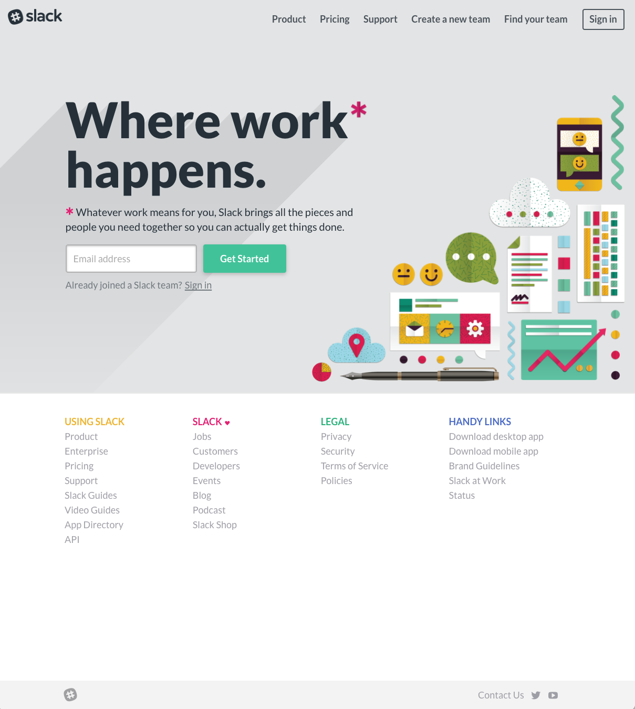
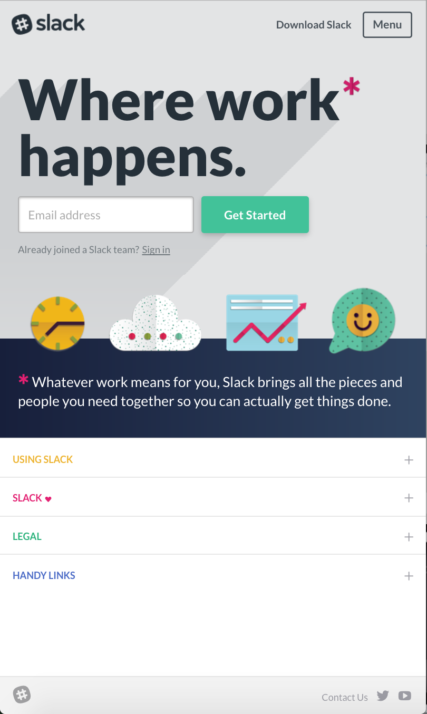
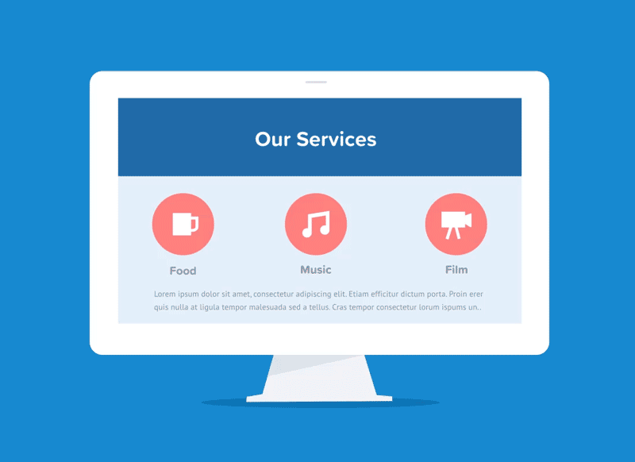
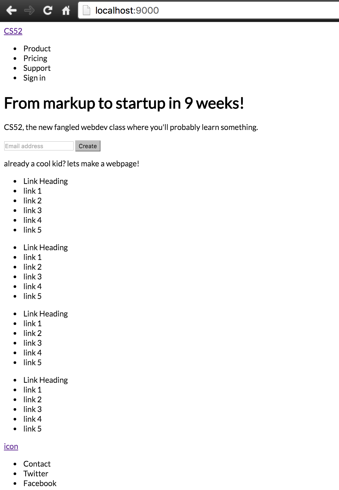
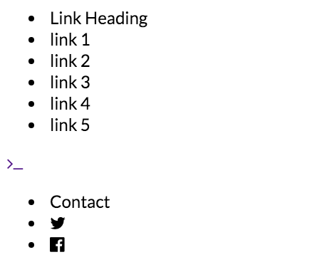
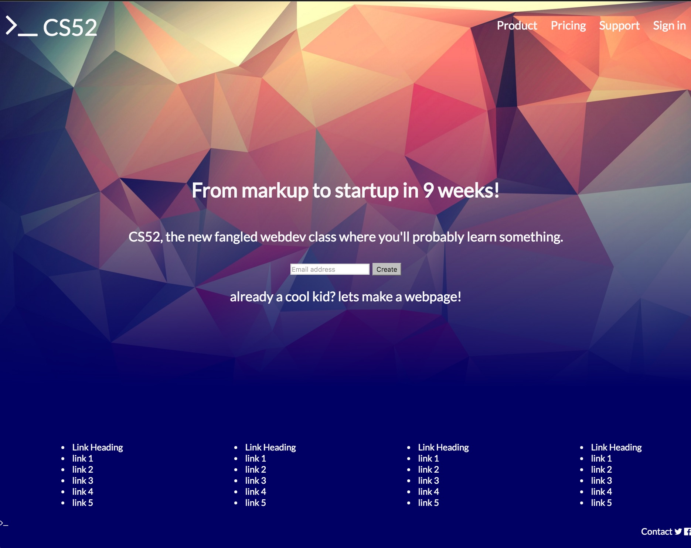
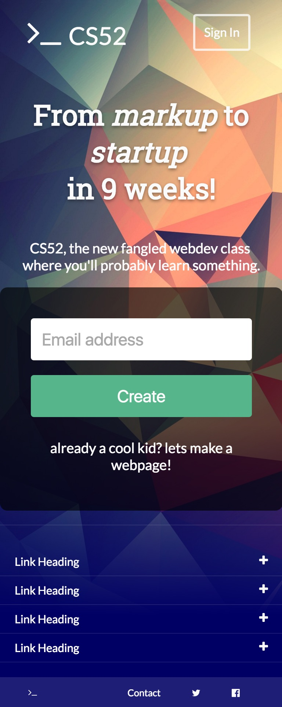
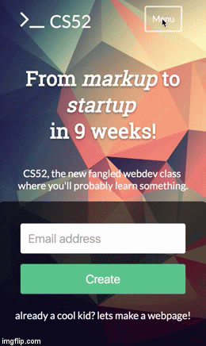

# Build a Landing Page!  :airplane:

Your assignment, should you choose to accept it, (not sure you have much choice there...) is to create a landing page.  

A landing page you say?  Yes, actually a specific landing page.

🚀In an incognito browser window, go to [Slack.com](http://www.slack.com). It shows up a little differently if you are signed in. Here's a screen shot for you.

{: .fancy .small}

And if you narrow your browser you'll see some responsive design and it looks like so:

{: .fancy .tiny}

You should feel free to choose another landing page to base yours off of, as long as it has the following features:

* responsive navigation menu - one that collapses from columns into rows when in mobile.
* expanding image - either as a background or central element
* a clear call to action button with some hover states, some nice styling, and responsive
* text input bar for signup or search (non-functional)
* a footer with links that are responsive (change from side by side to vertical in smaller sizes)

Some examples (in order of difficulty):
* [slack.com](http://slack.com)
* [apple.com](https://www.apple.com)
* [wistia.com](http://wistia.com)
* [hubspot.com](https://www.hubspot.com/)
* [sunbasket.com](https://sunbasket.com/)
* [patagonia.com](http://patagonia.com)

**Please be creative with your content!** All of the above have the same basic elements. You'll find that many product landing pages have a lot of similarities:

* A navbar that when resized turns into the hamburger menu 🍔<br>
  {: .tiny}
* A CTA (call to action)<br>
  {: .tiny}
* some resizing background image<br>
  {: .tiny}
* some set of side by side highlights<br>
  {: .tiny}

Using your fresh HTML and CSS skills you will make an **HTML and CSS only** version of this landing page (no JS allowed).  ❗None of the links or functionality needs to be there, it just needs to look good and be laid out properly.

All anchor tags should look like this

```html
<a href="#">
```

Links to nowhere.

**You can and should alter the text and images** as you please — make it be a landing page for your imagination!

**Note:** no JS, or any external libraries or CSS frameworks are allowed for this assignment. You can do all of it was just the HTML/CSS from scratch.  Don't worry it'll be fun!

**Note:** You can and should use the [Chrome DevTools Inspector](https://developers.google.com/web/tools/chrome-devtools/) 🔍 to examine the structure of the original page.  However, you'll find it is really messy and complicated!  Although it is a good idea to inspect individual elements (for instance: a button to see how they styled the borders) it won't really help you much to try to copy more.  If your code blatantly includes un-cited code copied from slack.com, that will be considered an honor code violation :warning:.  Ask me if you have questions about this.

## Where to Start?!

🚀Start in your git repo for the project -- Please use the github classroom link provided in the Canvas assignment to create the repo automatically.

🚀Open up Atom and create an index.html and a style.css file.  

🚀Link your style.css file into the head of your html file.


## Outline

In HTML only,  outline the main elements you envision for the page.  Here's some hints:

* `<nav>` for the navbar (even though it is transparent).
* `<ul>` unordered lists are often used for nav components, if you do it'll help to get rid of the bullets using `list-style-type: none;`
* `<footer>` is a good tag to use for... footer things.
* `<div>`, `<span>`, `<a>`, `<h1>`, `<p>` will all be useful.
* `<input>`, and `<button>` for any form like elements.


Don't worry about styling 💇 at this point. Just lay things out in an order that makes sense to you.

It should look approximately like this.

{: .fancy .small}

🚀Take a screen cap at this point.

## Adding in Fonts

Right, in the above you may have noticed that yours was Times New Roman...

🚀You should get some better fonts quick from [Google Fonts](http://fonts.google.com)! 🐎

🚀And you might as well grab some nice icons while you are at it from [FontAwesome](http://fontawesome.io/). Easiest is to just download the whole fontawesome package and including that in your source.


{: .fancy .tiny}

## Background

🚀Go ahead and add a background in!

I recommend getting rid of margin and padding on body:


```css
body {
  margin: 0;
  padding: 0;
}
```

and then creating a top level div, lets call it main:

```css
.cover {
  background-image: url(img/yourimageyname.jpg);
  background-size: cover;
}
```

## Flex Boxes

🚀Pretty much all the layout you can do with flex boxes.  In fact you should absolutely do as much of the layout of this page using flexbox layout.

There's a couple tricky elements, like the gradient which I recommend using `absolute` positioning to place.  You don't have to include the gradient at all though, thats fairly non-critical. (If you can't find it on the slack page just search in the inspector for gradient).

Here is a good [guide to flex](https://css-tricks.com/snippets/css/a-guide-to-flexbox/).

**Note:** for now only use pure CSS3 directives that are supported by the latest Chrome. Don't worry about the various [vendor prefixes](https://developer.mozilla.org/en-US/docs/Glossary/Vendor_Prefix) like `-webit` `-moz` or any of those prefixes.  Later on we'll learn about using [autoprefixers](https://css-tricks.com/autoprefixer/) to make our code work better cross platform, but for now use the latest the greatest that works in Chrome.  That is the browser we'll be testing your sites in and the only browser that matters for the time being. **Do not** use any other browser for your dev work. So please, points off for including vendor prefixes.


Now things should look like they are coming together.

{: .fancy .small}

Still things not lining up and much of styling is missing but most things are in their proper places. Using only flexboxes and some very basic positioning.  No bootstrap here!


## Styling

Now get it looking good!

🚀Don't forget the `:hover` CSS!  There's some nice little touches throughout.

`border`, `box-shadow`, `border-radius`, `margin`, `rgba`,  all will come in handy!

I recommend working on the full width version, and don't worry about how it resizes till you are moderately happy with it.

It should start looking something like this at this point.

{: .fancy .small}

## Media query

Now for the tricky part!  Shrink the width of your browser window all the way down!  GASP! 💩

Most likely it did not resize well. We'll deal with that similarly to how slack dealt with it.  A single media query.

🚀Here's how to start:

```css
@media only screen and (max-width: 640px) {

}
```

Anything in this media query will only apply if the screen is fairly narrow.  

Techniques to try:

```
flex-direction: column;
```

🚀Take some of your row flex boxes and simply convert them to columns.  This works remarkably well for many cases.  The input box and button for instance.

```
display: none;
```

🚀Toggle the display property on completely different sections of the site.  You might have a completely different set of elements for the links section for instance.  Toggle one off and the other on.

You should end up with something akin to:

{: .fancy .tiny}

**Note:** I did not bother with making the bottom Link Heading sections expand. Extra credit if you do.


## Speaking of CSS responding to clicks...

Notice on the slack page when you're in the narrow responsive site if you click on the Menu button an overlay menu comes up.   This is done with javascript the world over. BUT it is possible to trick CSS into responding to clicks!

This is called the [CSS Checkbox Hack](https://css-tricks.com/the-checkbox-hack/), very clever.  

If you choose to, you may implement this functionality in pure CSS. This part is extra credit, but easy and worth doing! You can also play with CSS transitions for this to make the menu appear to slide or fade in.  **Caveat:** CSS transitions don't work if the element has `display: none` on it, but there are other ways to hide an element, `opacity` + `height: 0px` come to mind.

Here's what it could look like:

{: .fancy .tiny}


## And You Are Done!

You should host this on github pages as you have in the past with the `gh-pages` branch.  Just make that the name of your main branch and it'll set it up automatically, or in `Settings` you can choose to use the `master` branch for ghpages (even easier).  Another cool static page hosting platform is [surge.sh](http://surge.sh).  Easy to set up, and you are welcome to do that instead if you prefer.


## To Turn In (canvas):

* url to your hosted page (gh-pages is fine)
* your page should:
  * display as many elements from the original site / above screenshots as possible
  * use only pure CSS/HTML
  * have clean CSS/HTML written by hand by you (your html file should only be around ~150 lines or so).
  * use lots of flexboxes for layout
  * be responsive with 1 narrow phone friendly version per the screenshots / original
  * include some details such as hover effects and border-radius
  * have clear document structure with proper semantic naming
  * look reasonable :-)
* your repo should include a README.md file with:
  * a couple sentence description of what you did and what worked / didn't work.
  * screen caps of your layout stage
  * screen caps with anything special you want to point out
  * url to the original landing page you were mimicking


## Extra Credit

* Fancy CSS transitions
* CSS Checkbox Hack for the mobile version Menu
* Link Headers utilizing the CSS Checkbox hack to expand!


## Resources:

* [https://css-tricks.com](https://css-tricks.com)
* [http://www.w3schools.com](http://www.w3schools.com)
* [https://philipwalton.github.io/solved-by-flexbox/](https://philipwalton.github.io/solved-by-flexbox/)
