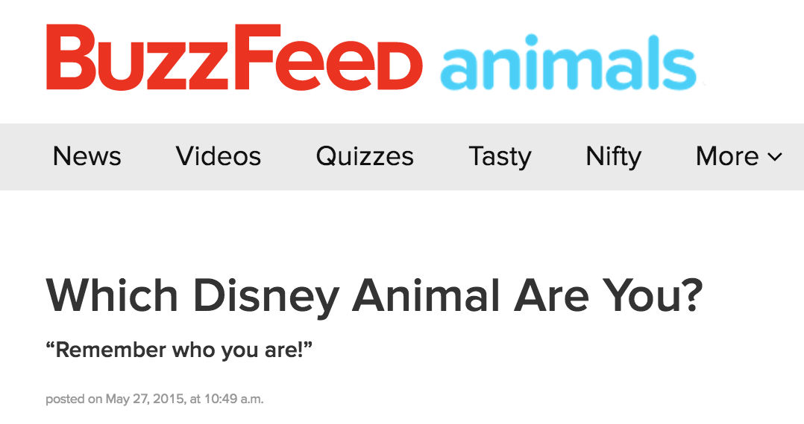
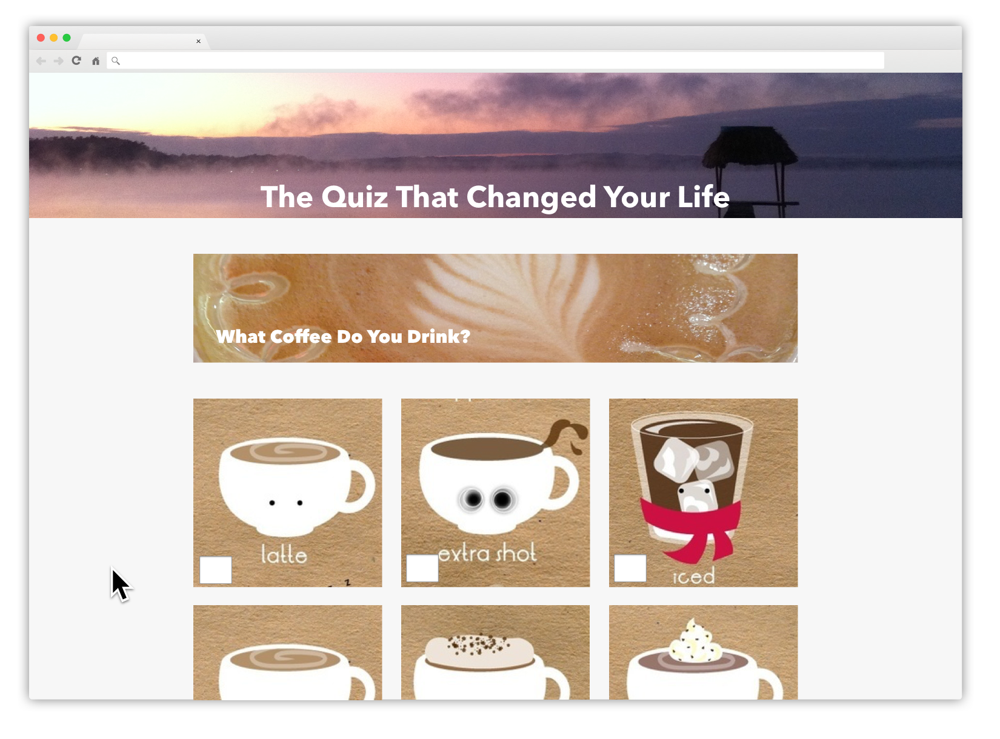
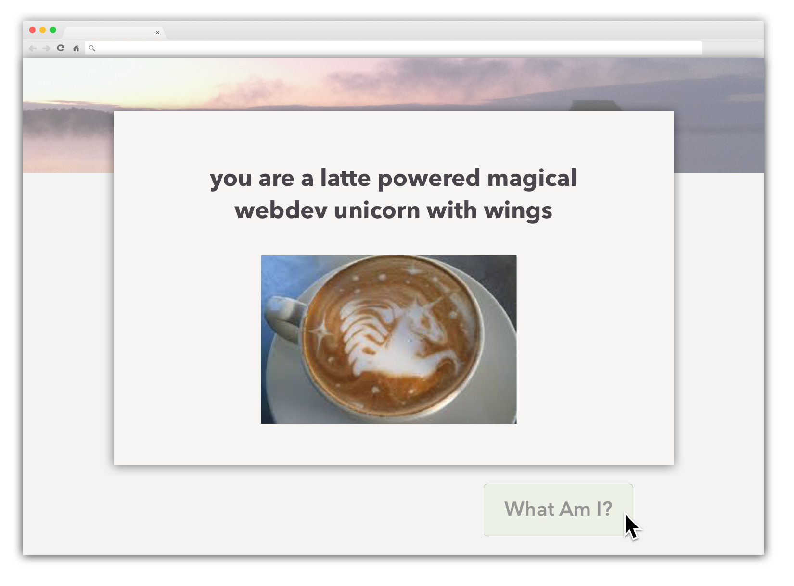
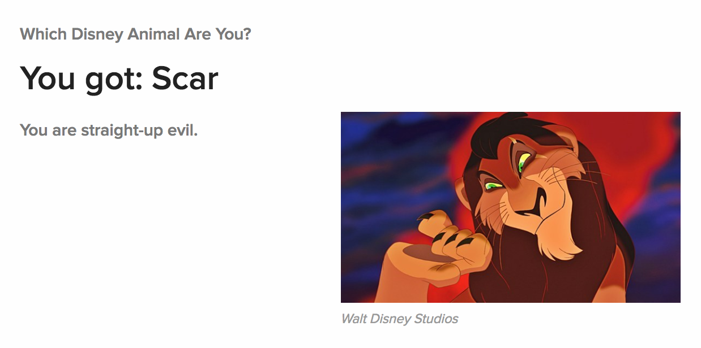

# Build a Buzzfeed® Quiz Site! :squirrel:

All the kids are doing it these days. This is where we'll learn a little bit about making interactive sites. We won't need to deal with any backend servers, just some nice clientside code (no server) to build up a fun quiz and show some calculated results.

🚀 head over to buzzfeed and take [this quiz](https://www.buzzfeed.com/elainawahl/which-disney-animal-are-you). I'll wait.

[{: .fancy .medium}](https://www.buzzfeed.com/elainawahl/which-disney-animal-are-you)

Doesn't that make you want to make your own quiz? Ok, you could use buzzfeed to do this, but you want to make one that doesn't have ugly ads. And looks classier too!

This assignment is going to *flex* your html and css skills some more as well as some javascript!  We'll use some JS to compute the results of the quiz as well as to check that the quiz was filled out correctly.


**Note:** You are allowed to use HTML5/CSS3/JS/jQuery in this assignment but no other libraries or frameworks. Try to use compatible plain JS/jQuery without any newer syntax so that your page will work in browsers without the need for anything aside from jQuery (if you choose to use it).

**Note:** You can and should use the [inspector 🔍](https://developer.chrome.com/devtools) to examine the structure pages you see. Although it is a good idea to inspect individual elements (for instance: a button to see how they styled the borders) you'll find that the way they do things is ugly anyway and I would recommend not imitating them at all. If your code blatantly includes [un-cited code](/logistics/#citation-format) copied from buzzfeed.com, that will be considered an honor code violation :warning: Ask me if you have questions about this.


## Plan

You have a lot of flexibility in this assignment.  This is your content, so be creative. How much you abstract out the problem is up to you.  You can start by hard-coding every question and answers in HTML, that is 100% acceptable.  If you choose you could implement reading the questions from say a separate JSON file - this would be extra credit. More about this later.  How you score the quiz is completely up to you.  Just a counter is sufficient but you could try something more complicated with different weights associated with the various answers. And finally,  the look and feel is all up to you.  There are just a few minimum requirements.


### Minimal Functional Specs:

* Quiz Page:
  * Questions:
    * display several questions (enough for this to be interesting)
    * have a header image and some text
    * have some number of potential answers
  * Question Answers:
    * be either text or an image (demonstrate some of both)
      * *text answers are just clickable text boxes (not an image)*
    * have 4 potential display states:
      * initial none selected state
      * have a `:hover` effect
      * have a clicked/selected state
      * when one answer is chosen all other answers should change to a not-selected state (different from the initial no answer chosen state).
    * have an associated value to be used to calculate the overall quiz output.
  * Done Button:
    * calculate the quiz output
  * Output Display
    * should have text and an image
    * should not show unless the calculations are finished
    * should display an error if not all questions were answered


Here's some design specs thrown together in [Sketch](https://www.sketchapp.com/)

1. Quiz page with a question and some image answers - nothing selected:

    {: .medium}

1. An example hover effect:

    {: .medium}

1. An answer selected:

    {: .medium}

1. Answer display:

    {: .medium}


## Where to Start?!

🚀 Start in your git repo for the project -- Please use the github classroom link provided in the Canvas assignment to create the repo automatically.

🚀 Open up Atom and create an index.html, a style.css, and a main.js file.  

🚀 Link your style.css file into the head of your html file.

🚀 Link in your js file. Best place for this is right before your closing `</body>` tag.  

Extra credit:  why might it be better for this to be placed at the bottom rather than in `<head> ... </head>`?

```html
<script src="main.js"></script>
```


## HTML

Start with coding up a single question and answer - then use flexboxes to arrange them. At this point using flexboxes for this should be almost second nature. You don't need any of those fancy grid frameworks.

One thing you may have noticed is that when you select an answer it is a exclusive selection.  There is an input type that already does that automatically.  Yup, [radio boxes](http://learn.shayhowe.com/html-css/building-forms/#radio-buttons)!

But the default styling of radio boxes is so ugly!  Sure, but you can do something similar to the checkbox hack and hide the actual radio box but use it for some display logic.

Here is the basic syntax for a radio button with an image label.

```html
<label for="puppy_question"></label>
<input type="radio" id="puppy_question" value="puppy"/>
```

```css
#puppy_question {
  display: none;
}
```

You can actually nest the input inside of the label and then you don't have to do the `for="elementID"` part of the label, it will just automatically serve as the label for the input inside it.

```html
<label>
  
  <input type="radio" value="puppy"/>
</label>
```

And you can suppress all radio inputs like so:

```css
input[type=radio] {
  display: none;
}
```

It is important to note that the way that you group radio buttons together
(i.e make it so clicking one unclicks others) is by their 'name' property.
Giving two radio buttons the same name groups them together.

For example, these two radio buttons could both be selected at the same time
(you can have a favorite dog and a favorite cat):

```html
<label>
  
  <input type="radio" name="favorite_dog" value="dalmation"/>
</label>
<label>
  
  <input type="radio" name="favorite_cat" value="tiger"/>
</label>
```

While these two radio buttons will automatically unselect one when the other is clicked
(you cannot have two favorite dogs):

```html
<label>
  
  <input type="radio" name="favorite_dog" value="dalmation"/>
</label>
<label>
  
  <input type="radio" name="favorite_dog" value="retriever"/>
</label>
```

## Javascript Logic

Once you have the basic structure up you can dive into getting the logic working. At this point you should have some radio boxes on the screen that are checkable.  But how do you collect the input from them?

For this assignment you are allowed to use [jQuery](https://jquery.com/) if you wish. Just load it before your own javascript in your `index.html` file:

```javascript
<script
  src="https://code.jquery.com/jquery-3.2.1.min.js"
  integrity="sha256-hwg4gsxgFZhOsEEamdOYGBf13FyQuiTwlAQgxVSNgt4="
  crossorigin="anonymous"></script>
```

jQuery is purely a personal choice. It helps simplify some things. If you have used it before, challenge yourself and use plain vanilla JS this time around.  Many sites on the internet use jQuery so it doesn't hurt to be familiar with it.

Most likely you have a button that you would like to attach a javascript action to.  Here's a tiny bit of code to get you started:

```javascript
$('#idOfYourButton').on('click', function(e) {
  // gather all checked radio-button values
  var choices = $("input[type='radio']:checked").map(function(i, radio) {
    return $(radio).val();
  }).toArray();
  // now you have an choices = ["valueofradiobox1", "valueofradiobox2", "valueofradiobox2"]
  // you'll need to do some calculations with this
  // a naive approach would be to just choose the most common option - seems reasonable
});
```

Some jQuery/JS that will come in handy:

* [show()/hide()](https://www.w3schools.com/jquery/jquery_hide_show.asp) // equivalent to `document.getElementById('someid').style.display = 'none';`
* [text()/html()](https://www.w3schools.com/jquery/jquery_dom_set.asp) // equivalent to `document.getElementById('someid').textContent='newtext';`

There's a lot you can do here, but the basics that you want are a button that calculates an answer and then shows it on the page!

The answer could be displayed as a [simple modal](https://www.w3schools.com/howto/howto_css_modals.asp) or inline like how buzzfeed does it.

🍸 Extra Credit:  Create a generalized framework for quizzes. This would involve something like reading in quiz questions and answers from a [JSON file](http://api.jquery.com/jquery.getjson/) and then looping through them and [appending](http://api.jquery.com/append/) to the html of the page with javascript.

## Styling

Now get it looking good!  If you need suggestions on how to improve your design come by any of our office hours.  This assignment will be partially graded on styling.  The minimum effort would be to do something like the primitive mockups or and equivalent attempt at improving the design of buzzfeed.


## And You Are Done!

You should host this on github pages as you have in the past with the `gh-pages` branch.  Just make that the name of your main branch and it'll set it up automatically. Remember to have fun with this.  We'll share the quizzes in class!


{: .fancy .medium}


## To Turn In:

* url to your hosted page (gh-pages enabled on your classroom repo is fine)
* your page should have all the [MVP specs](#minimal-functional-specs) in addition to:
  * have clear document structure with proper semantic naming
  * functional calculations and error checking to get quiz results
  * look reasonable, styling should be at least as classy as the mockups...
* your repo should include a README.md file with:
  * a couple sentence description of what you did and what worked / didn't work.
  * screen caps with anything special you want to point out


## Extra Credit

* Fancy CSS transitions/animations
* Generalized quiz framework reading in quiz from a [JSON file](http://api.jquery.com/jquery.getjson/)
* More complex quiz scoring
* Multiple quizzes / pages


## Resources:

* [https://css-tricks.com](https://css-tricks.com)
* [http://www.w3schools.com](http://www.w3schools.com)
* [https://philipwalton.github.io/solved-by-flexbox/](https://philipwalton.github.io/solved-by-flexbox/)
* [http://learn.shayhowe.com/html-css/building-forms/#radio-buttons](http://learn.shayhowe.com/html-css/building-forms/#radio-buttons)
* [Chrome Devtools](https://developer.chrome.com/devtools)
