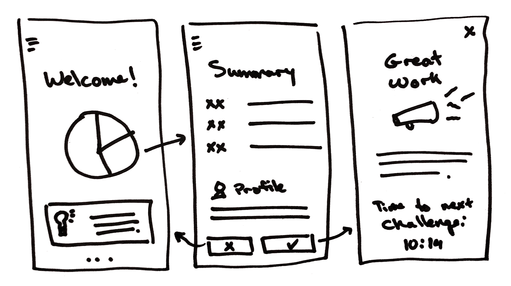
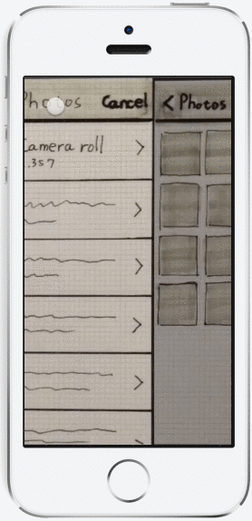
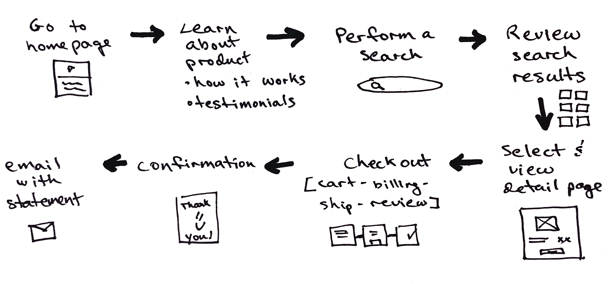

{: .fancy .medium}

The feature spec is a document that is a walk-though of your project from the users perspective. It provides a listing of all the features you are envisioning for the product. The feature spec functions as your overall plan for the project. Rather than thinking about it as locking you in, use this as an opportunity to think through your product in detail.

## User Stories and Personas

User stories are short scenarios about how your product is used.  User personas are the fictional individuals who comprise your product's users.  Your personas should have names and believable backgrounds.  They should have specific demonstrative use cases for your product.  You will refer to them as you work on the product and you'll find they will be quite useful!  The aim of user stories is to codify specific use cases for your product and allow them to be easily communicated as you build the product.  They help keep the team focused on the functionality of the product for specific people rather than getting sidetracked by features that seem "cool" or "look good".  For every feature in your spec you should have a user persona that would find it useful or compelling. You can use [userforge.com](http://userforge.com) if you want to as it provides a nice interface for creating them.

__Structure your user persona something like so:__

* Background and Demographic Information
  * __Name__
  * __Sketch/Picture__
  * __Demographic info__ (short)
  * __Overheard quote__
  * __Short narrative__ or description about the user and why they're using your product/service.
     *(try to capture their attitudes, needs, problems/concerns, and experience)*
* Behavioral and Dimensional Information
  * __Goals and Motivations__
     *(goals should directly relate to product/service)*
  * __Tasks__
     *(break goals down into tasks — what does the user need to do to accomplish a particular goal)*
  * __Pain Points__, Concerns, and challenges
     *(what are they worried about? what do they have trouble with?)*
  * __User Flow__
     *(describe a typical scenario of the user interacting with your product – this is a short ordered list of actions)*

## Mockups/Sketches

### Step 1: Paper Sketch
Based on the various features and pages you described in the feature spec, draw up sketches of each view.  Napkin style quick sketches are a good place to start. Focus more on thinking through the common actions that the users will be making rather than how and where the buttons go.  As you draw our these sketches with your team several things will come to light, features you might have missed or interactions that need to be changed.  Make your sketches comprehensive, they should cover all the views and functionality that your apps needs. Additionally you should make a site map style overview showing how the views are connected. It's more important to think through layout and functionality than making sure your color scheme or logo are perfect as you can continue to iterate on those.  Do not use wireframing software, for wireframing you might as well just sketch on paper, waste of time to learn a separate program.

Time to take the abstract to concrete. Sketch rough layouts of screens focused on **features**.

#### Generate options as a group
* Determine which **(2-5) main features** you will sketch that are essential to your product (e.g. the feed, leaderboard, comments, etc)
* Get thick markers, printer paper, and designate a timekeeper
* Allow for **5 minutes of individual sketching per feature**, working on as many unfiltered iterations as possible in that time limit. Treat this much like improv - try not to self-edit or rule out anything just yet.
* After each round, compare sketches and create a few group versions that incorporates the best of all the ideas. Actively agree/disagree with specific elements. Aim for **2-3 versions per feature**.

#### Rules
* Use the “thick marker trick” - the thicker the marker, the more you force yourself to keep the designs at a conceptual level (it’s difficult to add in details when the marker tip is so large!). Whiteboard markers are great here too, just take photos!
* Include little or no specific content
* Drop any worries about scale, straight lines, grids, etc.
* Think in flows whenever possible (what pages come after?)
* Match your sketches with your flow diagram - what part of the flow is not yet in the sketch?
* Never settle for your first idea!

{: .fancy .medium}

You can [download all sorts of device paper](http://sneakpeekit.com/) to help.

You can put all your sketches together using [Pop](https://marvelapp.com/pop/) — Prototyping on Paper, is a good way to get started without doing high quality designs and get something that you can click through.

{: .fancy .tiny}

### Step 2: Make Prettier

#### Figma

Once you are ready to make it prettier just go straight to[Figma](https://www.figma.com/). You'll need to [verify your student account status](https://www.figma.com/student/apply) to verify your .edu email.

🚀 Create a new [Team Project in Figma under the CS52 Org](https://www.figma.com/files/team/695309768358025992/CS52).  You should have all received an invite at the beginning of term to your @dartmouth.edu emails.

There's a short [tutorial for figma](http://cs52.me/workshops/design) available as well. 

## Site Map / Flow Diagram

A flow diagram documents the tasks the user will perform, in relation to each other and over time. Create flows for the primary tasks, but keep this in sketch or text form (best to not dwell on how it looks at this stage but rather how these elements connect to each other).

Checkout what [polished versions](https://speckyboy.com/collection-inspiring-sitemaps-user-flow-maps/) looks like for some inspiration.  You can have your flow diagram be your Invision or Pop Paper connections.

## To Turn In:

* Sketches of each view of your product (photos of paper)
* Super short bulleted list that is a step by step walk through of your app
* At least 3 short AND fun user stories - can be in google doc or [userforge.com](http://userforge.com)
* Mockups submitted as[figma](https://www.figma.com)
