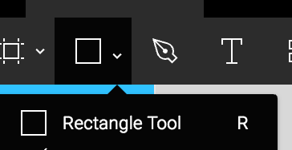
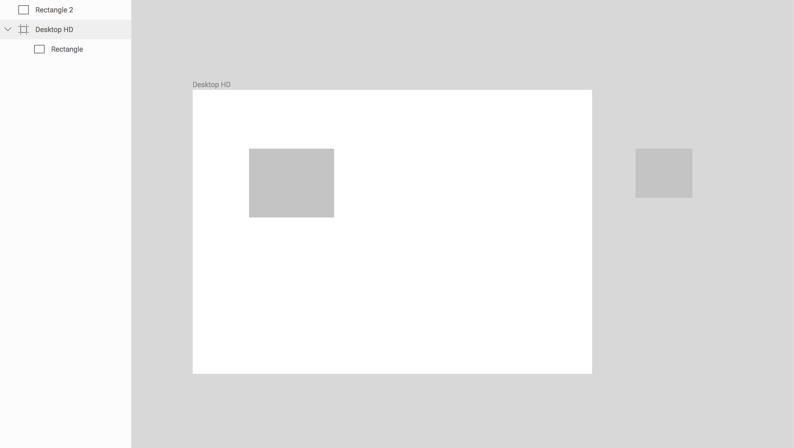
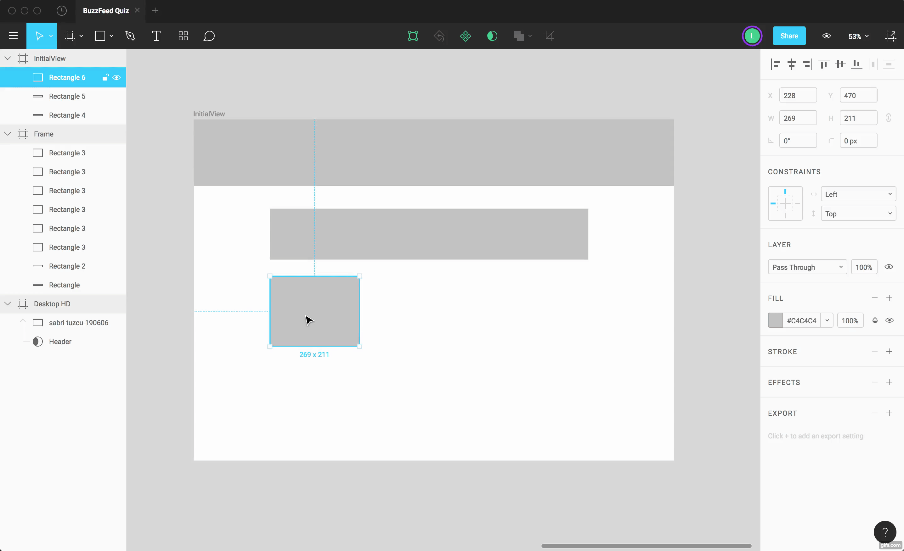
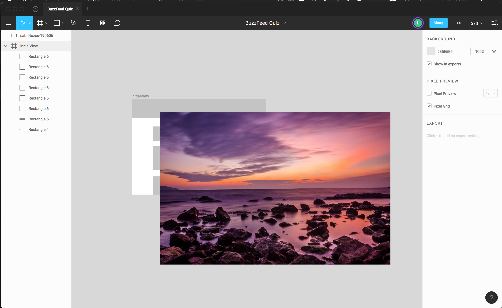
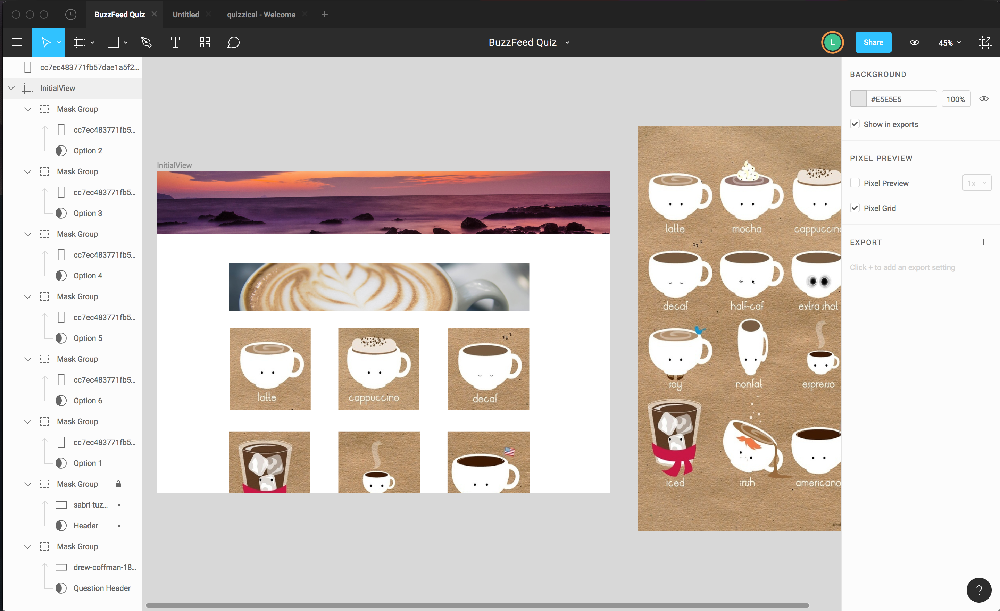
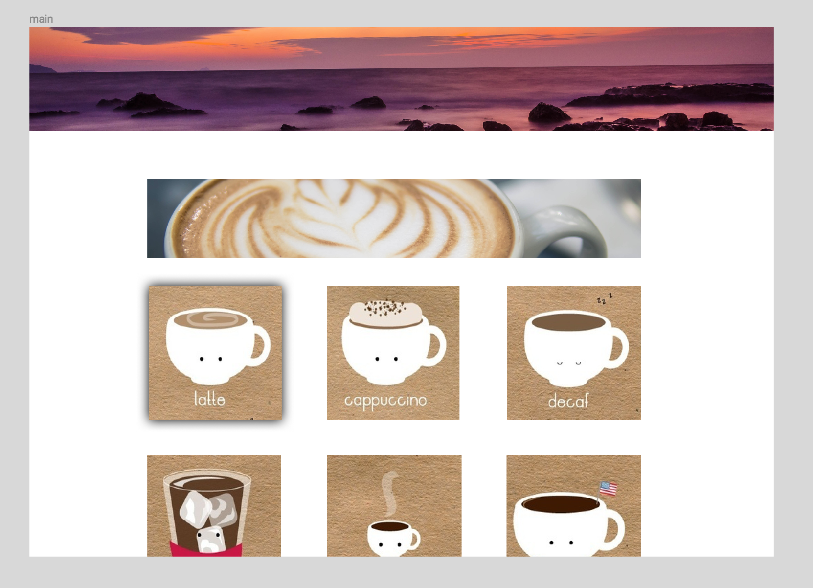
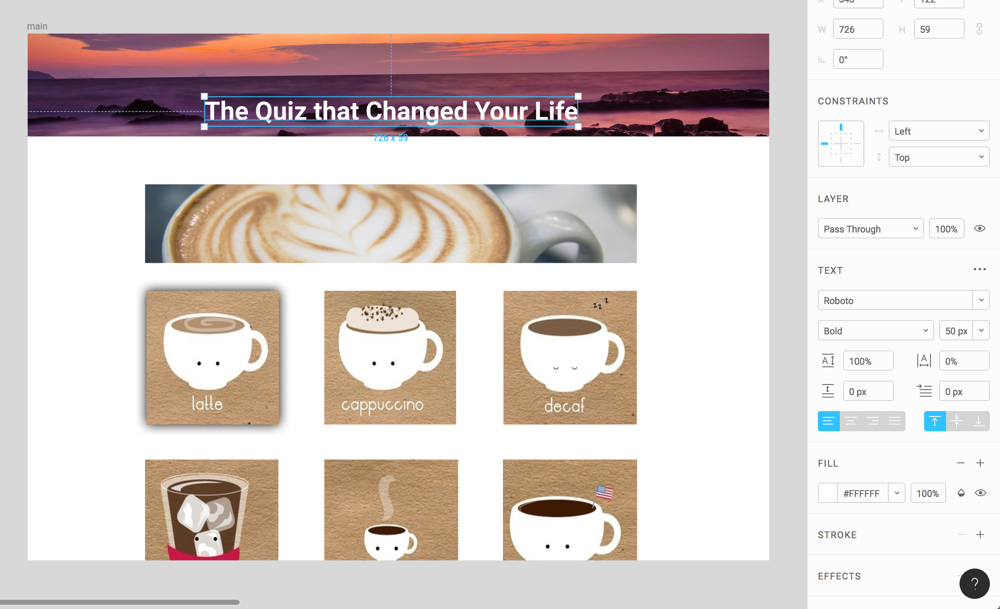
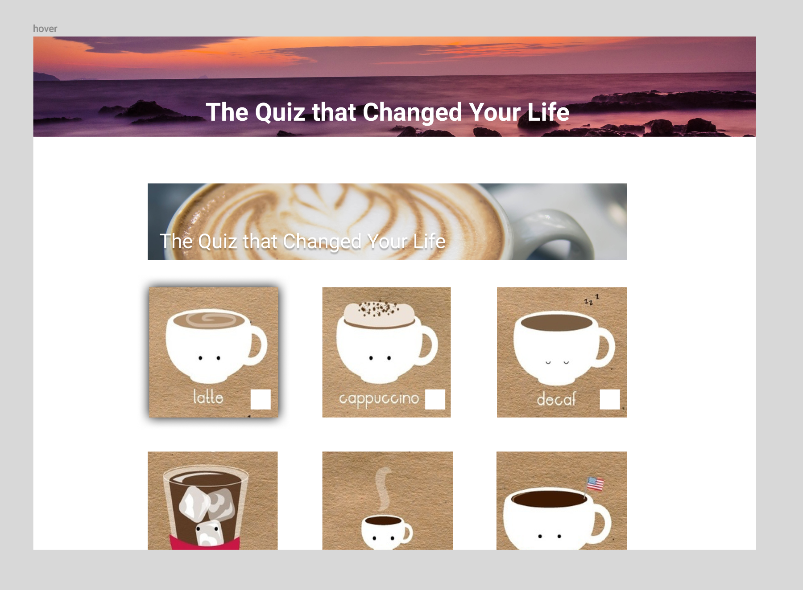
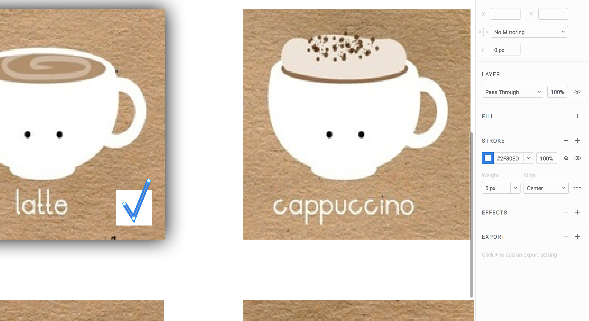
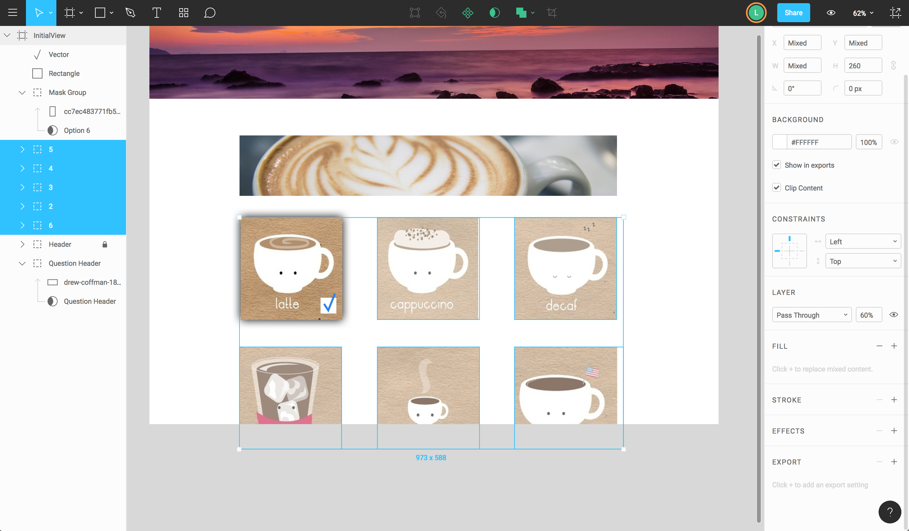

# Designing with Figma

Figma is a browser-based interface design tool. This allows us to wireframe our webpages: this will be useful for creating a design for our next assignment, a quiz page. Figma also allows for live team editing of files. This means that you can not only access your files from any computer by simply logging in, but anyone on your team can edit files and use shared components.

Figma also has Desktop apps available for download if you prefer that!

If you want to learn more about Figma there many online tutorials including the [Figma YouTube Channel](https://www.youtube.com/channel/UCQsVmhSa4X-G3lHlUtejzLA) that has a lot of short useful videos.

## Getting Set up
Go to [figma.com](https://www.figma.com) and Sign Up for a new account. This account that you create will be the one you use to log in whether you're in the browser or on the desktop app.

To download the desktop app click on the hamburger menu and then on "Get Desktop app":

## Introduction to the tools
For a brief run-down of the Figma interface take a look at the last 2min of [this video](https://youtu.be/RFi7wQHUP0c?t=1m33s).

And now we can get started!

## Using Figma
**Create a new file** by either clicking the "New File" button at the end of your files, by clicking on the hamburger menu icon and going to New File, or by going File > New File, or pressing Cmd + n. (Wow so many ways to do one thing)

Now **create an "Artboard"** or what Figma calls a "Frame" by clicking on the frame tool:

Then click on "Desktop HD" on the panel that appears on the right hand side of the screen. There are other Frames for other types of media that have the exact pixel sizes for each device. 

Anything you add onto this frame will be grouped within the frame. Let's try this out.

Select the rectangle tool by clicking on it in the top bar, or by pressing "R":

Now try creating a rectangle over your white Frame. Press "R" again and now create one outside of the frame. You'll see on the left hand bar how the second rectangle was created outside of the frame you created but the first one is grouped within it.

For the purposes of this assignment we want all of our assets to be within the frame we create so if you run into problems with layers etc. take a look at this sidebar.

If you move the rectangle from outside the frame into the frame, Figma automatically puts it into the Frame grouping.

## Creating your Quiz page
### Laying out page content

I usually like to plan the layout first with gray boxes and then add the images in later with masks, similarly to what we did with the header.

Using the rectangle tool create a layout that looks like this:

Rename the rectangle layers to keep them organized.

*Pro-tips:*
- **Hold down Ctrl** (**Option** on Mac) and click and drag a rectangle to duplicate it
- **Hold down shift** and click multiple rectangles to select more than one
- Select three rectangles and then hold ctrl and drag them down to duplicate a row of rectangles to create the grid of question options

### Adding a background image and masking

Now to add a background image to the header.

If you're looking for a high resolution do-whatever-you-want images https://unsplash.com/ and  https://www.pexels.com/ are good sites.

Once you have your image, save it somewhere easy to find, such as your desktop.

You can either drag your image into the Figma app from your file explorer or click **Cmd + Shift + K** to place the image and click "Place all".

Your image will be large and out of place and we want it to be the background of our navbar.

To fix this, we want to create a **mask**.

Before masking:

First select your Header reactangle and holding down the Shift key, select your image. Now press the Mask button up at the top.

Now the Header frame has become a sort of window frame for the image and you can resize and move the image until the header looks like you want it to.

Note: If you want to resize your image without messing up the proportions, hold down the Shift key as you change it's size.

Masked and positioned:

To make the rest of editing easier, lock your header layer.

You can also move the masked images down to the bottom of the layers to move them out of your way:

### Adding in content images

Repeat the masking process to add images to the rest of your layout.

Since this used different parts of one image I created a copy of the image and put it outside of the desktop frame for easy access to drag onto the gray rectangles. Another option would be to create one rectangle with the masked image and then copy it for each item of the grid.

Your page should now look like this:

### Adding text
Figma uses [Google fonts](https://fonts.google.com/), which means that later when you're developing your web page it will be easy to import the fonts you use in your Figma design.

**Press T** and then click where you want to place your text. Change the properties in the right hand panel.

Add text to your Question header as well, and your page should now look like this:

If your text is hard to see you can try changing it's thickness, color, or adding a drop shadow.

#### Create checkboxes

Create a small white rectangle in the bottom right corner of your first image. To create a perfect square from the start, hold the Shift key down as you drag out the rectangle.

Click on fill and change the color to white. Copy and paste this on each option.

### Create multiple views

In order to design what your page would look like at different moments duplicate the main page you just designed and rename it for the two other states we need: Hover and Checked.

Select your frame, hold down control and click and drag it to the right. Rename this frame "hover". Repeat this and name the third frame "checked". Now we're going to edit these frames to match the state.

These are your three frames before you edit the second two:

### Hover:
**Make sure you're on the second frame now.**

We want our "hover" frame to look like this:

#### Add drop shadow

Select the first question square, then in the Properties panel click the **+** next to **EFFECTS**. Make sure that Drop Shadow is selected and click the sun icon to edit the drop shadow as you want.

If you want it to add a drop shadow all the way around set the X and Y values to 0 and increase the blur; I set blur to 25px.

### Checked:
**Make sure you're on the third frame now.**

We want our "checked" frame to look like this:

Now to create the check we're going to use the **pen tool**. The pen tool creates a vector network.

**Press P** on your key board and then create a checkmark. I made mine with three points and then pressed enter to complete the path. Change the stroke color and stroke width to 5px.

#### Change opacity

Select the other 5 questions and change their "PASS THROUGH" property.

(I renamed the masked groups before this step to make it easier to track them and select them)

Now you have three different views showing the process of selecting an option on your quiz.

