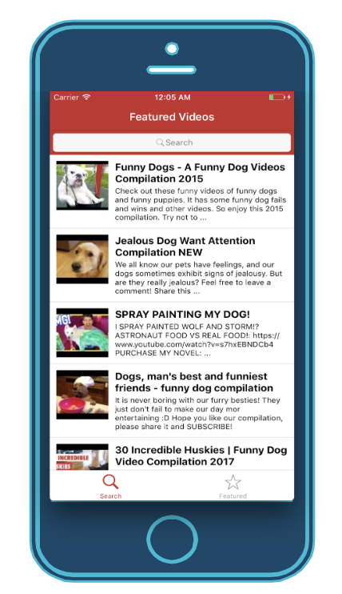


<!-- raw mode to ignore liquid tags that have {{ }} -->


{: .small }

<!-- based loosely on https://www.raywenderlich.com/165140/react-native-tutorial-building-ios-android-apps-javascript -->

## Overview

Today we'll be learning about [react-native](https://facebook.github.io/react-native/) and turn the Youtube search web app we build in assignment 4 into a simple iOS app. Basically, we are going to turn this:


...to this:




💻 : run in Terminal<br>
🚀 : a step to not forget


## What is React Native

React Native is a frontend framework for building mobile apps in JavaScript and React components. Unlike [PhoneGap](https://phonegap.com) and [Ionic](https://ionicframework.com), which are basically 'mobile-friendly' web apps, React Native allows you to build **real mobile apps** for specific platforms like iOS and Android.

## Setup

### XCode

We will need [Xcode](https://developer.apple.com/xcode/) for this assignment, which also includes an iOS Simulator for us to preview our app. You can install it via the Mac App Store.

### NPM
:warning: We should already have **Node.js** installed on our machines, but just in case, let's go way to the beginning:

```
💻 brew install node
```

And we should install [Watchman](https://facebook.github.io/watchman/), too, since react-native depends on it.

```
💻 brew install watchman
```

Watchman is a file watching service that records when files change, and triggers actions when it detects changes.

🚀 Alright, now we're ready to use react-native! We'll want to install the Command Line Interface(CLI) so we can call react-native commands from the terminal:

```
💻 npm install -g react-native-cli
```

Great! Now we're ready to create our app. Use the CLI tool to construct the project:

```sh
💻
$ react-native init VidSearch
$ cd VidSearch
$ react-native run-ios
```

🚀 `react-native run-ios` is the command to run ios simulator. You may use this a lot in debugging later.

When the iPhone simulator pops up, you should be seeing a basic template for an iPhone app.

What just happened? React-Native bundled up everything for us, ran it through XCode, and opened up a simulator, all through the command line and without us ever having to open up XCode or write a single line of Swift code. Neat.

### Git

Now we want to add this project to a local git repository.

```
💻
$ git init
$ git add .
$ git commit -m "initial commit"
```

Then grab the github classroom link to start a new remote repository. Copyt the git URL and set it as the origin of your local repository.

```
💻
$ git remote add origin copiedURl
$ git push -u origin master
```


### Dependencies

We're going to need a few dependencies from our trusty friend, the Node Package Manager.

🚀 Since we're making calls to the YouTube api, it would help if we made GET calls with axios, so:

`$ npm install --save axios`

Next, we'll need some specific react-native components that some other open source developers have kindly provided to us. This is fairly common in the react-native community, and it's great to have these pre-styled components at our disposal so we don't have to go through all the trouble of making an input field look nice, for example.

🚀 There's one additional component we'll be using in the workshop: [react-native-search-box](https://github.com/crabstudio/react-native-search-box), a simple input field made to look like the classic iOS search bar.

`$ npm install --save react-native-search-box`

🚀 And of course, we need to just install everything that react-native init has kindly provided us with in its `package.json`:

`$ npm install`

## Hot Loading

Let's take a sec to talk about how the simulator works. There are two things you can do:

* `command-R` will refresh the simulator, which is useful each time you save. It's a little annoying, though, especially since we're used to hot reloading in the browser at this point.
* If you hit `command-D`, a menu will pop up. From there, you can click `"Enable Hot Reloading"`. It might take a few seconds to load (don't panic like we did when the percent complete actually starts going down...) but when it's done it'll refresh the page every time we save something in the project.

:snowflake: Side note: We should appreciate how cool this is. If you've ever tried to program for smartphones before, you know that each time you test, you have to press run in the IDE and then wait for the app to compile. If you're uploading to an actual device instead of a simulator, it takes even longer. React Native is cutting through all the overhead for us so we can do instantaneous reloads without all the wait time.


## Basic Navigation

Let's take a look at our current folder and we will find two files created by CLI tool:

* **index.js** the entry point, which by default is App.js
* **App.js** the skeletal app, our top level component.

We will wire everything together in App.js later, but for now, let's make two simple components - a search view and a featured video view. We will navigate them by one of the classic navigation components in iOS: [the Tab Bar](https://facebook.github.io/react-native/docs/tabbarios.html). React Native also provides other ways to navigate between screens, like [the stack navigator](https://facebook.github.io/react-native/docs/navigation.html#react-navigation). Feel free to explore other navigator options for extra credits.

🚀 Create a new directory in the top level of the project folder called `components`.
Then create two new files: `components/search.js` and `components/featured.js`.

```js
import React, { Component } from 'react';

import {
    NavigatorIOS,
    View,
    Text,
  } from 'react-native';

class Search extends Component {
  render() {
    return (
      <View style={styles.container}>
        <Text style={styles.text}>
          Search component
        </Text>
      </View>
    );
  }
}

module.exports = Search;
```

🚀 And for  do the same for your `featured` component (with whatever refactoring is necessary).

🚀 Now let's connect them all together. Navigate to **App.js**. This is the top-level file for iOS dev in react native. (Side note: there's also an `index.android.js` file, which makes it fairly easy to convert to Android as well)

🚀 Alright, so in **App.js**, add the following code:

```js
import React, { Component } from 'react';
import Featured from './components/featured';
import Search from './components/search';

import {
  TabBarIOS,
  Platform,
  StyleSheet,
  Text,
  View
} from 'react-native';
```

```
class VidSearch extends Component {
export default class App extends Component<Props> {

  constructor(props) {
    super(props);
    this.state = {
      selectedTab: 'search'
    };
  }

  render() {
    return (
      <TabBarIOS selectedTab={this.state.selectedTab}
        translucent={false}
        unselectedItemTintColor='#9E9E9E'
        tintColor='#c4302b'
      >
        <TabBarIOS.Item
          selected={this.state.selectedTab === 'search'}
          systemIcon='search'
          onPress={() => {
            this.setState({
              selectedTab: 'search'
            });
          }}>
          <Search />
        </TabBarIOS.Item>
        <TabBarIOS.Item
          selected={this.state.selectedTab === 'featured'}
          systemIcon='featured'
          onPress={() => {
            this.setState({
              selectedTab: 'featured'
            });
          }}>
          <Featured />
        </TabBarIOS.Item>
      </TabBarIOS>
    );
  }
}

```

Alright, now head over to your simulator.

What's going on here? We forgot to add styling! Head back to `search.js` and add the following styling:

```js
const styles = StyleSheet.create({
  container: {
    flex: 1,
  },
});
```

🚀 Don't forget to add `StyleSheet` to your imports at the top!

Let's break down how this styling is working. Notice that we create a constant for our component called styles that contains a dictionary, where the id (in this case `container`), corresponds to that called by the `style` prop in the component itself. Take a look at the `<View>` tag in `search.js`. It's referencing `styles.container`, which is what we just declared. Also notice how there's no separate css stylesheet--all styling has to be done inline in React Native. This makes it easier to send through the bridge, which connects our JS code to native code.

🚀 Copy the same thing into `featured.js`. Refresh the simulator again. Now we have a nice looking tab bar at the bottom of the page. Should look something like this:


Let's make the featured page look a little less boring. Replace all the code in it with this:

```js
import React, { Component } from 'react';
import ImageView from './imageView';

import {
    StyleSheet,
    View,
    NavigatorIOS,
    Text,
    Image,
    StatusBar,
  } from 'react-native';

const styles = StyleSheet.create({
  container: {
    flex: 1,
  },
});

const Featured = (props) => {

  return (
    <View style={styles.container}>
    <StatusBar
     backgroundColor="blue"
     barStyle="light-content"
   />
    <NavigatorIOS
      style={styles.container}
      translucent={false}
      barTintColor='#c4302b'
      titleTextColor='white'
      initialRoute={{
        title: 'Yay React',
        component: ImageView,
      }}
    />
    </View>
  );
};


module.exports = Featured;
```

🚀 Now create a new file called `components/imageView.js`. We'll just put this nice react logo in it, so the page isn't so dreadfully boring.

Here's some more code!

```js
import React from 'react';
import {
  View,
  Image,
} from 'react-native';


const ImageView = (props) => {
  return (
    <View>
      <Image
        style={{ width: 400, height: 300 }}
        source={{ uri: 'https://facebook.github.io/react/img/logo_og.png' }}
      />
    </View>
  );
};

module.exports = ImageView;
```

:snowflake: Now, instead of some gross text up in the top corner, we have this nice react logo, since we love react so much:


## Adding Content to the Search Page

### Video List and Table View
So we've got some basic navigation working on the app, but it looks pretty boring. Let's make some cool stuff on the search tab, like how about a nice table view?

Since a table-view is specific to iOS, but react-native is cross-platform, there's no actual table view component. Instead, what we'll need to do is create a **list component** and instantiate it in our `search` page.

🚀 Create a new file: `components/video_list.js`. Add some imports:

```js
import React, { Component } from 'react';
import youtubeSearch from '../youtube-api';
import axios from 'axios';
import Search from 'react-native-search-box';

import {
    StyleSheet,
    View,
    Image,
    Text,
    TextInput,
    ListView,
  } from 'react-native';
```

🚀 And lets create a new class component:

```js
import VideoDetail from './video_detail';

class VideoList extends Component {

  constructor(props) {
    super(props);
    this.state = {
      query: 'dog',
      isLoading: true,
      dataSource: new ListView.DataSource({
        rowHasChanged: (row1, row2) => row1 !== row2,
      }),
    };
  }

  renderLoadingView() {
    return (
      <View style={styles.loading}>
        <Text>
          Loading videos...
        </Text>
      </View>
    );
  }

  renderVideoCell(video) {
    return (
      <View underlayColor="#dddddd">
        <View>
          <View style={styles.container}>
            //----- TableView Content should go here -----//
          </View>
          <View style={styles.separator} />
        </View>
      </View>
    );
  }

  render() {
    if (this.state.isLoading) {
      return this.renderLoadingView();
    }
    return (
      <View>
        <Search
          onChangeText={(query) => {
            this.setState({ query });
            // Call fetchData here!
            this.fetchData();
          }
          }
        />

        <ListView
          dataSource={this.state.dataSource}
          renderRow={this.renderVideoCell.bind(this)}
          style={styles.listView}
        />
      </View>
    );
  }
}

module.exports = VideoList;
```

Here we organize everything by a `ListView`, which stacks list items inside row by row. And we call renderVideoCell function to render each list item - a video picture, title and short description.

🚀 And we should add in some styles too. Let's make it a little more interesting this time:

```js
const styles = StyleSheet.create({
  container: {
    flex: 1,
    flexDirection: 'row',
    justifyContent: 'flex-start',
    alignItems: 'flex-start',
    backgroundColor: 'white',
    padding: 10,
  },
  thumbnail: {
    width: 80,
    height: 80,
    marginRight: 10,
  },
  rightContainer: {
    flex: 1,
  },
  separator: {
    height: 1,
    backgroundColor: '#dddddd',
  },
});
```

:snowflake: A few things to note here:

* We can really see how the styles are represented as dictionaries, with the ids being similar to css classes
* Property names need not go in quotes, but if the property itself is a string, it should (like in `backgroundColor: 'white'`)
* Flex is dealt with in kind of a strange way. Instead of a `display` property, these stylesheets default to flex when you simply specify `flex:` followed by some integer. This integer is a lot like the `flex-grow` property that we're familiar with.
* Finally, notice that all our integer values are simply integers! There's no `px`, `pt`, `em`, etc. Only numbers.

🚀 Now that that's there, let's import it into `search.js` so we can use it. After that, let's update the `search.js` file to have a table view that lists all our videos. Replace the return statement in the render function with the following:

```js
<View style={styles.container}>
  <NavigatorIOS
    style={styles.container}
    translucent={false}
    barTintColor='#c4302b'
    titleTextColor='white'
    tintColor='white'
    initialRoute={{
      title: 'Featured Videos',
      component: VideoList,
    }}
  />
</View>
```

🚀 Take a look at the simulator. We've now got some text indicating that the videos are loading. This is the default text we've provided if the API call hasn't returned videos yet. Since we haven't made an API call yet, that definitely makes sense.

:camera: Take a screenshot of the search tab in the simulator at this point. You'll upload this later.

🚀 Now, let's go back to video_list view and populate the table view! Add in the following lines to instantiate an image component containing the video thumbnail and some text with the video's title and description.

```js
<Image
  source={{ uri: video.snippet.thumbnails.default.url }}
  style={styles.thumbnail}
/>
<View style={styles.rightContainer}>
  <Text>{video.snippet.title}</Text>
  <Text>{video.snippet.description}</Text>
</View>
```

🚀 Hmm...simulator says still just loading videos. That's because we need to actually gather our data from Youtube. Let's add in the fetchData method to make our API call.

```js
fetchData() {
  youtubeSearch(this.state.query)
     .then((responseData) => {
       this.setState({
         dataSource: this.state.dataSource.cloneWithRows(responseData),
         isLoading: false,
       });
     })
     .done();
}
```

Where should we call this from? It would be nice if we could get the data from YouTube as soon as we get to the page. Can you recall from your React mastery which life cycle component is the ideal place to call it? You guessed it.

🚀 Create a function `componentDidMount` in `video_list.js`. Inside it, make a call to `fetchData`.

:snowflake: Now when the page loads, we'll call `fetchData` to populate our list view.


Ah darn, one other thing. We need to actually have a reference to the API, right? This next part should (hopefully) look super familiar.

🚀 Create a new file at the top level of your project, `youtube-api.js`.

Sound familiar?  We did this in short assignment 4, and we will be using the exact same api for this react-native app!  That's coooool.

Go ahead and find that file and copy it here.  We need to do this because we need your individual api key, which you already made in sa4.  

- Accidentally deleted your API key? No biggie. Just follow the [old instructions from sa4](http://cs52.me/assignments/sa/react-videos/#youtube-api).

Run your simulator. You'll see something like this:


Cool! We've got a table view of dog videos now!

### Video Detail

Next, like sa4, we want each list item to direct us to details of each video. To do so, we need to first make these items clickable. React Native has a built-in component [TouchableHighlight](https://facebook.github.io/react-native/docs/touchablehighlight.html) that responds to the 'click' actions. This is like html's `button` in web development.

Since the list items here are VideoCells, let's go back to `renderVideoCell` function and change the top-level `View` tag into `TouchableHighlight`. We also need to make a `showVideoDetail` function and trigger it by the `onPress` event. Let's go ahead and add the following code for showVideoDetail function, which will navigate users to the details of the video they select.

```
showVideoDetail(video) {
	this.props.navigator.push({
		title: video.snippet.title,
		component: VideoDetail,
		passProps: { video },
	});
}
```

🚀 What's this videoDetail thing? We'll also need to create that. Make a new file called `compnents/video_detail.js` and paste in this code:

```js
import React, { Component } from 'react';

import {
    StyleSheet,
    Text,
    View,
    Image,
    WebView,
  } from 'react-native';

//---------- style ------------//

class VideoDetail extends Component {
  render() {
    const video = this.props.video;
    const description = video.snippet.description || '';
    const vidId = video.id.videoId;
    return (
      <WebView
          style={styles.frame}
          source={{uri: `https://www.youtube.com/watch?v=${vidId}`}}
          renderLoading={this.renderLoading}
          renderError={this.renderError}
          automaticallyAdjustContentInsets={false}
      />
    );
  }
}

module.exports = VideoDetail;
```

:snowflake: This is a little different from what we've been doing. The [WebView](https://facebook.github.io/react-native/docs/webview.html) component is a sort of hybrid component that's actually just rendering a webpage. The `source` prop holds a uri that's called as if in a browser and then displayed in our application. Notice how it looks just like watching youtube on a mobile device. Pretty cool that we can do this within our application alongside native components, huh?

Here's what the app should be looking like when you click a video item:


🚀 Now that the app is complete, we're using all the styling we pasted in a while ago. Now it's your turn: play around with the styling in `video_list.js`. If you haven't enabled hot-reloading yet, do that, it'll make it easy to see all your styling changes.

:camera: Make the styling uniquely your own. Then, search for some unique searchterm and take a screenshot. You'll upload this to your repo to turn in.

And We Are Done!

Look at you! You spend the past weeks in full-stack web dev, but little did you know it was actually smartphone programming in disguise! Now you know how to set up a new iOS project in react native (from scratch!)


## To Turn In

1. Submit github url and your deployed surge url on canvas
2. In the README file, include the two screenshots we asked you to provide.
1. Your App should have the following working:
  * Implement Tab Bar navigation (without Swift code)
  * Made a table view on an iPhone in JavaScript
  * Make an API call to YouTube using axios
  * Clicking on a list item changes state and the main detail view
  * Styled to look nice


## Extra Credit

* add in other video / media sources such as vimeo, giphy, etc
* pull in the weather or other data sources
* make it responsive

## Resources

Really like React-Native?  Here are some more resources for you to look at and play around with:

* [http://www.reactnative.com/](http://www.reactnative.com/)
* [https://github.com/jondot/awesome-react-native](https://github.com/jondot/awesome-react-native)
* [https://www.raywenderlich.com/165140/react-native-tutorial-building-ios-android-apps-javascript](https://www.raywenderlich.com/165140/react-native-tutorial-building-ios-android-apps-javascript)
* [https://facebook.github.io/react-native/docs/getting-started.html](https://facebook.github.io/react-native/docs/getting-started.html)
* [https://www.turbo360.co/tutorial/simple-snapchat-clone](https://www.turbo360.co/tutorial/simple-snapchat-clone)



