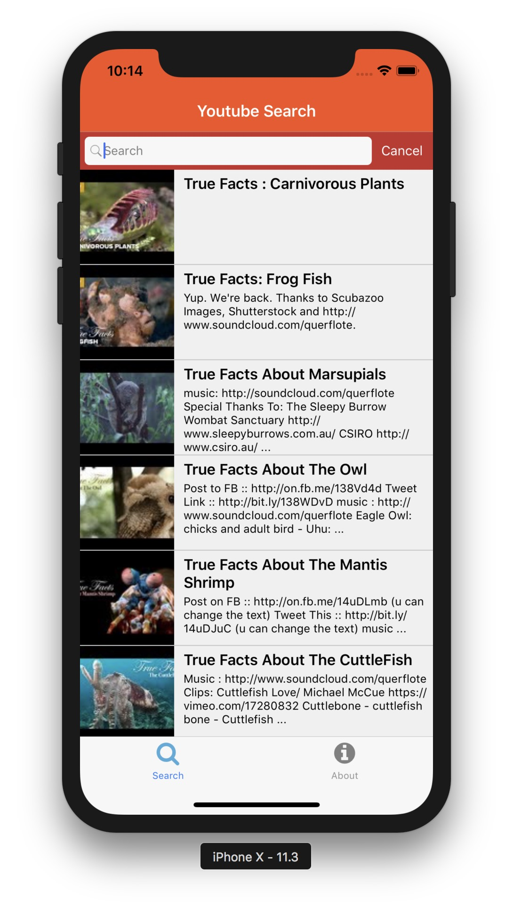
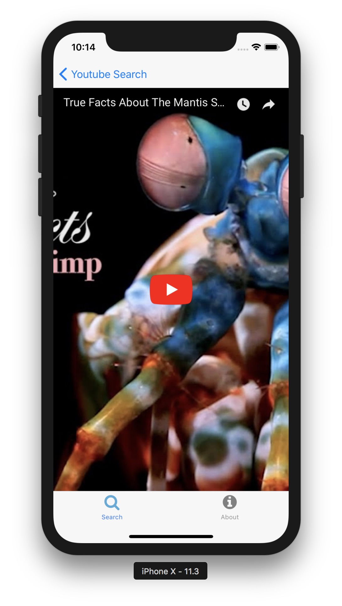


<!-- raw mode to ignore liquid tags that have {{ }} -->

# react-native-workshop

Today we'll be using react-native to build a simple react native app that allows us to search YouTube (just like short assignment 4, way back when.)

{: .tiny }

React Native is very cool - all your react skills can transfer over.

⚠️ Important note!  This is tested on OS X with a recent version of Xcode. We will be using [Expo.io](http://expo.io) to start your project which should allow it to work more easily on Windows and older OS X though. Expo provides a cool cloud simulator so you can test your app more easily.

## Set Up:

### Expo.io

🚀 Go to [http://expo.io](http://expo.io) and create a free account!

### Command Line

:warning: We should already have node installed on our machines, but just in case, let's go way to the beginning:

`$ brew install node`

🚀 And we should install Watchman, too, since react-native depends on it.

`$ brew install watchman`

Watchman is a file watching service that records when files change, and triggers actions when it detects changes.

🚀 Alright, now we're ready to use react-native! We'll be using `exp` the expo command line to init our project. *There exists Expo XDE also, but for our purposes we will stick with the command line stuff for now.*

```bash
npm install expo-cli --global
```

Great! Now we're ready to create our repo.

```sh
💻 expo init youtube-search-app
# choose blank as the template
# although at another time you can play with the more complicated one
💻 cd youtube-search-app
💻 expo start
```

This will run a server than you can then either connect to with then Expo app on your phone or launch a simulator via the directions (open another terminal and run `expo ios`, or select that option in browser). 

If you get an *expo command not found* error try:  
```
export PATH=`npm bin -g`:$PATH
```

When the app loads you should be seeing a basic template for a mobile app.

{: .tiny .fancy}

:snowflake: What just happened? React-Native bundled up everything for us, ran it through XCode/Android SDK, and opened up a simulator, all through the command line and without us ever having to open up XCode or write a single line of Swift code. Neat.

Let's take a sec to talk about how the simulator works. There are two things you can do: `command-R` will refresh the simulator, which is useful each time you save. It's a little annoying, though, especially since we're used to hot reloading in the browser at this point. If you hit `command-D`, a menu will pop up. From there, you can click "Enable Hot Reloading". It might take a few seconds to load, but when it's done it'll refresh the page every time we save something in the project.

:snowflake: Side note: We should appreciate how cool this is. If you've ever tried to program for smartphones before, you know that each time you test, you have to press run in the IDE and then wait for the app to compile. If you're uploading to an actual device instead of a simulator, it takes even longer. React Native is cutting through all the overhead for us so we can do instantaneous reloads without all the wait time.

⚠️ Sometimes 'Hot Reloading' doesn't catch a change, doing a `command-R` to reload then helps.

## Installing Dependencies
We're going to need a few dependencies from our trusty friend, the Node Package Manager.

🚀 Since we're making calls to the YouTube api, it would help if we made GET calls with axios, so:


```bash
# make sure you are cd'd into project dir
💻 yarn add axios
```

Next, we'll need some specific react-native components that some other open source developers have kindly provided to us. This is fairly common in the react-native community, and it's great to have these pre-styled components at our disposal so we don't have to go through all the trouble of making an input field look nice, for example.

🚀 There's one additional component we'll be using in the workshop: [react-native-search-box](https://github.com/crabstudio/react-native-search-box), a simple input field made to look like the classic iOS search bar.

🚀 `💻 yarn add react-native-search-box`

## Eslint

We can't live without this:

```bash
💻 yarn add --dev eslint eslint-config-airbnb eslint-plugin-import eslint-plugin-react eslint-plugin-jsx-a11y babel-eslint
```

🚀 Create a `.eslintrc` file from [this gist](https://gist.github.com/timofei7/c8df5cc69f44127afb48f5d1dffb6c84) and restart your code editor to pick up changes.

## Basic Navigation
One of the classic navigation components in iOS is the Tab Bar. We'll be using the [React Navigation](https://reactnavigation.org/docs/en/getting-started.html) plugin to help with this. You may encounter many conficting packages for doing this,  TabBarIOS, NavigatorIOS, etc, but React Navigation's Stack Navigator is currently the best option for this.  It navigates using string *Screen* identifiers. There is lots of documentation available.

🚀 Create a new directory in the top level of the project folder called `navigation`.

🚀 Now let's install some of the React Navigation dependencies.

```
💻 yarn add @react-navigation/native @react-navigation/bottom-tabs react-native-gesture-handler@~1.5.0 react-native-reanimated@~1.4.0 react-native-screens@2.0.0-alpha.12 react-native-safe-area-context@0.6.0 @react-native-community/masked-view@0.1.5
```

### Tabs

Tabs are a pretty common feature of apps, let's set up some using [Tab Navigation](https://reactnavigation.org/docs/en/tab-based-navigation.html).

🚀 Create a file called `navigation/main_tab_bar.js`:

```js
import React from 'react';
import { Text, View } from 'react-native';
import { NavigationContainer } from '@react-navigation/native';
import { createBottomTabNavigator } from '@react-navigation/bottom-tabs';

const AboutTab = (props) => {
  return <View style={{ flex: 1, justifyContent: 'center' }}><Text>about</Text></View>;
};

const SearchTab = (props) => {
  return <View style={{ flex: 1, justifyContent: 'center' }}><Text>Search</Text></View>;
};

const Tab = createBottomTabNavigator();

const MainTabBar = () => {
  return (
    <NavigationContainer>
      <Tab.Navigator>
        <Tab.Screen name="Search" component={SearchTab} />
        <Tab.Screen name="About" component={AboutTab} />
      </Tab.Navigator>
    </NavigationContainer>
  );
};

export default MainTabBar;

```

🚀  Now lets load this in the main `App.js`. Change `App.js` to be:

```js
import React from 'react';
import MainTabBar from './navigation/main_tab_bar';

// disable really annoying in app warnings
console.disableYellowBox = true;

const App = (props) => {
  return <MainTabBar />;
};


export default App;
```

📱 Test it out.  Looks great, right?

## About

Let's play around with a simple *About* view.


🚀 Create a new directory in the top level of the project folder called `components`.
Then create `components/about.js`.

```js
import React, { Component } from 'react';
import { StyleSheet, View, Text, Image } from 'react-native';

class About extends Component {
  render() {
    return (
      <View style={styles.container}>
        <Image
          style={styles.image}
          source={{ uri: 'https://facebook.github.io/react/logo-og.png' }}
        />
        <Text>
          This app was written in React-Native.
        </Text>
      </View>
    );
  }
}

const styles = StyleSheet.create({
  container: {
    flex: 1,
    justifyContent: 'space-around',
    alignItems: 'center',
  },
  image: {
    width: 400,
    height: 300,
  },
});

export default About;
```


📱 try it out!  

❄️ Note how we are doing styling:
- We can really see how the styles are represented as dictionaries, with the ids being similar to css classes
- Property names need not go in quotes, but if the property itself is a string, it should (like in `backgroundColor: 'white'`)
- Flex is dealt with in kind of a strange way. Instead of a `display` property, these stylesheets default to flex when you simply specify `flex:` followed by some integer. This integer is a lot like the `flex-grow` property that we're familiar with.
- Finally, notice that all our integer values are simply integers! There's no `px`, `pt`, `em`, etc. Only numbers.
- If we had a central style we could simply import it wherever we need it from a `style_constants.js` file for instance. For now we'll create the styles in the same files.


### Connect About

Let's load this new *About* component and make out TabBar better looking at the same time.

🚀 Let's add a package for icons:
```
💻 yarn add react-native-vector-icons
```

🚀 In your `navigation/main_tab_bar.js` file add some imports:

```js
import Ionicons from 'react-native-vector-icons/FontAwesome';
import About from '../components/about';
```

🚀 And replace the `MainTabBar` component with:

```js
const MainTabBar = () => {
  return (
    <NavigationContainer>
      <Tab.Navigator
        initialRouteName="Search"
        screenOptions={({ route }) => ({
          tabBarIcon: ({ focused }) => {
            let iconName;

            if (route.name === 'About') {
              iconName = 'info-circle';
            }

            return <Ionicons name={iconName} size={26} color={focused ? '#58AADA' : 'grey'} />;
          },
        })}
      >
        <Tab.Screen name="Search" component={SearchTab} />
        <Tab.Screen name="About" component={About} />
      </Tab.Navigator>
    </NavigationContainer>
  );
};
```

📱 Check it out!

{: .small}

## Search and Detail


So we've got some basic navigation working on the app, but it looks pretty boring. Let's make some cool stuff on the search tab, like how about a nice table view?

What we want to end up with is VideoDetail and a VideoList view similar to the SA4!

{: .small .left}

{: .small}

Note how the *VideoDetail* view has a back button at the top.  This indicates that it is part of a different type of navigation structure. Specifically, it is in a *StackNavigator* where screens exist in a stack to push and pop on/off.

But we already have a TabNavigator?!  Turns out you can nest navigation stacks. This allows us to start off with a TabNavigator and have a StackNavigator as any of the tabs themselves.  This is so that you can organize your screen flow in ways that make sense. It wouldn't make sense to have a a back button when you switch tabs for instance.

### Create SearchTab

🚀 Let's import the stack navigation package:
```
💻 yarn add @react-navigation/stack
```

🚀 Create `navigation/search_tab.js` and populate with:

```js
import React from 'react';
import { Button } from 'react-native';
import { createStackNavigator } from '@react-navigation/stack';
import Ionicons from 'react-native-vector-icons/FontAwesome';

// import VideoList from '../components/video_list';
// import VideoDetail from '../components/video_detail';

const TempSearch = (props) => (<Button onPress={() => { props.navigation.navigate('Detail'); }} title="next" />);
const TempDetail = (props) => (<Button onPress={() => { props.navigation.pop(); }} title="close" />);

const Stack = createStackNavigator();

// nest stack navigator to handle two internal views
// "name" prop is the name of the route
const SearchTab = () => {
  return (
    <Stack.Navigator>
      <Stack.Screen name="Search" component={TempSearch} />
      <Stack.Screen name="Detail" component={TempDetail} />
    </Stack.Navigator>
  );
}

export default SearchTab;
```

Here we are using `createStackNavigator` instead but it works very similarly. 

### Connect Search Tab

Similar to what we did with the About tab, we want to connect our new Search stack to the main tab bar.

🚀 Delete the old SearchTab component inside `main_tab_bar.js` and import your new one:
```
import SearchTab from './search_tab';
```

🚀 Next, we want to add an icon for the search tab, so edit the screenOptions prop to look like this:
```js
screenOptions={({ route }) => ({
  tabBarIcon: ({ focused }) => {
    let iconName;
		
		// Customize the icon we display based on the tab route
    if (route.name === 'About') {
      iconName = 'info-circle';
    } 
		// Adding the search icon
		else if (route.name === 'Search') {
      iconName = 'search';
    }

		// Return the respective icon
    return <Ionicons name={iconName} size={26} color={focused ? '#58AADA' : 'grey'} />;
  },
})}
```

📱 You should now see how stack navigation works inside of a tab navigator system.

### VideoList

We want to do more.

🚀 Let's create `components/video_list.js` and fill it in:

 ```js
import React, { Component } from 'react';
import Search from 'react-native-search-box';
import {
  ActivityIndicator,
  StyleSheet,
  View,
  Image,
  Text,
  FlatList,
  TouchableHighlight,
} from 'react-native';

import youtubeSearch from '../services/youtube-api';

class VideoList extends Component {
  constructor(props) {
    super(props);
    this.state = {
      query: 'true facts',
      isLoading: true,
      dataSource: [],
    };

    this.renderVideoCell = this.renderVideoCell.bind(this);
  }

  // ---------- componentDidMount here! -----------//

  // ------------ put fetchData here! -------------//


  showVideoDetail(video) {
    // pass in video into this.props.navigation.state.params.video in navigated view
    this.props.navigation.navigate('Detail', { video });
  }

  renderLoadingView() {
    return (
      <View style={styles.loading}>
        <ActivityIndicator size="large" color="#0000ff" />
      </View>
    );
  }


  renderVideoCell(video) {
    return (
      <TouchableHighlight onPress={() => { this.showVideoDetail(video); }} underlayColor="orange">
        <View>
          <View style={styles.container}>
            <Image
              source={{ uri: video.snippet.thumbnails.default.url }}
              style={styles.thumbnail}
            />
            <View style={styles.rightContainer}>
              <Text style={styles.title}>{video.snippet.title}</Text>
              <Text style={styles.subtitle}>{video.snippet.description}</Text>
            </View>
          </View>
          <View style={styles.separator} />
        </View>
      </TouchableHighlight>
    );
  }

  render() {
    if (this.state.isLoading) {
      return this.renderLoadingView();
    }
    return (
      <View>
        <Search
          backgroundColor="#c4302b"
          showsCancelButton={false}
          textFieldBackgroundColor="#c4302b"
          onChangeText={(query) => {
            this.setState({ query });
            this.fetchData();
          }}
        />

        <FlatList
          data={this.state.dataSource}
          renderItem={({ item }) => { return this.renderVideoCell(item); }}
          keyExtractor={(item) => item.snippet.thumbnails.default.url}
          style={styles.listView}
        />
      </View>
    );
  }
}
 ```


🚀 And we should add in some styles too. Let's make it a little more interesting this time:

```js
const styles = StyleSheet.create({
  container: {
    flex: 1,
    flexDirection: 'row',
    backgroundColor: 'rgb(240,240,240)',
  },
  thumbnail: {
    width: 100,
    height: 100,
    marginRight: 5,
    backgroundColor: 'black',
  },
  rightContainer: {
    flex: 1,
    padding: 5,
    height: 100,
  },
  title: {
    fontSize: 16,
    fontWeight: 'bold',
    marginBottom: 3,
  },
  subtitle: {
    fontSize: 12,
  },
  separator: {
    height: 1,
    backgroundColor: 'rgb(200,200,200)',
  },
  listView: {
    backgroundColor: 'rgb(240,240,240)',
  },
  loading: {
    flex: 1,
    justifyContent: 'center',
    alignItems: 'center',
  },
});
```

🚀 Alright, let's update the `search_tab.js` to show our new VideoList component:

```js
<Stack.Screen name="Search" component={VideoList} />
```

🚀 While we're here, let's jazz up the style of the youtube search header:
```js
<Stack.Screen
  name="Search"
  component={VideoList}
  options={{
    title: 'Youtube Search',
    headerStyle: {
      backgroundColor: '#f4511e',
    },
    headerTintColor: '#fff',
  }}
/>
```

🚀 Take a look at the simulator: Loady-spinny!  This is the default `<ActivityIndicator />` component we're showing if the API call hasn't returned videos yet. Since we haven't made an API call yet, that definitely makes sense.

{: .small}

🚀 Let's add in the fetchData method to make our API call.

```js
fetchData() {
  youtubeSearch(this.state.query)
    .then((responseData) => {
      this.setState({
        dataSource: responseData,
        isLoading: false,
      });
    }).catch((error) => {
      console.log(error);
    });
}
```

Where should we call this from? It would be nice if we could get the data from YouTube as soon as we get to the page. Can you recall from your React mastery which life cycle component is the ideal place to call it? You guessed it.

🚀 Create a function `componentDidMount` in `video_list.js`. Inside it, make a call to `this.fetchData`.

:snowflake: Now when the page loads, we'll call `fetchData` to populate our list view.


### Youtube API

Ah darn, one other thing. We need to actually have a reference to the API, right? This next part should (hopefully) look super familiar.

🚀 Create a new file at the top level of your project, `youtube-api.js`.

Sound familiar?  We did this in short assignment 4, and we will be using the exact same api for this react-native app!  That's coooool.

🚀 Go ahead and find that file and copy it here.  We need to do this because we need your individual api key, which you already made in sa4.  If you want more than 5 results at a time then add in `maxResults: 15` to the `params`.

- Accidentally deleted your API key? No biggie. Just follow the [old instructions from sa4](http://cs52.me/assignments/sa/react-videos/#youtube-api).


📱 At this point you should be showing a list of videos, coolbeans.

## VideoDetail

At list point clicking on a list item takes us to a boring screen. Let's make that better.

🚀 Create new file called `components/video_detail.js` and paste in this code:

```js
import React from 'react';
import WebView from 'react-native-webview';

const VideoDetail = (props) => {
  // example of destructuring, the below is equivalent to props.route.params.video
  const { route } = props;
  const { video } = route.params;

  return (
    <WebView
      source={{ uri: `https://www.youtube.com/embed/${video.id}` }}
      automaticallyAdjustContentInsets={false}
    />
  );
};

export default VideoDetail;
```

🚀 Oops, we forgot to install the Webview component:
```
💻 yarn add react-native-webview
```

:snowflake: The WebView component is a sort of hybrid component that's actually just rendering a webpage. The `source` prop holds a uri that's called as if in a browser and then displayed in our application. Notice how it looks just like watching youtube on a mobile device. Pretty cool that we can do this within our application alongside native components, huh?

🚀 Swap out the `TempDetail` view in your `search_tab.js` for this new component.

🚀 Now that the app is complete, we're using all the styling we pasted in awhile ago. Now it's your turn: play around with the styling in `video_list.js`. If you haven't enabled hot-reloading yet, do that, it'll make it easy to see all your styling changes.


## And We Are Done!
Look at you! You spend eight weeks in full-stack web dev, but little did you know it was actually smartphone programming in disguise!

There's a lot going on in the VideoList view that we breezed through. [Read through it](#videolist) a bit more carefully.

Also note how simply the `Search` component updates our query state and triggers a `fetchData`.


## Submission
To submit, create a new github repo and push your code up to it. On canvas, submit the URL to your repo.

## Resources

* https://docs.expo.io/
* http://www.reactnative.com/
* https://reactnavigation.org
* https://facebook.github.io/react-native/
* https://github.com/jondot/awesome-react-native


*Thanks to: Jane Lee, Sia Peng, Armin Mahban, Adam Rinehouse for the original workshop in 17s. Refactored in 18s for expo.io and React Navigation. Refactored in 19s by Angela Li for React Navigation 5.x*



