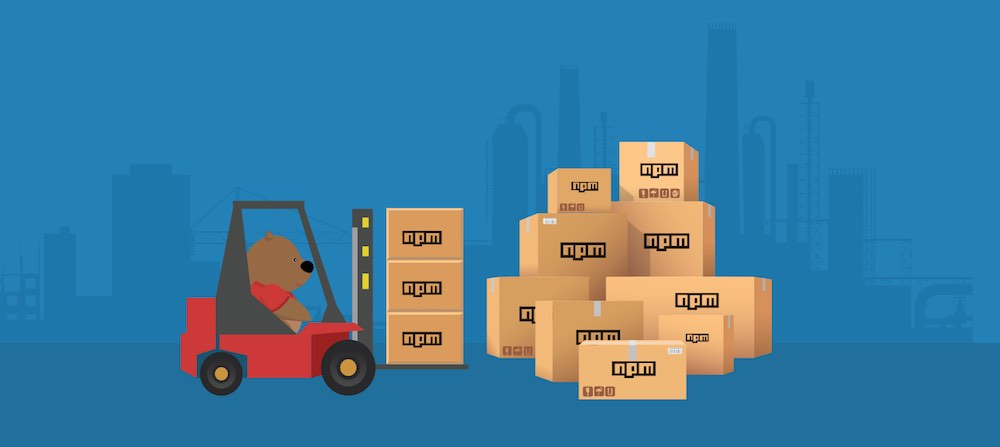
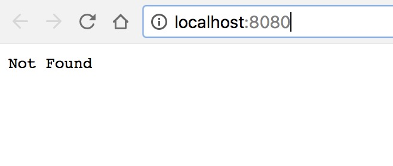
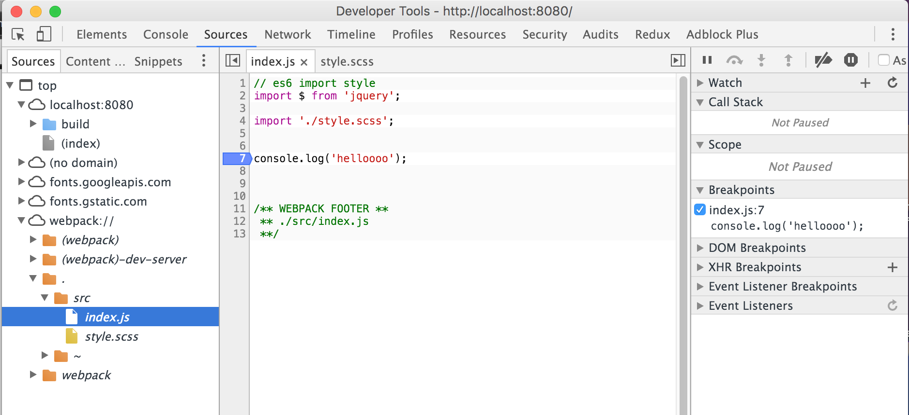

## Overview

Today we'll be learning about a set of tools for making your code compact and pretty.  So far you've been using html and css in separate files and the sites have been fairly compact — but as your sites grow more complex and include more and more libraries there has to be a way to manage it all.  We'll introduce a set of tools to help you build complex sites with many module dependencies easily.

💻 : run in Terminal<br>
🚀 : a step to not forget

🚀 To start grab the github classroom link in canvas to start a new repository. Work in the `master` branch for now, you'll see why later.

## Today's Stack

We'll build a starter package that will use:

* webpack
* sass
* babel
* eslint
* as well as a suite of cool tools: node, npm, yarn, Atom

Don't worry we'll learn allllll about it.

🌵 Note: This *short* is a little on the long side, but it's important. Try to read the explanations so you understand what is happening — you will be using and building up from this starterpack for the next month.


## [yarn](https://yarnpkg.com/en/) and [NPM](https://www.npmjs.com/)

{: .fancy .tiny }

{: .fancy .tiny }


[NPM](https://www.npmjs.com/) is the dependency package manager for Node.js and the javascript ecosystem in general.  While we won't exactly be using node just yet today, we will be using the package manager to install various javascript tools. Node.js is a javascript platform for running javascript outside of a browser for developing server side applications and we will be using it extensively later on. You can do things like `npm install somepackage` and it will download that package and add it to your project. Great. WTF is [yarn](https://yarnpkg.com/en/)?  Yarn is a faster/better npm.  It uses the same repository of packages.  You can use it practically interchangeably - just decide which you will use and try to stick to it. Yarn is newer and we're going to try it out for 18S and see how it goes.


### Installation

🚀 NPM comes with Nodejs so we'll first install that.

#### os x:

```bash
brew update
brew upgrade
brew install node
brew install yarn
```

Make sure you have the right versions of node/npm/yarn:

```bash
node --version
#v9.8.0
npm --version
#5.6.0
yarn --version
#1.5.1
```

Newer than these is fine, but if you have older ones you might need to force uninstall/reinstall:

If you run into problems here you can try forcing a reinstall:

```bash
sudo chown -R $USER /usr/local  #in case you had ever run brew with sudo
brew uninstall --force node
brew install node
```

#### windows, other:

* windows: install from [nodejs.org](https://nodejs.org/en/) and [yarnpkg.com](https://yarnpkg.com/en/). *you may need to restart git shell afterwards*
* linux: use your distribution's package manager

### start a node project

🚀 We will start a node js project even though we will only be using the node package manager.

```bash
#make sure you are cd'd into your cloned workspace

yarn init #accept all the default answers if you want
```

All this did was create a barebones `package.json`  file.  This file defines a node.js based project and is required.  It will primarily list all of the dependencies of our project.  It will also define some convenient scripts for us.

### Index file

🚀 Lets create a simple javascript file to get us started. It is good practice to keep your app in a subdirectory of the project so lets create that and call it `src`.

```bash
mkdir src #create directory
touch src/index.js   #creates an empty file
```

🚀 Now in **Atom** lets give our app something to do.

```javascript
console.log('starting up!');
```

### yarn start

Now lets make it so we can run our app!

🚀 Edit your `package.json` file:

* change:
  `"main": "index.js"` to `"main": "src/index.js"`
* add/modify a `"scripts"` section:
  `"scripts": { "start": "node src/index.js" }`

Now in 💻 you can:

```bash
💻 yarn start

yarn run v1.5.1
$ node src/index.js
starting up!
✨  Done in 0.16s.
```

Great, you just ran a little bit of javascript on the computer without a browser.

But, we want to actually make a webpage right?

## Index HTML

Let's set up a simple `index.html` to act as our main html page.

🚀 Create an `index.html` in in the `src/` folder:

```html
<!DOCTYPE html>
<html>
  <head>
    <title>starter pack</title>
    <meta name="viewport" content="width=device-width, initial-scale=1.0">
    <link href="https://fonts.googleapis.com/css?family=Roboto" rel="stylesheet">
  </head>
  <body>
    <div class="logo"></div>
    <div id="main">Loading</div>
  </body>
</html>
```

Sweet, a page that says "loading". You rock.


## Webpack

{: .fancy .small}

[Webpack](https://webpack.js.org) is a build tool.  What it does is take all your dependencies (all the various files and libraries that your project is using) and bundle them up together — but in a smart way where it will only bundle up the things you need. It can do any preprocessing that you need, such as converting various code syntax and supports hot-reloading, so you never have to refresh the page manually again.  Most cleverly it actually analyzes your code and figures out what you are doing and only includes what is necessary. It makes 1 file out of all your JS files, it can optimize your images, it can make your CSS better.

{: .profile}

Webpack is the shopping cart; `package.json` is the shopping list; and your browser is um, the frying pan that cooks a delicious web meal for you?

### Install Webpack for the project


🚀 Lets add webpack to our 🚼 project:

```bash
yarn add webpack webpack-serve webpack-cli --dev
```

`yarn add` is how you add most any javascript library to your project.  It will install in a directory `node_modules` in your project.  Note: `yarn install` would install it but not add it to your `project.json`.  Generally you want to add it to your project so that later if others were to download the project they could install the same packages.

Note: when you give `--dev` as an argument it will add those modules to your `package.json` in a `devDependencies` section.  In this case we are saying these are *development* only dependencies. So you will now notice new lines declaring those dependencies in `package.json` as `"devDependencies"`. Leave off the `--dev` flag if you are adding in a library you want to package up for the browser.

⚠️ `node_modules` is **not** something you need to commit to git.  These are libraries that you can assume will be available and so as long as you have saved the dependencies to the `package.json` file anybody can later install all of the required packages by simply running `yarn install`.

🚀 Let's make sure we don't do that now.  Create a file called `.gitignore` and add the following:

```bash
dist
node_modules
yarn-error.log
.DS_Store
```

🚀 Let's add things to git while we are at it: `git add * .gitignore`, `git commit -am "we have some files in our project now"`


### First JS On The Web


🚀 Lets add in [JQuery](http://jquery.com/) really quick. We won't really be using much jquery this term, but for a quick example it will suffice.

```bash
💻 yarn add jquery   #notice there is no --dev
```


🚀 Change your `index.js` to the following:

```javascript
const $ = require('jquery');

$('#main').html('Here we go!');

```

All this will do is find the element with the `id` of `main` and change the content to 'Here we go!'.

At this point, you could try opening this page in a browser, but it won't work! The browser has no idea how to find jquery and this it all crashes and burns 🔥.

### Configure webpack

🚀 Lets give webpack a very basic configuration. Create a file called `webpack.config.js` with these contents:

```javascript
const env = process.env.NODE_ENV || 'development';
// set to 'production' or 'development' in your env

module.exports = {
  mode: env,
  entry: ['./src'], // this is where our app lives
  devtool: 'source-map', // this enables debugging with source in chrome devtools
  module: {
    rules: [
      {
        test: /\.js$/,
        exclude: /node_modules/,
      },
    ],
  },
  plugins: [],
};
```

All this is saying is that we want to look in `src` for `.js` files. Webpack will assume some other things about our project - in particular it will package things up into a directory called `dist`.

```bash
src/ #all the source html,js,css,scss files for your app
dist/  #autogenerated directory where webpack will put your bundle files
```

🚀 now try running webpack directly from the commandline: `./node_modules/.bin/webpack`

```bash
💻 ./node_modules/.bin/webpack
Hash: 1ab8c0f7ebef096a6462
Version: webpack 4.2.0
Time: 484ms
Built at: 3/22/2018 6:14:54 PM
      Asset     Size  Chunks             Chunk Names
    main.js  270 KiB    main  [emitted]  main
main.js.map  351 KiB    main  [emitted]  main
Entrypoint main = main.js main.js.map
[./src/index.js] 448 bytes {main} [built]
   [0] multi ./src 28 bytes {main} [built]
    + 1 hidden module
```
{: .example}

🚀 Now if you do `ls dist`, you'll see some files in there!

Great! It is building our `index.js` file and packaging it up into a new bundle called `main.js`. There is also one hidden module which isn't ours. In this case this is jquery! How'd it know?  Well it analyzed our `index.js` and saw our `require` statement, then it located the module in `node_modules` and included it. 😎

Ok, but like, there is no `.html` file and how is this useful, you can't even see the page.

🚀 Let's delete dist for now. `rm -rf dist`

### webpack-serve

{: .fancy .tiny}


This is where webpack-serve comes in. It is a development server setup that will help us run our web app.

We could start up a python webserver to load the files, but webpack comes with a dev server built in and it is much better.

🚀 Edit your `package.json` again and change the `start` line to: `"start": "NODE_ENV=development webpack-serve ./webpack.config.js",`

*Note: on windows the syntax may be a tiny bit different `SET NODE_ENV=development & webpack-serve ./webpack.config.js`*

🚀 Now you can simply run `yarn start`:

```
💻 yarn start

yarn run v1.5.1
$ NODE_ENV=development webpack-serve ./webpack.config.js
ℹ ｢hot｣: webpack: Compiling...
ℹ ｢hot｣: WebSocket Server Listening at localhost:8081
ℹ ｢serve｣: Project is running at http://localhost:8080
ℹ ｢serve｣: Server URI copied to clipboard
ℹ ｢hot｣: webpack: Compiling Done
ℹ ｢wdm｣: Hash: bcbf4953e7e2b154c1b6
Version: webpack 4.2.0
Time: 11648ms
Built at: 3/22/2018 6:23:18 PM
      Asset     Size  Chunks             Chunk Names
    main.js  371 KiB    main  [emitted]  main
main.js.map  466 KiB    main  [emitted]  main
Entrypoint main = main.js main.js.map
[...]
ℹ ｢wdm｣: Compiled successfully.
```
{: .example}

{: .fancy .tiny}

Ok,  we're now *supposedly* showing our page through webpack-serve, but why isn't it working??!?!  

### HtmlWebpackPlugin

Well... by default webpack understands javascript, but honestly has no idea what to do with our `index.html` file. That is the file we need the browser to see. So we have to tell webpack about html. To do this we're going to add a webpack plugin.

🚀 The plugin we are looking for now is the `html-webpack-plugin`.  Go ahead `yarn add --dev` that and add
`const HtmlWebpackPlugin = require('html-webpack-plugin');` to the top of your `webpack.config.js` file.

🚀 And in the `plugins: []`array add in:

```js
new HtmlWebpackPlugin({
  template: './src/index.html',
  filename: './index.html',
}),
```

This just tells webpack that we want it to know that we have a `src/index.html` file and we want it to be available as just `index.html` in our final product.

🚀 ctrl-c out of your webpack server and rerun `yarn start`.

Now it works!

{: .fancy .tiny}

Notice that now index.html is being output by webpack in addition to the main.js file.

```
Asset       Size  Chunks             Chunk Names
main.js    371 KiB    main  [emitted]  main
main.js.map    466 KiB    main  [emitted]  main
./index.html  374 bytes          [emitted]
```


#### Webpack loaders

Webpack [loaders](https://webpack.js.org/concepts/loaders/) are modules that help webpack understand certain types of files. Loaders are the magic that allow webpack to `import` js files, compile sass to css, optimize images etc.

We're now going to add a loader that teaches webpack about newer ES6 syntax javascript - the `babel-loader`.

## Babel

{: .fancy .small }

We've talked a little bit about various JS versions.  Babel is a transpiler that converts newer es6+ javascript syntax to more compatible es5 syntax that browsers actually understand (browsers are typically behind in their ECMAScript support). If you are curious you can try it out at [babeljs](https://babeljs.io/repl/)


### Install and configure Babel

🚀 Let's install babel and the webpack babel-loader.

```bash
yarn add babel-core babel-loader babel-preset-env babel-polyfill --dev
```

Babel needs to be configured for the particulars of what feature set of ECMAScript you want.

🚀 Create a file called `.babelrc` in your project:

```json
{
  "presets": [
    ["env", {
      "targets": {
        "browsers": ["last 2 versions"]
      }
    }]
  ]
}
```


🚀 Finally merge the following with your `webpack.config.js` file

```javascript
module: {
  rules: [
    {
      test: /\.js$/,
      exclude: /node_modules/,
      use: [ //here's the part you want
        { loader: 'babel-loader'}
      ]
    }
  ],
},
```

🚀 and change your `entry` to be `entry: [ 'babel-polyfill', './src' ],`
this loads in some nice extra babel functions before we get into our app so we can use them.

🚀 `ctrl + c` out of your webpack server and run `yarn start` again to pick up the changes to the config files.

###  use some es6

🚀 Let's change our `index.js` to do something a tiny bit more interesting and we'll use ES6 syntax.

```javascript
// change require to es6 import style
import $ from 'jquery';
```

🚀 Now write some javascript that updates the `#main` element every second to:  `You've been on this page for ${num} seconds.`.  This will be a simple counter.  

* you could use `setInterval` to call a function
* if you have anonymous functions please use arrow notation `() => { }`
  * in fact you might run into scope problems if you don't use arrow notation as arrow notation does better things with scope than regular anonymous functions.
* avoid using `var` (remember `let` and `const`)

Excellent, now your page is keeping count of how long its been since you loaded / reloaded it. **SUPER USEFUL!**


## Linting and Linting Loader

{: .fancy .small}

Ok, how about we add in linting. Linters are code parsers that check your code for syntax errors, common style mistakes, and makes sure that your code is clean and follows some best practices. Linters help save time, detect bugs, and improve code quality. Linters exist for all types of languages and even markdown such as HTML, CSS, and JSON. Linters are especially helpful for detecting syntax errors while using dynamically typed languages in lightweight editors such as Atom and Sublime.

In *Atom* install the `linter-eslint` plugin.

{: .fancy .small}


The recommended linter plugin for javascript is [Eslint](http://eslint.org/).

🚀 Install `eslint`:

```bash
yarn add --dev eslint babel-eslint eslint-loader
yarn add --dev eslint-config-airbnb eslint-plugin-import eslint-plugin-jsx-a11y eslint-plugin-react
```

`eslint` comes with a series of plugins for various javascript packages.  In particular Airbnb's style guide is one that we will be **strongly** requiring:  [eslint-config-airbnb](https://github.com/airbnb/javascript/tree/master/packages/eslint-config-airbnb). We'll be changing some of the rules and the rules are flexible (you may disable some of the more annoying ones).  

🚀 After installing `eslint`, create an eslint configuration file `.eslintrc` with something like the following. This file instructs eslint to use the airbnb rules and overrides some of the common rules that I found particularly obtrusive. You are allowed to turn off certain rules if you prefer but take a look at the documentation and read about why the rule was implemented first.

```json
{
    "extends": "airbnb",
    "parser": "babel-eslint",
    "env": {
        "browser": true,
        "es6": true
    },
    "rules": {
        "strict": 0,
        "quotes": [2, "single"],
        "no-else-return": 0,
        "new-cap": ["error", {"capIsNewExceptions": ["Router"]}],
        "no-console": 0,
        "import/no-unresolved": [2, { "caseSensitive": false } ],
        "no-unused-vars": ["error", { "vars": "all", "args": "none" }],
        "no-underscore-dangle": 0,
        "arrow-body-style": 0,
        "one-var": ["error", { "uninitialized": "always", "initialized": "never" }],
        "one-var-declaration-per-line": ["error", "initializations"],
        "max-len": ["error", 200],
        "no-extra-parens": 0,
        "no-restricted-syntax": [
          0,
          "DebuggerStatement"
        ],
        "no-debugger": "warn"
    }
}
```

🚀 Now go to Atom -> Preferences -> Packages -> linter-eslint -> Settings, and check "Fix Errors on Save". Super useful. This will fix indentation problems and some other things automatically whenever you save. Now restart Atom.

When you see errors such as below:

{: .fancy .small}

You can click on the definition of the error to learn more.  Note: many of these show up as errors but are not compiler errors like you are used to in Eclipse.  The browser or node may still run the code fine — however it is recommended that you fix these errors or learn about what the errors mean and disable them only if you disagree with that particular rule stylistically.

🚀  Now let webpack include eslint! In your `webpack.config.js` file, add `{ loader: 'eslint-loader' }` to the loaders section for `test: /\.js$/`.

This will run your code through eslint before compiling it – thus making sure it is all good and giving you warnings and errors otherwise. Not only will Atom show the errors - but the browser console will as well.

From here on your assignments will all use an `.eslintrc` file as well as a `.babelrc` file.  Adhering to a code style and ES6 will at first seem annoying but you'll find ES6 to be a much more beautiful version of the language and over time will grow to appreciate the linting rules as well. This is also pretty much industry standard.


## SASS Webpack loader

Let's make webpack handle CSS for us also, and we'll even upgrade that to [SASS](http://sass-lang.com/guide)!  SASS is nicer - and demonstrates why webpack is so cool.

{: .fancy .small}

🚀 Does this mean we need another loader? Yup!

```bash
yarn add css-loader sass-loader node-sass style-loader mini-css-extract-plugin --dev
```

😑 Too many!  We have a few loaders:

* [css-loader](https://github.com/webpack-contrib/css-loader): allows you to use @import and url() in css to import other files
* [sass-loader](https://github.com/webpack-contrib/sass-loader): loads SASS/SCSS files and compiles to CSS
* [style-loader](https://github.com/webpack-contrib/style-loader): Adds CSS to the DOM by injecting a <style> tag

And a couple other helper packages.

🚀 Now you need to modify the `webpack.config.js` file to include the css/sass loaders. Here's what it should look like now:


```javascript
const MiniCssExtractPlugin = require('mini-css-extract-plugin');
const HtmlWebpackPlugin = require('html-webpack-plugin');

const env = process.env.NODE_ENV || 'development';
// set to 'production' or 'development' in your env

const finalCSSLoader = (env === 'production') ? MiniCssExtractPlugin.loader : { loader: 'style-loader' };

module.exports = {
  mode: env,
  entry: ['babel-polyfill', './src'], // this is where our app lives
  devtool: 'source-map', // this enables debugging with source in chrome devtools
  module: {
    rules: [
      {
        test: /\.js$/,
        exclude: /node_modules/,
        use: [
          { loader: 'babel-loader' },
          { loader: 'eslint-loader' },
        ],
      },
      {
        test: /\.s?css/,
        use: [
          finalCSSLoader,
          {
            loader: 'css-loader',
            options: {
              sourceMap: true,
            },
          },
          {
            loader: 'sass-loader',
            options: {
              sourceMap: true,
            },
          },
        ],
      },
    ],
  },
  plugins: [
    new MiniCssExtractPlugin(),
    new HtmlWebpackPlugin({
      template: './src/index.html',
      filename: './index.html',
    }),
  ],
};
```
Don't worry about the `MiniCssExtractPlugin` part - that is for outputting files for publishing later.

🚀 Create a  `src/style.scss` file and add in some style!

```css
body, html {
  font-family: "Roboto", sans-serif;
  background: linear-gradient(to bottom, #87e0fd 0%,#53cbf1 40%,#05abe0 100%);
  height: 100%;
}
```

🚀 Now, you need to have webpack include it, so add `import './style.scss'` to your `index.js` file! Remember webpack won't include anything that isn't used by your app directly - and the way to tell it is to import it into your app somewhere.  Your whole app right now is `index.js` so let's import it there.

🚀 Restart your webpack server and see if you style changes are picked up.

### Hot reloading

Wait, we were promised hot-reloading, whatever that means!

You got it!  Try changing your `style.scss` file – you should see changes but your counter doesn't restart!

On the terminal you'll see anytime you change your project files that webpack recompiles automatically - and in your browser console log as well.  Right now if you edit `index.js` you might be a full reload - that is because that file is everything so any changes in it will trigger a full reload.

## MiniCssExtractPlugin

This part gets a bit complicated.  We are including both css and sass loaders, and doing a little bit of trickery with the `mini-css-extract-plugin`.  The reason for this is that by default webpack is really all about the javascript. This means that webpack loads your CSS in via javascript.  This could cause an annoying flash of unstyled content ([FOUC](https://en.wikipedia.org/wiki/Flash_of_unstyled_content)) when you first load the page.  We want the CSS to be output separately as text into a `main.css` rather than loaded from `main.js`.  

The ternary line we have `(env === 'production') ? MiniCssExtractPlugin.loader : { loader: 'style-loader' };`
evaluates so that in *development* mode we use the `style-loader` which injects the CSS into the DOM via JS so that we can have hot-reloading, whereas in *production* mode it compiles it all down to an actual file.

## Image File Loader

{: .fancy .tiny}

Ok, so now webpack understands html, js, sass, and css.  But what if we want to include an image?

🚀 Just add another loader!  Let's use [file-loader](https://github.com/webpack-contrib/file-loader)

```bash
yarn add file-loader --dev
```

🚀 Here's the bit to include, where do you think it goes in your `webpack.config.js` file? *Hint: look for where you already have an example using `test`*

```js
{
  test: /\.(jpe?g|png|gif|svg)$/,
  use: [
    {
      loader: 'file-loader',
      options: {
        useRelativePath: true,
        name: '[name].[ext]',
      },
    },
  ],
},
```

🚀 Restart webpack server to pick up config changes.

🚀 Try adding an image into your `src/img` folder maybe and then showing it in the logo div:

```css
.logo {
  background-image: url('img/MYIMAGE.jpg');
  width: 100px;
  height: 100px;
  background-repeat: no-repeat;
  background-size: contain;
}
```

Yeah, can you see it?


## AutoPrefixing!

{: .small}


As you've been playing with CSS you've probably noticed the internet mentioning vendor prefixes such as:

```
-webkit-transition: all 4s ease;
-moz-transition: all 4s ease;
-ms-transition: all 4s ease;
-o-transition: all 4s ease;
transition: all 4s ease;
```

Due to varying browser support of features these are often associated with newer CSS. This should be something easy for a machine to solve rather than us humans manually remembering to make a mess of our CSS code, and indeed someone has.  Enter [autoprefixer](https://github.com/postcss/autoprefixer).

This is a module that we can incorporate and have webpack automatically prefix our canonical css to work in all browsers. It is actually a plugin for a [loader](https://webpack.js.org/concepts/loaders/), but regardless, you can see how it is configured here.

🚀 Let's add the [postcss-loader](https://github.com/postcss/postcss-loader), this allows us to add in some post processing of the CSS.


🚀 Edit your `webpack.config.js` file once again and add in:

```js
{
  loader: 'postcss-loader',
  options: {
    plugins: () => [autoprefixer()],
    sourceMap: true,
  },
},
```

in between your `css-loader` and your `sass-loader` objects.

🚀 and add in `const autoprefixer = require('autoprefixer');` to the top of the file.

🚀 Oh, and guess what you need to `yarn add --dev` as well?  Yup, `autoprefixer`and `postcss-loader`.

## Project Structure

At this point your project structure should look something like:

```
.babelrc
.eslintrc
.git
.gitignore
node_modules/
package.json
src/
    img
    index.html
    index.js
    style.scss
webpack.config.js
yarn.lock
```

## Deployment

{: .fancy .small}


How would you deploy a webpack setup such as this?

We're prepping this to be our SPA (single-page-app) starter pack and unfortunately github-pages doesn't have SPA support.  So we're going to be using another service to host our pages. Super easy though.

So what we're going to do is add a new deployment method.  We'll use [surge.sh](surge.sh) for this.  Surge is a fast static file hosting service similar to gh-pages but it has a couple of extra features.

{: .fancy .small}


```bash
npm install -g surge
yarn add --dev surge #both command and in dependencies
```

🚀 Add the following to your `package.json` `scripts` section:

```javascript
"build": "yarn clean; NODE_ENV=production webpack --colors",
"clean": "rimraf dist",
"deploy": "yarn build; surge -p dist -d MYCOOLSTARTERPACKNAME.surge.sh; yarn clean"
```

Go ahead.  Change the `MYCOOLSTARTERPACKNAME` to be a domain unique for you - say `yourname-cs52-starter.surge.sh`. `yarn deploy`.  


Now you have a deploy script you can run!

🚀 first run:

```
💻 yarn build
```

And poke around in the newly created `dist` folder.  It should look something like:

```bash
img          main.css     main.js
index.html   main.css.map main.js.map
```
{: .example}

These are the compiled/built output files — the actual files that the browser sees. `dist` should never be added to git as it is generated output.

🚀 Now try:

```
💻 yarn deploy
```

This will build your app into the `dist` directory and the deploy all the right stuff to surge.

🚀 git `add`, `commit`, `push` all the code that is currently in your `master` branch to your `origin master` branch. You should now have:  `master` branch with `/src` and all your webpack and package files.

## Release V1

🐙 Before we finish let's tag our repo so that there is a *release version* associated with our starterpack. This is convenient so you can keep track of how your starterpack progresses and for us to grade as well.

```bash
git tag v1
git push origin --tags
```

Now on github you can look at official releases of your startpack! So official.

{: .fancy .small}


## A word about debugging

{: .fancy .small}

As always you should use Chrome Dev Tools with the console as the first line of defense. Checking for errors there is the first thing you should look for.  You can also use breakpoints.  The recommended way to is locate the source in devtools and click the line number to add the breakpoint. Because of webpacks magic all sources end up in webpack:// *(Sources -> weback:// -> . -> src)*

{: .fancy }

You can also use the statement `debugger;` in your code, but that is somewhat frowned upon as you might forget and leave one in a piece of code that doesn't get executed often causing mayhem.


## Frontend Starter Pack is ready to go!

You now have a nicely set up starter pack that you can use for all your cool projects.  We will use this in most of the future assignments and build up on it too, so it is worth getting this all working.

### To Turn In

1. url to your github repository
1. url to deployed surge url
1. Checklist:
  * webpack-serve starts and serves pages
  * babel is configured
  * eslint is configured
  * webpage displays and counts seconds
  * image displays and is loaded via webpack
  * js is es6 and linted without errors
1. A short answer response on canvas to:
  * describe the environment you set up.
  * any questions about what/why/how that you feel are unresolved?

### Extra Credit

* add in more robust image loading than just file-loader. (compress + optimize)


## Resources:

* [getting started with webpack2](https://blog.madewithenvy.com/getting-started-with-webpack-2-ed2b86c68783)
* [webpack docs](https://webpack.js.org/)
* [babeljs](https://babeljs.io/)
* [State of the Art Javascript 2016](https://medium.com/javascript-and-opinions/state-of-the-art-javascript-in-2016-ab67fc68eb0b#.26xksjxvt)
* [Survive Webpack](https://survivejs.com/webpack/foreword/)
