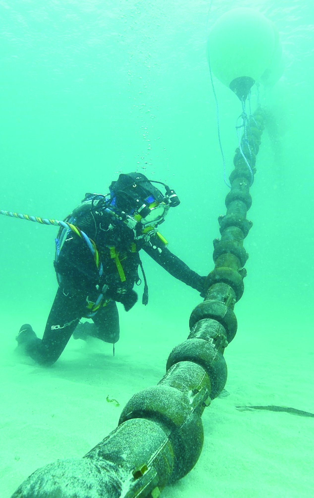
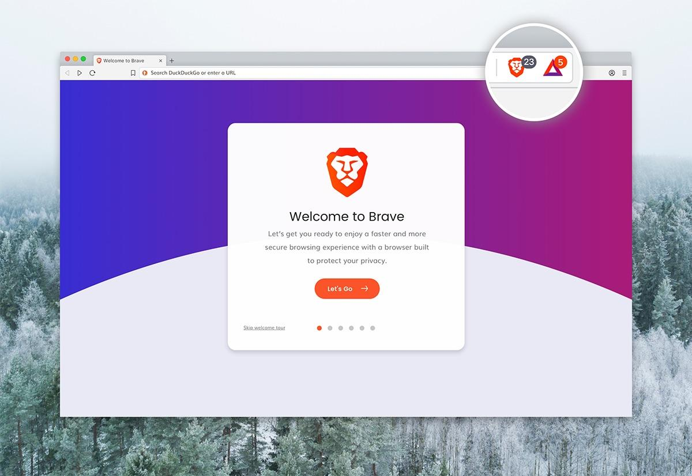
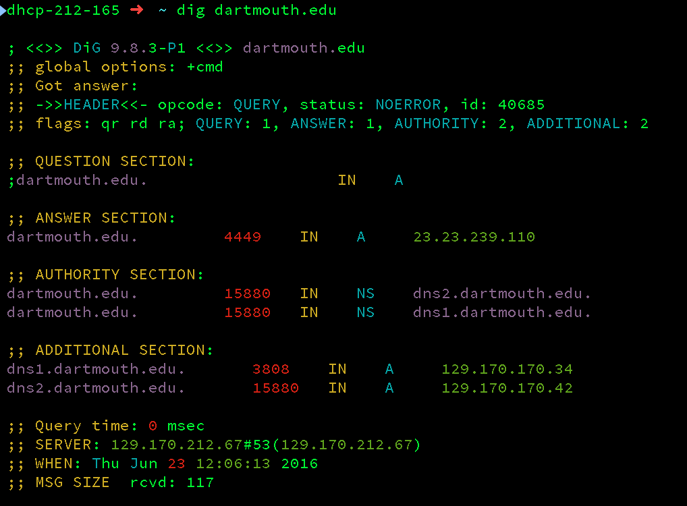
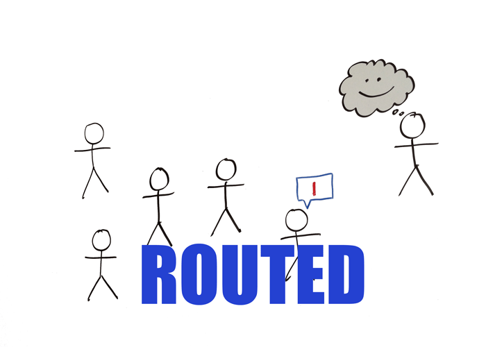
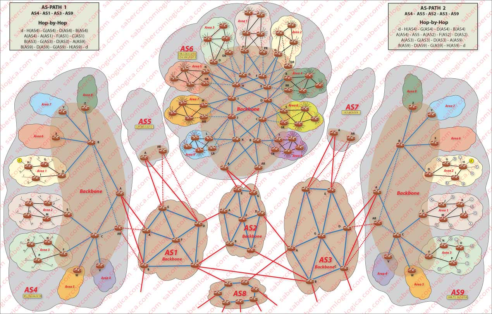

layout: true
class: center, middle
name: pic
background-size: contain
background-position: center

---

layout: true
class: center, top
name: fragment

.title[{{name}}]

---
layout: true
class: center, middle
name: base

.title[{{name}}]

---
name: WWW, tubes, networks


<audio  controls="true" preload="auto">
  <source src="img/series_of_tubes.mp3" type="audio/mp3">
  <source src="img/series_of_tubes.ogg" type="audio/ogg">
Your browser does not support the audio element.
</audio>

<audio controls>
  <source src="img/got_it_yesterday.mp3" type="audio/mp3">
  <source src="img/got_it_yesterday.ogg" type="audio/ogg">
Your browser does not support the audio element.
</audio>


.fancy.medium[]

> &ldquo;series of tubes --[Senator Ted Stevens (R-Alaska)](https://en.wikipedia.org/wiki/Series_of_tubes)&rdquo;

???
* CS60
* an internets was sent by my staff!
* we'll be sending each other lots of internets this term
* so we'll learn today what happens from your browser on out
* not wrong though

---
template: base
name: Submarine Cables

.fancy.small[]

???
* literally tubes under the ocean

---
template: base
name: Submarine Cables

.fancy[]

*(from [submarinecablemap.com](http://www.submarinecablemap.com/))*

???
* here's a map of all the tubes

---
name: City To City


.fancy[]

*(from [Chris Harrison](http://chrisharrison.net/index.php/Visualizations/InternetMap))*

???
* based on router configurations - which you'll learn about shortly!

---
name: Facebook Map

.fancy[]

*(from [Paul Butler](https://gigaom.com/2010/12/14/facebook-draws-a-map-of-the-connected-world/))*


Notice anything interesting missing?


???
* FB map is more of a social graph but does show internet connected Facebook users.
* missing obviously siberia.
* China blocks facebook

---
name: Computer2Computer Communication

<iframe src="//giphy.com/embed/zXmbOaTpbY6mA" width="480" height="202" frameBorder="0" class="giphy-embed" allowFullScreen></iframe>

URL=protocol+IP+port<br>
http://127.0.0.1:8000

???
* at its most basic -
* how to get from one computer - your laptop - to somewhere else
* or to this magical cloud thing
* or the pentagon
* lets start with the URL

---
name: Protocols
template: fragment
class: center, top

What is a protocol?

???
* Anybody?


--
name: Protocols
template: fragment
.fancy.medium[]


???
* we have social protocols all time
* secret handshakes!

---
template: base
name: Social Protocols

.fancy.medium[]

*(image from [Computer Networking: A Top Down Approach](https://wps.pearsoned.com/ecs_kurose_compnetw_6/))*


???
* Computers talk to each other like humans.  
* ordering my starbucks iced reserve
* social protocol.
* Protocols are **simply the order and format of the conversation**
* both computer hardware and software employ protocols to communicate.
* many protocols from how to **transmit email** to how your **wifi sends radio signals**.


---
template: fragment
name: Layers

.fancy.medium_small[]


???
* turns out, not just tubes, also layers

--
template: fragment
name: Layers

of protocols


???
* internet currently operates using a **system of layered protocols**.
* Your mail program does not need to know about how data gets transmitted between your computer and your wifi router
* but both of these things have to work to get the data to your destination.
* So the internet is made of layers. Like parfait.


---
template: base
name: Human Protocol Layers


<iframe src="//giphy.com/embed/onZIkheksIuje?hideSocial=true" width="480" height="269.76" frameBorder="0" class="giphy-embed" allowFullScreen></iframe>


???
* humans have layers of protocols, we have verbal protocols (how order food, or say hi) but also and body language protocols for instance.
* normally I'd be pacing around in front of class with my hands in my pockets, now I'm just fidgeting in this chair, is it because I'm super comfortable or is it a defense?
* better example


---
template: base
name: Airline Routing


.fancy.medium[]


???
* you are carrying some important data
* want to get from Boston to SF
* want to fly.
* lots of layered systems involved
* what are some of the things required to fly?
* put your ideas in the chat

---
name: Airline Routing


.fancy.large[]

*(image from [Computer Networking: A Top Down Approach](https://wps.pearsoned.com/ecs_kurose_compnetw_6/) p. 48)*

???
* Note how these are layered
* Any given system **adds information and provides a service**.
* baggage layer provides the service of transferring baggage
* gives you a **baggage tracking code** that you carry with you.


---
name: No baggage, no problem


<iframe src="//giphy.com/embed/IWOEH2zDGka88" width="480" height="480" frameBorder="0" class="giphy-embed"></iframe>

???

* layered system allows us to add/remove/change services
* without impacting the rest of the stack.
* travel with carry-on for instance and skip the baggage service completely
* or you can buy your ticket in different ways.

---
name: Internet Protocol Suite

5 layers!

🍎 Application Layer (ex. web)<br>
🚋 Transport Layer (ex. tcp)<br>
🚩 Network Layer (ex. ip)<br>
🔗 Link Layer (ex. ethernet/wifi)<br>
🔌 Physical Layer (ex. fiber optic)<br>

???
* in this delicious parfait

---
name: Application Layer


.fancy.medium[]

* Application Layer: HTTP (web), SMTP(email), FTP(files)
  * pass messages between specific applications
  * web browser and a program running on a web server


???

* we'll all be running this web server thing by thursday
* browser and web server - client - server
* this is just an image of brave - my web browser of choice - has built in ad block but sometimes breaks pages - built on chrome - so for this class you could use either


---
name: Transport Layer

<iframe src="//giphy.com/embed/ByhlGtyxMR6Mg" width="480" height="270" frameBorder="0" class="giphy-embed"></iframe>

URL=protocol+IP+<b>port</b><br>
http://127.0.0.1:<b>8000</b>

* establishes a connection to the correct application on another host
* delivery of applications messages
* TCP (transmission control protocol) usually
* TCP port numbers to identify applications


???
* TCP only handles the transfer of application data
  * doesn't actually know how to get places
  * network layer does the routing
  * makes sure all application data gets to the right application
  * breaks application data into packets - makes sure they all arrive / get resent if necessary
* like a series of letters each letter has a number 


---
name: Network Layer

<iframe src="//giphy.com/embed/WWfOzRDQS20ZG" width="480" height="270" frameBorder="0" class="giphy-embed"></iframe>

URL=protocol+<b>IP</b>+port<br>
http://<b>127.0.0.1</b>:8000


* machine to machine addressing
* usually IP (Internet Protocol)
* IP sends and routes packets between hosts
* IP is required for any network connected device
* TCP passes the target destination in the form of the IP address

???
* network layer doesn't know low level hardware details
* but it knows addresses - like street addresses
* IP is the mailperson / postoffice
* delivers the numbered letters

---
name: Link Layer

<iframe src="//giphy.com/embed/ihwuNjpbb2RBS" width="300" height="300" frameBorder="0" class="giphy-embed" ></iframe><br>

* protocols such as Ethernet and WiFi
* passes data between individual hosts

???
* responsible for data transfer between 2 hosts
* how do two machines with a link between them send each other data

---
name: Physical Layer

<iframe src="//giphy.com/embed/l41YvpiA9uMWw5AMU" width="480" height="270" frameBorder="0" class="giphy-embed" ></iframe>

* transferring bits along a wire, fiber optic cable, or waves, or pigeons

???
* how the electrical signals are manipulated to transfer bits

---
name: Internet Data Flow

.fancy.medium[]

???
* two computers (referred to as hosts) that need to communicate
* your laptop is Host A and Google is Host B
* The router is the network hardware similar to an airline controller
* anybody ever listened to an air traffic controller?

---
name: Encapsulation and Packets

.fancy.medium[]

*(image from wikipedia)*

???
* data is passed down the layers
* it is encapsulated with additional layer specific headers.
* browser has query data (application)
* TCP - creates packets with source and destination ports (application identifiers) and packet sequence information (to reassemble if in the wrong order) and other stuff like  control bits (sending/receiving/etc)
* IP adds source / destination IP address
* link has specific hardware addresses to and from
* physical is electical signals (handled by hardware)


---
name: What about Addresses?

To travel anywhere you need an address❕

<iframe src="//giphy.com/embed/14wXMGbHjXK2k0" width="480" height="480" frameBorder="0" class="giphy-embed"></iframe>


---
name: IP Protocol Addresses


* IPV4
  * 32 bit number (4 bytes)
  * 4,294,967,296 (2^32) addresses
  * *dotted decimal notation*: **nnn.nnn.nnn.nnn**
    * byte represents: 0-255 integer
* IPV6 eventually
  * 128 bit number
  * 2^128 addresses
  * ugly - eight four hexadecimal digits: 2001:0db8:0000:0000:0000:8a2e:0370:7334
* **private networks save the day for IPV4 for now**


???
* unsigned byte sized integer: 2^8 − 1
* ipv4 longer live due to private addresses


---
name: Private Addresses

* `10.*.*.*` and `192.168.*.*` addresses are reserved for private networks.
* Dartmouth eduroam is a `10.` network.
* significant bits notation:
  * `10.0.0.0/8` (1 byte masked) `10.0.0.*`
  * `192.168.0.0/16` (2 bytes masked) `192.168.*.*`
  * subnets use bitmasks


???
* bit masks just mean those bits can be anything
* ie /8 means the last 0-255 can be anything
* 32/64 would be all of it
* private addresses are not publicly routable
* routers across the internet will not know how to direct traffic to them


---
name: Localhost

* `127.0.0.1` loopback address
* local dev environment:
  * `localhost`
  * `127.0.0.1`
  * `0.0.0.0`
  * all point to the machine you are on


.medium[]


???

special case of:
`255.255.255.255` is a broadcast address
`sudo ping -t1 255.255.255.255`


---
template: pic
background-image: url(img/3327.jpg)


???
* its filling up - image from xkcd
* Publicly routable: IPs that you can get to from anywhere.
* various registrars and countries are responsible for different blocks
* dartmouth owns 129.170.\*.\*


---
template: base
name: Wait but PORTS!

URL=protocol+IP+port<br>
http://127.0.0.1:8000

<iframe src="//giphy.com/embed/JAU6PUIdLso4U" width="480" height="269" frameBorder="0" class="giphy-embed" allowFullScreen></iframe>

???
* what do ports identify again?
* each operating system on computer has 2^16-1  65535
* identifies know apps as ports
* specific services can run on ports
* btw don't worry about memorizing any of the little details


---
name: More Ports

* ports:
  * 16bit number
  * services associate with a port number
    * http: 80
    * https: 443
    * smtp: 25
  * are part of what layer and protocol?


???
* allows many services to run on a single machine
* part of transport layer (getting to) and TCP protocol (identifying application)!


---
name: Private Addresses Part II.
Wait so how do private addresses help the problem again?

.fancy.medium[]


???
* your router
  * maps certain ports on the private network side to requests going out
  * when packets come back in on that port it know to redirect them to a different machine


---
name: DNS

All I want is myname.com!

<iframe src="//giphy.com/embed/uxCT4ewdlB8uk" width="480" height="192" frameBorder="0" class="giphy-embed"></iframe>

* DNS (Domain Name Service)
  * maps names to numbers (yellowpages?)
  * IP doesn't understand names by itself
  * what layer?


???
* what about domain names? All I want is myname.com.co.uk.bbc.radiolab.website.ly?!

* DNS is a protocol for mapping names to IP numbers
* sort of like the yellow pages (😮does anybody even know what that is anymore?) for the internet
* IP doesn't understand names another layer comes in to help with this.

* What layer in the stack do you think DNS fits into?  Application layer actually


---
name: Lookup

.fancy.medium[]

* DNS == Application Layer Protocol
* distributed hierarchical database
* your laptop gets assigned DNS servers by DHCP

```bash
dig dartmouth.edu

host dartmouth.edu
```


???
* but internet is distributed system  - where does this lookup live?
* lots of different ways to register a name - how do you look that up? no central place.
* DHCP == Dynamic Host Configuration Protocol
* every time your computer needs to lookup a name to tell IP where to go it asks a number of servers


---
name: Lookup

.fancy.medium[]


???
* bottom lines with server tell you which local server was used
* not necessarily the authoritative ones
* if we were in sudi it would be a 10 year old PC running DNS in the basement machine room
* is a bit complicated but you'll be setting up domains as your first assignment so its good to know why it takes time.


---
name: Iterative DNS Queries

.fancy.medium[]

*(image from [Computer Networking: A Top Down Approach](https://wps.pearsoned.com/ecs_kurose_compnetw_6/))*


???
These local servers can't know every name however.
1. local name server will ask a ROOT server to find out which TLD (top level domain) server to ask.  TLDs are the various .com, .org, .ly, .website, domains.
2. then local name server will ask the TLD what it knows about that domain name. The TLD will return the authoritative name servers that are set up when you register a domain name.  (we'll do that next class!)
3. then finally the local name server will query the authoritative name server.  
Large organizations may run their own DNS servers (CS runs its own as does Dartmouth), but registrars like godaddy(bad) and [namecheap](http://namecheap.com)(good) do as well.


---
name: Routing

How does a packet find its way around all those tubes!?

.fancy.small[]

* packets travel through routers
* routers
  * forward based on a set of rules
  * have routing tables with some directions

???
* wait packet?
* what about the air traffic radar stations
* packet travels from one host to another it crosses through a series routers.
* your computer, dartmouth, some machine in boston, etc
* forwards the packet on **based on a set of rules**
* routing tables that tell it where to send packets.
* **packets are forwarded along to routers that should know more about where to send them**


---
name: Routing Logic
When a router gets a datagram (what we've been calling a packet) it does some logic similar to the following:

```python
Given a destination IP address, D, and network prefix, N:

if ( N matches a directly connected network address )
    Deliver datagram to D over that network link
else if ( The routing table contains a route for N )
    Send datagram to the next-hop address
    listed in the routing table;
else if ( There exists a default route )
    Send datagram to the default route
else
    Send a forwarding error message to the originator
```

*(from [wikipedia](https://en.wikipedia.org/wiki/IP_forwarding))*

???
* at the most basic level, more complicated algorithms exist
* network prefix 129.170 is dartmouths prefix

---
name: traceroute

Lets try this out:

```bash
💻 traceroute stanford.edu
traceroute to stanford.edu (171.67.215.200), 30 hops max, 60 byte packets
 1  s009-cisco-212-3-sw.cs.dartmouth.edu (129.170.212.3)  10.278 ms
 2  berry-remsen.berry1-crt.dartmouth.edu (129.170.1.73)  0.556 ms
 3  berry1-crt.border1-rt.dartmouth.edu (129.170.1.42)  1.271 ms
 4  akamai.border1-rt.dartmouth.edu (129.170.9.241)  15.729 ms
 5  et-10-0-0.107.rtr.chic.net.internet2.edu (198.71.45.8)  25.604 ms
 6  et-10-0-0.106.rtr.kans.net.internet2.edu (198.71.45.15)  36.883 ms
 7  et-1-0-0.109.rtr.hous.net.internet2.edu (198.71.45.16)  51.454 ms
 8  et-5-0-0.111.rtr.losa.net.internet2.edu (198.71.45.21)  83.843 ms
 9  hpr-svl-hpr3--lax-hpr3-100ge.cenic.net (137.164.25.74)  90.975 ms
10  hpr-stan-ge--svl-hpr2.cenic.net (137.164.27.162)  91.096 ms
11  west-rtr-vlan8.SUNet (171.64.255.193)  91.846 ms
12  web.stanford.edu (171.67.215.200)  91.974 ms
```

This is a pretty direct route, it can take many more *hops* typically!

---
name: Neighbors
template: fragment

But how do routers know who to send stuff to?

???

* what is this routing table thing?

--
name: Neighbors
template: fragment

Because routers that know stuff, shout about it to their neighbors. 📢


---
name: Routing Announcements
template: base

.fancy.medium[]

Routers use a protocol called BGP to exchange routing information with each other.  

???
* Dartmouth's Border Router 🛂shouts: *Hey I know stuff about 129.170.0.0/16 (Dartmouth)*  
* nearby routers will each record that they are 0 hops away from that particular internet prefix block and will tell others about it
*  Their neighbors will also record their distance and so on and so forth.  
* Each router stores a routing table with entries about which of their neighbors knows about which routes and also the distance (simplest metric is just hop count).
* you end up with a graph of nodes which know their distances to a variety of networks
* a node in boston could know about dartmouth but also reports being congested so traffic routes to burlington instead

* This is what enables the internet to be robust, if a link goes down, then there are usually alternate/longer routes available.

---
name: Airline Routing


.fancy.large[]

???
* airline routing - when flying every plane has to file flight plans before you set out - but theoretically if a plane maybe had unlimited fuel and each traffic controller knew just a little about their neighborhood - you could just ask for directions along the way


---
name: Backbone Graph
template: base

.fancy.medium[]

???
* like wavefront planning, you can find the shortest distances

---
name: IP Topology
template: base

.fancy.medium_small[]

???

---
name: Router Hardware
template: base

.fancy.medium_small[]

???
* i keep talking about routers -what do they look like?


---
name:

Want to see your local routing table on your laptop?

```bash
netstat -nr  #on osx
route -n     #on linux
route print  #on windows
```

---
name:

Want to see your local routing table on your laptop?

```bash
Routing tables

Internet:
Destination        Gateway            Flags        Refs      Use   Netif Expire
default            129.170.212.1      UGSc          411        0     en7
default            10.31.112.1        UGScI          82        0     en0
10.31.112/20       link#5             UCS            44        0     en0
10.31.112.1/32     link#5             UCS             3        0     en0
10.31.112.1        0:26:98:a:93:c1    UHLWIir        83       30     en0   1142
10.31.113.232      link#5             UHLWIi          2        1     en0
127                127.0.0.1          UCS             2        0     lo0
127.0.0.1          127.0.0.1          UH             10  2248094     lo0
129.170.212/22     link#4             UCS            40        0     en7
129.170.212.1/32   link#4             UCS             4        0     en7
129.170.212.1      0:0:5e:0:1:1       UHLWIir       400        0     en7   1192
129.170.212.26     a0:d3:c1:12:a6:16  UHLWIi          2       12     en7    153
```


---
name: HTTP! Finally!

* Browser requests a page via HTTP
* HTTP:
  * HyperText Transfer Protocol
  * request-response client-server ❓ layer protocol
  * uses tcp as underlying ❓ layer protocol

???
* http == application layer!
* tcp == transfer layer!
* The client (your browser for instance) initiates a request
* and the server (a webserver machine somewhere) responds


---
name: More HTTP

* **stateless**!
  * no tracking between requests
  * workaround?  

<iframe src="//giphy.com/embed/3o6ozgge4UJklqLgIg" width="480" height="270" frameBorder="0" class="giphy-embed"></iframe>


???
* stateless - this is important
* important will be on a test
* every time you click a button on a page it makeds a new request
* the server has no idea who you are
* workaround:  session and cookies!


---
name: HTTP Data

* HTTP is for HyperText (HTML).
* ... well and JSON
* ... and XML
* ... arbitrary data actually

???
* a format of data called html hypertext markup language


---
name: HTTP Methods

<div class="align-left">
<p>📩 GET:  retrieves a particular resource</p>
<p>📩 POST:  sends a dictionary of key, value pairs</p>
<p>📩 DELETE:  requests server delete specified resource</p>
<p>📩 PUT:  requests server update the specified resource</p>
</div>

???
* methods or verbs
* also will be on quiz
* GET:  retrieves a particular resource. This is the default method when you first go to a webpage in your browser.
* POST:  sends a dictionary of key,value pairs as data to the server. Typically used for submitting forms.
* DELETE:  requests that the server delete the specified resource.
* PUT:  requests that the server update the specified resource.


---
name:

💻 Want to try it?

```bash
telnet home.dartmouth.edu 80

GET / HTML/1.0
Host: dartmouth.edu

// hit enter twice
```
???
* hit enter twice
* telnet may not exist on your machine... so we'll go on

---
name:

.fancy.medium[]

???


<!-- name: somato-sensory Internet protocols

<iframe width="753" height="380" src="https://www.youtube.com/embed/fd_9qwpzVBQ?rel=0&amp;controls=0&amp;showinfo=0" frameborder="0" allowfullscreen></iframe>


hand out roles and explain process
 -->

---
name: The Interwebs

.fancy.medium[]

[simulationroles.pdf](img/CS52networksimulationroles.pdf)

???
* what we used to do here is actually play out a single request - through routers and dns queries and such - but online it'll be too much chaos - you can read through the play version of it and if you want to play this with your family as a not so fun nerdy game you are welcome to!

_Human:_

 > Hey *Browser*, go to http://news.ycombinator.com

_Browser:_

 > Hold on, I don't know how to get there.

*Browser:*

 > Hey *Computer*,  what is the address for news.ycombinator.com?
 `host news.ycombinator.com`

*Computer:*

 > Hmm, one sec.

*Computer:*

 > Hey *ISP DNS server*, what's the address for news.ycombinator.com?

*ISP DNS Server:*

 > No idea, lemme ask someone who knows better, the *ROOT DNS Servers*.

*ISP DNS Server:*

 > Hey *ROOT DNS Servers* whois responsible for ycombinator.com?
 `whois ycombinator.com`

*ROOT DNS Servers:*

 > Better ask the *.COM DNS Servers*, they should know more.

*ISP DNS Server:*

 > Hey *.COM DNS Servers*, what's the address for news.ycombinator.com?

*.COM DNS Servers:*

 > Oh, that was registered to Nicholas Sivo in 2005 and here's a list of *Hosts DNS Servers* that will know all about it.

*ISP DNS Server:*

 > Ok now we're getting somewhere.
 > Hey *Hosts DNS Servers* what is the IP address for news.ycombinator.com.

*Hosts DNS Servers:*

 > Sure thing boss, here it is: *198.41.191.47*

*ISP DNS Server hands address to Computer*.

*Computer hands address to Browser. Browser nods and gets back to work.*

*Browser:*

 > Hey *198.41.191.47*, I want to make a GET HTTP request. Give me / from the default http port for 80.

*198.41.191.47:*

 > Oooh, I'm just the load balancer, let me forward that request to one of my *Webservers*.

*198.41.191.47:*

 > Hey, *Webserver*, here's a request for you.

*Webserver:*

 > Ok, I have a *process* running on port 80 that should be able to answer that, please hold.

*Process:*

 > Lets, see, I need a list of today's top stories to answer that, one sec while I ask one of my *Database Servers*.

*Process:*

 > Hey *Database Server*: 'select title,description from stories order by date desc limit 10'    

*Database Server:*

 > Ok, ok.  Here you go: [results]

*Process takes results,  makes some pretty html for each row in the results and hands it to the webserver.*

*Webserver takes the html and responds to the waiting Browser.*

*Browser:*

 > Oh wow thanks. Ok I'll draw that on the screen! I think I know what all html should look like.


---
background-image: url(http://i.giphy.com/k8kG3Plo87Aqs.gif)
background-position: center
background-repeat: no-repeat
background-size: cover
name: 20S Let's go!

.white-foreground[XHOUR TOMORROW HTML 4:35-5:25pm ET  🚀]
.white-foreground[short assignment 1 out: due Thursday  🕛]
.white-foreground[will be on Tandem after class for any questions]
.white-foreground[email me if you were in class today and are still waiting to register]


???
