layout: true
class: center, middle
name: pic
background-size: contain

---

layout: true
class: center, top
name: fragment

.title[{{name}}]

---
layout: true
class: center, middle
name: base

.title[{{name}}]


---
name: CS52: CSS


.medium[]


???
* today:
  * on the order of a million slides to get through
  * and games,  don't worry if it all seems overwhelming - plenty of time to practice and don't need to memorize it all


<!-- name: Github Pages??

<iframe src="//giphy.com/embed/q0FBs96PQmjDi?hideSocial=true" width="480" height="269.76" frameBorder="0" class="giphy-embed" allowFullScreen></iframe>

* how does github pages hosting work? that all seemed magical -->


<!-- name: Github Pages??

.small[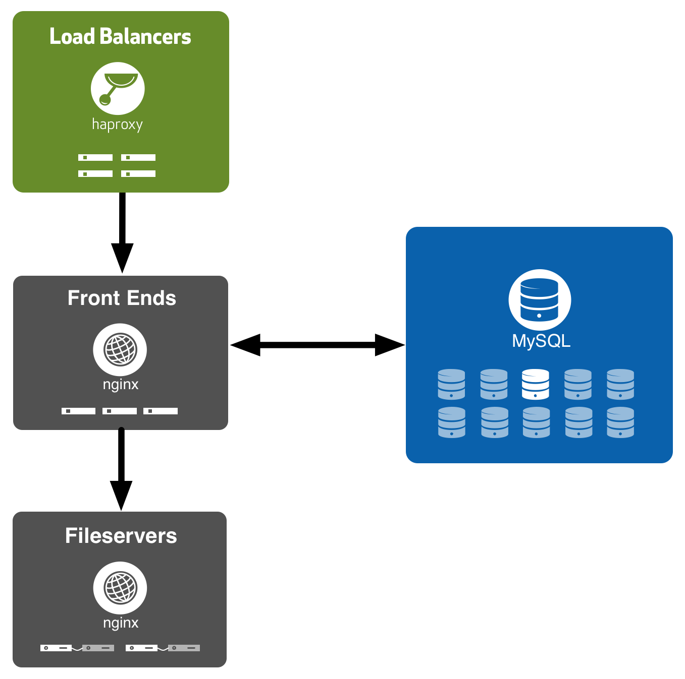]

* mysql stores routing tables
* domain -> repository lookup
* fileservers store ghpages branch
* all updated on PUSH

???

* https://githubengineering.com/rearchitecting-github-pages/ -->


---
name: Where in the stack?!

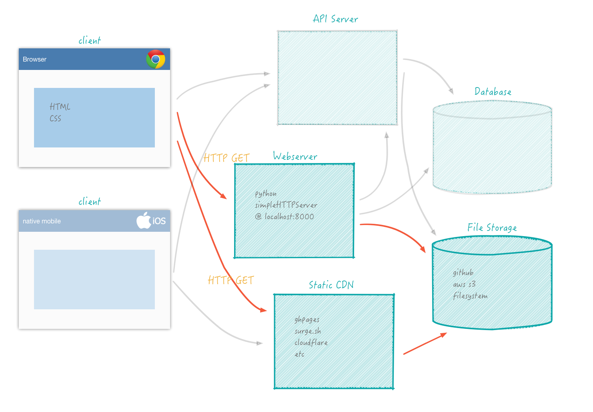

???
* content delivery network

---
name: CSS — Cascading Style Sheets

<iframe width="600" height="320" src="https://www.youtube.com/embed/4bZrJwxVPS8?rel=0&amp;showinfo=0" frameborder="0" allowfullscreen></iframe>

"It has been a constant source of delight for me over the past year to get to continually tell hordes (literally) of people who want to -- strap yourselves in, here it comes -- control what their documents look like in ways that would be trivial in TeX, Microsoft Word, and every other common text processing environment: '<strong>Sorry, you're screwed.</strong>'" — Mark Andreessen, 1994

???
* we'll dive deeper into the CSS render tree next class when we learn how the browser thinks about the document interally
* this is a video of the layout reflow render passes the browser makes just to display google
* basically as your browser processes the render tree (html+css) this is it drawing things. more on this later


---
name: CSS — Cascading Style Sheets

.fancy.small[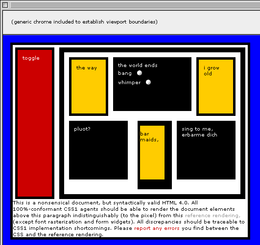]


* CSS v1 1996
* CSS v2 1998
* ...
* CSS v3 ~2014
* ...2019 (snapshots/modules)

???
* this image is what cssv1 supported - all the functionality in one test frame
* we're a new era now boys and girls, finally things are evolving, new things being rolled out
* long period of time when people had **all sorts of workarounds for things, like using tables** for everything
* css is faster than js for animations
* netscape used javascript at first for styling (super slow and still is not the best styling tool)
* [full history](https://eager.io/blog/the-languages-which-almost-were-css/)


---
name: Semantics vs. Style

* So far: html for structure
* Now CSS for STYLE

<br>
<iframe src="//giphy.com/embed/Oo4hdMO4Nw8Za" width="480" height="270" frameBorder="0" class="giphy-embed" ></iframe>


???
* in early days was all **browser defined style**
* defining structure but display up to browser, all just scientific docs
* relied on the default display styles provided by the browser
* set the `h1` tag the font size increased
* What we were defining was a section of content that was intended to be a header of level 1.
* **specify the intended use of the content**,  whether it is a header or a paragraph etc,  and then you **define the look and feel of these blocks separately**.


---
name: Enter CSS

.fancy.medium[]

???
* CSS will be friend and foe this term.
* Certain things will be easy, certain things will feel impossible - but together we will prevail.
* css inside joke: Try to vertically center something
* We will conquer this though, quite easily, anybody know?


---
name: we will however

.fancy[]


???
* just going to get all the css meme's out of the way.


---
name: CSS Rules

.medium[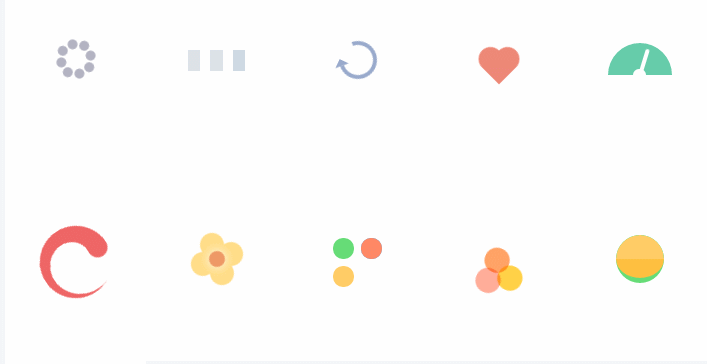]


* CSS is:
  * a **list of rules** specifying how elements should be displayed
  * each rule starts with **selector**
  * now your page structure comes in handy

???
* When you gave your page structure
  * you defined the elements that could be selected with CSS!


---
name: CSS Rules

.medium[]

???
* ok and now you know css. ship it, send it.\
* hereto follows a lot of css stuff
* don't worry we'll get play with it.
* what does selector do?
* selector chooses element
* property is what is  being set
* value self explanatory


---
name: Selectors!


A selector can target elements in different ways:

a tag name:

```css
p {
  color: blue;
}
```

a class:

```css
.classname {
  color: pink;
}
```

an id:

```css
#elementid {
  color: black;
}
```
???


---
name:

and combinations:

```css
p.someclass {...} /* element with class */

p.someclass a {...} /* element that is inside of element.class */

p .classy {...} /* any descendent of p that is .classy */

a, input, .classy {...} /* multiple selectors */
```

```html
<p class="someclass">
  stuff stuff <a href="#"> lets go </a> stuff stuff
  <span class="classy"> more stuff </span>
</p>
<input id="subscribe" ... />

```

???
* what would happen if I clicked 'lets go'? nothing - in the lab do that.
* what kind of element is span in terms of display?


---
name: Pseudo Classes

and any of the above plus special keywords such as `hover`, `link`, `visited`, `checked`, `empty`, `focus`, `not`, `nth-child` and lots more!

```css
p:hover { color: orange; }

a:link { color: blue;}

a:visited { color: purple;}

p:nth-child(2) {background: grey;}

div:not(p) {background: white;}

input[type=checkbox]:checked ~ #hiddenmenu {
  opacity: 1;
}
```


???
* **gets even better**, some selectors can select for a **particular state** of an element
* link is unvisited link
* these are super useful,  checkboxes can be used to record some state in CSS for instance
* plus things like **:first-child**, or **:not**
* ok that last one might be giving away too much... more complicated even:
  * ~ is sibling selector, so it selects the second selector based on the first.
  * can someone explain what this does?


---
name: more on children and sibling selectors

```css
ul li {  } /* descendent */
ul > li {  } /* child */
#title + ul {  } /* adjacent sibling */
#title ~ ul {  }  /* general sibling */
```

```html
<article>
  <ul id="list 0"></ul>
  <div id="title">Title</div>
  <ul id="list 1">
    <li>1</li>
    <li>2</li>
    <ol id="nested list">
      <li>nested 1</li>
    </ol>
  </ul>
  <ul id="list 2">
    <li>3</li>
  </ul>
<article>
```
???
* remember that this is a tree
* descendent would include any nested li's: 1,2,nested1, 3
* child would only include direct children, so say a nested `ol`'s children would be left untouched: 1,2,3
* adjacent sibling, directly adjacent with no elemnts in between: list1
* general sibling any matching as long as parent is same: list1, list2. but can't be before


---
name: Colors

.fancy.medium[]

* additive digital color:
  * <span style="color:red;">red</span>, <span style="color:green;">green</span>, and <span style="color:blue;">blue</span> color light, + alpha channel
  * 1 byte per color intensity
  * unsigned integer value of 0-255

???
* (2^8 -1)


---
name: Colors


* Predefined names: <span style="color:pink;">pink</span>, <span style="color:orange;">orange</span>, <span style="color:lightblue;">lightblue</span>, <span style="color:darkgrey;">darkgrey</span>, etc.
* 8-bit hexadecimal: <span style="color:#cc0000">#cc0000</span>
* 0-255 decimal intensities: <span style="color:rgb(150,0,150)">rgb(150,0,150)</span>
* Percentage intensities: <span style="color:rgb(20%,80%,20%)">rgb(50%,50%,100%)</span>
  * with transparency:  <span style="color:rgba(255,100,100,.5)">rgba(255,100,100,.5)</span>

.fancy.left[]<br>
.fancy.right[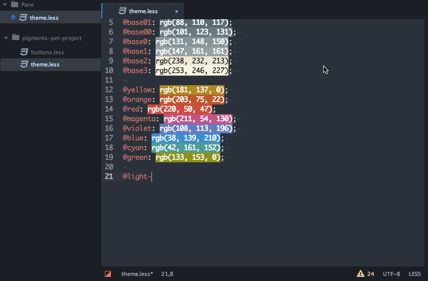]<br>


???
* which of these is most legible -- stick with one
* don't use color names
* **vscode and atom "color picker" and pigments plugins**


---
name: Selectors and Colors

<p data-height="400" data-theme-id="24117" data-slug-hash="a54aae158ba02e5e4cfe33c089277603" data-default-tab="css,result" data-user="timofei" data-embed-version="2" data-editable="true" class="codepen">See the Pen <a href="http://codepen.io/timofei/pen/a54aae158ba02e5e4cfe33c089277603/">a54aae158ba02e5e4cfe33c089277603</a> by Tim Tregubov (<a href="http://codepen.io/timofei">@timofei</a>) on <a href="http://codepen.io">CodePen</a>.</p>

???
* Note: I cheated in the above example and included some magic for that font.


---
name: CSS Game Time

CSS Selector Game — Play this to become a pro!
[http://flukeout.github.io/](http://flukeout.github.io/)

???
* so overwhelming time for a break


---
name: Fonts

* The [default "websafe" fonts](http://www.w3schools.com/css/css_font.asp) that browsers support are a bajillion years old
  * <span style="font-family: 'Times New Roman';">Times New Roman.</span>
  * <span style="font-family: 'Comic Sans MS';">Comic Sans.</span>
  * <span style="font-family: 'Courier New';">Courier New.</span>
  * a few others


???
* Please don't design your pages with any of the above, ever.
* some options like verdana are a bit better
* better options exist


---
name: Google Fonts


* [Google Fonts](https://www.google.com/fonts).
* Here's Open Sans (a lovely simple font):

```html
<!-- in <head> -->
<link href='https://fonts.googleapis.com/css?family=Open+Sans'
  rel='stylesheet' type='text/css' />
```

and in css:

```css
body {
  font-family: 'Open Sans', sans-serif;
}
```

To make it the default! 💗

???


---
name: Size Units Tangent

<iframe src="//giphy.com/embed/3ornjZLITGcFQVRbxK?hideSocial=true" width="480" height="237.12" frameBorder="0" class="giphy-embed" allowFullScreen></iframe>

* many css properties take size/length values:
  * `font-size`, `width`, `height`, `margin`, `padding`
  * many units to choose from
  * absolute units
  * relative units

???
* programmatic ways to think abouut sizes
* lots of overwhelming options for setting size
* what are best practices


---
name: absolute units

* `px`: *device pixels (1/96th of 1in at 28inches viewing distance)* ✅
* `pt`: *points (1/72 of 1in)* ❌
* `pc`: *pica (12 pt)* ❌
* `in`: *inches (96px)* ❌
* `cm`: *centimeters (37.8px)* ❌
* `mm`: *millimeter (3.78px)* ❌

<iframe src="//giphy.com/embed/xT0Gqcy5YrVjXdkZgs?hideSocial=true" width="220" height="220" frameBorder="0" class="giphy-embed" allowFullScreen></iframe>


???
* actually pixels are a very interesting case
* stick to pixels


---
name: pixel math!

.small[]

$px = 5376 \times \tan(\alpha)$

```css
#moon {
  width: 24.3px
  /* 5376  * (1079 miles radius of moon /  */
  /*   238900 miles distance from earth)   */
}
```

1 ref px = visual angle of 1px at a density of 96dpi at 28inches

more at [http://tinyurl.com/cssmath](http://tinyurl.com/cssmath)

???
* css pixels are **not physical pixels**
* pixels are actually an angular measurement
* reference pixel be the visual angle of one pixel on a device with a pixel density of 96dpi and a distance from the reader of an arms length. For a nominal arm's length of 28 inches, the visual angle is therefore about 0.0213 degrees.
* takeaway: **1css inch is what an inch would look like at 28inches away**
* devices with different pixel densities still use 96dpi for the px unit
* tan(α) = opp./adj.
* tan(α) = ((1/96) / 2) / 28
* tan(α) = (1/192) / 28
* tan(α) = 1/5376
* α = arctan(1/5376)
* 1 / arctan( ( ( 1/96 ) / 2 ) / 28)


---
name: Relative Units

* `em`:	*relative to the font-size of the current parent element*
* `rem`:	*relative to font-size of the root element*
* `ex`:	*relative to the width of character 'x' in the current font*
* `ch`: *relative to width of the character '0' in current font*
* `vw`:	*1% of the width of the viewport*
* `vh`:	*1% of the height of the viewport*
* `vmin`:	*1% of viewport's smaller dimension*
* `vmax`:	*1% of viewport's larger dimension*

<!-- .left[<iframe src="//giphy.com/embed/k46bzmbLhKJwc?hideSocial=true" width="320" height="200" frameBorder="0" class="giphy-embed" allowFullScreen></iframe>]<br> -->
.left.medium[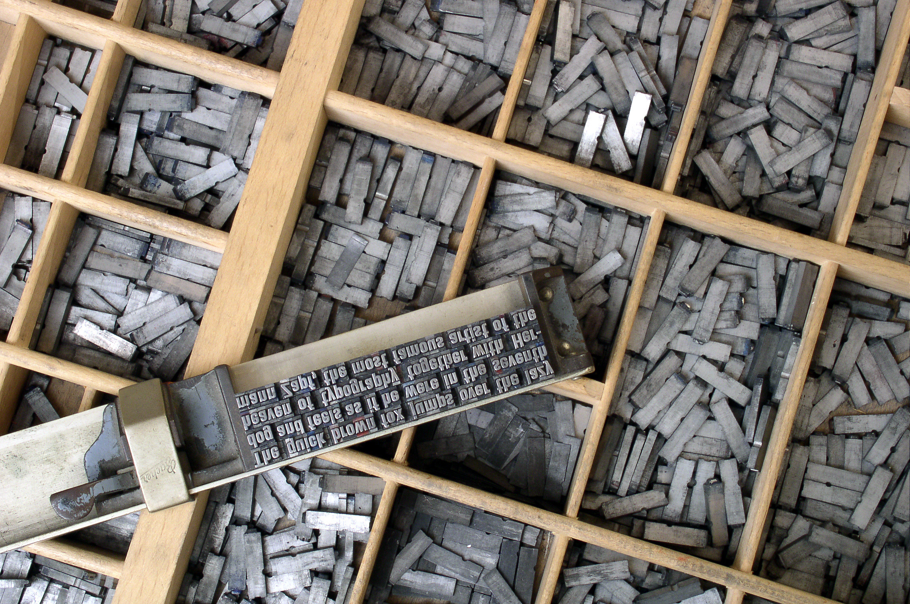]
.right.medium_small[]

???

* relative units are what you'll often be using.
* 1 rem is 16px by default
* **em originally** was the lineheight *C* when metal type was a thing and was also the same as the width of the letter m - hence **em dash** vs **en dash**
* older browsers don't support `vh`/`vw` units, but they can be very useful if you don't mind losing some compatibility - these days probably pretty safe to use


---
name: reasonable practice

.fancy.medium[]

* [css-tricks rems-ems](https://css-tricks.com/rems-ems/)

???
* body/html overall set pixels (16px is default em)
* main sections are in `rem`
* contents of each section are in `em`
* independent control of scaling for the main sections


---
name: Back to Fonts!

```css
@font-face {
  font-family: 'MyWebFont';
  src: url('myfont.woff2') format('woff2'),
       url('myfont.woff') format('woff'),
       url('myfont.ttf') format('truetype');
}

p {
    font-family: "MyWebFont";
    font-style: normal; /* italic oblique */
    font-size: 14px;
    font-weight: bold; /* normal light */
    font-variant: small-caps;
}
```
[i want my handwriting as a font](http://www.myscriptfont.com/)

???
* loading your own fonts in is possible
* but not recommended as it is more resource intensive
* and loading for a font provider gives you the most optimized compatible fonts for the browser
* and provide all the possible variants you need


---
name: CSS Inside

There are 3 ways to include CSS styles in your page.


```html
<html>
  <head>
    <title>CSS Loaded 3 Ways</title>
    <!-- Internal Style Sheet: MEDIOCRE -->
    <style type="text/css">
      h1 { color: purple; }
      body { background-color: orange; }
    </style>
    <!-- External Style Sheet: BEST -->
    <link rel="stylesheet" type="text/css" href="mystyle.css">
  </head>
  <body>
    <h1>Title</h1>
    <!-- Inline Style:  WORST -->
    <p style="color: white">Paragraph Stuff</p>
  </body>
</html>
```

???
* waiiit how do include css in my paaage?
* Inline style: `<p style="color: orange;">` BAD
* Internal style sheet: is a block of CSS inside of your html. Better.
* External style sheet: separate file included in head section. BEST.
* CSS Preprocessor Magics:  is actually best, we'll look into this more later. See: [SASS](http://sass-lang.com/)
* why is inline worst?
* we won't be individually adding in styles for every single html file - in fact we won't even be creating individual html pages! gasp!


---
name: CSS limitations

* Selectors are unable to ascend
* CSS rules can't be named, just a bit ol'mess.
* Can't declare new scope independently of position (z-index)
* [SASS](http://sass-lang.com/) for later:
  * variables: `$primary-color: #333`;
  * nesting:  `nav { ul { color: $primary-color; } a { ... } }`
  * mixins:  `@mixin border-radius($radius) { ... }`
  * partials: `import 'navbar'`
  * math:   `5px + 10px`

???
* ascending: no way to select a parent of something (when render tree is walked there is no backing up)
* z-index has a scope and looks for nearest absolute or relative parent
* nesting: can nest rules so each rule doesn't ahve to have the whole selector
* mixins:  like functions -- especially useful for vendor prefixes
* partials:  separate files that can be included when you need
* math:  can do math with pixels for instance


---
name: positioning

```css

div {
  position: _______;
  top: 10px;
  left: 10px;
}

```

???
* we talked about inline and block elements last class
* can someone remember what block elements do?
* take up all avaiable horizontal space and come one after another down the page


---
name: position: static;

.tiny[]

Default. Elements take up space within the document flow. No properties like `top`, `right`, `bottom`, `left` take effect.

???
* default


---
name: position: relative;

.tiny[]

Position is relative to default (ie. parent within document flow) via `top`, `right`, `bottom`, `left` properties.

???


---
name: position: absolute;


.tiny[]

Position is **relative** to the **nearest absolute parent** element via `top`, `right`, `bottom`, `left` properties. Element is removed from flow so other elements ignore it.

???
* tricky to remember that the nearest absolute parent
* have to go and set absolute on some parent as is not default, or uses doc body


---
name: position: fixed;


.tiny[]

Position is relative to the screen via `top`, `right`, `bottom`, `left` properties. Otherwise similar to absolute. Position 0,0 is the top left corner.  

???


---
name: z-index: 10;

.tiny[]

Similar to layers and allows elements (absolute and fixed) to be ordered. Parameter: signed integer. [stacking contexts](https://developer.mozilla.org/en-US/docs/Web/CSS/CSS_Positioning/Understanding_z_index/The_stacking_context#The_stacking_context)

???
* helps layer absolute and fixed elements
* and 3d transformed layers
* tricky beccause of [z-index context](https://philipwalton.com/articles/what-no-one-told-you-about-z-index/)
* **stacking order**:
  * order of appearance in the doc
  * positioned (non-static) elements go in front of non-positioned
  * new context for each parent that is positioned or opacity less than 1
  * [FROONT](http://blog.froont.com/positioning-in-web-design/)
  * For more detailed examples: [css-tricks](https://css-tricks.com/almanac/properties/p/position/)
  * draw parent with boxes inside, then one outside, can't layer it in between


---
name: positioning & aligning, the old way


* [`float` CSS property](http://www.w3schools.com/css/css_float.asp)
  * `left`, `right`, `none`
  * element should be taken from the normal flow
  * placed along the left or right side of its container
  * inline elements will wrap around it

* [`clear` CSS property](http://www.w3schools.com/css/css_float.asp)
  * `left`, `right`, `none`, `both`
  * specifies which side floating elements are **not** allowed on
  * if not allowed will move past them (clear past them)


???
* allow element to float in a direction with other elements allowed to flow around on the other side.
* keep it "clear" on which side
* Floating can get tricky.


---
name: More positioning and aligning, the old way

<p data-height="400" data-theme-id="24117" data-slug-hash="cc696879a64585dc629b27fba80c183d" data-default-tab="css,result" data-user="timofei" data-embed-version="2" data-editable="true" class="codepen">See the Pen <a href="https://codepen.io/timofei/pen/cc696879a64585dc629b27fba80c183d/">floats</a> by Tim Tregubov (<a href="http://codepen.io/timofei">@timofei</a>) on <a href="http://codepen.io">CodePen</a>.</p>

???
* imagine this with multiple elements in columns or something?!?


---
name: Flexbox, the new/right way

Alignment used to be miserable.

CSS3 [Flexbox](https://css-tricks.com/snippets/css/a-guide-to-flexbox/) make things much better!

.fancy.medium[]


???
* main idea: give the container the ability to alter its items' width/height (and order) to best fill the available space based on some rules


---
name: Flexboxes are the only way!

<p data-height="505" data-theme-id="24117" data-slug-hash="03b6b8b6dace6d8f7c666514ac66bead" data-default-tab="css,result" data-user="timofei" data-embed-version="2" data-editable="true" class="codepen">See the Pen <a href="https://codepen.io/timofei/pen/03b6b8b6dace6d8f7c666514ac66bead/">simple flexbox</a> by Tim Tregubov (<a href="http://codepen.io/timofei">@timofei</a>) on <a href="http://codepen.io">CodePen</a>.</p>


???


---
name: Flexbox model

.fancy[]

???
* **justify is main**
* **align is cross**
* default is row
* *main axis* / *main dimension*:
  * primary axis along which flex items are laid out
  * extends in the *main dimension*.
* *main-start* / *main-end*
  * flex items are placed starting on the *main-start* side
  * and going toward the *main-end* side.
* *main size* / *main size property*
  * flex items width or height, whichever is in the main dimension, is the item’s main size
  * The flex item’s main size property is either the width or height property, whichever is in the main dimension.
* *cross axis* / *cross dimension*
  * The axis perpendicular to the main axis is called the cross axis
  * extends in the cross dimension.
* *cross-start* / *cross-end*
  * Flex lines are filled with items and placed into the container starting on the cross-start side of the flex container and going toward the cross-end side.
* *cross size* / *cross size property*
  * The width or height of a flex item, whichever is in the cross dimension, is the item’s cross size. The cross size property is whichever of width or height that is in the cross dimension.


---
name: Flex Parent Properties

.medium[]

```css
.container {
  flex-direction:  column | column-reverse | row | row-reverse ;
}
```

???


---
name: Flex Parent Properties

.medium_small[]

```css
.container{
  flex-wrap: nowrap | wrap | wrap-reverse;
}
```

???


---
name: Flex Parent Properties

.small[]

```css
.container {
  justify-content: flex-start | flex-end | center | space-between | space-around;
}
```

???
* in main axis


---
name: Flex Parent Properties

.small[]

```css
.container {
  align-items: flex-start | flex-end | center | baseline | stretch;
}
```

???


---
name: Flex Parent Properties

.small[]

```css
.container {
  align-content: flex-start | flex-end | center | space-between | space-around | stretch;
}
```

???
* cross direction!
* modifies the behavior of the flex-wrap property
* similar to align-items, but instead of aligning flex items, it aligns flex lines


---
name: Flex Child Properties

.medium_small[]


```css
.item {
  order: <integer>;
}
```

???


---
name: Flex Child Properties

.medium_small[]

```css
.item {
  flex-grow: <number>; /* default 0 non negative */
  flex-shrink: <number>; /* default 1 non negative */
  flex-basis: <length> | auto; /* default auto */
  flex: none | [ <'flex-grow'> <'flex-shrink'>? || <'flex-basis'> ] /* shorthand for above */
}
```

???
* how that item grows in relation to other items as a weight
* how it shrinks
* basis: default size before remaining space is distributed


---
name: Flex Child Properties


.medium_small[]

```css
.item {
  align-self: auto | flex-start | flex-end | center | baseline | stretch;
}
```
???
* remember cross direction!


---
name: Flexbox Games

Want to learn more?

**go play this now:**
<br>[http://flexboxfroggy.com/](http://flexboxfroggy.com/)
<br>[http://flexboxdefense.com](http://flexboxdefense.com/)

???
* let's take 5, stretch, play some of these games, i'll stop recording
* you may not get though them now but please do play them all the way through after class and before you do the lab,  you'll need to understand flexboxes to do the lab. 


---
name: Flexbox resources


* images from: [guide-to-flexbox](https://css-tricks.com/snippets/css/a-guide-to-flexbox/)
* [flexboxin5.com/](http://flexboxin5.com/)
* [a-visual-guide-to-css3-flexbox-properties](https://scotch.io/tutorials/a-visual-guide-to-css3-flexbox-properties)

???


---
name: "Cascading"?

.medium[]

???
what is the cascading part of css?


---
name: Precedence

.medium[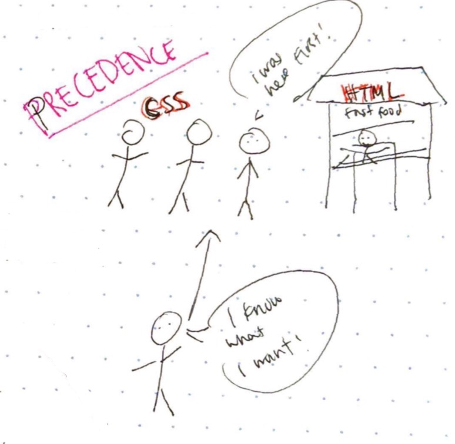]


---
name: Precedence and Cascading

CSS is named the way it is because is each style sheet applies in a cascading manner.


```html
<p style="color:#ffffff;">hi there</p> <!-- please no -->
```

```css
p {
  color: #ababab !important; /*sparing*/
}

#main-article p { ... }
#main-article .excerpt ul li p { ... }
```

???
* wait whats that whole cascading thing about?
* can have multiple rules that match an element
* and multiple stylesheets with overlapping rules
* enter precedence - basically how do you handle multiple inheritance safely and in a deterministic fashion


---
name: Precedence and Cascading


* more specific selector with more classes wins
  * more specific wins regardless of order
* same specificity, then load order matters, later wins
* !important gets the highest precedence **(use sparingly!)**
* inline styles have second highest precedence **(bad: hard to override)**

(from: [Zacky Pickholz](https://www.linkedin.com/pulse/most-important-css-rule-you-might-have-missed-zacky-pickholz))


???


---
name: CSS Box Model `content-box`

.medium[]

* Every element on the page is a box.
* totals =  content width/height + padding + borders + margins

???
* oh no not more about sizing things?!?! using text to describe how to display stuff is hard
* bunch of things go into the size that something appears on screen
* default is content-box
* `margin:` defines the spacing **around** the element
* `border:` defines thickness of a border line
* `padding:` defines the spacing *inside* of the element between the border and the contents (can be text of children elements)
* `width/height:`  define the size of the element contents — important to understand that this size does not include the totals
* is a little  confusing


---
name: CSS Box Model `border-box`


.medium[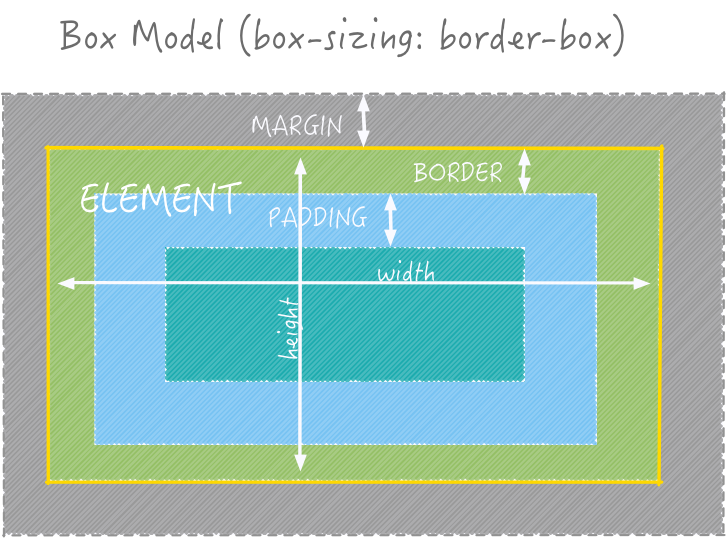]

* Better newer CSS3 model
* border and padding on the inside!

???
* The border and padding values were moved inside the element's box, cutting into the width/height of the box rather than expanding it.
* width = actual visible/rendered width of an element's box
* height = actual visible/rendered height of an element's box
* much more straightforward

???

---
name: CSS Box Model 

.large[]


---
name: Content-Box Best Practice

```css
html {
  box-sizing: border-box;
}
*, *:before, *:after {
  box-sizing: inherit;
}
```

???
* sets it to border-box
* and then forces everything to specfically inherit
* allows you to override if you need

---
name: Content-Box vs Border-Box

<p data-height="500" data-theme-id="24119" data-slug-hash="970f26f621cfa3ae3eec7e2a6b0e8c97" data-default-tab="result" data-user="css-tricks" data-embed-version="2" data-pen-title="Box Sizing Layout Demo" class="codepen">See the Pen: <a href="http://codepen.io/team/css-tricks/pen/970f26f621cfa3ae3eec7e2a6b0e8c97">content-box</a></p>


---
name: Element Visibility


* `display: none;` not displayed and takes no space in layout
* `display: inline;` inlined (like spans)
* `display: block;` block (like divs)

* `visibility: hidden;` not displayed but space still allocated
* `visibility: visible;` is displayed and space allocated

* `opacity: 0.5;` displayed with transparency and takes up space


???
* showing and hiding content is real popular
* so lots of ways to do this
* note,  you can fade in opacity but the others are binary
* opacity better than visibility


---
name: Transitions

<p data-height="400" data-theme-id="24117" data-slug-hash="EWyyNJ" data-default-tab="result" data-user="timofei" data-embed-version="2" data-pen-title="Day Night simulation" class="codepen">See the Pen <a href="http://codepen.io/timofei/pen/EWyyNJ/">Day Night simulation</a> by Tim Tregubov (<a href="http://codepen.io/timofei">@timofei</a>) on <a href="http://codepen.io">CodePen</a>.</p>

???
* now we're getting to the good stuff
* CSS3 can do a lot of stuff.  Transitions, animations, and even 3D transforms.


---
name: Transition Properties

```css
div {
  transition-property: [property];
  transition-duration: [duration];
  transition-timing-function: [timing-function];
  transition-delay: [delay];
}
/* or shorthand */
div {
  transition: [property] [duration] [timing-function] [delay];
}

```
???
* things that trigger transitions are any change in the style applied to an element
* hover, active,
* or even a class to an element in javascript


---
name: Transition Properties

.medium[]


* `property:`  (required) of the element to apply to.  can be specific property like background-color, a list, or `all`.
* `duration:`  (required) timespan in milliseconds or seconds units that the effect lasts.
* `timing-function:` (optional) animation interpolation type: `linear`, `ease` (default), `ease-in`, `ease-out`, `ease-in-out`, even `cubic-bezier`.
* `delay:` (optional) delay before the start of the animation in milliseconds or seconds units.

???
* you can define your own timing functions if you really want
* ease is faster in the middle


---
name: Transition Properties

<p data-height="400" data-theme-id="24119" data-slug-hash="598dcc037bd45c9e8c431646bd77a004" data-default-tab="css,result" data-user="timofei" data-embed-version="2" data-editable="true" class="codepen">See the Pen <a href="http://codepen.io/timofei/pen/598dcc037bd45c9e8c431646bd77a004/">basic css transitions</a> by Tim Tregubov (<a href="http://codepen.io/timofei">@timofei</a>) on <a href="http://codepen.io">CodePen</a>.</p>


???


---
name: CSS 2D and 3D Transforms

### Translate

```css
transform: translate(x, y);
transform: perspective(distance_from_view) translate3d(x, y, z);
```

A 2D translate in Y:

<p data-height="254" data-theme-id="24117" data-slug-hash="6cf9da2f0cc4da333ea92ec37259d676" data-default-tab="css,result" data-user="timofei" data-embed-version="2" data-editable="true" class="codepen">See the Pen <a href="http://codepen.io/timofei/pen/6cf9da2f0cc4da333ea92ec37259d676/">css pushbutton</a> by Tim Tregubov (<a href="http://codepen.io/timofei">@timofei</a>) on <a href="http://codepen.io">CodePen</a>.</p>

???


---
name: Rotate


```css
rotate(angle)	/* 2D rotation */
rotate3d(x,y,z,angle)	/* 3D rotation with axis (with transform-origin )and rotation*/
rotateX(angle) /* shorthand 3D along the X-axis */
rotateY(angle) /* shorthand 3D along the X-axis */
rotateZ(angle) /* shorthand 3D along the X-axis */
```

<p data-height="426" data-theme-id="24117" data-slug-hash="ed827936ca972890a167a2eacc8b8f28" data-default-tab="css,result" data-user="timofei" data-embed-version="2" data-editable="true" class="codepen">See the Pen <a href="http://codepen.io/timofei/pen/ed827936ca972890a167a2eacc8b8f28/">3d rotation with angles</a> by Tim Tregubov (<a href="http://codepen.io/timofei">@timofei</a>) on <a href="http://codepen.io">CodePen</a>.</p>


???
* Here's a visualization of how the rotation works.
* Note transform-origin is the default center of the object here, but it can be shifted.
* What happens when you do that?


---
name: Rotate


Here's an effect that may be a little over the top for daily use.

<p data-height="353" data-theme-id="24117" data-slug-hash="c0bacc59c1a4f7bade4a52e10d87373c" data-default-tab="css,result" data-user="timofei" data-embed-version="2" data-editable="true" class="codepen">See the Pen <a href="http://codepen.io/timofei/pen/c0bacc59c1a4f7bade4a52e10d87373c/">css card flip</a> by Tim Tregubov (<a href="http://codepen.io/timofei">@timofei</a>) on <a href="http://codepen.io">CodePen</a>.</p>


???


---
name: Rotate


Ok, that might be enough of 3D for one day! More demos can be found here:

<iframe class="white-background" src="http://desandro.github.io/3dtransforms/examples/cube-02-show-sides.html" height="400" width="100%"></iframe>


???
* try the carousel


---
name: Some Resources

* [learn.shayhowe.com](http://learn.shayhowe.com/html-css/) is also a good resource.
* [advanced-css-selectors-you-never-knew-about](https://medium.com/the-web-crunch-publication/advanced-css-selectors-you-never-knew-about-972d8275d079)
* [css-tricks](https://css-tricks.com/)
* [flexbox patterns](http://www.flexboxpatterns.com/home)
* [bootstrap](http://getbootstrap.com/)
* [semantic-ui (an alternative to bootstrap that looks cool)](http://semantic-ui.com/)
* [transitions and transforms](https://robots.thoughtbot.com/transitions-and-transforms)
* [3d transforms](http://desandro.github.io/3dtransforms)

???


---
name: Further Learning: Use the Source, Luke

## [UTSL](https://en.wikipedia.org/wiki/UTSL)


CSS is huge.  There are just too many things to cover!

Use the Chrome Devtools [Inspector](https://developers.google.com/web/tools/chrome-devtools)!


???


---
name: Chrome DevTools

.medium[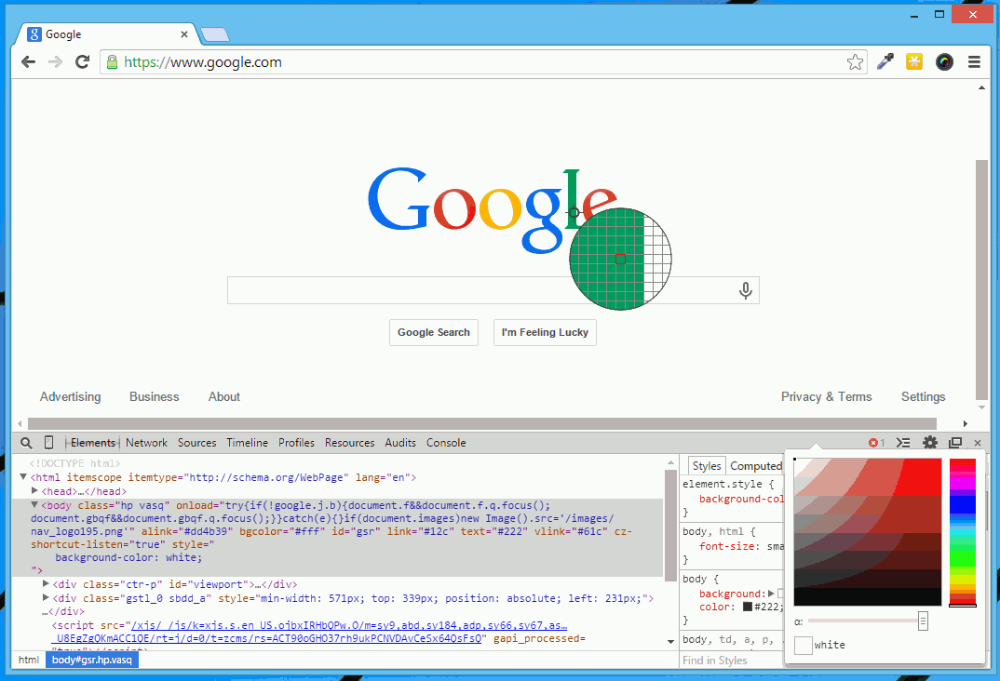]


* Press `Ctrl + Shift + I` (Windows, Linux) or `Command + Option + I` (Mac)
* or right click on an element in website and select `Inspect`.


---
name: Select Elements

.medium[]

???
* inspect border box model!

---
name: Change Text

.medium[]


---
name: Change Images

.medium[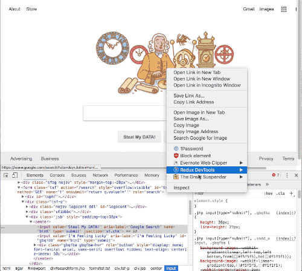]

---
name: Inspect Hover States

.medium[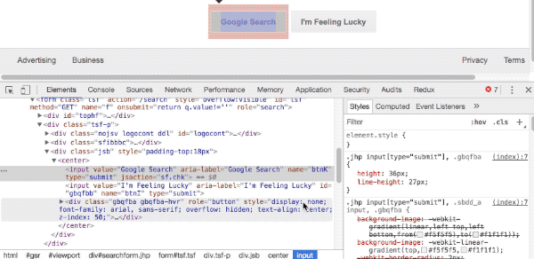]


---
name: Add Rules

.medium[]


---
name: much More!

[https://developers.google.com/web/tools/chrome-devtools/](https://developers.google.com/web/tools/chrome-devtools/)

* full javascript debugger with breakpoints, etc
* analyze performance
* run code


---
name: Today's activity

.medium[]


* Pair up with a neighbor
* get their domain name and open it up in inspector
  * or together edit some random webpage
* play around with it
* if you make something funny, take a screenshot and post it in Slack #20s

???
* hacking 101


---
name: The End

* Lab1 out today! Due Thursday early morning!
* Goal is to find a landing page you like - and then adopt it to your own liking. 

???
* Don't make it look like mine - be creative
* could be for a fake or real company
* could be for your family
* could be a joke site


---
name: The Real End

<iframe width="640" height="360" src="https://www.youtube.com/embed/LWGJA9i18Co?rel=0&amp;showinfo=0" frameborder="0" allowfullscreen></iframe>
