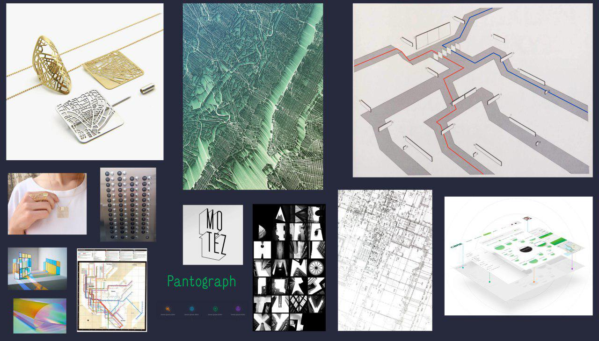
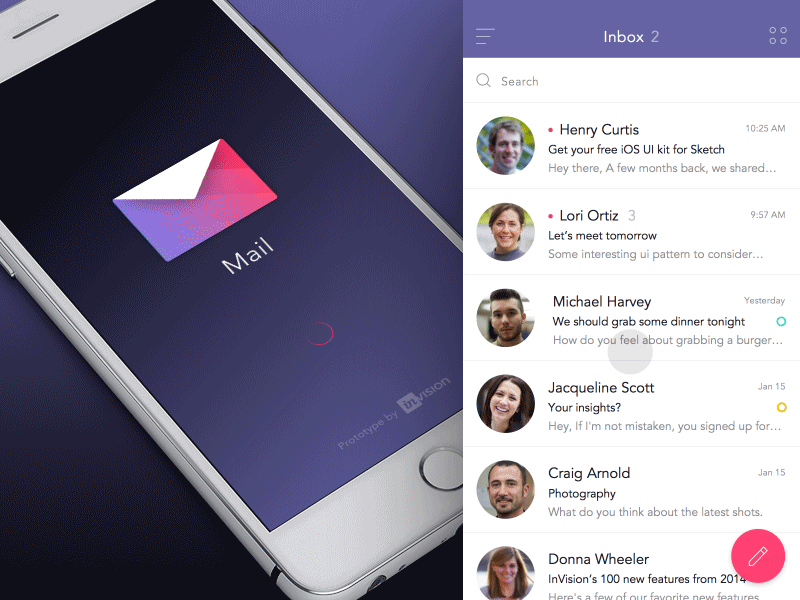
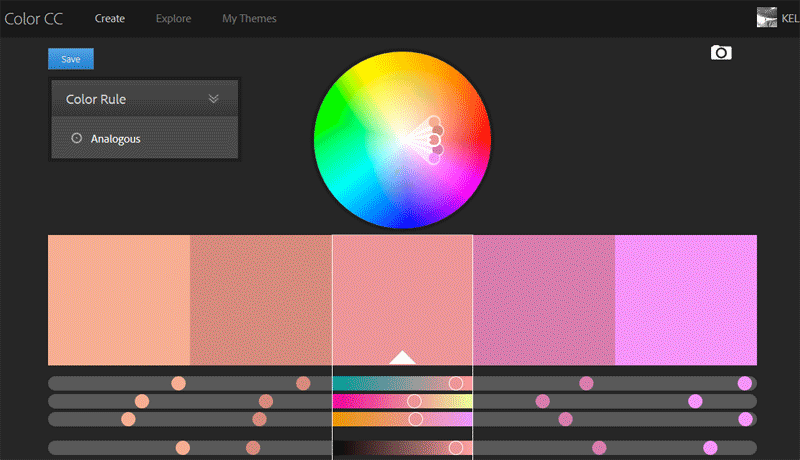
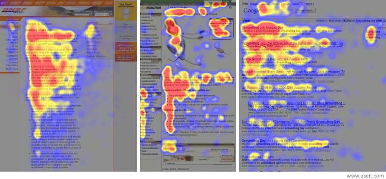
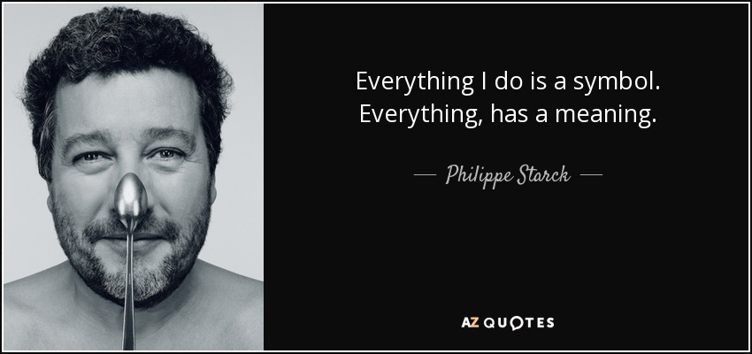

layout: true
class: center, middle
name: pic
background-size: contain

---

layout: true
class: center, top
name: fragment

.title[{{name}}]

---
layout: true
class: center, middle
name: base

.title[{{name}}]

---
name: Design

.fancy.medium[]

???
* just some tips
* not really a designer (tried to go to graphic design school many years ago though)
* here's what I've learned from hanging around designers
* based on working on hundreds of projects

---
name: Step 1: Inspiration Board

* find examples of similar products
* take screenshots
* save urls
* copy color schemes

.fancy.medium[]

???
* other people have made pretty designs,  look at them, use them for inspiration, copy them as best you can

---
name: Step 2: Sketches

* paper is best
* quickly jot down views and functionalities

<iframe src="//giphy.com/embed/d26EH3VCAHS12?hideSocial=true" width="380" height="284" frameBorder="0" class="giphy-embed" allowFullScreen></iframe>

???
* make them on paper first
* much faster

---
name: Step 3: Mockups

* with inspiration and sketches
* start on mockups ([figma](http://figma.com), [sketch](https://www.sketchapp.com), etc)
* don't code them yet

.fancy.medium[]

???
* the case for mockups:
* help you remember what needs to be built
* much quicker to play around with different options quickly and easily to determine what works best for your product
* coordinate with your team - keep everybody on track

---
name: Step 4: Functional Mockups

* put mockups together
* built in to [Figma](http://figma.com) or
* Invision: https://www.invisionapp.com/education-signup
* PopPaper: https://marvelapp.com/pop/

.fancy.medium[]

???
* great way to test your interactions
* woop forgot some logic path from one view to another
* can run it by users and see if they can figure it out

---
name: Colors

* Not just random
* Use a color scheme chooser: [color.adobe.com](http://color.adobe.com)
* Steal from other sites

.fancy.medium[]

???
* picking colors
* beg, borrow, steal color schemes

---
name: Hierarchy

* visual hierarchy
* what users see first, order of gaze
* visual saliency

.fancy.medium[]

???

* laying out your page, remember to think about the visual hierarchy
* ordering of what users see based on size/color/movement
* What will users eyes see first, your call to action, or the large user profile button that they never really need to go to
* Try to imagine what you would notice first as a new user and then order your elements in terms of visual saliency appropriately
* Larger and brighter colored things tend to be noticed first
* Positioning also matters, we tend to look at things in a [letter F pattern](https://uxplanet.org/f-shaped-pattern-for-reading-content-80af79cd3394).

---
name: Mindfulness

.fancy.medium[]

UX is like a joke...

???
* famous designer
* every choice you make conveys something
* you chose blue for a restaurant site because you like blue
* but blue is not appetizing, doesn't make people feel hungry - RED does weird.
* think about and defend every choice you make - 'i just like it' doesn't cut it.
* hidden interaction like swiping or hamburger - be careful.
* ux is like a joke - its bad if it needs explaining
* can use this time to test that!

---
name: resources

lots of resources out there

* [cs52.me/workshops/design](http://cs52.me/workshops/design)
* https://dribbble.com/
* https://blog.prototypr.io/design-for-programmers-d38c56982cd0
* http://www.cssdesignawards.com/
* https://www.awwwards.com/web-design-trends-for-2017.html

???
* best form of flattery is imitation

---
name: Let's play!

[cs52.me/workshops/design](/workshops/design)

???
