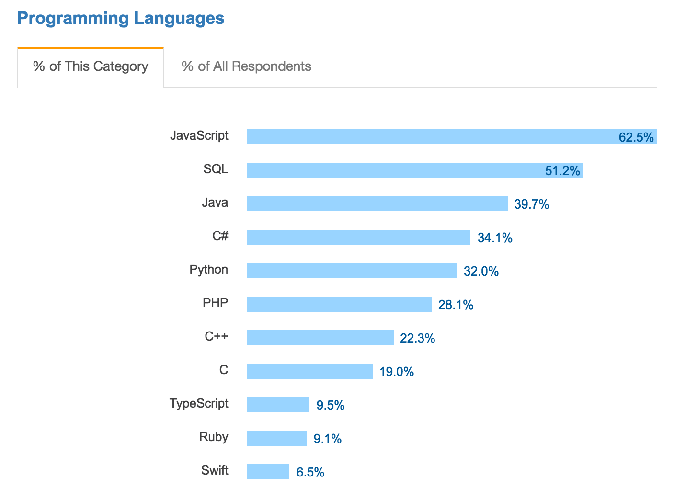
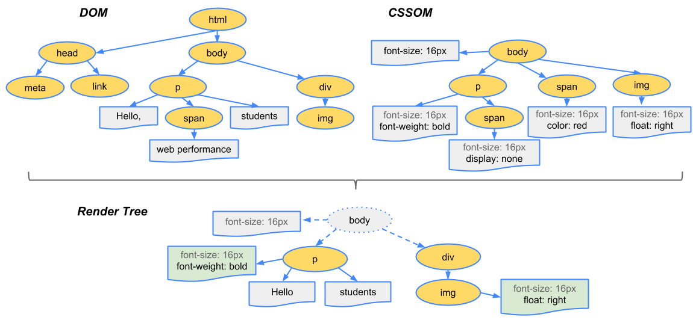
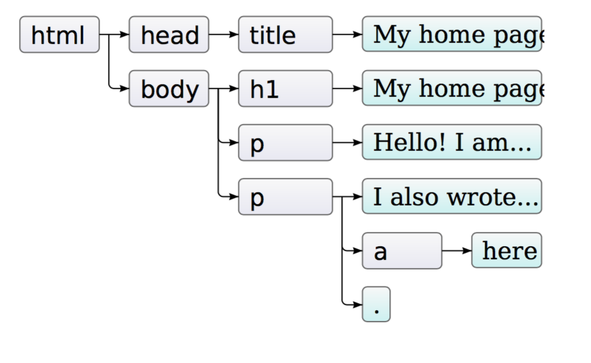
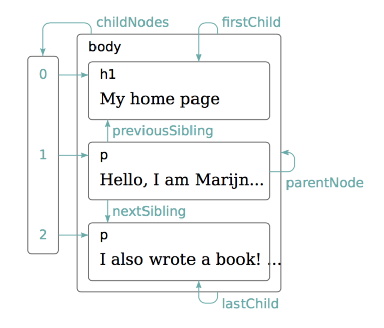

layout: true
class: center, middle
name: pic
background-size: contain

---
layout: true
class: center, top
name: fragment

.title[{{name}}]

---
layout: true
class: center, middle
name: base

.title[{{name}}]

---
name: cs52

<iframe src="https://www.facebook.com/plugins/video.php?href=https%3A%2F%2Fwww.facebook.com%2Fnatgeo%2Fvideos%2F10154506688308951%2F&show_text=0&width=560" width="560" height="315" style="border:none;overflow:hidden" scrolling="no" frameborder="0" allowTransparency="true" allowFullScreen="true"></iframe>


---
name: CS52

* Today:
  * basic javascript
  * the DOM
* Table Questions
  * can you do flex boxes within flex boxes?
  * why don't issues come up when a rebased branch is pushed and other try to pull - won't revision histories be different?
  * is flex native to CSS? do you define it in the HTML file?

.tiny[]


???
* can do better on Questions
* i know i'm an amazing lecturer, everything just makes sense whenever i speak
* but lets do put down questions on the sheets


---
name: Where in the Stack?

.medium[]


???
* today in browser only!
* later we'll do server side js with node


---
name: Where in the Browser?

.medium[]

???
* parts of the browser
* The user interface:address bar, back/forward button, etc. except the window with page
* The browser engine: sits between the UI and the rendering engine - passes commands
* The rendering engine : displays requested content. parses HTML and CSS, and displays the parsed content on the screen
* Networking: for network calls such as HTTP requests
* UI backend: used for drawing basic widgets like combo boxes and windows
* JavaScript interpreter. Used to parse and execute JavaScript code.
* Data storage. Browser local storage like Cookies


---
name: What is JS?

.medium_small[]


???
* custom designed jabbascript for cs52 by a friend of mine
* we'll be doing sooo much javascript
* good parts and bad parts (books written)
* a scripting language for coding inside of the browser - the browser has a JS interpreter and runtime.
* only real way to do interactive stuff in browser is through js,  otherwise need plugins


---
name:

<iframe src="//giphy.com/embed/anjRJ4nv9WJzO?hideSocial=true" width="180" height="180" frameBorder="0" class="giphy-embed" allowFullScreen></iframe>

* Netscape released in 1995 as a way to add programs to web pages in their browser
* has been evolving, now new annual specs

.medium[]

???
* called lots of different names, some inappropriate


---
name: ECMAScript

* Javascript =>  ECMAScript:
  * high-level, dynamic, un/weirdly-typed, interpreted scripting language
  * prototype-based with first-class functions
  * multi-paradigm: object-oriented, imperative, and functional
  * closer to c than java

???
* first-class function: functions are objects
* * ECMA (standards organization) was originally **European Computer Manufacturers Association**, but then decided to just stop being an acronym for anything. Still in Geneva.
* some things i like about js:  functional paradigm, first class functions, everything is a dictionary


---
name: mixed reviews

[2017 stackoverflow developer survey](http://stackoverflow.com/research/developer-survey-2017):


.fancy.medium[]

???
* no relation to java (named that way by sun as a marketing move because java was popular)
* love it, hate it
* sure is popular though


---
name:

* Pros:
  * can be easy
  * first-class functions
  * functional paradigm
  * event loop
* Cons:
  * dynamic typing
  * prototype-based
  * global variables
  * scope
  * == vs === and falsy values
  * event loop

???
* ha don't worry we'll dig into this
* i tried to find some fun learn js game but not much out there, most of them seem overly complicated, if anybody knows of one though!


---
name: syntax similar to c BUT

.right[```javascript

var i = i * 10 + 3 + (i / 10);

if (i < 3 && i > 0) {
  i = foobar(i);
} else {
  i = i * .02;
}

```]

.left[```javascript
function foobar(i) { return i; }

while (i >= 0) {
    sum += i*i;
    // Comment
}

for (i = 0; i < 10; i++)  {
}
```]


???
* but there's some things here we shouldn't do...
* c style for loop badness
* these are all JS! but BAD JS


---
name: dynamic typing

```javascript
var i;         // typeof i == undefined

i = 32;        // typeof i == typeof 32 == 'number'
i = 'foobar1'; // typeof i == typeof 'foobar' == 'string'
i = true;      // typeof i == 'boolean'
```

* have type of the last thing assigned
* primitive types: `undefined`, `number`, `string`, `boolean`, `function`, `object`


???
* variables aren't assigned a type
* but values do have a type


---
name: type coercion

* will automatically convert types!

```js
console.log(5 * null)   // → 0

console.log("5" - 1)    // → 4

console.log("5" + 1)    // → 51

console.log("five" * 2) // → NaN

console.log(false == 0) // → true
```

???
* will convert things for fun and profit
* sometimes useful, generally though.. not so  much
* anything funny with the string and number examples?
* can this cause problems? yes


---
name: number type

* number type is a `double`
* MAX_INT = $(2^{53} - 1) = 9007199254740991$
* oddities:
  * `NaN`, `Infinity` are numbers
  * `1/0 == Infinity`
  * NaN
    * `parseFloat('hi')` is `NaN`
    * `console.log(NaN === NaN); // false`
    * `0/0` is `NaN`
    * `Math.sqrt(-1)` is `NaN`
    * `isNaN()`
???
* lots of crazy you probably won't run into but you might when things are NaN and you forget that checking for it is difficult


---
name: string type

* string is variable length

```js

var foo = 'bar'; // single quotes preferred but can use double
foo.length // 3

var a = 'The ' + foo + ' is high.'; // es5 'foobar'

// lots of useful string methods:
// match, search, replace, toUpperCase, toLowerCase, slice, substr
```


???
* will introduce es6 next week for now  es5


---
name: boolean type

* `true`, `false`
* *truthy* and *falsy* when converting to bool

```js

//falsy
false == 0 == '' == null == undefined == NaN

//truthy
true == Object == '.+' == (num > 0) == function() {}

```


???
* pretty funny booleans because of type coercion
* == vs ===, if tripple = will not type coerce
* non empty string
* can anyone think of a problem you might encounter here?
  * what if you are checking if a variable is set to a number or not


---
name: undefined and null

* undefined — does not have a value assigned
* null — value to represent whatever coder wants (like a sentinel)

```js
var x;  // value of: undefined
x = undefined //can set to undefined
typeof x == 'undefined'

typeof null == 'object'

null == undefined // true
null === undefined // false
```

???


---
name:  function type

* called with any number of arguments
  * name if specified or `arguments[0]`
* always returns value (default is undefined)
* unspecified args: undefined

```js

// traditional
function useless(x) { console.log(x); }

// variable assigned anonymous function
var useless = function(x) { console.log(x); }

// es6 fat arrow notation
var useless = (x) => { console.log(x); }

typeof useless == 'function'
```

???
* `arguments[0]` (weird and bad)
* also actually is an object will dig in a bit later


---
name: object type

* is a hashmap or dictionary of:
  * name-value pairs called properties
* global scope is just an object (in browser `window`)
* can have functions as properties (called methods)

```js

var foo = {};  //empty object

var bar = {
  name: 'Anna', //no need to quotes for key
  'state': 'nh',
  age: 23,
  sayHi: () => {
    alert(`my name is ${this.name}`);
  }
}

bar.name === bar['name']
```
???
* note es6 arrow function
* note es6 template string builder
* this will be explained


---
name: more properties

```js
// adding
var foo = {};
foo.name = "Fred";  // foo.name returns "Fred"

//removing
var foo = {name: "Fred"};
delete foo.name; // foo is now an empty object

//enumerating
Object.keys({building: "Hop", height: 40}) == ["building", "height"]
```

???
* also functions -- everything is really just a dictionary


---
name: Arrays

* are also special objects!
* polymorphic and sparse
* oddity: can have properties ?!

```js

var list = [1, 2, 'three', null, () => { console.log('hi'); } ];

list[2]; // returns 'three'
list[4]; // returns function
list[4](); // ?

list[500] = 'sparse array';
// useful methods: push(), pop(), sort(), reverse(), splice()
// and properties: length
```

???
* list[4] // returns undefined and prints hi


---
name: date type

* special type of ...
* epoch time (1/1/1970 UTC)
* no timezones
* use [momentjs](http://momentjs.com/) instead

```js
let date = new Date();

typeof date == 'object';

date.valueOf() = 1452359316314
date.toISOString() = '2016-01-09T17:08:36.314Z'
date.toLocaleString() = '1/9/2016, 9:08:36 AM'
```
???


---
name: Logical operators

```js
// and &&
console.log(true && false)   // → false
console.log(true && true)    // → true

// or ||
console.log(false || true)   // → true
console.log(false || false)  // → false

// not !
console.log(!true)           // false

// ternary or conditional operator
console.log(true ? 1 : 2);   // → 1
console.log(false ? 1 : 2);  // → 2
```

???
* i'm a fan of ternary -- dumb python
* ternary would be used in assignment


---
name: short-circuiting

* `||` can be used with values
  * get converted to booleans
  * return whichever is true first, or second, or undefined

```js

var foo = null;
console.log(foo || "user")    // → user
console.log("Karl" || "user") // → Karl

```

???
* useful to set default values if the first thing failed
* say username if exists otherwise "username string"


---
name: DOM essentials

.fancy.medium_small[]

* Document Object Model


???
* we'll be talking about the dom a lot


---
name: Simple DOM

```html
<html>
  <body>
    <p>
      Hello World
    </p>
    <div> </div>
  </body>
</html>
```

.small[]

???
* simple example


---
name: Rendering Engine first


.medium[]


???
* to be able to render the page the browser first needs to parse your HTML into a tree
* parsing: parse HTML document and convert elements to DOM nodes in a tree called the "content tree"
* also parses CSS into a tree called CSSOM  CSS object model
* combines two trees together to form Render Tree!
* render tree is almost there, all the rectangles with content in the right order to display
* layout/reflow: computes the exact position and size of each object
* painting: traverse the render tree and display pixels on screen
* gradual process with lots of updates and repaints
* https://www.html5rocks.com/en/tutorials/internals/howbrowserswork/#DOM

---
name: Render Tree Construction





???
* start at root of the DOM tree, traverse each visible node. (some aren't )
* For each visible node, find the appropriate matching CSSOM rules and apply them.
* outputs only  visible nodes with content and their computed styles.
* so what happens if you change the visibility of an element?
* https://developers.google.com/web/fundamentals/performance/critical-rendering-path/render-tree-construction

---
name: Layout -> BOX MODEL


.medium[]

.medium[]


???
* remember the box model?
* the layout phase precisely captures the exact position and size of each element within the viewport
* all of the relative measurements are converted to absolute pixels on the screen and elements that jostle each around are taken into account
* in Chrome DevTools if you look at the Timeline tab you inspect how long it all takes


---
name: `document`

* DOM is available in global variable `document`
* JS can query or modify the DOM and CSSOM
* in browsers `window` is top level global scope javascript object


???
* dom objects have lots of private methods, can be annoying!


---
name:

.medium[]

???
* tree is directed and acyclic graph with 1 parent


---
name:

.fancy.medium_small[]

```javascript
element = document.body.firstChild.nextSibling.firstChild;
```

???
* js has DOM traversal methods
* links to children and siblings and parent nodes
* traversing dom nodes only through pointers... would be inconvenient right?
* other ways are possible


---
name:

```html
<div id="better">before</div>

<script>
element = document.getElementById("better");
element.textContent = "after";

// getElementsByClassName
// getElementsByTagName
</script>

```


???


---
name: Standardization

.small[]

* small library to make DOM traversal and manipulation standard and easy
* 70% of websites use it ([w3techs](https://w3techs.com/technologies/details/js-jquery/all/all))
* used to be more necessary but still convenient
* selector syntax identical to CSS


???
* as browsers javascript implementations and javascript itself has gotten better not as necessary
* still a nicer more consistent API though but browsers are getting better
* i'll show both syntaxes for some stuff
* selector syntax identical to CSS


---
name: Finding Elements

```javascript

document.getElementById('better');
$('#better')

document.getElementsByClassName('better');
$('.better');

document.getElementsByTagName('a');
$('a');

// like css selectors
document.querySelectorAll('nav li .selected') // not live
$('nav li .selected')

```

???
* note querySelectorAll might seem cool, but it returns copies of nodes that won't update
* jquery selector returns a nice collection


---
name:

```javascript
var vanillaEl = document.getElementById('thing');
var jqueryEl = $('#thing')

vanillaEl.textContent = 'some text' //text in node
jqueryEl.text('some text')

vanillaEl.innerHTML  // html string of children
jqueryEl.html()

vanillaEl.outerHTML  // includes element itself
jqueryEl.parent.html()

vanillaEl.style.display = "none"
jqueryEl.hide()
```


???
* various other helpful things


---
name: changing  structure

```javascript
document.createElement('p');

node.appendChild(element);

node.insertBefore(element, sibling);

node.removeChild(oldNode)
```
???
* again most of these are easier with jquery although not shown
* jquery docs are excellent
* for simple sites, i think its a perfectly fine way to go for basic functionality
* lots of libraries depend on jquery, like bootstrap for instance


---
name: What about my mouse clicks?

<iframe src="//giphy.com/embed/l0HlL2I8DbNa6JCJa?hideSocial=true" width="480" height="270" frameBorder="0" class="giphy-embed" allowFullScreen></iframe>

???
* ok great can do stuff, but what about mouse clicks
* what about user interaction?


---
name: Events

* DOM communicates [events](http://www.w3schools.com/jsref/dom_obj_event.asp) to JS
* Event types:
  * Mouse-related: `onclick`, `onmouseover`, `onmouseenter`, `onmouseleave`
  * Keyboard-related: `onkeypress`
  * Input Field: `onfocus`, `onblur`, `onchange`, `onsubmit`
  * Other:
    * `setTimeout`
    * `ondrag`, `ondrop`
    * `onload`


???
* lots of events


---
name: event handling

<iframe src="//giphy.com/embed/DDyJmi8wFJuP6?hideSocial=true" width="380" height="164" frameBorder="0" class="giphy-embed" allowFullScreen></iframe>

* to handle an event one needs:
  * target element
  * event type
  * function to call


???
* ok lets see how to set that up


---
name:

DOM level 0 events:
```html
<button onclick="alert('hello!');"> Say Hello! </button>
```

DOM Level 1 events:
```javascript
document.getElementById('myButton').onclick =  function(e) {
    alert('Hello!');
}
```

DOM Level 2 events:
```javascript
document.getElementById('myButton').addEventListener( 'click',
  function(e) { alert('Hello!'); }
, false);
```

???
* can anyone tell which of these is bad?
* level 0: BAD
  * inflexible method of defining event behavior
  * intermixes the structure and functionality
  * no remove
* level 1:
  * better, but only 1 listener per element
  * no remove
* level 2:
  * many events
  * bubble or capture ?!


---
name: jQuery on Event


jQuery Level 2:
```javascript
$('#myButton').on('click', function(e) { alert('hello!'); });
$('#myButton').off('click', function(e) { alert('hello!'); });
```

???

* what is this `e` argument we keep seeing?


---
name:

* event object
* event object properties:
  * `type`:  ('click', 'mouseDown', etc)
  * `timestamp`
  * `currentTarget`: element that listener was registered on
  * `target`: element that dispatched the event

???
* wait why are there different targets?!
* currentTarget is element that you registered on - the one in code that you selected.
* target is the thing that was clicked for instance.
* how can they be different?!


---
name: Event Propagation

```html
<body>
  <article onClick=...>
    <section>
      <button onClick=...>
        
      </button>

  </article>
</body>
```

```javascript

$('button').on('click', function(event){
  event.stopPropagation();
  alert(event.target.name); }
);
```


???
* what happens when someone clicks on the img?
* ALL will fire unless the event is stopped.
* currentTarget will be button
* what will be target?  img
* but this depends on which direction the event was set to trigger at at?
* direction!?!?


---
name: Bubbling & Capturing

.small[]

(from [w3c](https://www.w3.org/TR/DOM-Level-3-Events/#h3_event-flow))

???
* on events (onclick, onmouseover, etc) are typically *bubbling* phase event triggering by default
* with `addEventListener` can set which direction bubbling or capture
* have to be careful sometimes as `stopPropagation` on a capture event might mean you are blocking all of that event from getting to their destination


---
name: preventDefault

```javascript
$('submit').on('click', (event) = {
  event.preventDefault();
});
```

Don't submit the page plz

???
* by default submit buttons reload page
* or hover effects
* make sure browser doesn't execute default action


---
name: Tired?

<iframe src="//giphy.com/embed/l3V0p1WFoSIrzPLW0?hideSocial=true" width="280" height="280" frameBorder="0" class="giphy-embed" allowFullScreen></iframe>

<iframe src="//giphy.com/embed/26u7iYEO189wSu9lm?hideSocial=true" width="280" height="280" frameBorder="0" class="giphy-embed" allowFullScreen></iframe>

???
* questions


---
name: Lexical Variable Scoping

Two scopes: Global and function local

```javascript
var x = "outside";

var f1 = function () {
  var x = "inside f1";
};

f1();
console.log(x);  // → outside

var f2 = function () {
  x = "inside f2";
};

f2();
console.log(x);  // → inside f2
```

???
* everything outside of function is global
* inside of function is function scope
* if declared
* in second example just refers to global
* shadowing is bad (redeclaring locally on purpose)
* lexical scope is that an identifier at a particular place in a program always refers to the same variable location — where “always” means “every time that the containing expression is executed”


---
name: Variable Hoisting

* `var` statements hoisted to top of scope:

.right[
```js
function foo() {
  var x;
  x = 2;
}

// Same as:

function foo() {
  x = 2;
  var x;
}
```
]
.left[
```js
function foo() {
  console.log(x); // → undefined
  var x = 2;
}

// Same as:
function foo() {
  var x;
  console.log(x); // → undefined
  x = 2;
}
```
]


???
* variable declarations only get hoisted not assignment
* would log 'undefined'


---
name: Function hoisting

```js

showState1();  // output: Ready
showState2();  // undefined

var showState2 = function() {
  console.log("Idle");
};

function showState1() {
  console.log("Ready");
}

```


???
* all functions are hoisted to the top of their scope
* not just declaration actual stuff
* remember js can be an imperative scripting language
* generally otherwise you have to define functions in order of use unless you were in a class (later)


---
name: Closures

* ability to reference a specific instance of local variables in an enclosing function
* closure retains references even when outside function has returned

```javascript
function multiplier(factor) {
  // factor is a local var inside multiplier
  return function(number) {
    return number * factor;
  };
}

var double = multiplier(2);
var triple = multiplier(3);

console.log(triple(5));     // → 15
console.log(double(5));     // → 10   
```

???
* function “closes over” some local variables
* A good mental model is to think of the function keyword as “freezing”
  * the code in its body and wrapping it into a package (the function value).
* can be very cool, enables callbacks
* functions passed into other functions to call when they are done
* much more on this next time


---
name: Regular Expressions

* their own syntax
* define pattern to search for in a string
* String: search(), match(), replace(), and split()
* RegExp: exec(), test()

```javascript
var re1 = new RegExp("abc");
var re2 = /abc/;

console.log(/abc/.test("abcde")); // → true
console.log(/abc/.test("abxde")); // → false

```

???
* special text string for describing a search pattern
* wildcards on steroids
* test returns bool is regex is found anywhere in string


---
name: regex search and test

```javascript

/HALT/.test("HALT or not");  // true
/halt/i.test('HALT or not'); // true, ignore case
/[Hh]alt [A-Z]/.test('Halt B');

'foo abbbbbbc bar'.search(/ab+c/);// fount at 4 (position of ‘a’)
'foo ac bar'.search(/ab+c/);      // not found,  -1
'foo ac bar'.search(/ab*c/);      // found at 4
'12e34'.search(/[^\d]/);          // found at 2
'foo: bar;'.search(/...\s*:\s*...\s*;/); // found at 0

```

???
* regex are funny, take a while to perfect
* + at least 1
* * 0 or more
* ^ invert
* \d and digit
* \s spaces
* [] are a pattern
* . any character


---
name: match/replace

```javascript
var str = "This has 'quoted' words like 'this'";

str.match(/'[^']*'/g);
// returns ["'quoted'", "'this'"]


str.replace(/'[^']*'/g, 'stuff');
// Returns: 'This has stuff words with stuff.'
```

???
* mostly you'll just google when you need this stuff
* just be aware of what they are


---
name: try/catch

* raise exceptions with throw statement

```javascript
function UserException(message) {
   this.message = message;
   this.name = "UserException";
}

try {
  nonExistentFunction();
  // or manual throw new UserException("user doesn't exit");
} catch (error) {  // errstr === "Help!"
  console.log('Got exception', error.messages);
} finally {
  // This block is executed after try/catch
}

```

???


---
name: JavaScript Object Notation (JSON)

standard interchange format for sending data to and from a browser

```javascript
var person = {
  fullName: 'Jamie Lannister',
  age: 42,
  phoneNumbers: [
    {
      type: 'home', number: '212 555-1234'
    }
  ],
}
var s = JSON.stringify(person);
// '{"fullName":"Jamie Lannister","age":42,
//  "phoneNumbers":[{"type":"home","number":"212 555-1234"}]}'
var backToPerson = JSON.parse(s)
// returns object with same properties
```
???
* json is what the map used, you'll be using a lot of JSON
* is the preferred interchange format between many web services and apis


---
name:  intermission

<iframe width="640" height="360" src="https://www.youtube.com/embed/LWGJA9i18Co?rel=0&amp;showinfo=0" frameborder="0" allowfullscreen></iframe>
