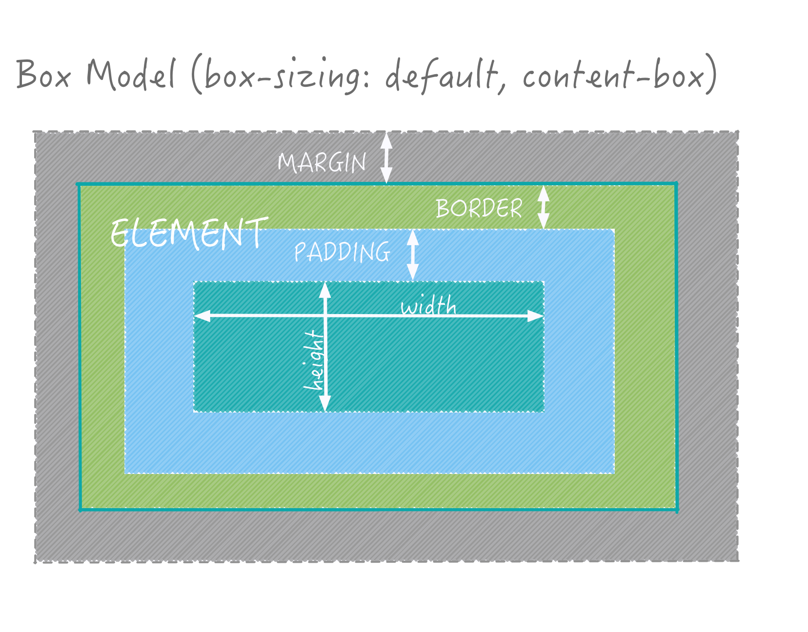
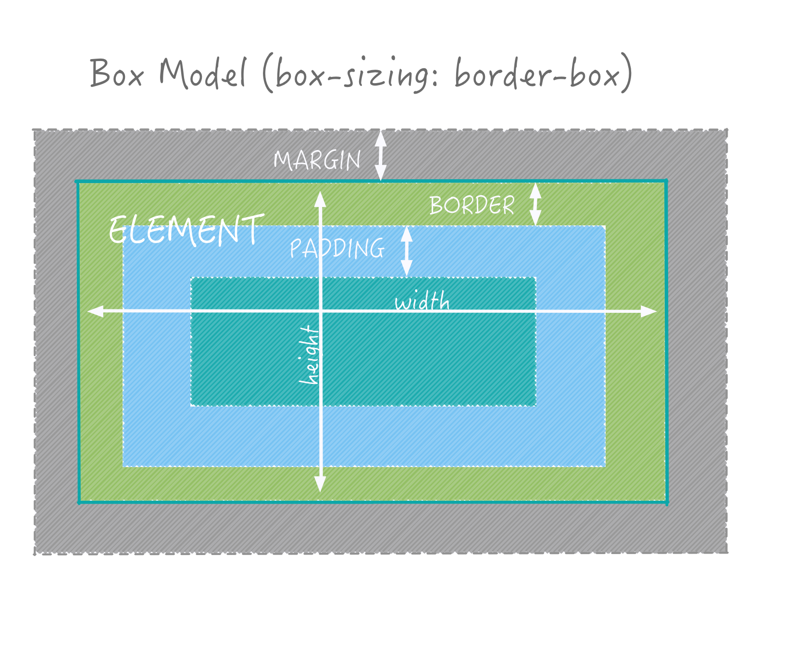

layout: true
class: center, middle
name: pic
background-size: contain

---

layout: true
class: center, top
name: fragment

.title[{{name}}]

---
layout: true
class: center, middle
name: base

.title[{{name}}]


---
name: On the Menu


* DOM
* Functional /Vector  programming
* asynch
* promises
* modules
* workshop SASS+Jekyll


???


---
name: Quiz Time!

ANOTHER QUIZ?

???


---
name: git machine!

.fancy.medium[]

???


---
name:

.fancy.medium[]

???
* box-sizing!  totally forgot!f
* indeed does depend on this
* default is this:


---
name: content-box

.fancy.medium[]

???


---
name: border-box
.fancy.medium[]

???


---
name:

<iframe id="cp_embed_970f26f621cfa3ae3eec7e2a6b0e8c97" src="//codepen.io/css-tricks/embed/970f26f621cfa3ae3eec7e2a6b0e8c97?height=675&amp;theme-id=1&amp;slug-hash=970f26f621cfa3ae3eec7e2a6b0e8c97&amp;default-tab=result&amp;user=css-tricks" scrolling="no" frameborder="0" height="675" allowtransparency="true" allowfullscreen="true" name="CodePen Embed" title="CodePen Embed" class="cp_embed_iframe " style="width: 100%; overflow: hidden;"></iframe>

???


---
name: best practices

```css
html {
  box-sizing: border-box;
}
*, *:before, *:after {
  box-sizing: inherit;
}
```

*(from [css-tricks](https://css-tricks.com/inheriting-box-sizing-probably-slightly-better-best-practice/))*

???


---
name:

<p data-height="400" data-theme-id="24117" data-slug-hash="d518f39c65614da11ced8784d025c8e8" data-default-tab="css,result" data-user="timofei" data-embed-version="2" data-editable="true" class="codepen">See the Pen <a href="https://codepen.io/timofei/pen/d518f39c65614da11ced8784d025c8e8/">quiz1</a> by Tim Tregubov (<a href="http://codepen.io/timofei">@timofei</a>) on <a href="http://codepen.io">CodePen</a>.</p>

???


---
name: pull

.fancy.medium[]


???


---
name: with rebase

.fancy.medium[]

???


---
name: all the git

[https://onlywei.github.io/explain-git-with-d3/](https://onlywei.github.io/explain-git-with-d3/)

???


---
name: reminder

[cs52-dartmouth.slack.com](https://cs52-dartmouth.slack.com/)

???
* don't forget to use the channels to ask questions and help each other out


---
name: DOM essentials

.fancy.medium_small[]

???
* we'll be talking about the dom a lot
  * but today there'll be examples that use more jquery


---
name: document

* Document Object Model
* the HTML document exposed as a collection
* JS can query or modify the HTML document
* available in global variable `document`
* in browsers `window` is top level global scope


???
* dom objects have lots of private methods, can be annoying!
* dom is constrcuted from html


---
name:

.fancy.medium[]

???


---
name:

.fancy.medium_small[]

```javascript
element = document.body.firstChild.nextSibling.firstChild;
```

???
* traversing dom nodes this way though... would be inconvenient right?
* other ways are possible


---
name:

```html
<div id="better">before</div>

<script>
element = document.getElementById("better");
element.textContent = "after";

// getElementsByClassName
// getElementsByTagName
</script>

```


???


---
name: jquery

.fancy.small[]

* small library to make DOM traversal and manipulation standard and easy
* 70% of websites use it ([w3techs](https://w3techs.com/technologies/details/js-jquery/all/all))
* used to be more necessary but still convenient


???
* as browsers javascript implementations and javascript itself has gotten better not as necessary
* still a nicer more consistent API though
* i'll show both syntaxes for some stuff


---
name:

```javascript

document.getElementById('better');
$('#better')

document.getElementsByClassName('better');
$('.better');

document.getElementsByTagName('a');
$('a');

// like css selectors
document.querySelectorAll('nav li .selected') // not live
$('nav li .selected')

```

???
* note querySelectorAll might seem cool, but it returns copies of nodes that won't update


---
name:

```javascript
let vanillaEl = document.getElementById('thing');
let jqueryEl = $('#thing')

vanillaEl.textContent = "some text" //text in node
jqueryEl.text()

vanillaEl.innerHTML  // html string of children
jqueryEl.html()

vanillaEl.outerHTML  // includes element itself
jqueryEl.parent.html()

vanillaEl.style.display = "none"
jqueryEl.hide()
```
???


---
name: changing  structure

```javascript
document.createElement('p');

parent.appendChild(element);

parent.insertBefore(element, sibling);

node.removeChild(oldNode)
```
???
* again most of these are easier with jquery although not shown
* jquery docs are excellent
* for simple sites, i think its a perfectly fine way to go for basic functionality
* lots of libraries depend on jquery, like bootstrap for instance


--- Functional Programming

* everything is a function
* no/minimal mutable objects
* state is in stack vs heap


???


---
name: imperative vs functional


```javascript
let results = [];
for (var i = 0; i < anArray.length; i++) {
  results[i] = anArray[i] * i;
}

```

```javascript

let results = anArray.map(function (value, i) {
  return value * i;
});

```


???
* map example, map calls the function with value and index
  * basically a for loops
* pass functions as arguments is key
  * is possible because functions are first-class
* note the array does not have to be mutable
* fp premise 1:  immutable is better
  * functions take in arguments
  * spit out new results
  * no modification of things in place


---
name: functions as arguments

```javascript
function foo(arg1, arg2) { return arg1 * arg2; }

let results = anArray.map(foo);  // args are unspecified no ()


let results = anArray.map(function (value, i) { //anon function
  return value * i;
});

let results = anArray.map((value, i) => {  //arrow
  return value * i;
});
```

???
* if you put in parens will execute immediately
* setInterval example


---
name: elegance

```javascript
let total = 0, count = 1;
while (count <= 10) {
  total += count;
  count += 1;
}
console.log(total);
```

```javascript
console.log(sum(range(1, 10)));
```

???


---
name: higher order functions

* functions that operate on other functions
  * can take functions as arguments
  * can return functions

```javascript
setInterval(() => {  }, 1000);
```

???
* saw a higherorder function already


---
name: filter, map, reduce

<p data-height="400" data-theme-id="24117" data-slug-hash="74f50559357975493892499683747702" data-default-tab="js,result" data-user="timofei" data-embed-version="2" data-editable="true" class="codepen">See the Pen <a href="http://codepen.io/timofei/pen/74f50559357975493892499683747702/">higher order examples</a> by Tim Tregubov (<a href="http://codepen.io/timofei">@timofei</a>) on <a href="http://codepen.io">CodePen</a>.</p>

???
*


---
name: chaining

<p data-height="400" data-theme-id="24117" data-slug-hash="070c691851aba008158126f4ff77556b" data-default-tab="js,result" data-user="timofei" data-embed-version="2" data-editable="true" class="codepen">See the Pen <a href="https://codepen.io/timofei/pen/070c691851aba008158126f4ff77556b/">toTitlecase</a> by Tim Tregubov (<a href="http://codepen.io/timofei">@timofei</a>) on <a href="http://codepen.io">CodePen</a>.</p>


???


---
name: flatten, etc

<p data-height="400" data-theme-id="24117" data-slug-hash="af79914b72dfd8e302c52c3f0a96452e" data-default-tab="js,result" data-user="timofei" data-embed-version="2" data-editable="true" class="codepen">See the Pen <a href="http://codepen.io/timofei/pen/af79914b72dfd8e302c52c3f0a96452e/">flattening</a> by Tim Tregubov (<a href="http://codepen.io/timofei">@timofei</a>) on <a href="http://codepen.io">CodePen</a>.</p>

???
* flattening and extending prototype
* sometimes frowned on to extend native types
  * mostly cause you can wreak havoc if you redefine something
  * just do so thoughtfully


---
name:

.fancy.medium_small[]

* pure functions:
  * do not rely on external state, only parameters
  * do not change external state, only return values
* side effects:
  * when a function changes some state (instance / global var)
  * not always bad (console.log)
  * can be hard to debug and test

???
* why is good?
  * easier to combine functions that don't rely on some global state
  * easier to test functions where inputs are all declared
  * more like math
* more cool things --
  * can replace a pure function in memory


---
name: asynchronous js

* some functions take time
  * making network requests
  * any io really
  * or `setInterval / setTimeout`

???
* so far all the functions we have passed in have pretty much run instantly
* this is not always the case!
* setInterval


---
name: non-blocking


* java/python
  * when you run I/O functions
  * they block -- program does nothing while waiting
* javascript is non-blocking!
  * how it do?!


???


---
name:

.fancy.medium[]


* event-driven programming:
  * application flow control driven by events/changes in state
  * central mechanism that listens for events
  * calls callback function once event is detected


???


---
name:

.fancy.medium[]s

???


---
name: ajax

* asynchronous javascript and XML
  * people no longer really fetch xml/html
  * JSON data format

???


---
name:
```javascript
var data;       
$.ajax({
    url: 'http://api.something.com/all-datas',
    success: function( result ) {
        data = results;
        // But, this will!
        console.log( data );
    }
})
// Oops, this won't work...
console.log( data );
```

???
* this uses jquery ajax for readability
* common occurence!


---
name:

```javascript
var xhttp = new XMLHttpRequest();
xhttp.onreadystatechange = function() {
  if (xhttp.readyState == 4 && xhttp.status == 200) {
   document.getElementById("demo").innerHTML = xhttp.responseText;
  }
};
xhttp.open("GET", "http://api.something.com/all-datas", true);
xhttp.send();
```

???
* now what if we needed to make further callbacks and requests based on the response?


---
name:

.fancy.medium[]

???


---
name:

* goal: keep code shallow
* some solutions for nested callbacks:
  * use named functions
  * use modules (more later)
  * promises
  * async (coming soon)

???
* fewer levels is easier to read


---
name: promises?

* rather than passing a callback:
  * return a promise that will be filled when done
* promise is representation of the result of asynchronous operation:
  * pending - initial state of a promise
  * fulfilled - successful operation
  * rejected - failed operation

```javascript
doSomething(args, doneCallback);
//vs
let donePromise = doSomething(args);
```

???
* not quite done yet
* where is the callback functionality?


---
name:

```javascript
fetch('http://api.something.com/all-datas"').then(function(response) {
	// do something with response, check for fields etc
}).then(function(returnedValue) {
	// ...
}).catch(function(err) {
	// Error :(
});
```

[http://davidwalsh.name/fetch](http://davidwalsh.name/fetch)

???
* fetch is a new api that babel will do the right thing with
  * don't need jquery ajax
* returns a promise


---
name:

```javascript
var cherishAndHonor = new Promise(function(resolve, reject) {
  // do a thing, possibly async, then…
  goDoSomethingAsynchronous( () => {
    if (/* everything turned out fine */) {
      resolve('Stuff worked!');
    }
    else {
      reject(Error('It broke'));
    }
  });
});
```

???
* construct a promise
* return resolve if it worked
* reject if not


---
name:

.left[
```javascript
asyncThing1().then(function() {
  return asyncThing2();
}).then(function() {
  return asyncThing3();
}).catch(function(err) {
  return asyncRecovery1();
}).then(function() {
  return asyncThing4();
}, function(err) {
  return asyncRecovery2();
}).catch(function(err) {
  console.log("Don't worry about it");
}).then(function() {
  console.log("All done!");
});
```
]
.right[
{: .fancy .white-background}
]


???
* more at http://www.html5rocks.com/en/tutorials/es6/promises/


---
name: modules

* what if multiple js files and modularized code?
* es6 modules:
  * import
  * export
  * have own scope
  *

???


---
name:

```javascript
// create in new file myModule.js
function someCoolFunction() {
    return coolStuff;
}
function boringFunction(a, b) {
    return a + b;
}

export { someCoolFunction, boringFunction }
```

```javascript
// import
import { someCoolFunction, boringFunction } from 'myModule';
someCoolFunction();
// or
import * as cool from "myModule";
cool.someCoolFunction();
```

???


---
name:

```javascript
// what if we want to export an object in a file myModule?
var coolCode = {
  function someCoolFunction() { return coolStuff; }
  function boringFunction(a, b) { return a + b; }
};

export default coolCode;
```

```javascript
// import
import coolCode from 'myModule';
```


???
* more variations


---
name: Workshop

Jekyll + SASS

???


---
name: Next time!

* HW2 due tuesday
* Next week REACT!

???
