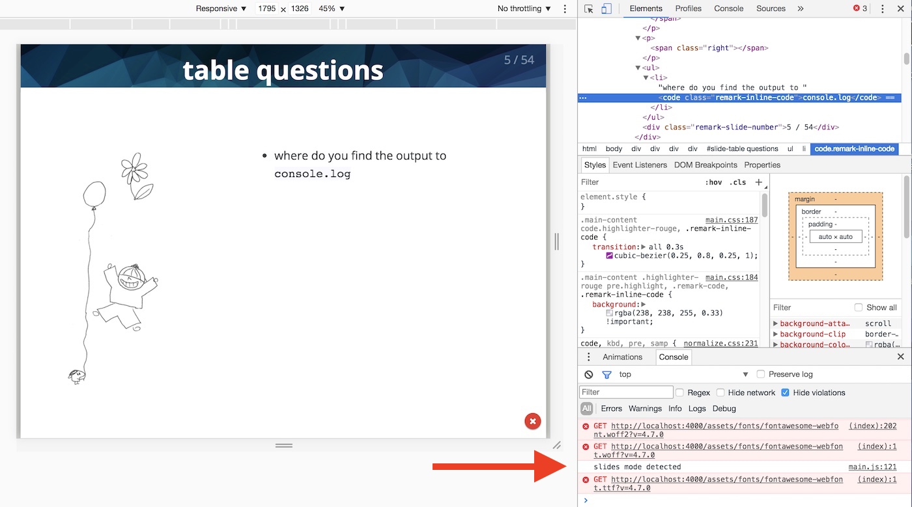
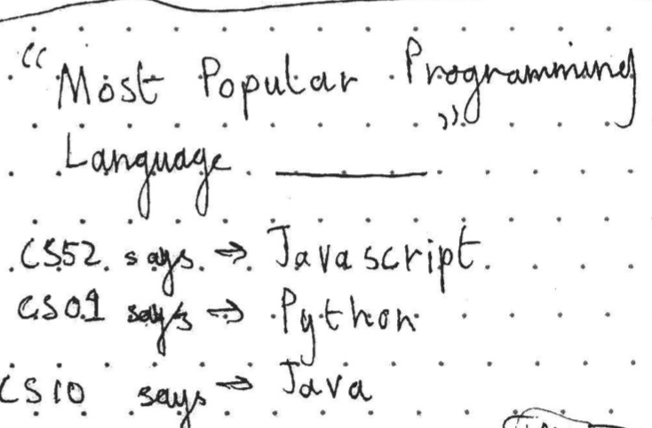
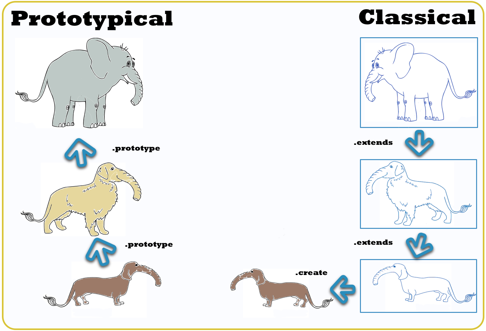

layout: true
class: center, middle
name: pic
background-size: contain

---

layout: true
class: center, top
name: fragment

.title[{{name}}]

---
layout: true
class: center, middle
name: base

.title[{{name}}]


---
name: CS52

* Today:
  * lab1 show
  * more javascript!
  * newer javascript!
  * tricky javascript!
  * team workshop
  * sections
  <!-- * our first quiz! -->


???
* SECTIONS?!
* goals of workshop
  * present breadth of material - not just what i like
  * have a bit of hack fun during class - had a geog class that was like this and i really enjoyed it
  * show that you worked on it, but doesn't have to be perfect
  * answer some reflection questions
  * pass on your knowledge - team will walk around and answer questions - henceforth to be known as experts
  * signup sheet out today, been revising it with new cool stuff. 
  * will have some mandatory xhours since the class is so big

---
name: oh the css


.large[]


???
* 


---
name: some labs1 to explore

* <a href="https://dartmouth-cs52-20s.github.io/lab1-landingpage-chanchavac2022/" target="_blank">[content]</a>
* <a href="https://dartmouth-cs52-20s.github.io/lab1-landingpage-Meriem-Fouad/" target="_blank">[chocolate]</a>
* <a href="https://dartmouth-cs52-20s.github.io/lab1-landingpage-iankhou/" target="_blank">[css typewriter]</a>
* <a href="https://dartmouth-cs52-20s.github.io/lab1-landingpage-dmw21/#" target="_blank">[coffee]</a>
* <a href="https://dartmouth-cs52-20s.github.io/lab1-landingpage-katrinayu1213/" target="_blank">[classy]</a>
* <a href="https://dartmouth-cs52-20s.github.io/lab1-landingpage-BCritchfield/" target="_blank">[checkbox hack]</a>
* <a href="https://dartmouth-cs52-20s.github.io/lab1-landingpage-hack-heart/#" target="_blank">[company and color scheme]</a>
* <a href="https://dartmouth-cs52-20s.github.io/lab1-landingpage-rohithm1/" target="_blank">[css animation]</a>
* <a href="https://dartmouth-cs52-20s.github.io/lab1-landingpage-catherinedparnell/" target="_blank">[css animation + parallax +]</a>
* <a href="https://dartmouth-cs52-20s.github.io/lab1-landingpage-musabshak/" target="_blank">[buttons]</a>
* <a href="https://dartmouth-cs52-20s.github.io/lab1-landingpage-srishtibagchi/" target="_blank">[magazine]</a>
* <a href="https://dartmouth-cs52-20s.github.io/lab1-landingpage-rcaverob/" target="_blank">[restaurant]</a>
* <a href="https://dartmouth-cs52-20s.github.io/lab1-landingpage-grantrdumanian/" target="_blank">[climbing]</a>
* <a href="https://dartmouth-cs52-20s.github.io/lab1-landingpage-georgina-davis/" target="_blank">[clean living]</a>
* <a href="https://dartmouth-cs52-20s.github.io/lab1-landingpage-nicBerg/" target="_blank">[?]</a>


---
name: reminder for frontend console




* Ctrl+Shift+J or Cmd+Opt+J

???
* just a reminder from last year - just always have this open
* in [chrome devtools](https://developer.chrome.com/devtools)


<!-- name: re
 
 MOVE BACK

.small[]
.small[] 
-->


---
name: Where in the Stack?

.medium[]


???
* still in browser only


---
name: what is es6?!?!


???
* a bunch of cool new stuff that makes javascript not crappy
* apologies, but i love programming language coolness and currently js is one of my favorites

---
name: what is es6/es7?!?!

<iframe src="//giphy.com/embed/ZtufItCGJM3Vm?hideSocial=true" width="480" height="360" frameBorder="0" class="giphy-embed" allowFullScreen></iframe>


???
* general confusion - don't worry
* the idea is to immerse you in a bunch of stuff but then you go and try it and eventually by trying it it'll make sense
* ask questions, learn good


---
name: es6 template string


<div 
  class="codepen hidden" 
  data-prefill='{
    "stylesheets": ["//cs52.me/assets/css/codepen-mods.css"],
    "scripts": ["//cs52.me/assets/codepen-mods.js"]
  }'
  data-preview="true"
  data-height="400" 
  data-theme-id="24117"
  data-default-tab="js,result"
  data-user="timofei"
  data-editable="true"
>
<pre data-lang="babel">
const foo = 'bar'; // single quotes preferred but can use double

// es5
let a = 'The ' + foo + ' is high.'; 

//prefer es6:
a = `The ${foo} is high.`;

console.log(a);
</pre>

</div>


???
* use the es6 template string constructions!
* why is string concatenation bad? (array concatenation - each plus allocates a new array and copies each element in)


---
name: closure and scope trickiness

<div 
  class="codepen hidden" 
  data-prefill='{
    "stylesheets": ["//cs52.me/assets/css/codepen-mods.css"],
    "scripts": ["//cs52.me/assets/codepen-mods.js", "https://code.jquery.com/jquery-2.2.4.min.js"]
  }'
  data-preview="true"
  data-height="550"
  data-default-tab="js,result"
  data-theme-id="24117"
  data-user="timofei"
  data-editable="true"
>
<pre data-lang="html">
  <blockquote>
    <div id="speech"></div>
    <div class="arrow bottom right"></div>
  </blockquote>
  <div id="cat">😼</div>
  <button id="go">hi cat!</button>
</pre>
<pre data-lang="css">
#cat {
  margin-top: 0.3em;
  font-size: 8em;
}

button {
  background: #0a0;
  color: white;
  margin-left: 2em;
  border-radius: 0.2em;
  border-width: 0.0em;
  padding: 0.2em 3em;
  font-size: 2em;
}


blockquote {
  background-color: #f8f8f8;
  border: 2px solid #c8c8c8;
  border-radius: 1em;
  height: 1.5em;
  width: 250px;
  text-align: center;
  padding: 20px;
  position: relative;
}

blockquote .arrow {
  border-style: solid;
  position: absolute;
}

.bottom {
  border-color: #c8c8c8 transparent transparent transparent;
  border-width: 13px 13px 0px 13px;
  bottom: -13px;
}

.bottom:after {
  border-color: #f8f8f8 transparent transparent transparent;
  border-style: solid;
  border-width: 13px 13px 0px 13px;
  bottom: 2.8px;
  content: "";
  position: absolute;
  left: -12.5px;
}

</pre>
<pre data-lang="babel">
function go() {
  const messages = ["Meow!", "I'm a talking cat!", "Callbacks are fun!"];

  for (var i = 0; i < messages.length; i++) {
    setTimeout(function () {
      cat.say(`${messages[i]} ${i}`);
    }, i * 1500);
  }
  
  // use let or

  /*
  messages.forEach( (message, i) => {
    setTimeout(function () {
      cat.say(`${message} ${i}`);
    }, i * 1500);
  });
  */

}


let cat = {
  speech: $("#speech"),
  cat: $("#cat"),
  say: function(quip) {
    this.speech.html(quip);
    this.cat.html("😸");
    setTimeout( function() {
      this.speech.html("");
      this.cat.html("😼");
    }.bind(this), 1250);
  }
};

$("#go").on("click", function () { go(); });</pre>
// from: https://hacks.mozilla.org/2015/07/es6-in-depth-let-and-const/

</div>

???
* btw where you see "babel" that means we are using the latest features of javascript  - we'll learn what babel does next week/ in the next short assignment
* reference retained to a variable that changes!
* note: easy way to fix this in es6, use let, or don't use for loops
* DON"T USE var:
  * i is hoisted above for loop
  * i is available after for loop


---
name: programming practices


<video loop controls>
  <source src="http://res.cloudinary.com/dali-lab/video/upload/w_283,h_512/v1546203223/cs52/programmingpractices.webm" type="video/webm"/>
  <source src="http://res.cloudinary.com/dali-lab/video/upload/w_283,h_512/v1546203223/cs52/programmingpractices.mp4" type="video/mp4"/>
  <source src="http://res.cloudinary.com/dali-lab/video/upload/w_283,h_512/v1546203223/cs52/programmingpractices.ogv" type="video/ogg"/>
  Your browser does not support HTML5 video tags
</video>

???
* template strings might not qualify as dangerous - mostly stylistic but some things we talk about can cause hard to find bugs- like shadowing variables, using var


---
name:  let

* let variables are block-scoped (not just function -> while, if, for)
* still hoisted
* global let variables are not properties on `window`
* `for (let x...)` create a fresh binding for x in each iteration
* error to use a let variable before declaration is reached
* redeclaring a variable with let is a SyntaxError
* use for variables that need reassigning

???
* all good things
* use let instead of var, kids
* for variable that need reassigning


---
name:  const

* simple:
  * variables declared with const are just like let
  * except that you can only assign to them when you declare them
  * ie. no reassignment allowed

???


---
name: OOP try 1

* Object-oriented programming: methods
  * property of an object can be a function
  * instance variables


<div 
  class="codepen hidden" 
  data-prefill='{
    "stylesheets": ["//cs52.me/assets/css/codepen-mods.css"],
    "scripts": ["//cs52.me/assets/codepen-mods.js"]
  }'
  data-preview="true"
  data-height="400" 
  data-theme-id="24117"
  data-default-tab="js,result"
  data-user="timofei"
  data-editable="true"
>
<pre data-lang="babel">
var o = {
  count: 0,
  increment: function(amount) {
    this.count += amount || 1;
    return this.count;
  }
}

console.log(o.increment());
console.log(o.increment(2));
console.log(o.increment(2));
</pre>

</div>


???
* everything is already an object
* everything is a dictionary, hence...


---
name: functions are objects

<div 
  class="codepen hidden" 
  data-prefill='{
    "stylesheets": ["//cs52.me/assets/css/codepen-mods.css"],
    "scripts": ["//cs52.me/assets/codepen-mods.js"]
  }'
  data-preview="true"
  data-height="400" 
  data-theme-id="24117"
  data-default-tab="js,result"
  data-user="timofei"
  data-editable="true"
>
<pre data-lang="babel">
function plus1(value) {
  if (!plus1.invocations) {
    plus1.invocations = 0;
  }
  plus1.invocations++;
  return value + 1;
 }

 console.log(plus1(10));  
 console.log(plus1(20)); 

 console.log(plus1.invocations);

</pre>

</div>


???
* tracks how many times it was called
* does this make sense? How does this work?


---
name: this failures

* `this` is special keyword for referring to the 'owner' of the function / context
  * when a function is executed not when defined
* in methods (function properties of objects): `this` is bound to object
* in other functions: `this` refers to global object

```javascript
function foo() { console.log(this); }

foo(); // `this` will refer to parent `window`

// as object method
var obj = {
  foo:'hi',
  bar: function() {console.log(this.foo)}
};
obj.bar(); // `this` will refer to `object`

```

???
* some examples, confusing yes
* difference in object vs function
* this will come back and haunt you sometimes
* who (which object) is the runner of the function
* couldn't run these in the interactive mode because there are


---
name: this

<div 
  class="codepen hidden" 
  data-prefill='{
    "stylesheets": ["//cs52.me/assets/css/codepen-mods.css"],
    "scripts": ["//cs52.me/assets/codepen-mods.js", "https://cdnjs.cloudflare.com/ajax/libs/jquery/3.4.1/jquery.slim.min.js"]
  }'
  data-preview="true"
  data-height="400" 
  data-theme-id="24117"
  data-default-tab="js,result"
  data-user="timofei"
  data-editable="true"
>
<pre data-lang="babel">
let flower = {
  petalCount: 10,
  bloom: function(){
  	$('#out').text(`I have ${this.petalCount} petals!`);
  },
  //option 1
  lateBloom: function(){ setTimeout(this.bloom,1000) },
  //option 2
  lateBloomBound: function(){ setTimeout(this.bloom.bind(this),1000) },
  // option 3
  lateBloomArrow: function(){
    setTimeout(()=> {this.bloom()},1000);
  }
}

flower.lateBloom(); 
</pre>
<pre data-lang="html">
<div id="out"></div>
</pre>

</div>

???
* why do we care about `this`?
* this won't run
* setTimeout always runs in the context of window - just as an illustration - this could have been a button instead
* window does not have a petalCount!


---
name: this

```javascript
setTimeout(this.bloom.bind(this),1000)

//or
setTimeout( ()=> {this.bloom() }, 1000);
```

* bind returns a new function with current `this` tied to the function
* on execute uses the bound `this` instead

???
* setTimeout's "this" refers to window
* needs `.bind(this)`
* bind returns a new function where the context includes the variables passed in.
* arrow notation we'll talk about more


---
name: that = this, bind

```javascript

var that = this;
setTimeout( function() {
  console.log(that);
}, 1000);

```

* assigning current `this` to a variable to freeze

???
* anybody want to take a stab at why this works? / what is the name for this?
* sometimes you will see people fix this with a closure
* reassigning the current this to another variable so that is closed over and included
* rather than the magic this
* BAD


---
name: that = this

<div 
  class="codepen hidden" 
  data-prefill='{
    "stylesheets": ["//cs52.me/assets/css/codepen-mods.css"],
    "scripts": ["//cs52.me/assets/codepen-mods.js", "https://cdnjs.cloudflare.com/ajax/libs/jquery/3.4.1/jquery.slim.min.js"]
  }'
  data-preview="true"
  data-height="400" 
  data-theme-id="24117"
  data-default-tab="js,result"
  data-user="timofei"
  data-editable="true"
>
<pre data-lang="babel">
var button = $('#greeting');
var double = function () {
  // that trick?
  setTimeout(function() {
    try{
      $(this).clone().appendTo('#output');
    }catch(err){
      console.log(err.message);
    }
  }, 1000);
  // or bind?
};

button.on("click", double);
</pre>
<pre data-lang="html">
<button id="greeting">HELLO</button>
<div id="output"></div></pre>
<pre data-lang="css">
button {
  background: #0a0;
  color: white;
  margin: 10px;
  border-radius: 0.2em;
  border-width: 0.0em;
  padding: 0.2em 3em;
  font-size: 2em;
}
</pre>
</div>

???
* this is button -- but setTimeout scope is window
* can .bind on the function inside the setTimeout
* or can alias that above setTimeout


---
name: classes (old way)

* Functions as classes in JavaScript:
  * Name the function after the class
  * use the new keyword
  * functions used this way are constructors

<div 
  class="codepen hidden" 
  data-prefill='{
    "stylesheets": ["//cs52.me/assets/css/codepen-mods.css"],
    "scripts": ["//cs52.me/assets/codepen-mods.js"]
  }'
  data-preview="true"
  data-height="400" 
  data-theme-id="24117"
  data-default-tab="js,result"
  data-user="timofei"
  data-editable="true"
>
<pre data-lang="babel">
function Rectangle(width, height) {
  this.width = width;
  this.height = height;
  this.area = function() { return this.width*this.height; }
}
var r = new Rectangle(26, 14);
console.log(r)
</pre>

</div>


???
* anybody remember constructors in java? what do they do?  (function that returns an instance of the class -> an object)
* this is basically the constructor - setting everything including methods there


---
name: inheritance

* prototype based:
  * a prototype object for each object instance
  * can have other prototype objects forming a chain
  * will search up the prototype chain until the property is found

.medium[]


???
* more questions for you!  how is inheritance done in java?
* properties of an object are its own property in addition to all the properties up the prototype chain
* more simply:  searches up the chain,  has the property no, ok lets check your prototype.
* multiple can be done with mixins (copying over properties from one object to another...) using `Object.assign`!
* img from http://yycjs.com/the-weird-parts/#slide19


---
name: adding to prototype


<div 
  class="codepen hidden" 
  data-prefill='{
    "stylesheets": ["//cs52.me/assets/css/codepen-mods.css"],
    "scripts": ["//cs52.me/assets/codepen-mods.js"]
  }'
  data-preview="true"
  data-height="400" 
  data-theme-id="24117"
  data-default-tab="js,result"
  data-user="timofei"
  data-editable="true"
>
<pre data-lang="babel">
function Rectangle(width, height) {
  this.width = width;
  this.height = height;
}

let r = new Rectangle(26, 14);

Rectangle.prototype.area = function() {
   return this.width*this.height;
}

console.log(r.area());
console.log(Object.keys(r)); //only own props
</pre>

</div>


???
* changing prototype will cause all instances to change
* this is similar to just adding a property to a function buuut
* adding to prototype will change all instances
* `String.prototype.isPalindrome = function() {
    return this == this.split('').reverse().join('');
} // radar, "live on time emit no evil"`


---
name: inheritance


```javascript

Rectangle.prototype = new Shape(...);

Square.prototype = new Rectangle();

//without separate constructor
let Square = Object.create(Rectangle);

```

* If desired property not in Rectangle.prototype
* then look in Shape.prototype and so on


???
* can use Object.create() instead of constructor
* don't need to memorize this stuff


---
name: getters and setters

```javascript
var pile = {
  elements: ["eggshell", "orange peel", "book"],
  get height () {
    return this.elements.length;
  },
  set height(value) {
    console.log("Ignoring attempt to set height to", value);
  }
};
console.log(pile.height); // → 3
pile.height = 100; // → Ignoring attempt to set height to 100
```

???
* want to include properties that are not methods but are computed?
* sure we got that
* anybody remember why properties are useful?
  * properties are data (even computed properties)
  * methods represent actions
  * also potentially concurrency safety for access to altering data, but we won't need to worry about that so much


---
name: BUT WAIT!

* es6 has "real" classes
* stop talking about prototypes
* still really just an object / function
* we'll use classes in all the next assignments

<iframe src="//giphy.com/embed/CKBuF2Sz3zuOQ?hideSocial=true" width="380" height="260" frameBorder="0" class="giphy-embed" allowFullScreen></iframe>

???
* keep ranting about es6, doesn't it make this better?


---
name: es6 class syntax

<div 
  class="codepen hidden" 
  data-prefill='{
    "stylesheets": ["//cs52.me/assets/css/codepen-mods.css"],
    "scripts": ["//cs52.me/assets/codepen-mods.js"]
  }'
  data-preview="true"
  data-height="400" 
  data-theme-id="24117"
  data-default-tab="js,result"
  data-user="timofei"
  data-editable="true"
>
<pre data-lang="babel">
class Bunny {
  constructor(name, favoriteFood){
    this.name = name;
    this.favoriteFood = favoriteFood;
  }
  eatFavFood() {
    console.log(`${this.favoriteFood}, yum!`);
  };
}

let es6Bunny = new Bunny('Brigadier Fluffkins', 'Raspberry Leaves');
es6Bunny.eatFavFood();
</pre>

</div>


<!-- from: https://medium.freecodecamp.com/learn-es6-the-dope-way-part-v-classes-browser-compatibility-transpiling-es6-code-47f62267661#.g5wa16op9 -->

???
* has constructor and methods
* much nicer syntax
* note: classes are *not* hoisted so need to declare class before using it


---
name: es6 inheritance
<div 
  class="codepen hidden" 
  data-prefill='{
    "stylesheets": ["//cs52.me/assets/css/codepen-mods.css"],
    "scripts": ["//cs52.me/assets/codepen-mods.js"]
  }'
  data-preview="true"
  data-height="400" 
  data-theme-id="24117"
  data-default-tab="js,result"
  data-user="timofei"
  data-editable="true"
>
<pre data-lang="babel">
class Bunny {
  constructor(name, favoriteFood){
    this.name = name;
    this.favoriteFood = favoriteFood;
  }
  eatFavFood() {
    console.log(`${this.favoriteFood}, yum!`);
  };
}

class BelgianHare extends Bunny {
  constructor(name, favoriteFood, favDrink) {
    super(name, favoriteFood);
    this.favDrink = favDrink;
  }

  drinkFavDrink() {
    console.log(`glug glug ${this.favDrink}`)
  }
}

let es6Bunny = new BelgianHare('Brigadier Fluffkins', 'Raspberry Leaves', "New England IPA");
es6Bunny.drinkFavDrink();
</pre>

</div>

???
* as you would expect `extends`
* super to invoke base class constructor *required*


---
name: navigating JS

<iframe src="//giphy.com/embed/13XQ6JKr2jQWRO?hideSocial=true" width="480" height="360" frameBorder="0" class="giphy-embed" allowFullScreen></iframe>

???
* getting into deep waters now
* but we will survive
* on to my favorite topic


---
name: Functional Programming

* everything is a function
* no/minimal mutable objects
* state is in stack vs heap
* easier to: test, parallelize, debug

.fancy.small[]


???
* why i love FP (i don't love math)
  * easy to test a function
  * parallelizable easily
  * shorter but still readable code
  * NO SIDE EFFECTS
  * in fact it will make you happy rather than sad


---
name: imperative vs functional


```javascript
let results = [];
for (let i = 0; i < anArray.length; i++) {
  results[i] = anArray[i] * i;
}
```

```javascript

let results = anArray.map( (value, i) => {
  return value * i;
});

```


???
* no idea why we are multiplying each value by its index but there you have it
* map example, map calls the function with value and index
  * basically a for loop for populating / altering arrays
* pass functions as arguments is key
  * is possible because functions are first-class
* note the array does not have to be mutable
  * has anyone tried to change an array while inside of a for loop? 
* fp premise:
  * immutable is better
  * functions take in arguments
  * spit out new results
  * no modification of things in place


---
name: functions as arguments

```javascript
function mult(arg1, arg2) { return arg1 * arg2; }

let results = anArray.map(mult);

//CAUTION:
let results = anArray.map(mult());

let results = anArray.map(function (value, i) { //anon function
  return value * i;
});

let results = anArray.map((value, i) => {  //arrow
  return value * i;
});
```

???
* coolest thing about js, passing functions as arguments
* CAUTION: if you put in parens will execute immediately then what???
* setInterval example


---
name: elegance

```javascript
let total = 0, count = 1;
while (count <= 10) {
  total += count;
  count += 1;
}
console.log(total);
```

```javascript
console.log(sum(range(1, 10)));
```

???
* fp can be elegant


---
name: higher order functions

* functions that operate on other functions
  * can take functions as arguments
  * can return functions

```javascript
function runLater(seconds) {
  return (func) => {
    setTimeout(func, seconds);
  }
}

const inFive = runLater(5000);
inFive( ()=> {console.log('hi'); } );

```

???
* setTimeout is a higher order function as it takes a function as an argument
* later will build functions that return new functions


---
name: filter, map, reduce

<div 
  class="codepen hidden" 
  data-prefill='{
    "stylesheets": ["//cs52.me/assets/css/codepen-mods.css"],
    "scripts": ["//cs52.me/assets/codepen-mods.js", "https://cdnjs.cloudflare.com/ajax/libs/jquery/3.4.1/jquery.min.js"]
  }'
  data-preview="true"
  data-height="400" 
  data-theme-id="24117"
  data-default-tab="js,result"
  data-user="timofei"
  data-editable="true"
>
<pre data-lang="babel">
// using https://swapi.co/ 

$.ajax({
  url: 'https://cs52-swapi.herokuapp.com/api/people/',
  method: 'GET'
}).then(function(data) {

  let filtered = data.results.filter( p => {
    return p.height > 172; //lukes height
  });
    
  let names = filtered.map( p => {
      return p.name;
  });
  
  names.forEach( name => println(`\n ${name}`));
});


$.ajax({
  url: 'https://cs52-swapi.herokuapp.com/api/planets/',
  method: 'GET'
}).then(function(data) {
    
  let population = data.results.map( x => x.population).reduce( (a, b) => {
    return (parseInt(a)||0) + (parseInt(b)||0);
  }, 0);
  
  println(`Population: ${population}`);
});


function print(stuff) {
  stuff.forEach(println);
}
function println(line) {
  $('body').append(`<br><div>${line}</div><br>`);
}
</pre>

<pre data-lang="css">
body {
  padding: 10px;
  background: url(https://s3-us-west-2.amazonaws.com/s.cdpn.io/667559/Star-Wars-Jakku.jpg);
  background-size: auto 500px;
  background-attachment: fixed;
  font-size: 16px;
}</pre>
</div>


???
* things to try:
  * change height (turns out we don't really know height that well)
  * p.mass over 100
  * p.eye_color == "yellow"
  * also try watching episodes 4,5,6... 


---
name: chaining

<div 
  class="codepen hidden" 
  data-prefill='{
    "stylesheets": ["//cs52.me/assets/css/codepen-mods.css"],
    "scripts": ["//cs52.me/assets/codepen-mods.js", "https://cdnjs.cloudflare.com/ajax/libs/jquery/3.4.1/jquery.min.js"]
  }'
  data-preview="true"
  data-height="400" 
  data-theme-id="24117"
  data-default-tab="js,result"
  data-user="timofei"
  data-editable="true"
>
<pre data-lang="babel">
String.prototype.toTitleCase = function() {
  return this.toLowerCase()
  .split(' ')
  .map(i => i[0].toUpperCase() + i.substring(1))
  .join(' ');
}


// using https://jsonplaceholder.typicode.com/posts

$.ajax({
  url: 'https://jsonplaceholder.typicode.com/posts',
  method: 'GET'
}).then(function(data) {
  
  let titles = data.map( post => {
    return post.title.toTitleCase();
  });
  
  print(titles);
  
});


function print(stuff) {
  stuff.forEach(println);
}
function println(line) {
  $('body').append(`<div>${line}</div><br>`);
}
</pre>

<pre data-lang="css">
body {
  padding: 10px;
  background: url(https://s3-us-west-2.amazonaws.com/s.cdpn.io/667559/Star-Wars-Jakku.jpg);
  background-size: auto 500px;
  background-attachment: fixed;
  font-size: 16px;
}
}</pre>
</div>


???
* take away toTitleCase()
* demonstrates chaining functions as well as prototype adding a method to string!


<!-- 
name: flatten, etc

<div 
  class="codepen hidden" 
  data-prefill='{
    "stylesheets": ["//cs52.me/assets/css/codepen-mods.css"],
    "scripts": ["//cs52.me/assets/codepen-mods.js", "https://cdnjs.cloudflare.com/ajax/libs/jquery/3.4.1/jquery.min.js"]
  }'
  data-preview="true"
  data-height="400" 
  data-theme-id="24117"
  data-default-tab="js,result"
  data-user="timofei"
  data-editable="true"
>
<pre data-lang="babel">
// using https://swapi.co/ 
Array.prototype.flatten = function() {
  return this.reduce( (a,b) => { return a.concat(b) }, []);
}
Array.prototype.uniq = function() {
  return Array.from(new Set(this))
}


$.ajax({
  url: 'https://cs52-swapi.herokuapp.com/api/species',
  method: 'GET'
}).then(function(data) {

  let eyeColors = data.results.map( p => {
    return p.eye_colors.split(', '); 
  });
  
  // flatten uniq;
    
 
  eyeColors.forEach( name => console.log(`${name}`));
});

</pre>

<pre data-lang="css">
body {
  padding: 10px;
  background: url(https://s3-us-west-2.amazonaws.com/s.cdpn.io/667559/Star-Wars-Jakku.jpg);
  background-size: auto 500px;
  background-attachment: fixed;
  font-size: 16px;
}
}</pre>
</div>

* flattening and extending prototype
* sometimes frowned on to extend native types
  * mostly cause you can wreak havoc if you redefine something
  * just do so thoughtfully
 -->


---
name: pure functions

.medium[]


* pure functions:
  * do not rely on external state, only parameters
  * do not change external state, only return values

???
* why is good?
  * easier to combine functions that don't rely on some global state
  * easier to test functions where inputs are all declared
  * more like math
* more cool things --
  * can replace a pure function in memory


---
name: Side Effects

.medium_small[]

* side effects:
  * when a function changes some state (instance / global var)
  * not always bad (console.log)
  * can be hard to debug and test

???
* how do you test something when a function relies on global state + inputs


<!-- ripped out asynch js to add to react1 for now - bring back for 19s --> 

---
name: yay!


* next time:
   * intro to react!
* sa3 is starterpack
