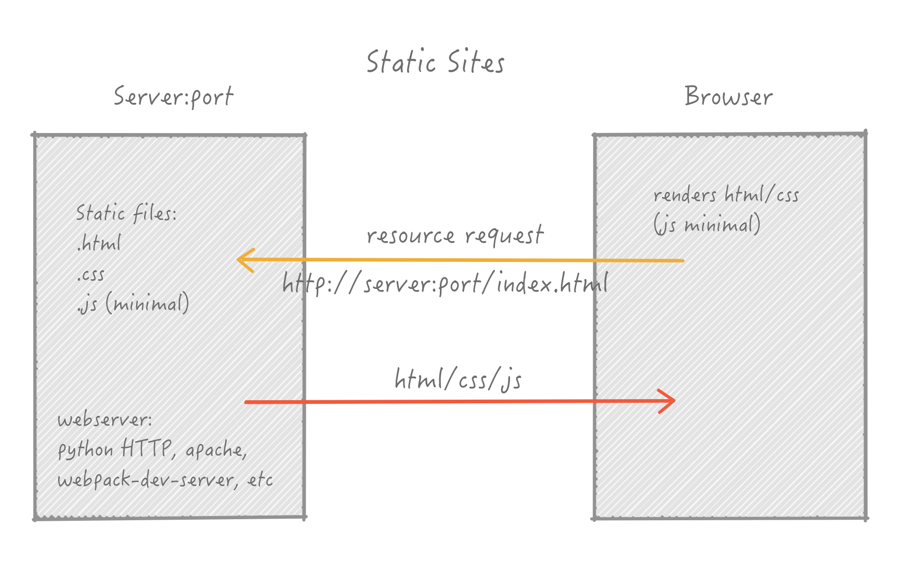
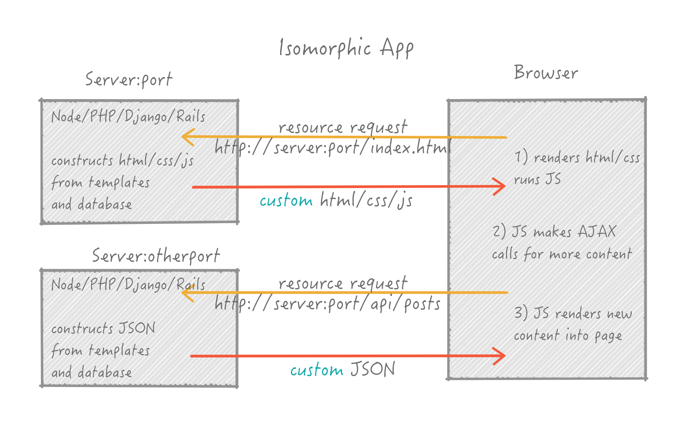
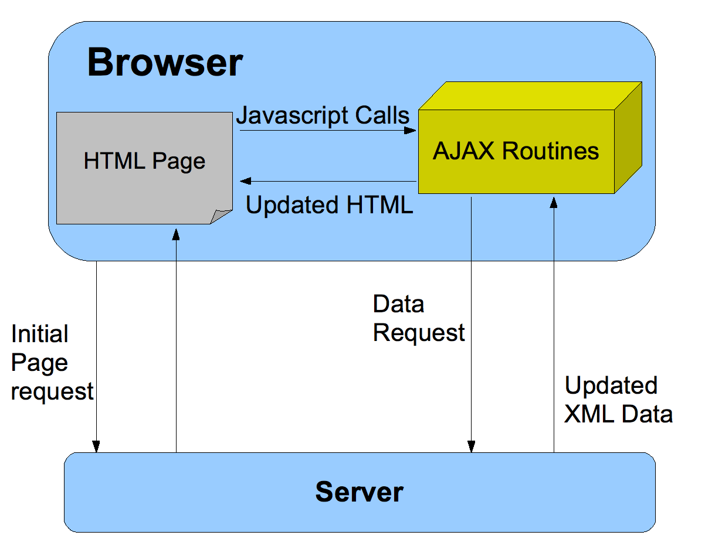
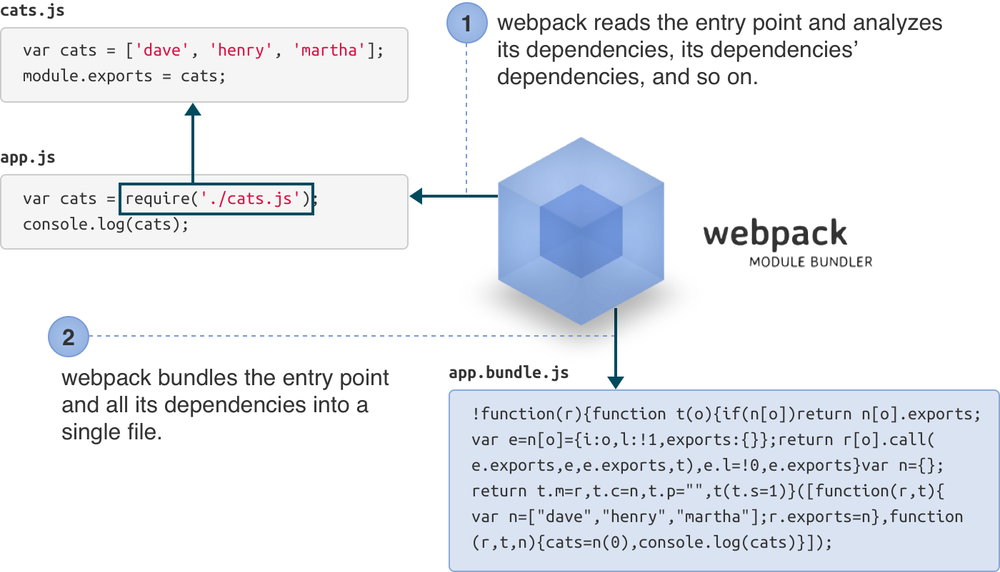
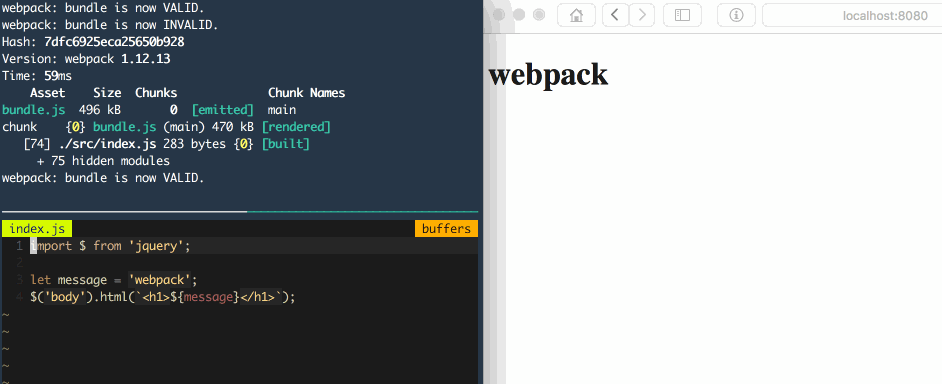

layout: true
class: center, middle
name: pic
background-size: contain

---

layout: true
class: center, top
name: fragment

.title[{{name}}]

---
layout: true
class: center, middle
name: base

.title[{{name}}]

---
name: CS52

* Today:
  * less javascript!
  * workshop!
  * what was this starterpack thing?!
  * intro to react!

???


---
name: table questions

* why aren't JS objects automatically bound to their context? what's the benefit of not.

```js
function handleClick(e) {
  this.innerHTML="you clicked me!"
}

document.getElementById('button')
  .addEventListener('click', handleClick);
```

.large[]

???
*  


---
name: table questions

* is it universally accepted that ES6 is better, or is there a debate against it?
* does ES6 move JS to object oriented programming?

.medium[]


???
* there are quite a few debates in general about javascript language features, but no ES6 is superior in every way. some people might want more or different changes, but nobody wants less.
* it helps with some object oriented style with the new `class` syntax but it also introduces new functional methods such as the arrow functions and generators and iterators.

* objects that allow you iterate through a sequence while keeping track of position and providing a next funciton
* generator is a function that acts as an iterator.


---
name: quiz


???
* let's take break a do a quiz!


---
name:



???
* static sites
  * just files, transmitted on the network


---
name:


???
* server side rendering
  * server constructs custom response for every page
  * uses template and results from database


---
name:


???
* single page app
  * like the starwars display snippet
  * 1 index html file that loads javascript
  * javascript then handles all content and urls
  * loads all content asynchronously and inserts into page
  * DOM manipulation + frontend framework


---
name:




???
* isomorphic app
  * does both server side rendering
  * AND javascript client side content fetching and display


---
name:

.small[]

.medium[]


???
* ajax is what talks to api's
<!--http://stackoverflow.com/questions/25336156/how-to-immediately-invoke-jquery-upon-clicking-remote-link-in-rails-->
<!--https://realpython.com/blog/python/django-and-ajax-form-submissions-more-practice/-->


---
name:

.medium[]

???
* more ajax
  * page updates happen in background separate from full page loads


---
name: More More

* apis
* webpack and build tools
* node and npm


???


---
name: apis

* http/s requests
  * GET, POST, etc
* return JSON format data
* [https://www.getpostman.com/](https://www.getpostman.com/)

.medium[]


???


---
name: webpack

.fancy.medium[]

???
* https://webpack.js.org/


---
name: babel

.fancy.medium[]


???


---
name: eslint with airbnb style guide

.fancy.medium[]

???


---
name: webpack

.medium_small[]


???


---
name:

.medium[]

```bash
babel app -d dist
uglify dist
sass app/sass:dist/css
# reload server / pages
```

???
* es6 transpilation
* sass compilation
* only necessary modules


---
name:

.medium[]


???
* analyzes all import statements


---
name:

.medium[]
???
* nice clean bundle


---
name: webpack-dev-server

.medium[]

* just a local http server
  * picks up changes and builds
  * with magic reload only certain modules powers

???


---
name: Deployment

* for production
  * need to build outputs to files
  * host static output files
  * would not be running webpack-dev-server

???


---
name: Node and NPM

* `npm` is package manager
  * downloads js modules
  * uses `package.json` file to `--save` dependencies
  * can share project with `package.json` file

.small[]

???
* package.json file allows other devs or Heroku to load your project
* no need to include the giant amounts of dependencies in your actual project git


---
name: node

* Node is javascript interpreter without a browser
* used for server side processing
* used for desktop js apps like Atom
* webpack-dev-server is a Node app
* slackattack are Node apps

???


---
name:

.medium[]

???


<!-- ripped out events here to put into 04_js -->


---
name: questions?

<iframe src="//giphy.com/embed/7cfBCpzyvkVs4" width="480" height="323" frameBorder="0" class="giphy-embed"></iframe>

???


---
name: brief frameworks history

* web v0: static HTML files only
* web v1: Common Gateway Interface (CGI)
  * URLs map to executable programs that return HTML
  * exits after returning page
  * stateless
  * LAMP stack -- linux+apache+mysql+perl

???
* server spits out full display html


---
name: 1st gen web frameworks

* php, asp.net, java
* language runtime directly in web server (faster)
* template: mix code and HTML
* web specific libraries:
  * url handling
  * html generation
  * sessions
  * database interfaces

???
* server side rendering


---
name: 2nd gen serverside frameworks

* Ruby on Rails, Django
* Model-View-Controller:
  * abstracted structure
* Object Relational Mapping (ORM):
  * simply database use
  * use objects instead of SQL

???
* note these all fit in to Server Side Rendering


---
name: 3rd gen serverside frameworks


* Express, Flask, Sinatra
* lightweight
* optional mvc but less rigid
* module based rather than monolothic
  * ex: use any templating engine
* options vs the one way


???


---
name: 3rd gen frontend frameworks


* AngularJS, Backbone
* clientside javascript frameworks
* handle dynamic data on frontend
* templates
* optional mvc
* rise of api architecture


???
* some of these have gone through multiple generations themselves
* react is a bit on the new side


---
name: MVC

.medium[]


???
* mvc is common pattern
* model stores your datas, objects
* controller operates on the datas
* view presents it, webpage
* can be both frontend and backend
  * often both!
  * frontend for managing data objects loaded in browsers
  * server for database
  * servers views are JSON api


---
name:

.medium[]

* all frameworks — end product html/css
* write html for parts of page that don't change
* code for dynamic parts
* execute template to fill in code parts


???
* benefits of templates
* designer friendly
* easy to test


---
name: mvc popular but

* invented in the 70s
* helps organize architecture
* modern applications need more scalability
* mvc can be heavy, too much data loaded, too many views


???
* we'll keep talking about mvc so don't worry
* BUT we're also going to move on to 4rth more modern tooling!


---
name:


???


---
name:

.small[]

* what is React and why?
* basic render function and virtual dom
* class components
* component state
* smart and dumb components

???


---
name: React

* V in MVC
* but actually more
  * super fast virtual dom

???


---
name: Virtual DOM?

* isn't one DOM already enough?!?!
* DOM is slow
* Virtual DOM allows for faster DOM manipulation
* Virtual DOM simpler and faster
  * React diffs Virtual DOM and DOM
  * only updates what is changed


???


---
name: tree diffs

* wouldn't comparing trees be expensive?
  * $O(n^{3})$ yes
  * but React does it in $O(n)$

???


---
name: dirty state

.medium_small[]


???
* when you run setstate it markes a node as dirty
* potentially rerendering the entire subtree but in practice is performant

*(img from [perfplanet](http://calendar.perfplanet.com/2013/diff/))*


---
name: rerendering

.medium_small[]


???


---
name: components

* React is component based:
  * encapsulated reusable containers
  * logic + rendering
  * no state in the DOM
* components are just functions:
  * have `state`
  * `props` as arg
  * nested

???
* everything is a component in react
* each node in virtual DOM is component


---
name: state old way

```javascript
$("button").on("click", function(button) {
  if(button.value=="OFF") {
      button.value="ON";
  } else {
      button.value="OFF";
  }
});
```

gross

???
* storing state in the DOM
* have to query for it if we want to know anything
* super gross


---
name: state new way

```javascript
<button onClick={() => this.setState({ button: !button })} />
```

* prettier?

???
* fp principles
* each component has local state which is an object (dictionary/hashmap)
* has method `setState` to change it
* never mutate state directly without `setState`


---
name: JSX

```javascript
const aDivElement = <div className="foo" />;

const aComponent = <MyComponent someProperty={true} />;
```

* JSX is html-like syntax for defining react tree nodes
* create JS objects


???
* this is where babel comes in


---
name: component lifecycle


.medium_small[]

* `setState` and `setProps` are key


???


---
name: down data flow

.medium_small[]

* parent components send data down as `props`
* children pass up actions in callbacks

???
* this can get a little tricky as you'll see in SA3
* buuut next week we'll learn how to manage that in larger apps


---
name: dumb component

<p data-height="300" data-theme-id="24117" data-slug-hash="2a117cd9e89d119ff929e921eb280df1" data-default-tab="js,result" data-user="timofei" data-embed-version="2" data-editable="true" class="codepen">See the Pen <a href="http://codepen.io/timofei/pen/2a117cd9e89d119ff929e921eb280df1/">dumb component</a> by Tim Tregubov (<a href="http://codepen.io/timofei">@timofei</a>) on <a href="http://codepen.io">CodePen</a>.</p>


???
* also called functional
* just a function, takes props, spits back JSX


---
name: smart component

<p data-height="351" data-theme-id="24117" data-slug-hash="9cdfb283082fadae6152944f1f3ac506" data-default-tab="js,result" data-user="timofei" data-embed-version="2" data-editable="true" class="codepen">See the Pen <a href="http://codepen.io/timofei/pen/9cdfb283082fadae6152944f1f3ac506/">9cdfb283082fadae6152944f1f3ac506</a> by Tim Tregubov (<a href="http://codepen.io/timofei">@timofei</a>) on <a href="http://codepen.io">CodePen</a>.</p>

???
* es6 class based (doesn't have to be but better this way)
* knows state
* note, no poking of the DOM at all
* just state changes


---
name: tiny todo

<p data-height="398" data-theme-id="24117" data-slug-hash="4940f261bfe4feb77de31981597c4201" data-default-tab="js,result" data-user="timofei" data-embed-version="2" data-editable="true" class="codepen">See the Pen <a href="http://codepen.io/timofei/pen/4940f261bfe4feb77de31981597c4201/">mini todo</a> by Tim Tregubov (<a href="http://codepen.io/timofei">@timofei</a>) on <a href="http://codepen.io">CodePen</a>.</p>


???
* putting it all together


---
name:


???


---
name: Workshop and SA4

[cs52.me/assignments/sa4](/assignments/sa4)


???


---
name: Nexttime

* SA4 out, due Thurs!
* More REACT!
* State management

???
