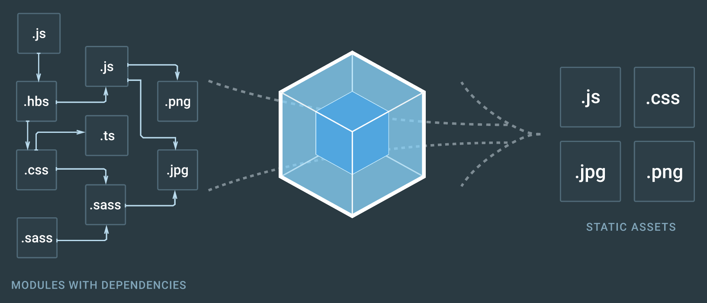
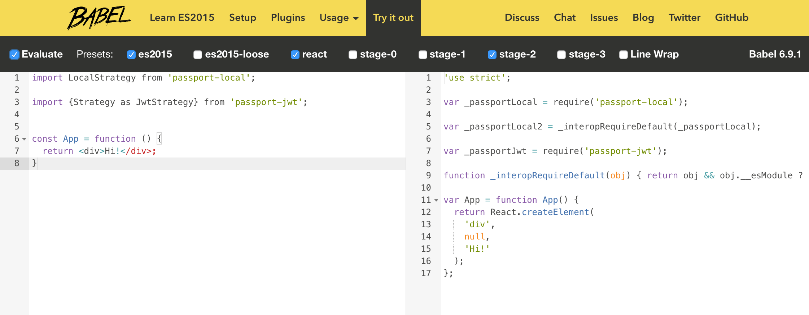
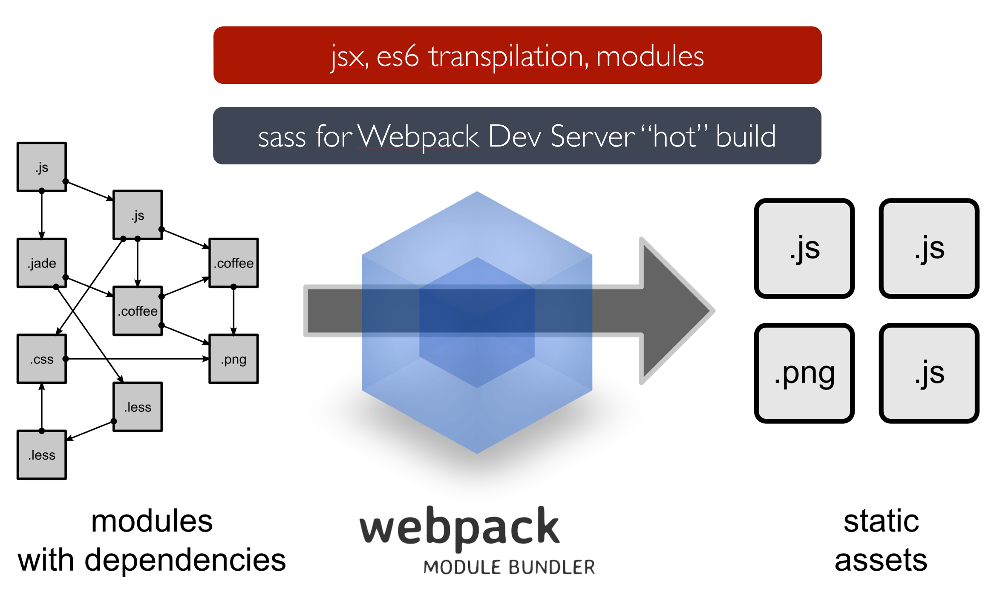
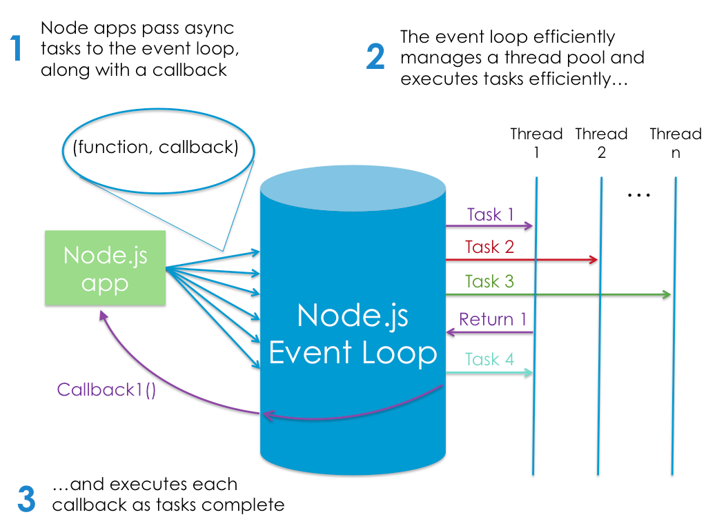
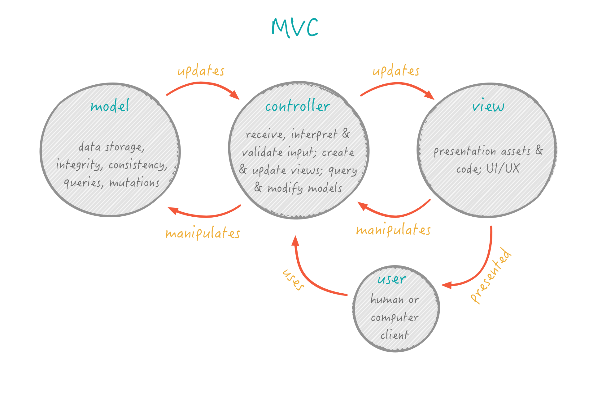
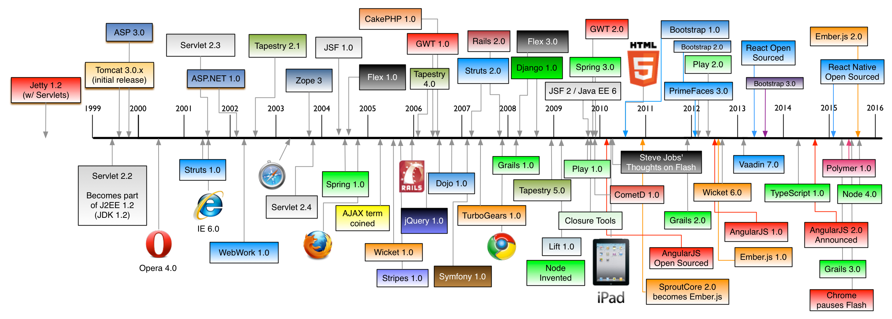
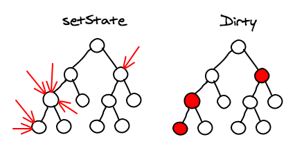

layout: true
class: center, middle
name: pic
background-size: contain

---

layout: true
class: center, top
name: fragment

.title[{{name}}]

---
layout: true
class: center, middle
name: base

.title[{{name}}]

---
name: CS52

* Today:
  * less javascript!
  * what was this starterpack thing?!
  * intro to react!

???


---
name: table questions

* why aren't JS objects automatically bound to their context? what's the benefit of not.

```js
function handleClick(e) {
  this.innerHTML="you clicked me!"
}

document.getElementById('button')
  .addEventListener('click', handleClick);
```

.large[]

???
*  in this example, handleClick needs `this` to refer to the calling owner (ie the button).
* might want to use this in quizzical


---
name: table questions

* is it universally accepted that ES6 is better, or is there a debate against it?
* does ES6 move JS to object oriented programming?

.medium[]


???
* there are quite a few debates in general about javascript language features, but no ES6 is superior in every way. some people might want more or different changes, but nobody wants less.
* it helps with some object oriented style with the new `class` syntax but it also introduces new functional methods such as the arrow functions and generators and iterators.

* objects that allow you iterate through a sequence while keeping track of position and providing a next funciton
* generator is a function that acts as an iterator. can return intermediate values for instance.


---
name: SA3


<iframe src='https://gfycat.com/ifr/DearestIllinformedBlackbird' frameborder='0' scrolling='no' width='440' height='520' allowfullscreen></iframe>

???
* shall we code together on the board?


---
name: quiz


???
* let's take break a do a quiz!
* don't worry just get the answers right and you'll be fine


---
name: Back to SA3


<iframe src="//giphy.com/embed/xT8qBpccknAjZalxe0?hideSocial=true" width="480" height="480" frameBorder="0" class="giphy-embed" allowFullScreen></iframe>


---
name: where in the stack


---
name: SASS

.medium[]

.left[
```css

.question {
  background-color: #95c34c;
}

.question h1 {
  font-size: 1.2em;
  color: #658534
}
```
]

.right[
```scss
$theme: #95c34c;

.question {
 background-color: $theme;
 h1 {
  font-size: 1.2em;
  color: darken($theme,10%);
 }
}
```
]


???
* preprocessor/transpiler - takes this better syntax and compiles it down to regular compatible css
* nesting,  variables, imports other stuff


<!-- ---
name: webpack

.fancy[]

???
* https://webpack.js.org/
* is a build
 -->


---
name: babel

.fancy[]


???

* transpiles latest and greatest js into compatible old code
* also enables this thing called jsx which we'll be learning soon


---
name: eslint with airbnb style guide

.fancy[]

.fancy[]


???
* checks your bad code and makes it good
* fyi, semicolons are optional although i use them
* https://github.com/airbnb/javascript


---
name: webpack

<iframe src="//giphy.com/embed/3o84U6421OOWegpQhq?hideSocial=true" width="580" height="370" frameBorder="0" class="giphy-embed" allowFullScreen></iframe>

???


---
name:

.medium[]

```bash
babel app -d public
uglify public
sass app/sass:public/css
# reload server / pages
```

???
* es6 transpilation
* sass compilation
* only necessary modules
* builds all the things for you!
* hot reloads modules - you change some js it can reload just that module.  


---
name:

.medium[]

???
* analyzes all import statements
* follows them and includes everything that is actually linked
* can do other stuff like delete unused code - tree shaking


---
name:

.left.fancy[]

.right.fancy[]

???
* nice clean bundle


---
name: webpack-dev-server

.medium[]

* just a local http server
  * picks up changes and builds
  * with magic reload-only-certain-modules powers

???


---
name: Deployment

* for production
  * need to build outputs to files
  * host static output files
  * would not be running webpack-dev-server

* `gh-pages` is just one way of publishing compiled output

.small[]


???


---
name: Node and NPM

* `npm` is package manager
  * downloads js modules
  * uses `package.json` file to `--save` dependencies
  * can share project with `package.json` file

.small[]

???
* package.json file allows other devs or Heroku to load your project
* no need to include the giant amounts of dependencies in your actual project git


---
name: node.js

.tiny[]


* Node.js is javascript interpreter without a browser
* used for server side processing
* used for desktop js apps like Atom
* webpack-dev-server is a Node app


.tiny[]


???
* we'll be using lots of node later for server side stuff


---
name: More event loop

.medium[]

???


<!-- ripped out events here to put into 04_js -->


---
name: questions?

<iframe src="//giphy.com/embed/7cfBCpzyvkVs4" width="480" height="323" frameBorder="0" class="giphy-embed"></iframe>

???


---
name:


???
* an overview of different web architectures
* we'll go over these more in depth also
* static sites
  * just files, transmitted on the network
  * what we've been doing so far


---
name:


???
* server side rendering
  * server constructs custom response for every page
  * uses template and results from database


---
name:


???
* single page app
  * 1 index html file that loads javascript
  * javascript then handles all content and urls
  * loads all content asynchronously and inserts into page
  * DOM manipulation + frontend framework
  * largely the architecture we'll be using


---
name:


???
* isomorphic app
  * does both server side rendering
  * AND javascript client side content fetching and display
  * this is useful in a few cases where say you want bots to read your page better or for SEO, so we'll learn about it but not have to inmplement it.


---
name:

.small[]

.medium[]


???
* ajax is what talks to api's
* process by which a page loads new data via javascript rather than html

<!--http://stackoverflow.com/questions/25336156/how-to-immediately-invoke-jquery-upon-clicking-remote-link-in-rails-->
<!--https://realpython.com/blog/python/django-and-ajax-form-submissions-more-practice/-->


---
name:

.medium[]

???
* more ajax
  * page updates happen in background separate from full page loads
  * we will use JSON isntead of XML, but note that new html only happens once the data is fetched


---
name: apis

* http/s requests
  * GET, POST, etc
* return JSON format data
* [https://www.getpostman.com/](https://www.getpostman.com/)

.medium[]


???
* when people say apis'
* what they mean is:
  * a server that returns/mutates data
  * based on http get/post requests


---
name: brief frameworks history

.medium_small[]

* web v0: static HTML files only
* web v1: Common Gateway Interface (CGI)
  * URLs map to executable programs that return HTML
  * exits after returning page
  * stateless
  * original LAMP stack -- linux+apache+mysql+perl

```bash
perl -e 'print "<html>Hello World</html>"'
```

???
* server spits out full display html


---
name: 1st gen web frameworks

.tiny[]

* php, asp.net, java
* template: mix code and HTML
* web specific libraries:
  * url handling
  * html generation
  * sessions
  * database interfaces

```php
<?php echo '<h1>Hello World</h1>'; ?>
```

???
* server side rendering
* language runtime directly in web server (faster)


---
name: 2nd gen serverside frameworks

.tiny[]

* Ruby on Rails, Django
* Model-View-Controller:
  * abstracted structure
* Object Relational Mapping (ORM):
  * simply database use
  * use objects instead of SQL

```ruby
def home
  @greeting = "howdy"
end
```

???
* note these all fit in to Server Side Rendering


---
name: 3rd gen serverside frameworks

.tiny[]

* Express, Flask, Sinatra
* lightweight
* optional mvc but less rigid
* module based rather than monolothic
  * ex: use any templating engine
* options vs the one way

```js
app.get('/', (req, res) => {
  res.send('hi');
});
```

???


---
name: 3rd gen frontend frameworks

.tiny[]


* AngularJS, Backbone
* clientside javascript frameworks
* handle dynamic data on frontend
* templates
* optional mvc
* rise of api architecture

```js
var AppView = Backbone.View.extend({
  template: _.template("<h3>Hello <%= who %></h3>"),
  render: function(){
    this.$el.html(this.template({who: 'world!'}));
  }
});
```


???
* some of these have gone through multiple generations themselves
* and then there is REACT!   4th gen!


---
name: MVC




???
* mvc is common code architecture pattern - specifically for uis
* model stores your datas, objects
* controller operates on the datas
* view presents it, webpage
* can be both frontend and backend
  * often both!
  * frontend for managing data objects loaded in browsers
  * server for database
  * servers views are JSON api (but very minimal mostly just controller)
* lots of alternatives mvvc mcp etc etc.  


---
name: Templating for Views

.medium[]

* all frameworks — end product html/css
* write html for parts of page that don't change
* code for dynamic parts
* execute template to fill in code parts


???
* benefits of templates
* designer friendly
* easy to test


---
name: mvc popular but

* invented in the 70s
* helps organize architecture
* modern applications need more scalability
* mvc can be heavy, too much data loaded, too many views


???
* we'll keep talking about mvc, more next week!
* BUT we're also going to move on to 4rth more modern tooling!


---
name:




???
* timeline of web frameworks
* you'd think webdev  has been around for a long time, but tooling keeps evolving rapidly


---
name:

.small[]

* enter REACT
* basic render function and virtual dom
* class components
* component state
* smart and dumb components

???
* facebook created


---
name: React

.medium_small.fancy[]

* V in MVC
* but actually more
  * super fast virtual dom

???


---
name: Virtual DOM?

.medium_small.fancy[]


* isn't one DOM already enough?!?!
* DOM is slow
* Virtual DOM allows for faster DOM manipulation
* Virtual DOM simpler and faster
  * React diffs Virtual DOM and DOM
  * only updates what is changed


???
* dom trees are large, react component virtual tree is smaller
* saved unneccessary dom manipulation (state changes but don't need to rerender a lot of stuff)


---
name: tree diffs

* wouldn't comparing trees be expensive?
  * $O(n^{3})$ yes
  * but React does it in $O(n)$

???


---
name: dirty state

.medium[]


???
* when you run `setstate` it markes a node as dirty
* potentially rerendering the entire subtree but in practice is performant

*(img from [perfplanet](http://calendar.perfplanet.com/2013/diff/))*


---
name: rerendering

.medium[]


???


---
name: components

* React is component based:
  * encapsulated reusable containers
  * logic + rendering
  * no state in the DOM
* components:
  * have `state`
  * take in `props` as args
  * nested
  * can `render`

???
* we'll be talking a lot about component this component that
* everything is a component in react
* each node in virtual DOM is component
* trees on trees on trees


---
name: state old way

```javascript
$("button").on("click", function(button) {
  if(button.value=="OFF") {
      button.value="ON";
  } else {
      button.value="OFF";
  }
});
```

gross

???
* storing state in the DOM
* have to query for it if we want to know anything
* super gross
* slight exaggeration but still


---
name: state new way

```javascript
<button onClick={() => this.setState({ button: !button })} />
```

* prettier?

???
* fp principles
* each component has local state which is an object (dictionary/hashmap)
* has method `setState` to change it
* never mutate state directly without `setState`


---
name: JSX

```javascript
const aDivElement = <div className="foo" />;

const aComponent = <MyComponent someProperty={true} />;
```

* JSX is html-like syntax for defining react tree nodes
* create JS objects


???
* react components rendering is definied in JSX
* this is where babel comes in


---
name: component lifecycle


.medium[]

* `setState` and `setProps` are key
* methods that get called at different times during the life of the page


???
* components have lifecycle methods


---
name: down data flow

.medium_small[]

* parent components send data down as `props`
* children pass up actions in callbacks

???
* this can get a little tricky as you'll see
* but i believe in you, you'll practice and this will all become second nature to you - i know.
* buuut next week we'll learn how to manage that in larger apps
* need to refresh what a callback is?


---
name: dumb component

<p data-height="400" data-theme-id="24117" data-slug-hash="2a117cd9e89d119ff929e921eb280df1" data-default-tab="js,result" data-user="timofei" data-embed-version="2" data-editable="true" class="codepen">See the Pen <a href="http://codepen.io/timofei/pen/2a117cd9e89d119ff929e921eb280df1/">dumb component</a> by Tim Tregubov (<a href="http://codepen.io/timofei">@timofei</a>) on <a href="http://codepen.io">CodePen</a>.</p>


???
* also called functional
* just a function, takes props, spits back JSX


---
name: smart component

<p data-height="400" data-theme-id="24117" data-slug-hash="9cdfb283082fadae6152944f1f3ac506" data-default-tab="js,result" data-user="timofei" data-embed-version="2" data-editable="true" class="codepen">See the Pen <a href="http://codepen.io/timofei/pen/9cdfb283082fadae6152944f1f3ac506/">9cdfb283082fadae6152944f1f3ac506</a> by Tim Tregubov (<a href="http://codepen.io/timofei">@timofei</a>) on <a href="http://codepen.io">CodePen</a>.</p>

???
* es6 class based (doesn't have to be but better this way)
* knows state
* note, no poking of the DOM at all
* no selectors, no getlementbyanything, no setting html or css
* just state changes
* and outputs


---
name: tiny todo

<p data-height="400" data-theme-id="24117" data-slug-hash="4940f261bfe4feb77de31981597c4201" data-default-tab="js,result" data-user="timofei" data-embed-version="2" data-editable="true" class="codepen">See the Pen <a href="http://codepen.io/timofei/pen/4940f261bfe4feb77de31981597c4201/">mini todo</a> by Tim Tregubov (<a href="http://codepen.io/timofei">@timofei</a>) on <a href="http://codepen.io">CodePen</a>.</p>


???
* putting it all together


---
name:


???


---
name: Nexttime

* SA4 out
* More REACT!
* State management

???
