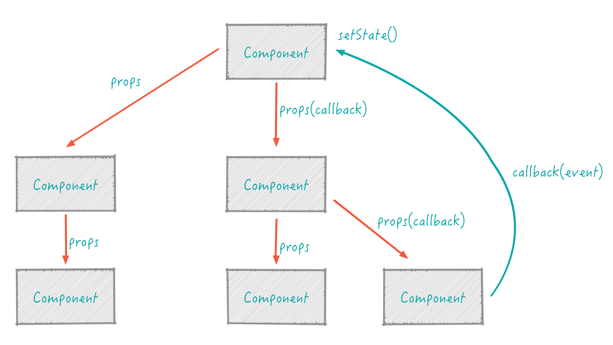
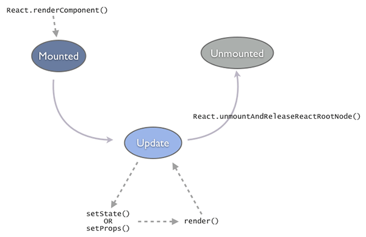
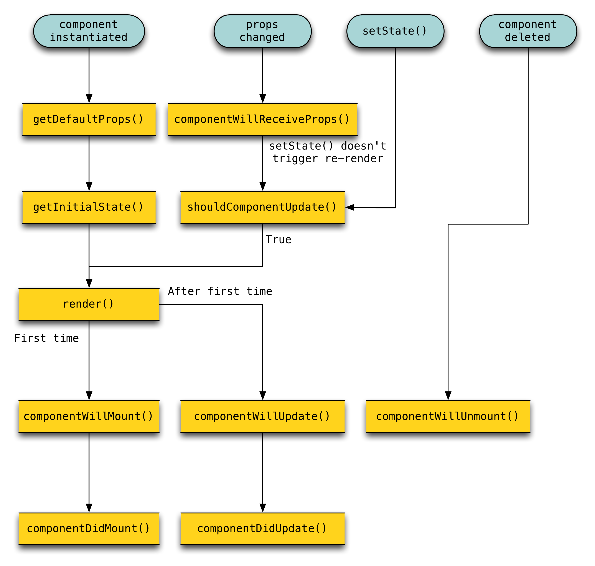

name: pic
layout: true
class: center, middle
background-size: contain

---
name: fragment
layout: true
class: center, top

.title[{{name}}]

---
name: base
layout: true
class: center, middle

.title[{{name}}]


---
name: CS52 Today's Menu


* All the React
* All the Quizzes
* Projects

.medium[]

???
* heading into week 4! so intense

---
name: Random Sampling of Quizzicals

* [moose](https://dartmouth-cs52-17s.github.io/lab2-watermandrew/)
* [goat](https://dartmouth-cs52-17s.github.io/lab2-randaline11/)
* [pokemon](https://dartmouth-cs52-17s.github.io/lab2-TPeterW/q1.html)
* [cat](https://dartmouth-cs52-17s.github.io/lab2-emilyJLin95/)
* [dog](https://dartmouth-cs52-17s.github.io/lab2-KevinFarmer/)
* [psychoanalyze](https://dartmouth-cs52-17s.github.io/lab2-annieke/)
* [swearer](https://dartmouth-cs52-17s.github.io/lab2-allisonchuang/)
* [gelato](https://dartmouth-cs52-17s.github.io/lab2-zchr/)
* [90's gadget](https://dartmouth-cs52-17s.github.io/lab2-ArminMahban/)
* [friend](https://dartmouth-cs52-17s.github.io/lab2-yeonjaepark/)
* [composer](https://dartmouth-cs52-17s.github.io/lab2-arinehouse/)
* [yeezy](http://yeezyyeezyyeezy.me/h2)


---
name: More React

```html
<div className="red">let's talk SA4 and React!</div>
```
```js
React.createElement("div", { className: "red" },
  "let's talk SA4 and React!"
);
```

.tiny[]


???
* confused is good, we're going to go over everything
* this can be react - well jsx
* who's confused about JSX?
* javascript XML
* Today F8 started, react 16 may be announced soon
  * facebook dev tools


---
name:

.medium[]

???
* now that you are all jquery masters
* react simplifies things
* we'll build like 5 react apps in the coming weeks so don't worry if its all a bit confusing
* state isn't hidden in many components requiring you to read state and then change stuff


---
name: Data Binding


 * establishes a connection between the application UI and business logic
 * when data changes value the elements that are bound to the data reflect changes
 * most UI frameworks have some form of data binding

```html
<input type="text" value={username}>
```
↕️ ↕️ ↕️
```js
var username = '';
```

???
* concept evolved in more complex frameworks than jquery (angular say)
* idea was what if a UI display could be directly tied to the persistent value in your code
* if one changes so does the other
* at least two types


---
name: Nope

.medium_small[]


???


---
name: Two Way


???
* two way data binding
* data model changes so does view
* view changes so does data model
* ember and angular have 2-way data binding


---
name: One Way


???
* driven by state
* an event updates the state


---
name: Bindings

.medium_small[]


???
* here's another view of this
* critical difference is that with two-way - there is no explicit event, it just updates the value
* boom value is different, did you happen to notice? no? ok bye.
* theoretically you could code the 'watchers' to trigger events, but it does add complexity
* since each variable that is bound is independent, then have to manually remember to update dependent stuff if necessary


---
name:


???

* from https://docs.google.com/presentation/d/1afMLTCpRxhJpurQ97VBHCZkLbR1TEsRnd3yyxuSQ5YY/edit#slide=id.g380053cce_125
* here' we'll illustrate another difference between the react way and others


---
name:


???


---
name:


???


---
name:


???


---
name:


???
* this is all to say that 2 way data binding
* is like globals and sideffects. shit can get messed up
* so drink the koolaid that is react and know that the river of data is clean


---
name: Some React Postulates

1. Managing state is treacherous
1. Two-way bindings are evil
1. Data mutations can be tricky


???
* state:
  * what radio button was clicked
  * what is being displayed etc
* transparency: effects of a code change should be limited/local
  * or at least easy to reason about
  * Also a useful concept regarding state change
  * Two-way bindings open Pandora’s box:
    * No easy way of knowing how far-reaching a change in the reverse direction is going to be
* mutable state and sideeffects are not transparent
* hard to test
* what if you needed to compute somethings or validate something on that data


---
name:


???
* reacts solution - all state changes go through setState


---
name:


???


---
name: React Drawbacks

* NONE
  * long props chains
  * component separation
  * input fields a little annoying

???
* but we'll fix most of this next week with Redux
* the answer to state management everywhere
* more and more framework are adopting the state first reactive approach


---
name: Thinking In React

1. Start with a mock
???
1. mock: features + data
--
name: Thinking In React
1. Break the UI into a component hierarchy
???
1. components: single responsibility
--
name: Thinking In React
1. Build a static version in React
???
1. static version: render methods with data (props, no state)
--
name: Thinking In React
1. Identify the minimal (but complete) representation of UI state
???
1. state:  minimal set of mutable state that your app needs
--
name: Thinking In React
1. Identify where your state should live: renders by state,  common owner / or create one
???
1. which component mutates/owns the state
--
name: Thinking In React
1. Add inverse data flow
???
1. Add inverse data flow: explicit events for changing state
--
name: Thinking In React
1. Style it
--
name: Thinking In React
1. Ship it
???
1. profit


---
name:

.medium[]


???
* based on state and props
* composable (nestable)
* reusable (cause props)
* unidirectional (rerenders everything in component)
* think reusable: generic input bar vs youtube searchbar


---
name:

.medium[]


???
* lets talk components
* searchbar is smart because its driven, doesn't have to be but better when it is


---
name: local state


???
* based on state and props
* composable (nestable)
* reusable (cause props)
* unidirectional (rerenders everything in component)


---
name: parent state




???
* based on state and props
* composable (nestable)
* reusable (cause props)
* unidirectional (rerenders everything in component)


---
name: Props

.medium[]


???
* props
  * are passed in
  * defined on initialization
  * immutable inside component
* state
  * internal to component
  * modified only through setState
  * where modified is really set to new state
  * we'll see later why this is important


---
name:

```javascript
const SmallComponent = (props) => {
  return (
    <li onClick={props.onClick}>
      <div>{props.person.display_name}</div>
    </li>
  );
};
```

```javascript
const ParentComponent = (props) => {
  const handleClick = () => {console.log('clicked')}

  const list = props.people.map( person => {
    return <SmallComponent person={person} onClick={handleClick}/>
  });

  return <ul> {list} </ul>;
};
```


???
* props are passed in
* defined on initialization
* immutable
* can be callbacks
* both of these are "dumb" components


---
name: component lifecycle

.medium[]


???

* *from: http://code.tutsplus.com/tutorials/intro-to-the-react-framework--net-35660*


---
name: State

```javascript
//initialize State
this.state = {video: null}
```

```javascript
//set new state once video fetched
this.setState({video: new_video});
```

```javascript
render() {
  if (!this.state.video) { return <div>loading</div>; }

  return (
    <div>this.state.video.name</div>
  );
}
```


???
* react state is internal to component
* should be modified only through setState
* where modified is really set to new state
* we'll see later why this is important
* but generally if you modify it otherwise react won't know about it and won't update


---
name: expanded component lifecycle


.medium[]


???
* you'll find this helpful later i promise


---
name: dumb component

<p data-height="400" data-theme-id="24117" data-slug-hash="2a117cd9e89d119ff929e921eb280df1" data-default-tab="js,result" data-user="timofei" data-embed-version="2" data-editable="true" class="codepen">See the Pen <a href="http://codepen.io/timofei/pen/2a117cd9e89d119ff929e921eb280df1/">dumb component</a> by Tim Tregubov (<a href="http://codepen.io/timofei">@timofei</a>) on <a href="http://codepen.io">CodePen</a>.</p>


???
* also called functional
* just a function, takes props, spits back JSX


---
name: smart component

<p data-height="400" data-theme-id="24117" data-slug-hash="9cdfb283082fadae6152944f1f3ac506" data-default-tab="js,result" data-user="timofei" data-embed-version="2" data-editable="true" class="codepen">See the Pen <a href="http://codepen.io/timofei/pen/9cdfb283082fadae6152944f1f3ac506/">9cdfb283082fadae6152944f1f3ac506</a> by Tim Tregubov (<a href="http://codepen.io/timofei">@timofei</a>) on <a href="http://codepen.io">CodePen</a>.</p>

???
* es6 class based (doesn't have to be but better this way)
* knows state
* note, no poking of the DOM at all
* no selectors, no getlementbyanything, no setting html or css
* just state changes
* and outputs


---
name: tiny todo

<p data-height="400" data-theme-id="24117" data-slug-hash="4940f261bfe4feb77de31981597c4201" data-default-tab="js,result" data-user="timofei" data-embed-version="2" data-editable="true" class="codepen">See the Pen <a href="http://codepen.io/timofei/pen/4940f261bfe4feb77de31981597c4201/">mini todo</a> by Tim Tregubov (<a href="http://codepen.io/timofei">@timofei</a>) on <a href="http://codepen.io">CodePen</a>.</p>


???
* putting it all together
