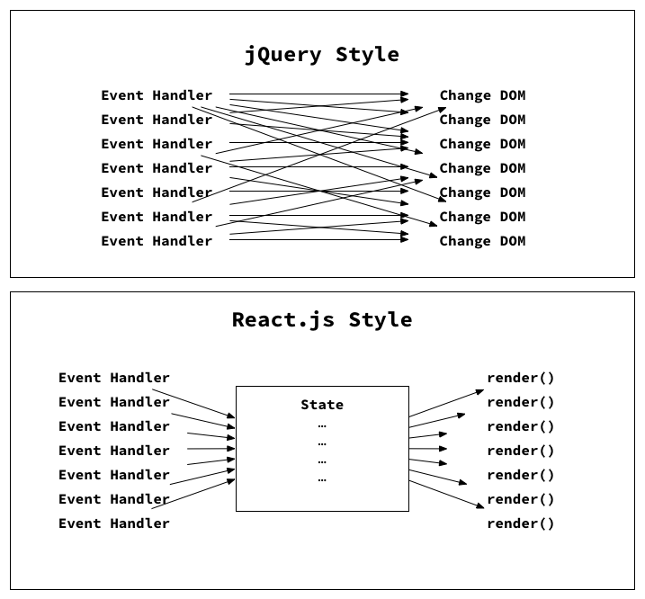
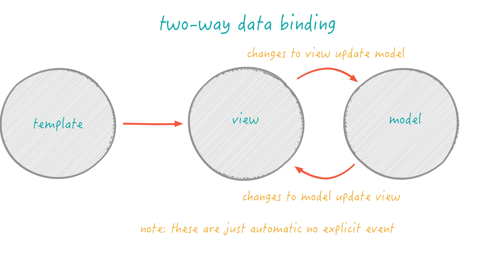
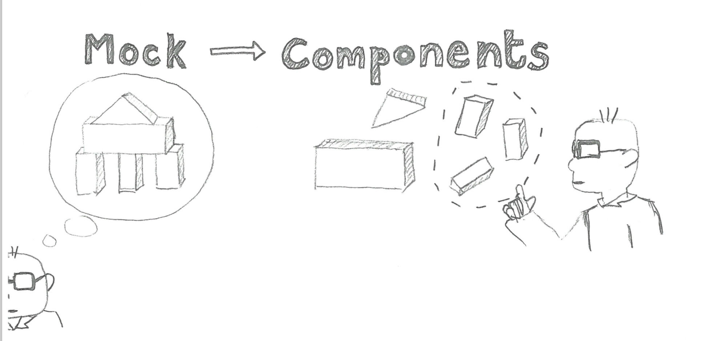
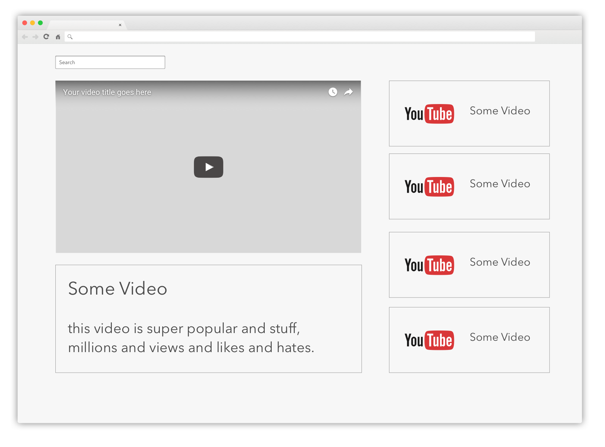
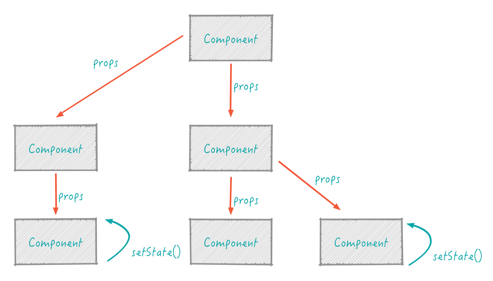
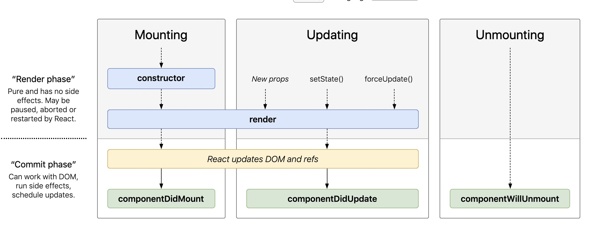
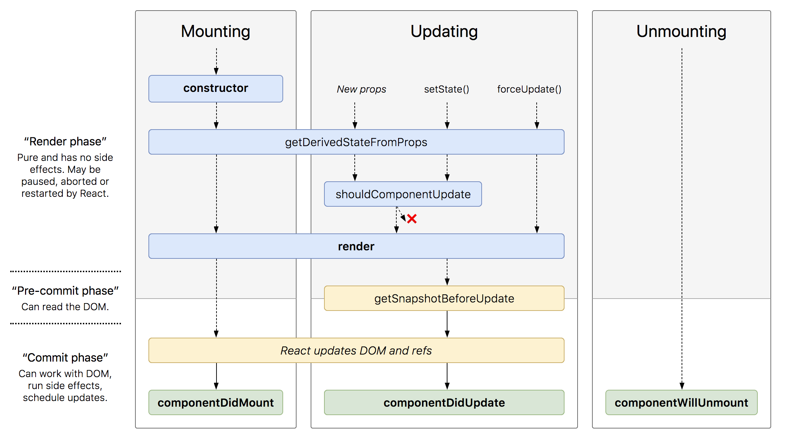

name: pic
layout: true
class: center, middle
background-size: contain

---
name: fragment
layout: true
class: center, top

.title[{{name}}]

---
name: base
layout: true
class: center, middle

.title[{{name}}]


---
name: CS52 Today's Menu


* All the React


.medium[]

* tomorrow weds x-hour is workshop

???
* heading into week 4 yaaay
* questioons commments concerns?
* workshop attendance taken


---
name: Sharing is Caring

* [got](https://dartmouth-cs52-19s.github.io/lab2-prosper007/)
* [hip css](https://dartmouth-cs52-19s.github.io/lab2-baileyburke/)
* [which rose](https://dartmouth-cs52-19s.github.io/lab2-saburack/)
* [vine and scroll](https://dartmouth-cs52-19s.github.io/lab2-tmonfre/)
* [progress bar](https://dartmouth-cs52-19s.github.io/lab2-ziruihao/)
* [kaf order](https://dartmouth-cs52-19s.github.io/lab2-zacgottschall/)
* [language?](https://dartmouth-cs52-19s.github.io/lab2-SyedHTanveer/)
* [dart dorm](https://dartmouth-cs52-19s.github.io/lab2-faustino99/)
* [motorcycle](https://dartmouth-cs52-19s.github.io/lab2-overlake333/)
* [how generic](https://dartmouth-cs52-19s.github.io/lab2-dhungjookim/)
* [sitcom picker](https://dartmouth-cs52-19s.github.io/lab2-emmalangfitt/)
* [autoscroll](https://dartmouth-cs52-19s.github.io/lab2-CharlotteChui/)
* [blinding](https://dartmouth-cs52-19s.github.io/lab2-gracedorgan/)
* [beautiful color math](https://dartmouth-cs52-19s.github.io/lab2-regina-yan/)


???


---
name: Table Questions


.medium[]


???
* questions comments concerns?
* we're finishing grading labs and shorts tnight so those will be out


---
name: React.js


.medium[]

.medium[]

???
* wait backup - we're still in frontend mode
* course description said: how to make powerful - extensible - modern web apps
* used by everyone
* made by facebook
* large open source community


---
name: why react?


.medium[]


* https://insights.stackoverflow.com/survey/2018/


---
name: why react?


.medium[]


* https://stateofjs.com/


---
name: React Onwards and Upwards

.small[]


* `fn(data) = View`
* UI is a function of your state
* props are to components what arguments are to functions


???
* why revolutionary?
* view as a pure function of data
* we'll be talking a lot about component this component that
* everything is a component in react
* each node in virtual DOM is component
* trees on trees on trees


---
name: Questions about JSX? 

```html
<div className="red">let's talk SA4 and React!</div>
```
```js
React.createElement("div", { className: "red" },
  "let's talk SA4 and React!"
);
```

.tiny[]


???
* confused is good, we're going to go over everything
* this can be react - well jsx
* who's confused about JSX?
* javascript XML
* syntax for defining views in render


---
name: JSX

```js
const aDivElement = <div className="foo" />hi</div>;
//or
React.createElement("div", { className: "foo" }, "hi");

const aComponent = <MyComponent someProperty={true} />;
//or
React.createElement(MyComponent, { someProperty: true });

```

* JSX is html-like syntax for defining react tree nodes
* instantiate your components for fun and profit!


???
* react components rendering is defined in JSX
* what enables us to use this nice syntax?  babel


---
name:

.medium[]

???
* now that you are all jquery masters
* with jquery you can change stuff on the page but your code logic doesn't necessarily know anything about it
* lab2 vs lab3
* react simplifies things
* we'll build like 5 react apps in the coming weeks so don't worry if its all a bit confusing
* rather than looking up and poking, is more clearly state driven
* change state -> render, repeat
* *not a render loop btw* - only on state change


---
name: Data Binding


 * connection between application UI and business logic
 * when data changes value the elements that are bound to the data reflect changes
 * most UI frameworks have some form of data binding

```html
<input type="text" value={username}>
```
↕️ ↕️ ↕️
```js
var username = '';
```

???
* concept evolved in more complex frameworks than jquery (angular say)
* you have some data - and you have some display - how to make it easier to work together
* idea was what if a UI display could be directly tied to the persistent value in your code
* if one changes so does the other
* **what might be the problem here?**
  * what if when the username changed you wanted to do something like check it on the server? 


---
name: Two Way




???
* two way data binding
* data model changes so does view
* view changes so does data model
* ember and angular have 2-way data binding


---
name: One Way


???
* driven by state
* an event updates the state
* not automatic
* seems similar except there is a function that is explicitly executed


---
name: Nope

.medium_small[]


???
* ok maybe not
* did you know he lives 20 minutes from here in vt?


---
name: Bindings

.medium_small[]


???
* here's another view of this
* critical difference is that with two-way - there is no explicit event, it just updates the value, you don't know how the watchers work
* boom value is different, did you happen to notice? no? ok bye.
* theoretically you could code the 'watchers' to trigger events, but most frameworks don't do that 
* **biggest issues is** that since each variable that is bound is independent, then have to manually remember to update dependent stuff if necessary


---
name:


???

* from https://docs.google.com/presentation/d/1afMLTCpRxhJpurQ97VBHCZkLbR1TEsRnd3yyxuSQ5YY/edit#slide=id.g380053cce_125
* here' we'll illustrate another difference between the react way and others


---
name:


???


---
name:


???


---
name:


???


---
name:


???
* this is all to say that 2 way data binding
* is like globals and sideffects. shit can get messed up


---
name: Some React Postulates

1. Managing state is treacherous
1. Two-way bindings are evil
1. Data mutations can be tricky

???
* state:
  * what button was clicked
  * what is being displayed etc
* transparency: effects of a value change should be limited/local
  * or at least **easy to reason about**
  * Also a useful concept regarding state change
  * Two-way bindings open Pandora’s box:
    * No easy way of knowing how far-reaching a change in the reverse direction is going to be
* **mutable state and sideeffects are not transparent**
* hard to test
* what if you needed to compute somethings or validate something on that data


---
name:


???
* react's solution - all state changes are events
* you run setState and it only affects shit downriver


---
name:


???
* so drink the koolaid that is react and know that the river of data is clean


---
name: Thinking In React

.medium[]

1. Start with a mock
???
1. mock: features + data
--
name: Thinking In React
1. Break the UI into a component hierarchy
???
1. components: single responsibility
--
name: Thinking In React
1. Build a static version in React
???
1. static version: render methods with data (props, no state)
--
name: Thinking In React
1. Identify the minimal (but complete) representation of UI state
???
1. state:  minimal set of mutable state that your app needs
--
name: Thinking In React
1. Identify where your state should live: renders by state,  common owner / or create one
???
1. which component mutates/owns the state
--
name: Thinking In React
1. Add inverse data flow
???
1. Add inverse data flow: explicit events for changing state
--
name: Thinking In React
1. Style it
--
name: Thinking In React
1. Ship it
???
1. profit


---
name:

.medium[]


???
* sa4 yay
* components are:
   * composable (nestable)
   * reusable (cause props)
* unidirectional (rerenders everything in component)
* hint: think reusable: generic input bar vs youtube searchbar


---
name:

.medium[]


???
* lets talk components
* searchbar is smart because its driven, doesn't have to be but better when it is
* data flows down
* events are passed up


---
name: local state


.medium[]

???
* state internal to a component
* can be passed down to children as props


---
name: local state




???
* we also had state somewhere else in sa4?
* yeah top level app component


---
name: props


.medium[]

???
* pass an event up to change state in parent

---
name: parent state


???
* create function that runs setState in parent smart container
* pass function down to children who can run it


---
name: state summary


.medium[]


???
* props
  * properties or function arguments if you prefer
  * are passed in
  * defined on initialization
  * read-only inside component
* state
  * internal to component
  * modified only through setState
  * where modified is really set to new state
  * we'll see later why this is important


---
name:

```javascript
const SmallComponent = (props) => {
  return (
    <li onClick={props.onClick}>
      <div>{props.person.display_name}</div>
    </li>
  );
};
```

```javascript
class ParentComponent extends Component {
  handleClick = () => {console.log('clicked')}

  const list = this.props.people.map( person => {
    return <SmallComponent person={person} onClick={this.handleClick}/>
  });

  render() {
    return <ul> {list} </ul>;
  }
};
```


???
* note the class property arrow function - automatically bound
* simplified example, why is parentComponent a bad example?
* doesnt' do anything useful with click event
* should run setState
* lot of good stuff going on here
* **where does people come from?**


---
name: component lifecycle

.large[]


???

* *from: https://medium.com/@nancydo7/understanding-react-16-4-component-lifecycle-methods-e376710e5157*
* http://projects.wojtekmaj.pl/react-lifecycle-methods-diagram/


---
name: React Drawbacks

* NONE
  * long props chains
  * component separation
  * input fields a little annoying

???
* but we'll fix most of this next week with Redux
* the answer to state management everywhere
* more and more framework are adopting the state first reactive approach


---
name: State Details

```javascript
//initialize State
this.state = {video: null}
```

```javascript
//set new state once video fetched
this.setState({video: new_video});
```

```javascript
render() {
  if (!this.state.video) { return <div>loading</div>; }

  return (
    <div>this.state.video.name</div>
  );
}
```


???
* react state is internal to component
* should be modified only through setState
* where modified is really set to new state
* we'll see later why this is important
* but generally if you modify directly react won't know about it and won't update
* also note the flow here - first time component is rendered... video key is null!


---
name: Functional setState "one step behind"

```javascript
//initialize State
this.state = {counter: 0}
```

```javascript
this.setState({count: this.state.count+1});
console.log(this.state.count) // 0
this.setState({count: this.state.count+1});
// batch update merging objects
// then end result is 1

```

```javascript
this.setState(prevState => ({count: count+1}));
console.log(this.state.count) //0
this.setState(prevState => ({count: count+1}));
// batch update queues function calls in order
// end result is 2
```


???
* setstate as asynchronous - we'll do lots more with asynch of thurs
* you may run into issues like this, you try to use the state right after setting it to a new thing - but it'll be one step behind


---
name: expanded component lifecycle


.medium[]


???

* *from: https://medium.com/@nancydo7/understanding-react-16-4-component-lifecycle-methods-e376710e5157*
* forceUpdate bad
* shouldComponentUpdate rarely used
* snapshot can read the dom for instance to get scroll position if you need it
* getDerivedState includes prevState and nextProps in case, you won't need this generally unless you are doing something bad
* don't shadow state <- props


---
name: Do Not Shadow

```javascript
const Parent = (props) => {
  return (
    <BadShadow unread={props.realUnreadCount} />
  );
};
```

```javascript
class BadShadow extends Component {
  constructor(props) {
    this.state.unread = props.unread;
  }

  handleClick = () => {this.setState(prevState=>({unread: prevState.unread-1});}

  render() {
    <div>
      <div>`unread: ${this.state.unread}`</div>
      <div onClick={this.handleClick}> message </div>
    </div>
  }
};
```


???
* what could go dreadfully wrong here?
* silly example but see it a lot


---
name: dumb component

<p data-height="400" data-theme-id="24117" data-slug-hash="2a117cd9e89d119ff929e921eb280df1" data-default-tab="js,result" data-user="timofei" data-embed-version="2" data-editable="true" class="codepen">See the Pen <a href="http://codepen.io/timofei/pen/2a117cd9e89d119ff929e921eb280df1/">dumb component</a> by Tim Tregubov (<a href="http://codepen.io/timofei">@timofei</a>) on <a href="http://codepen.io">CodePen</a>.</p>


???
* also called functional
* just a function, takes props, spits back JSX


---
name: smart component

<p data-height="400" data-theme-id="24117" data-slug-hash="9cdfb283082fadae6152944f1f3ac506" data-default-tab="js,result" data-user="timofei" data-embed-version="2" data-editable="true" class="codepen">See the Pen <a href="http://codepen.io/timofei/pen/9cdfb283082fadae6152944f1f3ac506/">9cdfb283082fadae6152944f1f3ac506</a> by Tim Tregubov (<a href="http://codepen.io/timofei">@timofei</a>) on <a href="http://codepen.io">CodePen</a>.</p>

???
* es6 class based (doesn't have to be but better this way)
* knows state
* note, no poking of the DOM at all
* no selectors, no getlementbyanything, no setting html or css
* just state changes
* and outputs


---
name: tiny todo

<p data-height="400" data-theme-id="24117" data-slug-hash="4940f261bfe4feb77de31981597c4201" data-default-tab="js,result" data-user="timofei" data-embed-version="2" data-editable="true" class="codepen">See the Pen <a href="http://codepen.io/timofei/pen/4940f261bfe4feb77de31981597c4201/">mini todo</a> by Tim Tregubov (<a href="http://codepen.io/timofei">@timofei</a>) on <a href="http://codepen.io">CodePen</a>.</p>


???
* putting it all together


---
name: Lab3 

.medium_small[]
* out today - due night Monday 22nd
* part 2 is uses firebase which we'll go over thurs

???
* putting it all together


