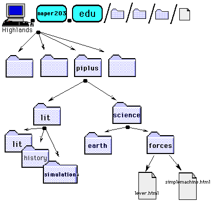
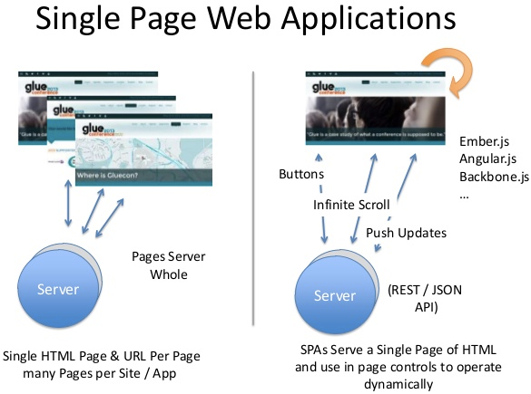
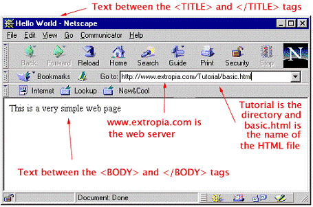
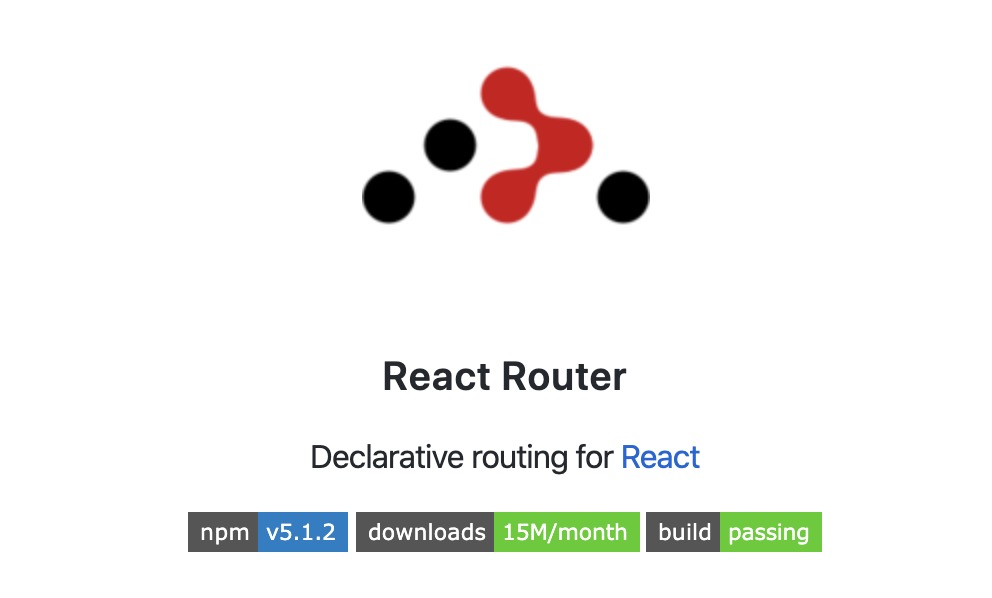

layout: true
class: center, middle
name: pic
background-size: contain

---

layout: true
class: center, top
name: fragment

.title[{{name}}]

---
layout: true
class: center, middle
name: base

.title[{{name}}]


---
name: CS52 Today


* routing
* projects

.medium[]


???
* how's lab?
* js stuff?
* firebase module?


---
name: CS52 Art


.medium[]


???
* from last year, no drawings like this this year
* hopefully JS is starting to make a little bit of sense
* anything we should go over?
* lab3 coming along, sounds like a lot of you have started it


<!-- name: React Notes

* [create modal](http://dartmouthnotes.surge.sh/)
* [multiple boards](http://kevinhu-cs52-notes.surge.sh/)
* [note resizing](http://christina-cs52-notes.surge.sh/)
* [class](http://moyo-cs52-lab3.surge.sh/)
* [auth and permissions](http://waddupboard.surge.sh/)
* [integrated api](http://raul-cs52-lab3.surge.sh/)
* [more auth](http://noted.surge.sh/)
* [tag search](http://morgansorbaro-cs52-lab3.surge.sh/)
* [nickname + editing](http://morgansorbaro-cs52-lab3.surge.sh/)
* [style](http://emmakennelly-cs52-lab3.surge.sh/)
* [gif content award](http://abenezer-cs52-postit.surge.sh/)
* [transparency](http://colecorrente-cs52-react-notes.surge.sh/)
* [scrolling board](http://thomaskim-cs52-notes.surge.sh/)
* [github auth and zindex](http://ted-react-notes.surge.sh/)
* [colors](http://benjihannam-cs52-lab3.surge.sh/)

* some examples
* will try to speed up our grading to get you feedback quicker 
-->


---
name: Announcements

<!-- .small[] -->

* Project Pitching Next Week!
* coming up: SA5: Routing (super extra short)

???
* we should start talking about final project ideas!
* there will be another short for redux going out soon.
* these are all super short just to get your starterpacks up and ready


<!-- name: Quiz

.large[] 


 -->


---
name: Routing Frontend

`http://yummyserver.com/food/id/#/section?id=23j32j3j`

.medium_small[]

* the UX of routes


???
* originally - routes were just file resources in folders
* what if you want to **pass some state via the url**
* or **have a url that is meaningful** to the user to help indicate where they are
* who keeps track of all that junk
* tracking where a link was clicked and who shared it for instance
* what news article to show
* https://ed.fnal.gov/lincon/tech_web_links_types.shtml
* https://www.slideshare.net/rfreebern/the-ux-of-urls


---
name: The UX of Routes

> people spent 25% of their time looking at the URL in navigational tasks vs 22% in informational tasks --E. Cutrell, et al 2007


> searchers are particularly interested in the URL when they are assessing the credibility of a destination --J Nielssen, 2007

* the [UX of routes](https://www.slideshare.net/rfreebern/the-ux-of-urls)


???
* you judge a site by its urls


---
name: SPA problem?


.medium[]

* app in browser
* routes?  serverside vs clientside

???
* remember single page apps?
* lives in the browser  - javascript application basically
* what are some pros/cons:
  * serverside cons: page reloads, background flash, slow
  * serverside pros: no js needed, directory structure?
  * clientside cons: not sure how it would work not builtin, js needed
  * clientside pros: fast, no page reload, only fetching data needed


---
name:


.medium[]


???
* http://www.slideshare.net/3scale/the-api-and-appification-of-the-web
* https://eager.io/blog/the-history-of-the-url-path-fragment-query-auth/?h


---
name: clean urls?

.medium[]

???
* remember parts of the url again
* if we had to choose between path, query and fragment for making a url that looks nice which?


---
name: enter frontend routing

`http://cs52-notes.cool/boardid`


* `/posts/super_interesting_post`
* app needs to know about this

???
* lets call this thing a route
* now our javascript app needs to know about this
* remember what we have currently been building are basically fully js apps


---
name: Basic Browser

.small[]

* maintains a history of URLs visited
  * back
  * forward
* loads/reloads page on navigation/submission
  * killing js

???
* stepping back a sec to basic browser functionality
* default browser actions
* loading pages/resources from scratch
* cookies we'll dive into later


---
name: reloads on


.small[]

* loading/reloading triggered by:
    * location bar typing
    * forward/back buttons
    * page refresh operation
    * javascript assignments to `window.location`
    * form submission

???
* BUT what we want is to change url *without* refresh


---
name: Attempt 1: Hash History

* http://example.com
* http://example.com#fragment

* http://example.com?id=3535
* http://example.com?id=3535#fragment


???
* can already change fragments without reload
* some early frontend frameworks only used hash history


---
name: Navigation Away -> loss of state

```javascript

window.onbeforeunload = function(e) {
  alert('are you sure you want to leave this page?');
}

```

???
* another reason why we want this
* the problem of loss of state on navigation away from page


---
name: desired behavior

* all that we want:
  * browser page history
  * navigate with forward and back buttons
  * navigate away and come back to the app
  * bookmark a place in the app
  * copy the URL and share it
  * refresh reloads to same place

???
* dont' want loss of state on navigation away from page
* urls that are meaningful to allow bookmarking etc


---
name: that would be perfect, thanks

<iframe src="//giphy.com/embed/p5yJjfLjyNjy0" width="580" height="370" frameBorder="0" class="giphy-embed" allowFullScreen></iframe>

???
* owls are so cool


---
name: Deep Linking

`https://www.amazon.com/Building-Isomorphic-JavaScript-Apps-Implementation/dp/1491932937/ref=sr_1_5?ie=UTF8&qid=1493142393&sr=8-5&keywords=react`

* state in urls:
  * how much state/ui context to encode?
  * url sharing is standard
* share buttons to generate special urls

???
* how much of app state to include
* state/ui context meaning if in app, do you have menus open? editing some field?
* probably not everthing
* notice amazon links have a lot of stuff encoded in them
* these days on mobile you can deep link into an application not just web


---
name: App Init from URL

* **ugly url: http://www.example.org/?show=posts?id=s987s9d&type=today&user=320s9s8**

* **clean url: http://www.example.org/posts/07-22-16**

???
* clean urls better!
* maybe less encoded but user shouldn't be in the url!


---
name: HTML5 History API

```javascript

history.forward();
history.back();

history.pushState([data], [title], [url]);

// and others
```

http://html5demos.com/history

???
* allow JS access to history
* change url with history without! reloading page
* mostly supported these days
* http://diveintohtml5.info/history.html


---
name:


.medium[]

[https://reacttraining.com/react-router](https://reacttraining.com/react-router)

???
* react wraps all that js-dom history stuff
* and allows us to define routes more easily!


---
name:


"React Router keeps your UI in sync with the URL."

* reusable layout
* url routes
* nested routes
* matching
* declarative jsx
* composable (new)

???
* simply put, keeps ui logic matching the url
* reusable layout


---
name:


*(from [css-tricks](https://css-tricks.com/learning-react-router/))*

???
* here's a common layout with some components


---
name:


http://somedomain.com/users


???
* nav
* sidebar
* and some inner components


---
name:


http://somedomain.com/widgets


???
* and maybe we can search users, or widgets


---
name:


http://somedomain.com/other


???
* or even replace the search with some other view


---
name: Manual Labor

```javascript
renderInner() {
  if (this.state.showUsers) {
  // or if(window.location.search.indexOf("users") > -1))
    return <ShowUsers />;
  } else {
    return <ShowWidgets />;
  }
}

render() {
  <div id="main">
    <Nav />
    {renderInner()}
    <Footer />
  </div>
}
```

???
* given our current state of information
* we might do something like this no?
* but what if we wanted to have multiple layouts?
* and especially if we wanted to change this based on url?
* could just read the url in - and use that as a bit of state?
* but lots of checking


---
name: React Router

```html
<Nav />
<Switch>
  <Route exact path="/" component={Home}>
  <Route path='/users' component={Users} />
  <Route path='/widgets' component={Widgets} />
</Switch>
<Footer />
```


???
* more declarative
* connected to urls
* just same old JSX notation!
* yeah - you feel *that* comfortable with jsx!
* what is cool about this? where are these components coming from?


---
name: Defining


```html
<Route exact path='/' component={Home} />
<Route path='/users' component={Users} />
```

???
* basic route definition
* component and path -
* match can be exact or substring
* pattern matching happens in order listed - is why we needed to say the first is exact
* what might happen if we left that off?


---
name: Nesting


```html
const Users = (props) => (
  <div>
    <Route path={`${props.match.url}/:userid`} component={User}/>
    <Route exact path={props.match.url} render={() => (
      <h1>search by name</h1>
    )} />
  </div>
)
<Route path="/users" component={Users} />
```

`props.match`


???
* can nest components
* props.match is cool
* can extract url for instance
* but also parameters
* crazy stuff


---
name: react components can be parents

```html
// App

render() {
  <MainLayout>
    {(this.state.isLoggedIn) ? <Profile /> : <Login /> }
  </MainLayout>
}
```

```html
// MainLayout
render() {
  <div>
    <nav />
    {this.props.children}
    <footer />
  </div>
}
```


???
* your components too can have children! tanget
* all there is to it. this.props.children will contain all the componets that are nested.
* Route components do something similar in that they wrap a component and add some functionality - higher order component
* you can do this with other components also if you want to add functionality for instance


---
name: FallBack Route

```html
<Nav />
<Switch>
  <Route exact path="/" component={Home}>
  <Route path='/users' component={Users} />
  <Route path='/widgets' component={Widgets} />
  <Route component={FallBack} />
</Switch>
<Footer />
```

???
* can define a route that matches if all other routes fail


---
name: Linking and Pushing

```html
<ul>
  <li><Link exact to="/">Home</Link></li>
  <li><NavLink to="/users">Users</NavLink></li>
  <li><NavLink to="/widgets">Widgets</NavLink></li>
</ul>

{/* do this instead of <a href="/">! */}
```

```javascript
handleClick() {
  this.props.history.push('/some/path');
}
// must use: export default withRouter(MyComponent)
```

???
* use Link or NavLink to avoid reloads and use router
* need to use withRouter to have props.history available in a component
* NavLink will add an 'active' class to current match


---
name: Route matching and Params

```html
// :paramName pattern matches and extracts into props.match.params.paramName

<Route path="users/:userId" component={UserProfile} />

```

```javascript
//UserProfile
const url = `https://api.com/users/${props.match.params.userId}`;

fetch(url, { method: 'get'})
  .then(function(profile) {
    this.setState({user: profile})
  })
```

???
* available in props.match.params
* pretty common, posts, users, etc
* we'll use this for next hw
* but can use for multiple boards for instance


---
name: 404!

* but we have a problem, these aren't real files!

.medium[]


???
* no requests being made to the server except first app load
* BUT if first load is to specific resource...


---
name: 404!

```bash
my-project.surge.sh/
  ├─200.html
  ├─index.html
  └─main.js
```

```html
<!-- 200.html -->
<script src="app.js"></script>
```

* serve needs to return index.html for all server side routes
* surge:  `200.html`
* can't do this on gh-pages... sadly

???
* will cover more on this later


---
name:

* [animating urls?!?](http://matthewrayfield.com/articles/animating-urls-with-javascript-and-emojis)

* [let's talk final projects](/assignments/project/#1)

