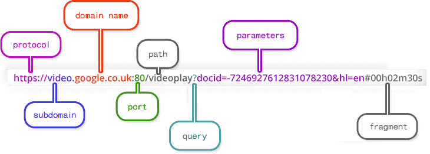

layout: true
class: center, middle
name: pic
background-size: contain

---

layout: true
class: center, top
name: fragment

.title[{{name}}]

---
layout: true
class: center, middle
name: base

.title[{{name}}]

---
name: Routing

---


---
## Announcements

* HW3 Extension
  * p1 SAT
  * p2 TUE
  * much extra credit
* office hours in carson 6-9pm TNIGHT
* pitch signups, SUNDAY

???


---
## Routing Frontend

http://yummyserver.com/food/id/#/section?id=23j32j3j

<iframe src="//giphy.com/embed/ezIkH40d6sesw" width="380" height="438" frameBorder="0" class="giphy-embed" allowFullScreen></iframe>

???
* what the what, who keeps track of all that junk
* it crowd, no british comedy?


---

{: .medium .white-background}

* remember single page apps?
* app in browser
* routes?

???


---


{: .medium .white-background}


???
* http://www.slideshare.net/3scale/the-api-and-appification-of-the-web
* https://eager.io/blog/the-history-of-the-url-path-fragment-query-auth/?h


---
## urls

{: .medium .white-background .bordered}

???
* remember parts of the url again


---
## enter routes

* `/posts/super_interesting_post`
* app needs to know about this

???
* lets call this thing a route


---
## Basic Browser

* maintains a history of URLs visited
  * back
  * forward
* reloads page on navigation
  * killing js
  * cookies stay

???
* stepping back a sec to basic browser functionality
* default browser actions
* loading pages from scratch


---
## reloads on

* location bar typing
* forward/back buttons
* page refresh operation
* javascript assignments to `window.location`

???
* what we want is to change url without refresh


---
## Attempt 1: Hash History

* http://example.com
* http://example.com#fragment
* http://example.com?id=3535
* http://example.com?id=3535#fragment


???
* can already change fragments and query parameters wihtout reload
* some early frontend frameworks only used hash history


---
## Navigation Away

```javascript

window.onbeforeunload = function(e) {
  return 'are you sure you want to leave this page?';
}

```

???
* loss of state on navigation away from page


---
## desired behavior

* do the right thing:
  * browser page history
  * navigate with forward and back buttons
  * navigate away and come back to the app
  * bookmark a place in the app
  * copy the URL and share it
  * refresh reloads to same place

???
* loss of state on navigation away from page


---
## that would be perfect, thanks

<iframe src="//giphy.com/embed/p5yJjfLjyNjy0" width="480" height="270" frameBorder="0" class="giphy-embed" allowFullScreen></iframe>

???


---
## Deep Linking

* state in urls:
  * how much state/ui context to encode?
  * url sharing is standard
* share buttons to generate special urls

???
* how much of app state to include
* state/ui context meaning if in app, do you have menus open? editing some field?


---
## App Init from URL

* old ugly way: http://www.example.org/?show=posts?id=s987s9d&type=today&user=320s9s8
* new clean urls: http://www.example.org/posts/07-22-16

???
* clean urls better!


---
## HTML5 History API

```javascript

history.forward();
history.back();

history.pushState([data], [title], [url]);

// and others
```

http://html5demos.com/history

???
* allow JS access to history
* change url with history without reloading page
* mostly supported these days
* http://diveintohtml5.info/history.html


---

{: .hfill}

???
* panda time


---
{: .medium .white-background}

[https://github.com/reactjs/react-router](https://github.com/reactjs/react-router)

???
* react wraps all that js-dom history stuff
* and allows us to define routes more easily!


---

"React Router keeps your UI in sync with the URL."

* reusable layout
* url routes
* nested routes
* index route
* matching
* declarative jsx

???
* simply put
* reusable layout


---

{: .medium .white-background}

*(from [css-tricks](https://css-tricks.com/learning-react-router/))*

???


---
http://somedomain.com/users

{: .medium .white-background}


???


---
http://somedomain.com/widgets

{: .medium .white-background}


???


---
http://somedomain.com/other

{: .medium .white-background}


???


---
## Manual Labor

```javascript
renderInner() {
  if (this.state.showUsers) {
    return <ShowUsers />;
  } else {
    return <ShowWidgets />;
  }
}

render() {
  <div>
    <Nav />
      {renderInner()}
    <Footer />
  </div>
}
```

???
* we might do something like this no?
* but what if we wanted to have multiple layouts?
* and especially if we wanted to change this based on url?


---
## React Router

```html
<Router>
  <Route path="/" component={MainLayout}>
    <IndexRoute component={Home} />
    <Route component={SearchLayout}>
      <Route path='users' component={ShowUsers} />
      <Route path='widgets' component={ShowWidgets} />
    </Route>
  </Route>
</Router>
```


???
* more declarative
* connected to urls
* just same old JSX notation!


---
## Defining


```javascript

<Route path='/' component={Home} />
<Route path='users' component={Users} />

```

???
* basic route definition


---
## Nesting


```javascript

<Route component={MainLayout}>
  <Route component={SearchLayout}>
    <Route path='users' component={UserList} />
  </Route>
</Route>

// http://localhost:8080/users
```


???
* can nest components


---
## Nesting

* wait but like, where does it go?

???
* we're nesting these components but how does react know where to render then inside of the nested component?
* dark magic!!


---
## PROPS

* when you nest a component it goes into props!

```javascript
/// SearchLayout

render() {
  <div>
    <h1> search layout </h1>
    {this.props.children}
  </div>
}

```

???
* all there is to it. this.props.children will contain all the componets that are nested.
*


---
## Not just for Router

```javascript
// App

render() {
  <MainLayout>
    <Contents />
  </MainLayout>
}
```

```javascript
// MainLayout

render() {
  <div>
    <nav> {/*...*/ }</nav>
      {this.props.children}
    <footer> {/*...*/ }</footer>
  </div>
}
```


???


---
## IndexRoute

```html
<Route path="/" component={MainLayout}>

  <IndexRoute component={Home} />

  <Route component={SearchLayout}>
    <Route path='users' component={UserList} />
    <Route path='widgets' component={WidgetList} />
  </Route>
</Route>
```

* in case of `http://localhost:8080/`
  * matches `/`
  * does not match `/users` or `/widgets`

???
* Search layout not rendering in this case


---
## Linking and Pushing

```html
<ul>
  <li><Link to="/">Home</Link></li>
  <li><Link to="/users">Users</Link></li>
  <li><Link to="/widgets">Widgets</Link></li>
</ul>
```

```javascript
handleClick() {
  browserHistory.push('/some/path');
}
```

???
* use Link to to avoid reloads and use router
* use singleton browserHistory to  push urls from codes


---
## BrowserHistory vs HashHistory


```javascript
import { Router, browserHistory } from 'react-router';
import routes from './routes';


ReactDOM.render(
  <Router history={browserHistory} routes={routes} />
  , document.getElementById('main'));

```

???
* i recommend separating routes into their own file
* need to set browserHistory manually as default is dumb hashHistory


---
## Route matching

```html
<Route path="users/:userId" component={UserProfile} />
```

```javascript
//UserProfile
const url = `https://api.someapp.com/users/${this.props.params.userId}`;

fetch(url, { method: 'get'})
  .then(function(response) {
    this.setState({user: response})
  })
```

???
* available in props.params
* pretty common, posts, users, etc
* we'll use this for next hw
* but can use for multiple boards for instance


---
## 404!

* no requests being made to the server except first app load
* BUT if first load is to specific resource...
* serve needs to return index.html for all server side routes
* surge:  `200.html`

???
* will cover more on this later


---
## Deprecated methods

* React Router under heavy development
* stackoverlow has lots of outdated info

???


---

<p data-height="300" data-theme-id="24117" data-slug-hash="GqxdAw" data-default-tab="js,result" data-user="timofei" data-embed-version="2" data-editable="true" class="codepen">See the Pen <a href="http://codepen.io/timofei/pen/GqxdAw/">React-Router Demo</a> by Tim Tregubov (<a href="http://codepen.io/timofei">@timofei</a>) on <a href="http://codepen.io">CodePen</a>.</p>

???


---
## Question Time


<iframe src="//giphy.com/embed/jTZVegIrdLCCY" width="480" height="360" frameBorder="0" class="giphy-embed" allowFullScreen></iframe>

???


---
## Lets try it!

[http://cs52.me/workshops/routing](http://cs52.me/workshops/routing)

???


