layout: true
class: center, middle
name: pic
background-size: contain

---

layout: true
class: center, top
name: fragment

.title[{{name}}]

---
layout: true
class: center, middle
name: base

.title[{{name}}]

---
name: Redux


.medium[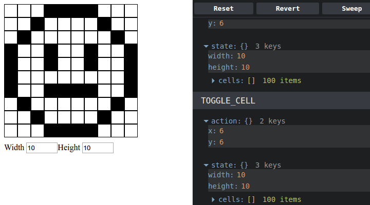]


---
name: React Notes


* <a href="https://chibuzo-cs52-notes.surge.sh/" target="_blank">[login,recycle, and more]</a>
* <a href="https://samihadatta-reactnotes.surge.sh/" target="_blank">[friends support friends]</a>
* <a href="https://cdnb.surge.sh" target="_blank">[some style]</a>
* <a href="https://srishti-cs52-notes.surge.sh" target="_blank">[hover control]</a>
* <a href="https://annebailey-noteboard.surge.sh" target="_blank">[more auth]</a>
* <a href="https://rodrigo-cs52-notes.surge.sh" target="_blank">[puppy]</a>
* <a href="https://jacksonharris-cs52-reactnotes.surge.sh" target="_blank">[bold]</a>
* <a href="http://alexfeng-cs52-notes.surge.sh" target="_blank">[skeumorphic]</a>
* <a href="https://selim-cs52-lab4-notes2keep.surge.sh" target="_blank">[materialui]</a>
* <a href="https://stickynotes.surge.sh" target="_blank">[content!-don't delete]</a>
* <a href="https://aarishiyer-cs52-reactnotes.surge.sh" target="_blank">[editing update]</a>
* <a href="https://tonymilne1-cs52-lab3.surge.sh" target="_blank">[bootstrap]</a>
* <a href="http://adityachoudhari-cs52-lab3-reactnotes.surge.sh" target="_blank">[login,undo,zindex]</a>
* <a href="https://josephnotis-cs52-reactnotes.surge.sh" target="_blank">[note colors]</a>
* <a href="https://tvergho-cs52-reactnotes.surge.sh" target="_blank">[new boards, undo]</a>
* <a href="https://leaflets.surge.sh/" target="_blank">[fall colors]</a>


???
* some examples
* i did pick ones that did EC in this case
* if you struggled, don't worry you aren't alone, this was a tough one lot of new stuff
* we're hard at work already going through and giving feedback so you'll learn by practicing - we'll keep pumping out more

---
name: What do we know about React so far?

--
name: What do we know about React so far?

* components
* unidirectional data flow
* events and callbacks
* state and props
* rendering jsx


???


---
name: Problems

.medium[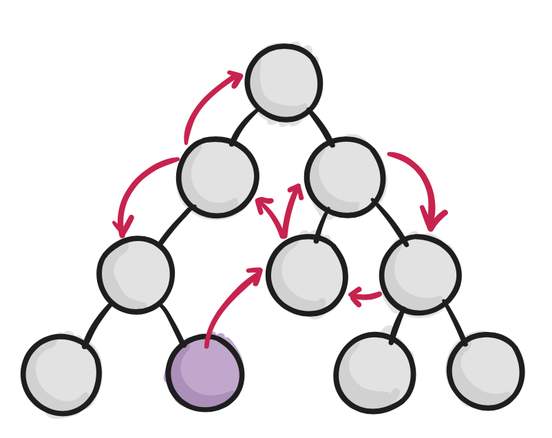]


???
* look familiar? we will fix it
* props all over the place, sometimes you rename them as you pass them down, super hard to track


---
name: Smart and Dumb components

.small[]


* smart components have state + props
* dumb components only props (function)

???
* dumb components can react too


---
name: Presentational and Container Components

* ***presentational component*** (may just be a function)
  * concerned with how things look
  * have state for ui things but not data
  * generally get data as props
  * real view
  * reusable (your mini bootstrap)
* ***container component*** (class with state)
  * concerned with data
  * pass data to presentational components
  * binds callbacks to self
  * and now can be *redux connected*

???
* so far we'd had both
* we've not really talked about this abstraction
* but will have a bit more of it soon with redux!
* btw, if you've played with react hooks we'll talk about them in a bit, but for now sticking with classes as they are easier to learn


---
name: Flux

<iframe width="640" height="360" src="https://www.youtube.com/embed/nYkdrAPrdcw?rel=0&amp;showinfo=0" frameborder="0" allowfullscreen></iframe>

???
* facebook's answer to scalability
* interesting worth watching


---
name: The beginning


???
* multiple parts of webpage that tracked messages in different ways
* had a messenger window but also unread count


---
name: questionable design


???
* bugs were insidious
* how do you handle both staying in synch - read in one meant mark as read in another
* had multiple data models responsible for each view
* updating one model would need to update another
  * unread thread count
  * unread messages
* had unread counts that were false positive


---
name: Chat

.medium[]


???
* increment unseen
* append message in chat
* if open append message in messages Views
* if chat tab is focused or messages is open - decrement unseen
* complex login living in multiple places
* imperative code with lots of steps with checks


---
name: Chat

.medium[]


???
* attempt 1:
  * problem kept coming back as they fixed things due to complexity
  * here's what the basic logic looked like
  * handler had too much to do
  * large amount of centralized logic is one solution but have to code for consistency problems
  * chat tabs is easy - get a new message - append it
  * less clear about unseen count logic
* realizations:
  * **perhaps storing unseen as a list by threadID would be better**
  * use **explicit data** - actual unseen threads, not just counter
  * moving display logic to each component so it can decide based on data how to render (sound familiar)
  * separating data from view
  * wanted to move these decisions closer to the actual views.


---
name: MVC

.medium[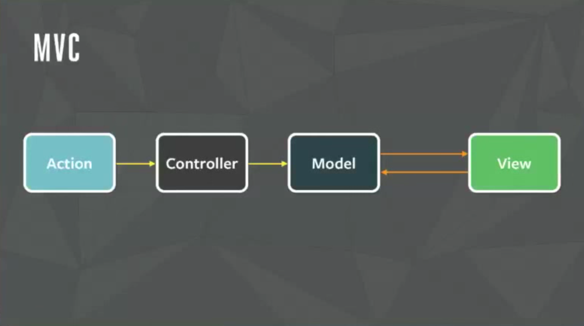]


???
* taking a step back to look at mvc and data binding
* perhaps this was of thinking was part of the problem
* two way binding here


---
name: MVC Problems

.medium[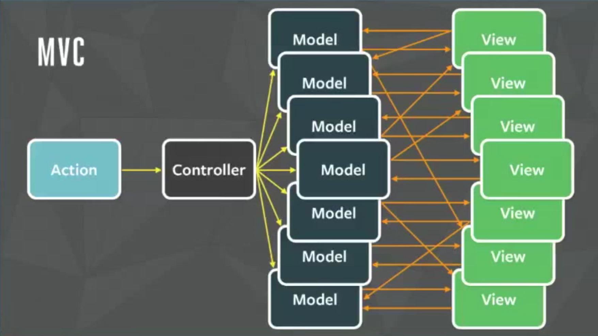]


???
* too much stuff to keep track off
* data changing over time
* would you be able to tell if there is an infinite loop - one model updating another and back


---
name: Enter Flux


???
* unidirectional data flow
* thanks facebook
* predictable - no multiple arrows
* finish a layer you are done
* with multiple Views easy as arrows go in one direction
* easy to reason about
* data changes - views update
* except that is more global and neat


---
name: unidirectional data flow: actions

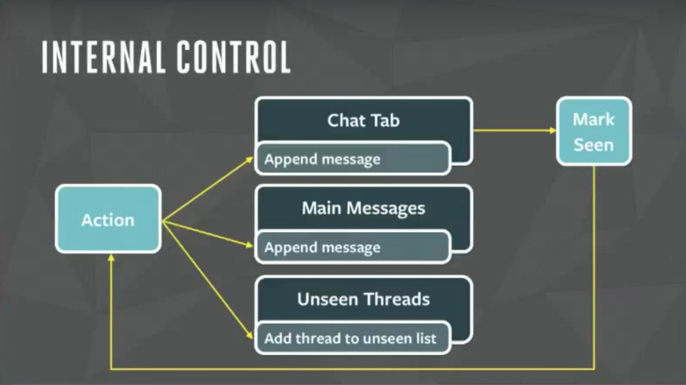


???
* not the full system - but the actions required
* track an action through the system
* easy consistency


---
name: Flow Based Programming


???
* the dark grey models are the actual data
* so unseen count is list size rather than a counter
* can imagine testing is easy


---
name: MVC -> Flux

* loosely:
  * Views -> Views (React Components)
  * Controller -> Views (Container Components)
  * Model -> Store (also ~state)


???
* how do we convert one way of reasoning to another?


---
name:

.medium[]

???
* flux was a bit tricky
* dan abramov comes up with answer - REDUX


---
name:

.small[]

.small[] 7/2016

.small[] 4/2017

.small[] 4/2018

.small[] 4/2019

.small[] 4/2020


???
* Redux - a flux framework for the rest of us
* flux was more a paradigm
* redux takes those principles and makes them functional and awesome


---
name: Application Level State


.large[]

???
* backing up a sec - whats the issue again?
* having consistent state which drives everything
* take this OS screenshot

---
name: Application Level State


.large[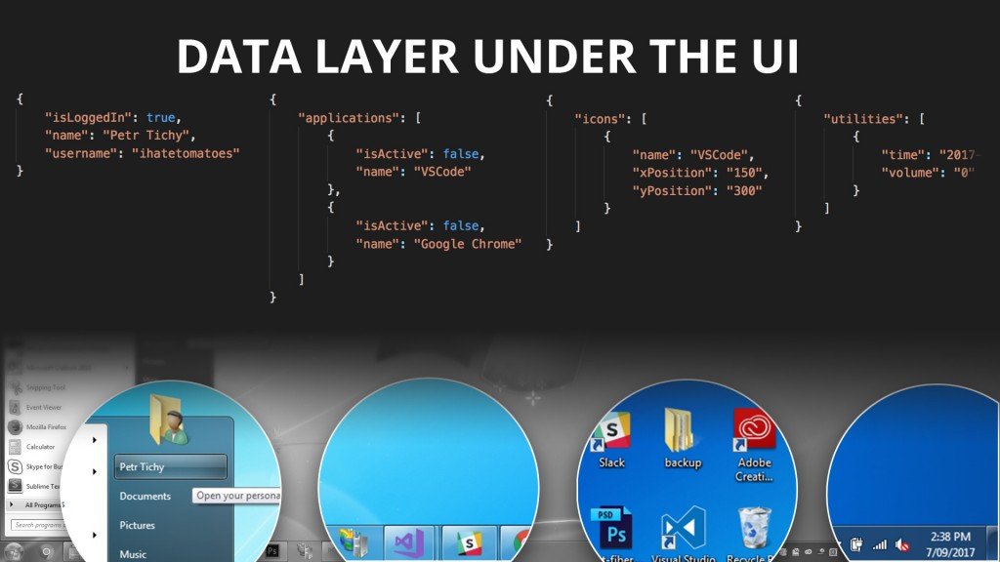]

???
* could store in one place
* or multiple places
* most likely a combo. 
* which of these seems more like UI state vs Business Logic state?

---
name: Application Level State


.medium[]

* react is great
* but could use better data management
* Redux
  * data, model, controller
  * single object stores app state!


???
* so far we'd done,  component level state vs application level state
* we've used components to allow us to pass down component level state in props
* but not ideal solution


---
name: Redux Principles

```js
// what is react
react(state) => {return UI}

//what is redux
(state, action) => { return newstate }
```

1. **Single source of truth**<br>
    One tree of state for entire application - not spread out over variables all over the place
1. **State is read-only**<br>
    To change state emit an action, which are centrally processed, generating new state.
1. **Changes are made with pure functions**<br>
    No side effects or mutations. Reducers take existing state+action emit new state.


---
name: React Component Props


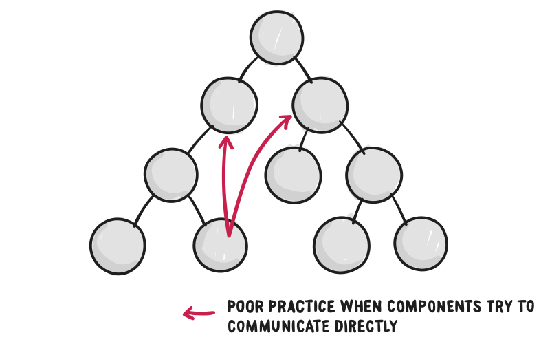


???
* not ideal, why do the parents need to know for instance?


---
name: Add a dash of Redux


???
* what if we had an application level store of data
* where a component can dispatch an action
* and others can subscribe to data - NOT EVENTS BUT ACTUAL DATA


---
name: Together at Last


???


---
name: State & Actions


???
* dispatch sends actions to reducers which return new state given old state


---
name: Multiple Reducers


???
* lets dance


---
name: In motion

.medium[]


???
* and here's how it all moves Together
* state comes in together with action to form new state


---
name: example

.medium[]


???
* lets take youtube app
* had some complicated double layer wiring
* would have been nice not to pass so much stuff in props right?


---
name: example+redux


???
* heres a version with redux
* seemed like too much to ask you all to rewrite the videos so the redux short is much simpler
* this drawing is pretty much what you'll be doing is SA4 - refer back to this - not all things are named the same, this has 2 reducers but you'll be combining the state into 1 - this is purposeful, understand the concepts not the specifics.


---
name: An Action

```javascript
{
    type: 'VIDEO_SELECTED',
    selected: video,
}
```

* is just an object
* has a type property

???
* can be constant rather than string
* all Redux events trigger actions
* remeber only way to change applicaiton state is through actions


---
name: Action Creator

```javascript
export function selectVideo(video) {
  return {
    type: 'VIDEO_SELECTED',
    selected: video };
  }
}

// must be `connect`ed to redux or dispatched
// basically does dispatch( {type: _, etc:_ } )
```

* is called in an event
  * user or ajax callback
* is a function that returns an action object
* action is sent to all reducers

???
* CAVEAT + MUST CONNECT TO REDUX


---
name:  Reducer


```javascript
const initialState = { selected: null, all: [] }

export default function (state = initialState, action) {
  switch (action.type) {
    case 'VIDEO_SELECTED':
      return { all: state.all, selected: action.video };
    default:
      return state;
  }
}
```
* reducer produces new state
* based on current state + action
* return is assigned to key in main state


???
* we're going to use multiple reducers in most projects
* each reducer is responsible for one piece of the state object
* draw out what your state looks like - this is important!


---
name: Reducers

.left[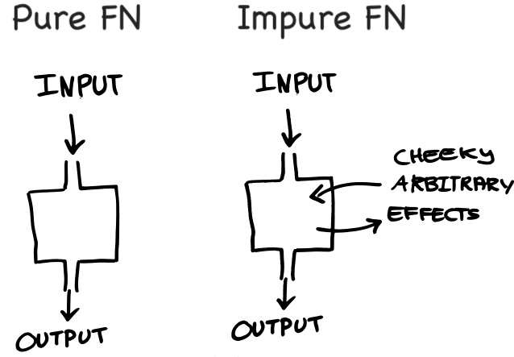]

.right[
* must be a pure function!
* receive:
  * current state
  * action and any payload
* return:
  * new state
* do not have access to anything else
* shape MUST stay consistent
]

???


---
name:  Reducers

.left[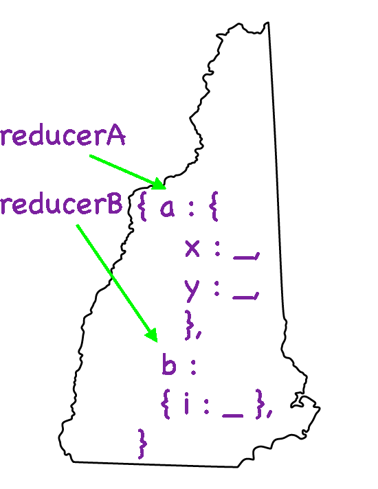]

.right[
* all reducers get called hence `switch` on action
* return state for particular key
* must return some state, always merged
* default action return existing state
]

???
* REMEMBER  component state is different and can and should still be used


---
name: All fine and dandy

But how do our components know about any of this?

<iframe src="//giphy.com/embed/DeKJrr8vovqXC" width="480" height="259" frameBorder="0" class="giphy-embed" allowFullScreen></iframe>

???


---
name:  react-redux


<iframe src="//giphy.com/embed/O5XX68H6WfAlO" width="480" height="199" frameBorder="0" class="giphy-embed" allowFullScreen></iframe>

* no intrinsic connection
* **upgrade smart objects to connected containers!**
???


---
name:  who needs upgrades? not all!


.left[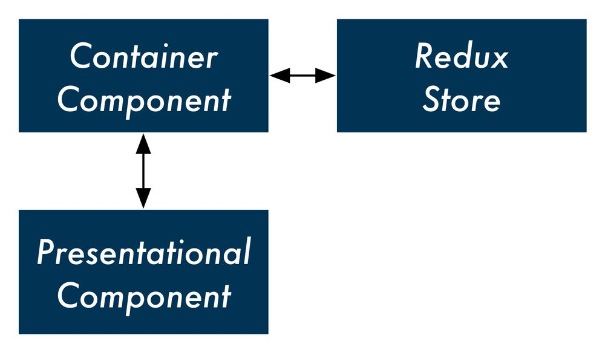]

.right[
* components that control data
* need to trigger actions (could use props though)
* need access to global state
* may pass data to presentational children components
* don't overuse
]

???
* some components, presentational ones don't need it
* just props based
* no need to overuse


---
name: react-redux connect

```javascript
import { connect } from 'react-redux';

class MyComponent extends Component { /* stuff */ }

export default connect(mapStateToProps,mapDispatchToProps)(MyComponent)
```

* higher order component!
* is a function that returns a function that we run on the component to return a new and improved component
* returns a component that is connected to redux


???
* some funky notation eh?


---
name: mapStateToProps

```js
  render() {
    <div>{this.props.video}</div>
  }
```

```js
const mapStateToProps = (reduxState) => (
  {
    video: reduxState.videoReducerOutput.selectedVideo
  }
);
```
* global state -> props
* takes state as argument
* returns mapping to show up in `props`

???
* takes application state as argument
* and returns subtree that will show up as props inside the connected component
* exposes a bit of global state to this particular component


---
name: mapDispatchToProps

```javascript
// import 1 action
import {selectVideo} from './actions';
// or import all
import * as actions from './actions';

// ends up with this.props.selectVideo()
const mapDispatchToProps = dispatch => {
  return {
    selectVideo: (item) => {
      dispatch(actions.selectVideo(item));
    },
  };
};

export default connect(mapStateToProps, mapDispatchToProps)(MyComponent);
//or shorthand
export default connect(mapStateToProps, {selectVideo: actions.selectVideo})(MyComponent);
//or
export default connect(mapStateToProps, {selectVideo})(MyComponent);
```

* component must be connected to ActionCreator functions
* if called directly won't trigger reducer!
* lots of short hand [here](https://github.com/reactjs/react-redux/blob/master/docs/api.md#connectmapstatetoprops-mapdispatchtoprops-mergeprops-options)
???


---
name: Provider

.left[]
.right[

```html
ReactDOM.render(
  <Provider store={store}>
    <MyRootComponent />
  </Provider>,
  rootEl
)
```
]


???
* last thing, provides access to store to connected components
* required boilerplate


---
name: Redux Map

.medium[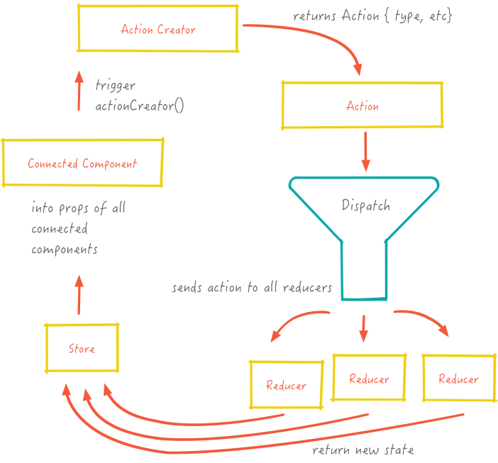]

???
* memorize this - be able to draw it
* or forever will redux confuse you


---
name: What about async? 

.tiny[]

* what about asynch stuff like api calls?!?!
* can an action deal with that? 

---
name: Thunks

.medium[]


???
* in CS a thunk is a method that is created, often automatically, to assist a call to another method.
* what if we need to make an api call that takes time
* there a way we can fix that also
* we'll work with these in SA6


<!-- 
name: React-Videos with Thunks

.medium_large[]

 -->


---
name: Redux Cheat Sheet + thunks

.medium[]

???
* ok that was a lot of codes
* but once you've set it up once it'll all start making sense
* remember we're learning how to build large-scale web apps


---
name: devtools

.medium[]


???
* react devtools, hopefully you've all been using this


---
name: devtools

.medium[]


???
* redux devtools give you state timemachine
* and you can just set the state, and import and export the state!


---
name: next

.left[]

.right[
* [thursday pitches](https://canvas.dartmouth.edu/courses/39574/assignments/218664)! (if there are any could do a few tomorrow as well)
* sa6 - ease you in to frontend state management
* lab4 - redux platform frontend
]

???
