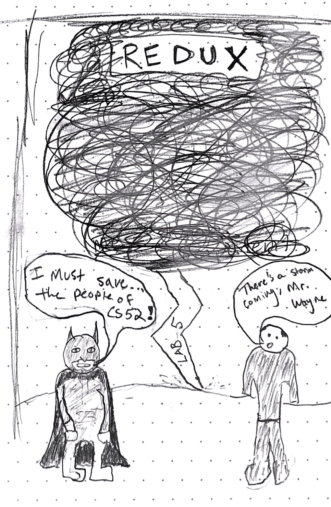
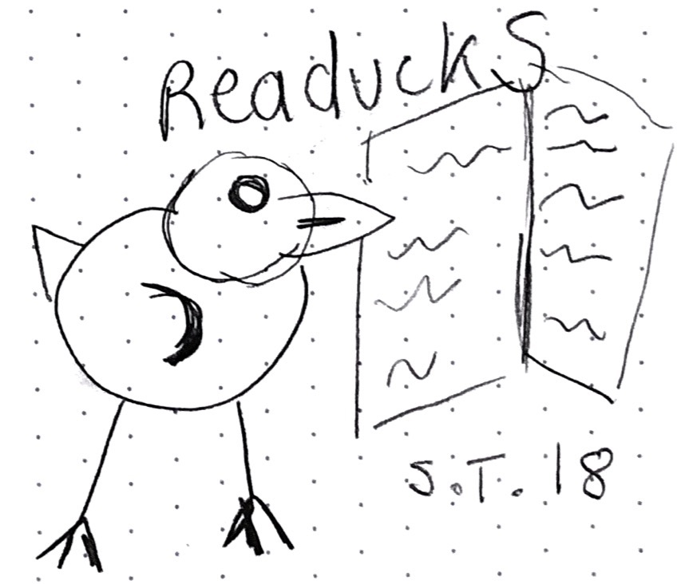
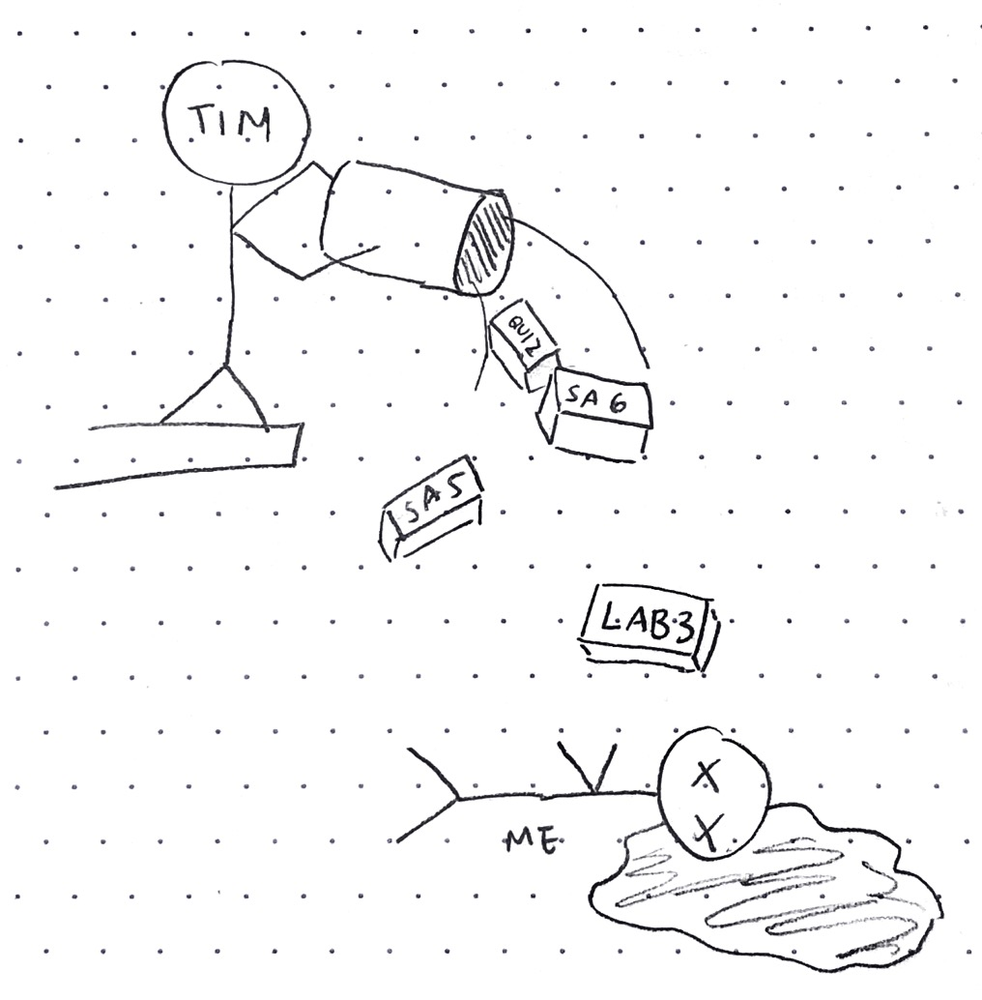
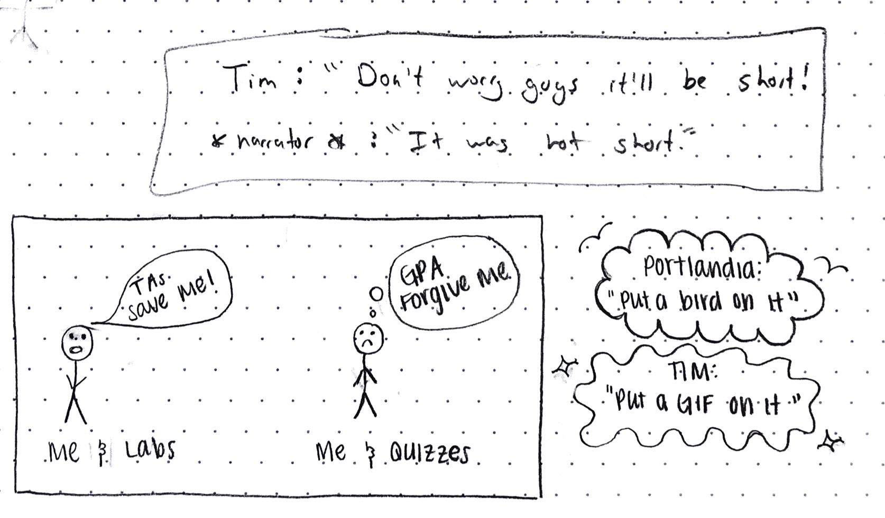
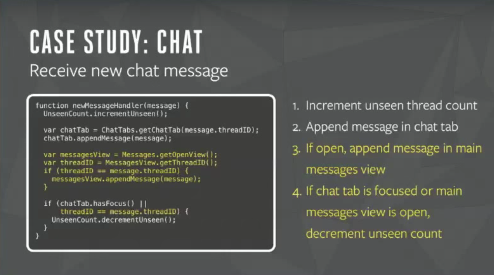
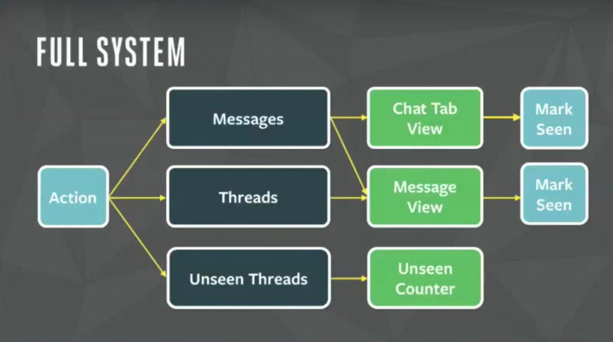
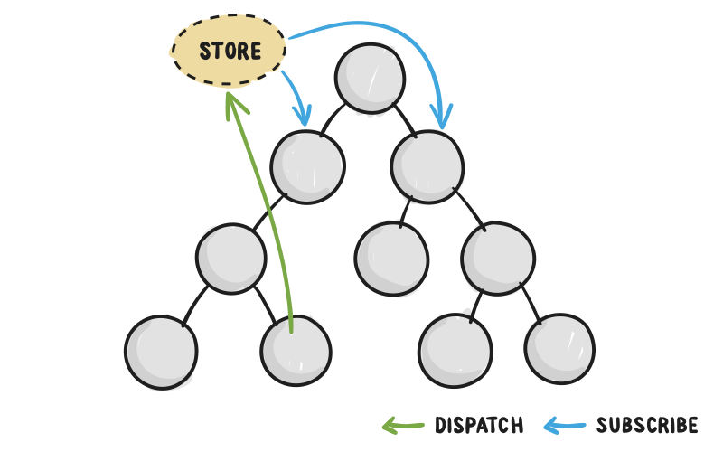
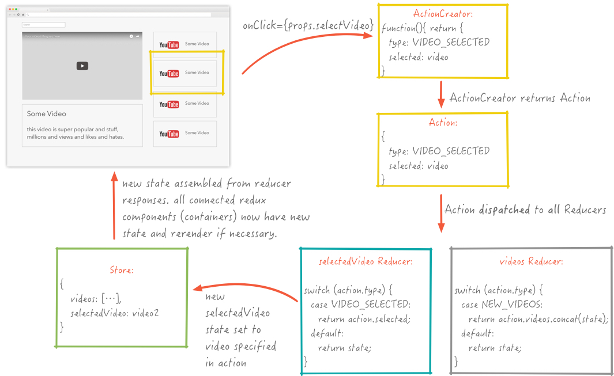
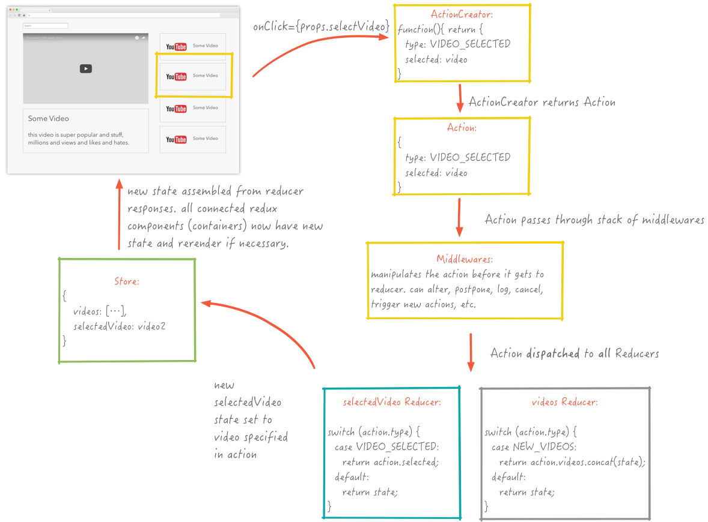
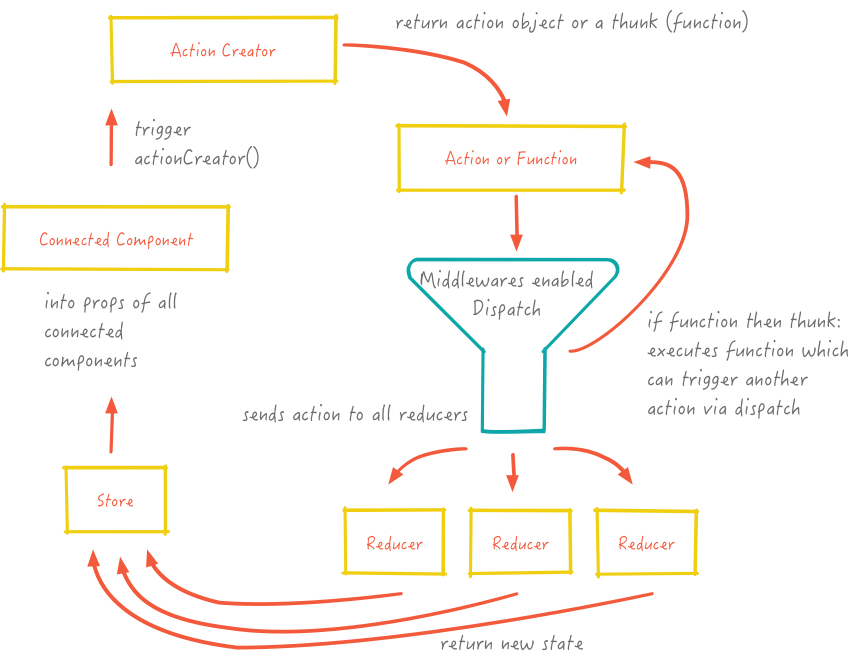

layout: true
class: center, middle
name: pic
background-size: contain

---

layout: true
class: center, top
name: fragment

.title[{{name}}]

---
layout: true
class: center, middle
name: base

.title[{{name}}]

---
name: Redux


.medium[]


---
name: CS52 Art

.left[]

.right[]


???
*


---
name: CS52 Art


.medium[]


???
*

---
name: CS52 Art

.medium[]


* what are benefits of firebase over other stuff like amazon aws?
* what is robots.txt for?
* can JS push fake history to user's browser?


???
* robots.txt is for robots!
* pushState url needs to be same origin (same protocol+domain+port) according to the docs
* pretty much yup


---
name: CS52 Art

.tiny[]
.tiny[]
.tiny[]
.tiny[]


???
* finally some tears


---
name: course survey so far

<iframe src="https://dalilab.typeform.com/report/m0bPyl/D5ZFUjWpn0sOT64K" style="transform: scale(0.8) translateX(-150px) translateY(-125px) " width="1000" height="700" frameBorder="0" ></iframe>


???
* more ta hours or different times?
* enjoying hmws and learnign from them
* and good understand
* majority of class is understanding majority of material - perfect


---
name: things to like

* Super fun projects, learning a lot, TA's and prof super helpful
* The feeling of finishing a lab; The learning is visible–I can make things that I couldn't before
* Everything we learn in class is directly applicable. I feel like I can go build something on my own after this class.
* Work load is pretty good; I feel like I am BUILDING stuff; I love the labs
* making pretty/useful sites; the fun assignments! I like that creativity and humor are encouraged.
* The hands-on parts of the class are really fun.
* The material is really great -- enjoy building front-end stuff that I can show my parents or friends!
* Lots of assignments to get the hang of things
* That it’s not all lecture; I think the workshops are nice. I had no idea these frameworks existed.
* Fun classes and labs, great ideas with the workshops.
* Workshops in class!
* Lectures are good and easy to follow. The interactive games and activities built into lectures!
* The short assignments are very helpful - probably more helpful than the lectures in learning the material.

???
* situation is more complex - people both love and hate various parts, so its a balancing act

---
name: things to improve

* There is so much material that is being thrown very quickly and I am absorbing only a part of it. As fun as the labs and short assignments are, having a slightly slower pace would be great!
* Although I definitely think the late policy is very fair, even just one late day pass would be really helpful
* I'm not sure. Being able to start labs in class. The hardest part for me is just starting the lab...
* I think less workshops would be good; More time walking through code examples
* Reduce number of workshops. I feel like I don’t learn much from them.  Would prefer if we could expand the list of technologies we learned in class
* Quizzes are too hard; feel like they don't reflect the stated goal of just checking if you did the assignments.
* Nothing off the top of my head! I've really enjoyed it so far.; I love the labs
* More interactive breaks or parts of lecture; Maybe we could work on the lecture notes
* lectures feel a little tangential
* Small coding sessions with TAs to get used to syntax etc
* Some parts of the shorts are't explained as well/deep as I would prefer.
* What's yarn?? Do I need to know all of JavaScript?? What are all the node modules and how does the starter pack work(!!!!)?


???
* 1 free 12hrs day pass is now available but must be arranged in advance. - have given a couple out for extenuating circumstances, assignments are just close together so want to make sure people don't cascade
* too late to change how workshops work - generally i like them because they give you a breadth that we couldn't cover otherwise.  don't feel like you have to finish them or work on them outside of class though!
* i know I'm trying to do both a survey of everything - plus a deep dive on one stack
* but honestly which of those would you prefer to forgo?
* tips: start labs early and ask questions - some ta hours have nobody and then last day is swamped. xhours have few people but i'm happy to work through stuff then
* lecture notes are somewhat available by hitting 'p' on the slides to go into presenter mode


---
name: other comments/concerns/etc

* Can we learn about Django
* do we have quizzes after every lab?
* I like your gifs!!
* More time plz
* Socket.io and Slackbots!
* Can we go over the starter pack? Also my computer is rapidly running out of space. Is that a me problem? I wish I understood the basic tools we use better so I could use them myself in the future. I get the projects and the coding, but not how all the dependencies work and what they mean I can do.
* nope! it's a great class
* Really enjoying the class so far!
* I really enjoy all of the tutorials in the group presentations. Just copying and pasting code with only a small amount of thought allows for a surprising amount of learning and familiarization.


???
* i too wish for more time! :-)
* something like django with alternative server side workshop a bit later
* but we'll do server side ddon't worry
* sockets coming soon


---
name: What do we know about React so far?

* components - smart and dumb
* unidirectional data flow
* events and callbacks
* state and props
* rendering jsx


???


---
name: Problems

.medium[]


???
* look familiar? we will fix it


---
name: Smart and Dumb components

.small[]


* smart components have state + props
* dumb components only props (function)

???
* dumb components can react too


---
name: Presentational and Container Components

* ***presentational***
  * concerned with how things look
  * have state for ui things but not data
  * generally get data as props
  * real view
  * reusable (your mini bootstrap)
* ***container***
  * concerned with data
  * pass data to presentational components
  * binds callbacks to self
  * can be *connected*

???
* so far we'd had both
* we've not really talked about this abstraction
* but will have a bit more of it soon with redux!


---
name: Flux

<iframe width="640" height="360" src="https://www.youtube.com/embed/nYkdrAPrdcw?rel=0&amp;showinfo=0" frameborder="0" allowfullscreen></iframe>

???
* facebook's answer to scalability
* interesting worth watching


---
name: The beginning


???
* multiple parts of webpage that tracked messages in different ways
* had a messenger window but also unread count


---
name: questionable design


???
* bugs were insidious
* how do you handle both staying in synch - read in one meant mark as read in another
* had multiple data models responsible for each view
* updating one model would need to update another
  * unread thread count
  * unread messages
* had unread counts that were false positive


---
name: Chat

.medium[]


???
* increment unseen
* append message in chat
* if open append message in messages Views
* if chat tab is focused or messages is open - decrement unseen
* complex login living in multiple places
* imperative lots of steps with checks


---
name: Chat

.medium[]


???
* problem kept coming back as they fixed things due to complexity
* here's what the basic logic looked like
* handler had too much to do
* large amount of centralized logic is one solution but have to code for consistency problems
*
* chat tabs is easy - get a new message - append it
* less clear about unseen
* perhaps storing unseen as a list by threadID would be better
*
* use explicit data - actual unseen threads, not just counter
*
* moving display logic to each component so it can decide based on data how to render (sound familiar)
* separating data from view
* wanted to move these decisions closer to the actual views.


---
name: MVC

.medium[]


???
* two way binding here


---
name: MVC Problems

.medium[]


???
* too much stuff to keep track off
* data changing over time
* would you be able to tell if there is an infinite loop - one model updating another and back


---
name: Enter Flux


???
* unidirectional data flow
* thanks facebook
* predictable - no multiple arrows
* finish a layer you are done
* with multiple Views easy as arrows go in one direction
* easy to reason about
* data changes - views update
* except that is more global and neat


---
name: unidirectional data flow


???
* track an action through the system
* easy consistency


---
name: Flow Based Programming



???
* no backwards arrows
* can imagine testing is easy


---
name: MVC -> Flux

* loosely:
  * Views -> Views (React Components)
  * Controller -> Views (Container Components)
  * Model -> Store (also ~state)


???
* how do we convert one way of reasoning to another?


---
name:


???
* flux was a bit tricky
* dan abramov comes up with answer - REDUX


---
name:


.small[] 7/2016

.small[] 4/2017

.small[] 4/2018


???
* Redux - a flux framework for the rest of us
* flux was more a paradigm
* redux takes those principles and makes them functional and awesome


---
name: Application Level State

* react is great
* but could use better data management
* Redux
  * data, model, controller
  * single object stores app state!


???
* so far we'd done,  component level state vs application level state
* we've hacked components to allow us to pass down component level state
* but not ideal solution


---
name: React Component Props


???
* not ideal, why do the parents need to know for instance?


---
name: Add a dash of Redux





???
* what if we had an application level store of data
* where a component can dispatch an action
* and others can subscribe to data - NOT EVENTS BUT ACTUAL DATA


---
name: Together at Last


???


---
name: State & Actions


???
* dispatch sends actions to reducers which return new state given old state


---
name: Multiple Reducers


???
* lets dance


---
name: In motion

.medium[]


???
* and here's how it all moves Together
* state comes in together with action to form new state


---
name: example

.medium[]


???
* lets take youtube app
* had some complicated double layer wiring
* would have been nice not to pass so much stuff in props right?


---
name: example+redux




???
* heres a version with redux
* seemed like too much to ask you all to rewrite the videos so the redux short is much simpler
* this drawing


---
name: An Action

```javascript
{
    type: 'VIDEO_SELECTED',
    selected: video,
}
```

* is just an object
* has a type property

???
* can be constant rather than string
* all Redux events trigger actions
* remeber only way to change applicaiton state is through actions


---
name: Action Creator

```javascript
export function selectVideo(video) {
  return {
    type: 'VIDEO_SELECTED',
    selected: video };
  }
}
```

* is called in an event
  * user or ajax callback
* is a function that returns an action object
* action is sent to all reducers


???


---
name:  Reducer


```javascript
export default function (state = [], action) {
  switch (action.type) {
    case 'VIDEO_SELECTED':
      return action.video;
    default:
      return state;
  }
}
```
* reducer produces new state
* based on currernt state + action
* return is assigned to key in main state


???
* we're going to use multiple reducers in most projects
* each reducer is responsible for one piece of the state object
* draw out what your state looks like - this is important!


---
name: Reducers

* must be a pure function!
* receive:
  * current state
  * action and any payload
* return:
  * new state
* do not have access to anything else

???


---
name:  Reducers

* all reducers get called hence `switch` on action
* return state for particular key
* must return some state, always merged
* default action return existing state

???
* REMEMBER  component state is different and can and should still be used


---
name: All fine and dandy

But how do our components know about any of this?

<iframe src="//giphy.com/embed/DeKJrr8vovqXC" width="480" height="259" frameBorder="0" class="giphy-embed" allowFullScreen></iframe>

???


---
name:  react-redux


<iframe src="//giphy.com/embed/O5XX68H6WfAlO" width="580" height="299" frameBorder="0" class="giphy-embed" allowFullScreen></iframe>

* no intrinsic connection
* upgrade smart objects to connected containers!

???


---
name:  who needs upgrades?

* not everyone
  * components that control data
  * need to trigger actions (could use props though)
  * need access to global state
  * may pass data to presentational children components


???
* some components, presentational ones don't need it
* just props based
* no need to overuse


---
name: react-redux connect

```javascript
import { connect } from 'react-redux';

class MyComponent extends Component { /* stuff */ }

export default connect(mapStateToProps,
  mapDispatchToProps)(MyComponent)
```

* higher order component!
* returns a component that is connected to redux


???


---
name: mapStateToProps

```javascript
  /* ... */
  render() {
    <div>{this.props.video}</div>
  }
}

const mapStateToProps = (state) => (
  {
    video: state.selectedVideo
  }
);

```
* global state -> props
* takes state as argument
* returns mapping to show up in `props`

???
* takes application state as argument
* and returns subtree that will show up as props inside the connected component
* exposes a bit of global state to this particular component


---
name: mapDispatchToProps

```javascript
import * as actions from './actions';

function mapDispatchToProps(dispatch) {
  return bindActionCreators({selectVideo: actions.selectVideo}, dispatch);
}

export default connect(mapStateToProps, mapDispatchToProps)(MyComponent);
//or shorthand
export default connect(mapStateToProps, {selectVideo: actions.selectVideo})(MyComponent);
// or even shorter:
export default connect(mapStateToProps, actions)(MyComponent);
```

* component must be connected to ActionCreator functions
* if called directly won't trigger reducer!
* lots of short hand [here](https://github.com/reactjs/react-redux/blob/master/docs/api.md#connectmapstatetoprops-mapdispatchtoprops-mergeprops-options)
???


---
name: Provider

.left[]
.right[

```html
ReactDOM.render(
  <Provider store={store}>
    <MyRootComponent />
  </Provider>,
  rootEl
)
```
]


???
* last thing, provides access to store to connected components
* required boilerplate


---
name: Redux Map

.medium[]

???


---
name: Thunks

.medium[]

* what about asynch stuff like api calls?!?!

???
* in CS a thunk is a method that is created, often automatically, to assist a call to another method.
* what if we need to make an api call that takes time
* there a way we can fix that also
* we'll work with these in SA6


---
name: React-Videos with Thunks

.medium[]


???


---
name: Redux Cheat Sheet

.medium[]

???


---
name:


<iframe src="//giphy.com/embed/JjKYrKa8UVTNe" width="480" height="466" frameBorder="0" class="giphy-embed" allowFullScreen></iframe>

???
* ok that was a lot of codes
* but once you've set it up once it'll all start making sense
* remember we're learning how to build large-scale web apps


---
name: devtools

.medium[]


???
* react devtools, hopefully you've all been using this


---
name: devtools

.medium[]


???
* redux devtools give you state timemachine
* and you can just set the state, and import and export the state!


---
name: Question Time


<iframe src="//giphy.com/embed/jTZVegIrdLCCY" width="480" height="360" frameBorder="0" class="giphy-embed" allowFullScreen></iframe>

???
