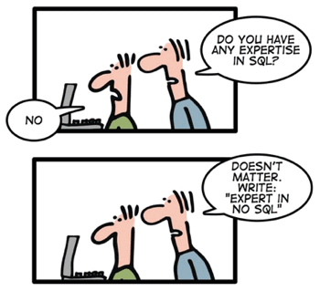

layout: true
class: center, middle
name: pic
background-size: contain

---

layout: true
class: center, top
name: fragment

.title[{{name}}]

---
layout: true
class: center, middle
name: base

.title[{{name}}]

---
name: Databases, Mongo, REST


---
name: Today

* REST
* Mongo
* HW4
* HW5

???


---
name: What Is REST API?

* <span style="color: #F27D00">RE</span>presentational <span style="color: #F27D00">S</span>tate <span style="color: #F27D00">T</span>ransfer
  * software architectural style
  * guidelines for web app to server communications

???
* transfer some state -> remote to client
* where state is data from server
* some conflicting opinions
* api -> on the web
* following some guidlines


---
name:  RESTful API

* Server should export resources to clients using unique names (URIs)
  * http://api.domain.com/photo/ is a collection
  * http://api.domain.com/photo/48s9c8s83j is a resource
* Server supports a set of HTTP verb mapping to CRUD


???
* resources avaible via http
* in file like paths


---
name:  RESTful API

{: .medium_small}


* Server supports a set of HTTP verbs mapping to CRUD
  * *GET* method - Read resource (list on collection)
  * *PUT* method - Update resource
  * *POST* method - Create resource
  * *DELETE* method - Delete resource
* NOT: http://domain.com/delete_photo?id=23lkj3

???
* endpoints are resources not actions


---
name: API Design

1. define resources, give them unique names (URIs)
1. clients use CRUD operations via HTTP methods
1. keep abstractions clean: GET's don't delete, etc

???


---
name: RESTful API


* Control caching of resources
* Keep servers "stateless"
  * load balancing across web servers

???


---
name: Standard

* proposed in 2000 phd thesis
* been standard for years

???


---
name:


<iframe src="//giphy.com/embed/3oEduRCITWQ5BruE8g" width="780" height="499" frameBorder="0" class="giphy-embed" allowFullScreen></iframe>

???


---
name: Problems

* complicated data requires multiple round trips to server
* versioning with old clients breaking
* variability in REST design
* data returned may not be what is needed

???
* user firstname+lastname = fullname


---
name: The Future

{: .medium_small}

* GraphQL
  * query "shape" determines response
  * multiple data stores


???


---
name: GraphQL

```javascript
//QUERY
{
    article(id: 2k3k3) {
      id
      title
      image(width: 600) {
        src
      }
    }
}
```

```javascript
//RESPONSE
{
    "article": {
      "id": 2k3k3,
      "title": "Welcome to GraphQL",
      "image": {
        "src": "http:///..."
      }
    }
}
```

???
* function like query part
* very cool
* will be a small workshop later


---
name: Other alternatives

* firebase like subscriptions to data (websockets)
* good for realtime
* not so good for complicated data

???
* less structured


---
name: We will

* build REST api in HW5
* be RESTful
* use Express.js
  * lightweight web framework
  * routes
  * HTTP verbs
  * JSON responses

???


---
name: Storage

<iframe src="//giphy.com/embed/N35rW3vRNeaDC" width="680" height="575" frameBorder="0" class="giphy-embed" allowFullScreen></iframe>

???
* how to store data in a manageable way


---
name: Storage

* Need to persist data
* central storage
* options:
  * piles
  * files
  * tables
  * documents

???


---
name: Database Systems

* runs on server (or dev machine)
* connect to database via library
* queries are code fetch or change data
* no direct connections from client side code

???


---
name: Relational Database

* series of tables
  * rows and columns
* connected by relations
* columns are typed:
  * string, int, etc

???
* excel pivot table


---
name: RDBMS

* many engines:
  * mysql, postgres, oracle
* replication
* fault tolerance
* complex queries and optimizations

???
* excel pivot table


---
name: ACID

* atomicity
* consistency
* isolation
* durability

???
* atomicity:  each transaction is all or nothing. (update both inventory and available credit)
* consistency:  valid states of database by some rules. (non-negative inventory)
* isolation:  transactions don't affect each other. (can't interleave transaction components)
* durability:  committed data never lost


---
name: Schema

* structure of the database
* tables, columns and types
* any additional constraints

???


---
name: Example Schema

```javascript
{
    id: Number,
    name: String,
    email: String,
    birthday: Date,
    comments: [ID]
}
```

???


---
name: SQL

* Structured Query Language
  * relational algebra
  * complex queries
  * table joins
  * transactions

???
* database runs on server or you local machine!
* query is in code that talks to server, not HTTP
* this is server side, you would not connect to database directly from the web


---
name: Relational Algebra

{: .medium}

{: .medium}

```sql
SELECT *
FROM Employee
JOIN Dept
ON Employee.DeptName=dept.DeptName;
```

???
* lots of relational algebra in discrete
* set operations, unions, intersections etc
* right out join, left inner join
* we'll try to do some more of this next week


---
name: Keys and Indexes

```sql
SELECT * FROM Users WHERE id = 2
```

* scan through rows
* lookup result from index instead
* index maps:
  * value to rows
  * lookup table $O(1)$ or $O(log(n))$
* primary key: unique row ID
* secondary keys: other columns
* foreign keys: refer to unique ids of other tables


???
* foreign keys are for relationship lookups


---
name:


<iframe src="//giphy.com/embed/BfqcuxcIAUGVa" width="480" height="695" frameBorder="0" class="giphy-embed" allowFullScreen></iframe>

???
* object vs table


---
name: ORM

* Object Relational Mapping
  * Objects map to database records
  * A class for each table in the database
  * Objects of class are rows
  * Attributes of columns

???
* dealing with SQL syntax is hard


---
name: Objects in Mirror

<iframe src="//giphy.com/embed/Gn6FwqRBMPYJy" width="480" height="375" frameBorder="0" class="giphy-embed" allowFullScreen></iframe>

???
* ORM's greatly simplified dealing with sql
* ActiveRecord was Ruby On Rails big win
* what if we just stored objects in the database like we want
* make live easier for developers


---
name: NoSQL

* what if we just stored documents?!

<iframe src="//giphy.com/embed/pHJHblYwlIptC" width="480" height="382" frameBorder="0" class="giphy-embed" allowFullScreen></iframe>

???


---
name: Various Forms

* key:value stores
* graphs
* documents

???
* different pros and cons
* documents are what we are going to be talking about
* mongodb


---
name: MongoDB

* Data model:
  * collections of documents (JSON)
* expressive query language
* supports indexes
* tries for scalability

???
* mongodb has supporters and haters
* largely just need to understand limitations
* and use appropriately
* went first came out people misused and misunderstood leading to data loss and hate


---
name: JSON blobs

* with great flexibility comes great responsibility
* unstructured data up to dev to enforce structure

???


---
name: Need to Know

{: .small}

* NOSQL != ACID
  * programmer managed
  * transactions more complicated
  * data duplication
  * eventual consistency


???
* newish support for packaging up transactions
* different use case


---
name: Tools for the Programmer

* what if we wanted help with schema enforcement?

???


---
name: Mongoose

{: .medium_small}

* Object Definition Language
* Like an ORM but for Mongo
* You thought documents were already friendly?  

???


---
name: Mongoose Schema

* Types:
  * String, Number, Date, Buffer, Boolean
  * Array: []
  * ObjectId: references to other documents (relation)
  * and nested objects {}

```javascript
const userSchema = new mongoose.Schema({
  name: String,
  birthday: Date,
  posts: [ObjectId]
});
```

???
* schema defines the documents in a collection


---
name: Index and More

* `email: {type: 'String', index: {unique: true}}`
* `date: {type: Date, default: Date.now }`

???
* indexes, some data rules


---
name:


{: .small}

* pros
  * faster queries
  * no scanning
* cons:
  * mutating ops like update, add, delete slightly slower
  * storage space
* use indexes for common queries

???
*


---
name: Mongoose Model

* fancy constructors compiled from Schema
  * instances represent documents
  * new documents
  * query documents

```javascript
const User = mongoose.model('User', userSchema);

User.create({ first_name: 'Remus', last_name: 'Lupin'})

User.findOne({_id: user_id})
  .then(user => {
    user.location = [51.528308,-0.3817765];
    return user.save();
  });

User.remove({first_name: 'Remus', last_name: 'Lupin'});
```


???


---
name: be fierce

<iframe src="//giphy.com/embed/M8QcfdiOCZoCQ" width="680" height="469" frameBorder="0" class="giphy-embed" allowFullScreen></iframe>

???


---
name: next time

* http://cs52.me/assignments/hw5p1
* hw5 part 1 and part 2
* next time sessions and authentication

???
