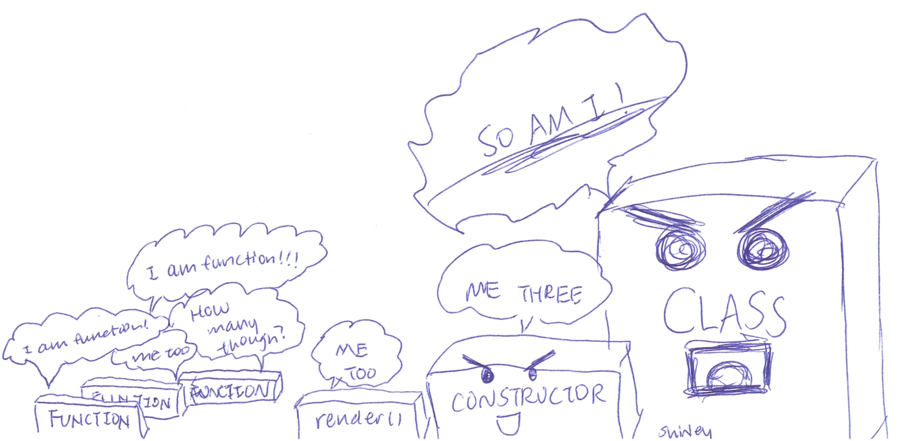
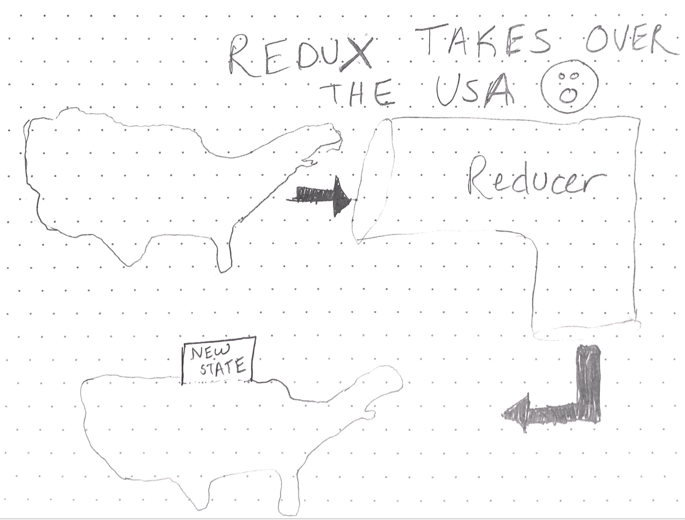
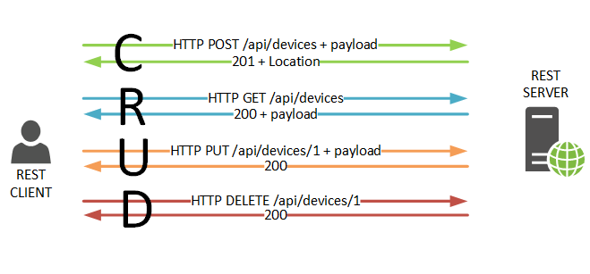
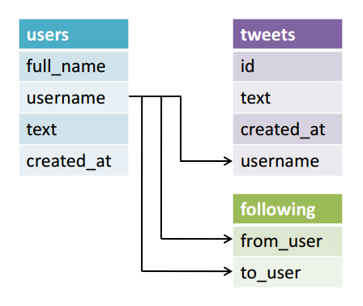
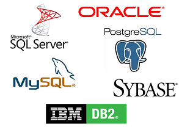
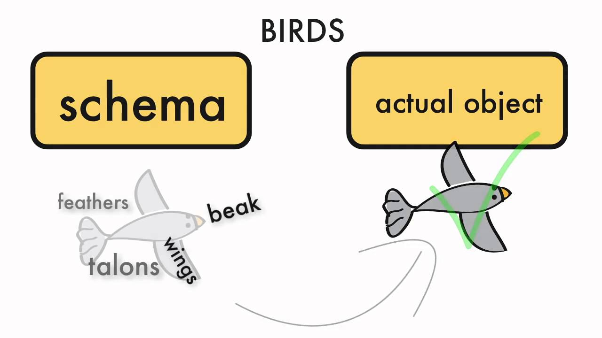
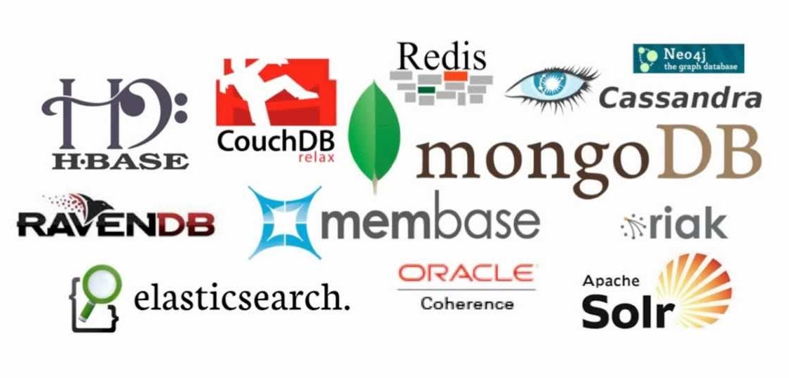

layout: true
class: center, middle
name: pic
background-size: contain

---

layout: true
class: center, top
name: fragment

.title[{{name}}]

---
layout: true
class: center, middle
name: base

.title[{{name}}]

---
name: Today and Stuff

* REST apis
* Databases
* SA7


???
* take or taking cs61


---
name: CS52 Art





???
* quiz grading tonight, do people want a quick review?


---
name: CS52 Art


???
* redux review


---
name: CS52 Art





???
* redux review


---
name: Final Project Ideas


<iframe width="600" height="400" src="https://www.youtube.com/embed/J-GVd_HLlps?rel=0&amp;showinfo=0" frameborder="0" allowfullscreen></iframe>

* Thoughts on pitching
* Ideas+

???
* today talk about pitching ideas and do a idea workshop thing
* I generally dislike formal brainstorming
  - but hopefully this will be fun and fruitful


---
name: Story

<iframe src="https://giphy.com/embed/IoQETeY2ue5bi" width="308" height="360" frameBorder="0" class="giphy-embed" allowFullScreen></iframe>

* What is the problem?
  * Story hook / why it matters?
* What are you doing / your solution?
* How are you special?
* Next step?


???
---
name: Ok but like, why?

<iframe src="https://giphy.com/embed/113udJYmASs3qE" width="480" height="282" frameBorder="0" class="giphy-embed" allowFullScreen></iframe>

???
* get roommate to cleanup
* go on a date
* get a job
* anytime present what you care about

* last term we had a pitching activity
* where people pitched their favorite food and then we got that food later in term
* we can do that or move on to an ideation workshop?

---
name: Ideas


.fancy.medium[]


???
* hard to generate
* today we'll do some brainstorming
* today will be different
* queue smoke machine


---
name: Some Inspiration Sources


* http://www.ycombinator.com/resources/
* https://www.startupschool.org/
* http://www.paulgraham.com/startupideas.html
* https://www.ycombinator.com/rfs/
* https://www.npr.org/podcasts/510313/how-i-built-this
* https://dribbble.com/
* http://abc.go.com/shows/shark-tank


???
* how i built this is a cool interview series


---
name: Your Pitch

* Propose either:
    * problem with a potential solution
    * OR pose a problem you want to attempt to solve without a solution
    * OR a topic that you think might be interesting to brainstorm around

* on thurs will do some more brainstorming


???
* dont' overdefine
* but also who wouldn't want to be on a project with someone passionate?


---
name: What Is REST API?


.medium[]

* <span style="color: #F27D00">RE</span>presentational <span style="color: #F27D00">S</span>tate <span style="color: #F27D00">T</span>ransfer
  * software architecture style
  * guidelines for web app to server communications

???
* what we used for bloggy
* transfer some state -> from remote server to client
* where state is data from server
* some conflicting opinions
* api -> on the web
* following some guidlines


---
name:  RESTful API


* Server should export resources to clients using unique names (URIs)
  * http://api.domain.com/photo/ is a collection
  * http://api.domain.com/photo/48s9c8s83j is a resource
* Server supports a set of HTTP verb mapping to CRUD


???
* resources avaible via http
* in file like paths
* helps to organize and think in terms of paths to resources rather than actions or functions


---
name:  RESTful API

.medium[]


* Server supports a set of HTTP verbs mapping to CRUD
  * *GET* method - Read resource (list on collection)
  * *PUT* method - Update resource
  * *POST* method - Create resource
  * *DELETE* method - Delete resource
* NOT: http://domain.com/delete_photo?id=23lkj3

???
* endpoints are resources not actions
* why would it be bad to have action endpoints?
   * have hundreds potentially
   * getUser, getUserProfile, getListViewAuthorized, etc


---
name: API Design

.medium[]


1. define resources, give them unique names (URIs)
1. clients use CRUD operations via HTTP methods
1. keep abstractions clean: GET's don't delete, etc

???


---
name: RESTful API


* Control caching of resources
* Keep servers "stateless"

???
* why is stateless good?
  * load balancing across web servers
* easier to cache resource than actions


---
name: Standard

* proposed in phd thesis circa 2000
* been standard for years

???
* gotta know it


---
name:


<iframe src="//giphy.com/embed/3oEduRCITWQ5BruE8g" width="780" height="499" frameBorder="0" class="giphy-embed" allowFullScreen></iframe>

???
* but there are problems
* what are some problems we ran into with blog?
  * updates?
  * how would you do chat?


---
name: Complications

* complicated data requires multiple round trips to server
* versioning with old clients breaking
* variability in REST design
* data returned may not be what is needed
* realtime?

???
* user firstname+lastname = fullname


---
name: The Future

.medium[]

* GraphQL
  * query "shape" determines response
  * multiple data stores


???
* is out now
* could do a short on it if people were interested but not really enough time


---
name: GraphQL

.left-small[
```js
//QUERY
{
  article(id: '2k3k3') {
    id
    title
    image(width: 600) {
      src
    }
  }
}
```
]


.right-large[
```json
//RESPONSE
{
  "article": {
    "id": "2k3k3",
    "title": "Welcome to GraphQL",
    "image": {
      "src": "http:///..."
    }
  }
}
```
]


???
* function like query part
* very cool
* helps with getting the data you need
* btws, if you read that redux is dead - don't worry it isnt
* lots of different ideas about redux and graphql - but you still want to manage your state in a smart way


---
name: Other alternatives

<iframe src="//giphy.com/embed/12bUwjHIJghgmk?hideSocial=true" width="280" height="280" frameBorder="0" class="giphy-embed" allowFullScreen></iframe>

* firebase like subscriptions to data (websockets - SA8)
* good for realtime
* not so good for complicated data

???
* less structured
* we'll use websockets in SA8
* more on this later


---
name: Lab 5

.medium[]

* be RESTful with expressjs
* routes
* HTTP verbs
* JSON responses

???
* expressjs is a lightweigth web framework on the server-side
* webpack-serve is actually built on express


---
name: Storage

<iframe src="//giphy.com/embed/N35rW3vRNeaDC" width="580" height="475" frameBorder="0" class="giphy-embed" allowFullScreen></iframe>

???
* how to store data in a manageable way
* need to persist data to server


---
name: Storage

.left-small[
* Need to persist data
* central storage
* options:
  * piles
  * files
  * tables
  * documents
]

.right-large[
<iframe src="//giphy.com/embed/aHmquP8GsDCHS?hideSocial=true" width="380" height="380" frameBorder="0" class="giphy-embed" allowFullScreen></iframe>
]

???
* piles, files, tables, documents
* need this to be remotely accessible
* need it to be fast
* structured maybe?
* need to be able to query
* ask specific questions
* btw piles are a real thing - double ended priority queues - added to either end, if needs middle then new pile is started.


---
name: Database Systems

<iframe src="//giphy.com/embed/xTiTnxpQ3ghPiB2Hp6?hideSocial=true" width="480" height="269.76" frameBorder="0" class="giphy-embed" allowFullScreen></iframe>

* nothing like ☝️
* run on server (or dev machine)
* connect to database via library
* queries are code -> fetch or change data
* no direct connections from client side code

???
* are a process typically that runs on some machine
* queries to ask the system specific questions
* server talks to database not client


---
name: Relational Database


.left-small[
* series of tables
  * rows and columns
* connected by relations
* columns are typed:
  * string, int, etc
]

.right-large[

]

???
* excel pivot table


---
name: RDBMS

.small[]


* replication
* fault tolerance
* complex queries and optimizations

???
* excel pivot table
* relational database management Systems


---
name: ACID

.small[]

* atomicity
* consistency
* isolation
* durability

???
* atomicity:  each transaction is all or nothing. (update both inventory and available credit)
* consistency:  valid states of database by some rules. (non-negative inventory)
* isolation:  steps in transactions don't affect each other. (can't interleave transaction components).
* durability:  committed data never lost
* also this is vitamin c


---
name: Schema

.small[]


* structure of the database
* tables, columns and types
* any additional constraints

???
* describes the structure of the db
* some cognition theories think our brain stores objects as schemas


---
name: Example Schema

```javascript
{
    id: Number,
    name: String,
    email: String,
    birthday: Date,
    comments: [ID]
}
```

???
* each column has a type
* can define more things


---
name: SQL

.medium[]


* Structured Query Language
  * relational algebra
  * complex queries
  * table joins
  * transactions

???
* language to describe questions / operations to perform on the DB
* database runs on server or you local machine!
* query is in code that talks to server, not HTTP
* this is server side, you would not connect to database directly from the web


---
name: Relational Algebra

.medium[]

.medium[]

```sql
SELECT *
FROM Employee
JOIN Dept
ON Employee.DeptName=dept.DeptName;
```

???
* set operations, unions, intersections etc
* right out join, left inner join
* won't be needing this in this class
* natural join - all columns are kept from both but only where matching key

---
name: JOINS

.medium[]


???
* left/right: keeping rows of one side even if don't have matching keys in other for instance
* generally full join or inner join are useful
* oof


---
name: Keys and Indexes

```sql
SELECT * FROM Users WHERE id = 2
```

* scan through rows
* lookup result from index instead
* index maps:
  * value as hashkey to row
  * lookup table $O(1)$
  * or $O(log(n))$
* primary key: unique row ID
* secondary keys: other columns
* foreign keys: refer to unique ids of other tables


???
* cranking through rows is slow
* hashmap
* secondary keys *can* be set on other columns
* foreign keys are for relationship lookups


---
name: Object vs Table


<iframe src="//giphy.com/embed/BfqcuxcIAUGVa" width="305" height="520" frameBorder="0" class="giphy-embed" allowFullScreen></iframe>

???
* object vs table
* but we're programmers, we just want objects everywhere.
* don't care about columns and such.
* cat object, has property claws and allergens


---
name: In practice: ORM

.medium[]


* Object Relational Mapping
  * Objects map to database records
  * A class for each table
  * Objects of class are rows
  * Attributes are columns
* less sql the better

???
* dealing with SQL syntax is hard
* we can add abstraction layer!
* we like objects better
* also provides sanitization


---
name: Objects in Mirror

<iframe src="//giphy.com/embed/Gn6FwqRBMPYJy" width="480" height="375" frameBorder="0" class="giphy-embed" allowFullScreen></iframe>

???
* ORM's greatly simplified dealing with sql
* ActiveRecord was Ruby On Rails big win
* what if we just stored objects in the database like we want
* make live easier for developers


---
name: NoSQL

* what if we just stored objects / documents directly?!

<iframe src="//giphy.com/embed/pHJHblYwlIptC" width="480" height="382" frameBorder="0" class="giphy-embed" allowFullScreen></iframe>

???
* sure we can do that!


---
name: NoSQL

.medium[]


* key:value stores
* graphs
* documents

???
* different pros and cons
* documents are what we are going to be talking about
* mongodb
* no sql vs not only sql
* some are specialized storage for different purposes


---
name: MongoDB

.small[]


* Data model:
  * collections of documents (JSON)
* expressive query language
* supports indexes
* tries for scalability

???
* mongodb has supporters and haters
* largely just need to understand limitations
* and use appropriately
* when first came out people misused and misunderstood leading to data loss and hate


---
name: Freeform JSON

<iframe src="//giphy.com/embed/zMDQIudRLFKco?hideSocial=true" width="480" height="331.2" frameBorder="0" class="giphy-embed" allowFullScreen></iframe>

* with great flexibility comes great responsibility
* unstructured data up to dev to enforce structure

???
* up to you to make it work
* background jobs etc
* make sure to rollback if a chain of queries fails


---
name: Need to Know

.small[]

.left[
* ACID vs BASE
  * Basically Available
  * Scalable
  * Eventually Consistent
]

.right[
* NOSQL != ACID
  * programmer managed
  * transactions more complicated
  * data duplication
  * eventual consistency
]


???
* newish support for packaging up transactions
* different use case
* basically available: availability more important than consistency
* scalable:  fast and simple
* eventually consistent:  duplicate data ok, no complex ops like joins
* acid:
  * atomicity
  * consistency
  * isolation
  * durability


---
name: Eventually Consistent


```js
post: {
  PostID,
  FullName,
  AuthorID,
  Title,
  Content
}
author: {
  AuthorID,
  FullName,
  Email
}
```

???
* data eventual consistency
* but also across servers sometimes
* facebook example, cassandra as store


---
name: Tools for the Programmer

* what if we wanted help with schema enforcement?

???
* we had ORM's for sql is that a thing?


---
name: Mongoose

.medium[]

* Object Definition Language
* Like an ORM but for Mongo
* You thought documents were already friendly?  

???
* ODL


---
name: Mongoose Schema

* Types:
  * String, Number, Date, Buffer, Boolean
  * Array: []
  * ObjectId: references to other documents (relation)
  * and nested objects {}

```javascript
const userSchema = new mongoose.Schema({
  name: String,
  birthday: Date,
  posts: [ObjectId]
});
```

???
* schema defines the documents in a collection


---
name: Index and More

```js
email: {type: 'String', index: {unique: true}}
```

```js
date: {type: Date, default: Date.now }
```

```js
personSchema.virtual('fullName').get(function () {
  return this.name.first + ' ' + this.name.last;
});
```


???
* secondary indexes
* some data rules
* virtual fields (computed)


---
name:


.small[]

* pros
  * faster queries
  * no scanning
* cons:
  * mutating ops like update, add, delete slightly slower
  * storage space
* use indexes for common queries


---
name: Mongoose Model

* fancy constructors compiled from Schema
  * instances represent documents
  * new documents
  * query documents

```javascript
const User = mongoose.model('User', userSchema);

User.create({ first_name: 'Remus', last_name: 'Lupin'})

User.findOne({_id: user_id})
  .then(user => {
    user.location = [51.528308,-0.3817765];
    return user.save();
  });

User.remove({first_name: 'Remus', last_name: 'Lupin'});
```


???


---
name: SA7

.medium[]

* build expressjs routes
* return server side rendered html
* use mongoDB for data persistence
* use mongoose for *ORM*

???


---
name: be fierce

<iframe src="//giphy.com/embed/M8QcfdiOCZoCQ" width="680" height="469" frameBorder="0" class="giphy-embed" allowFullScreen></iframe>

???
