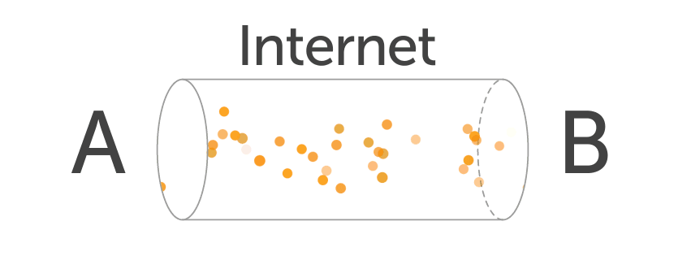
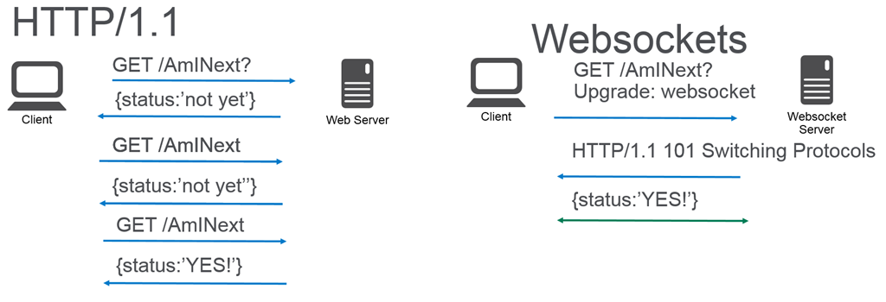
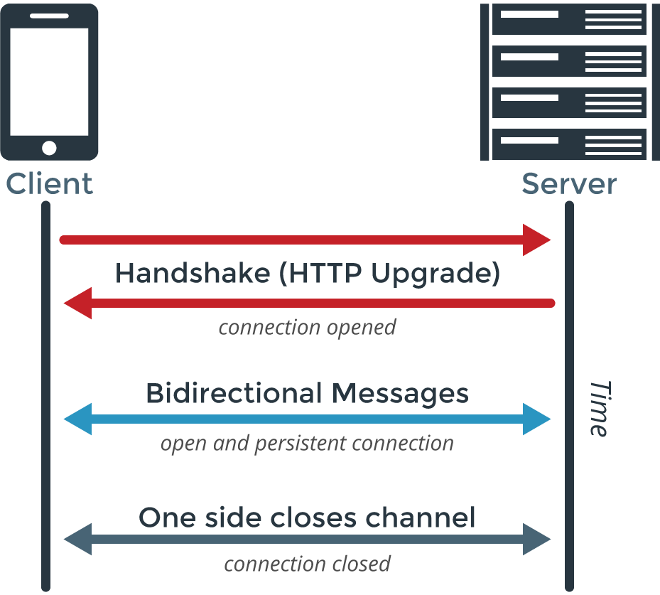
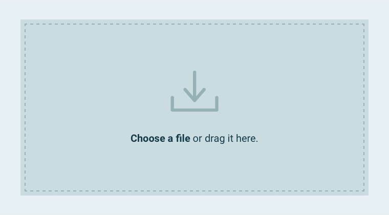
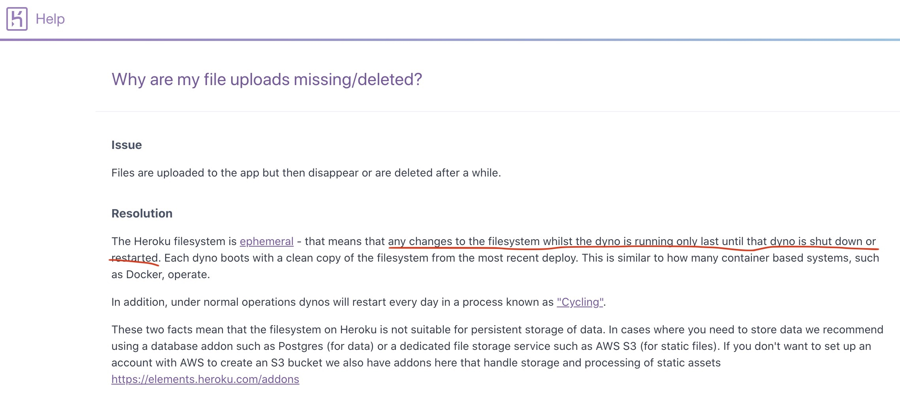
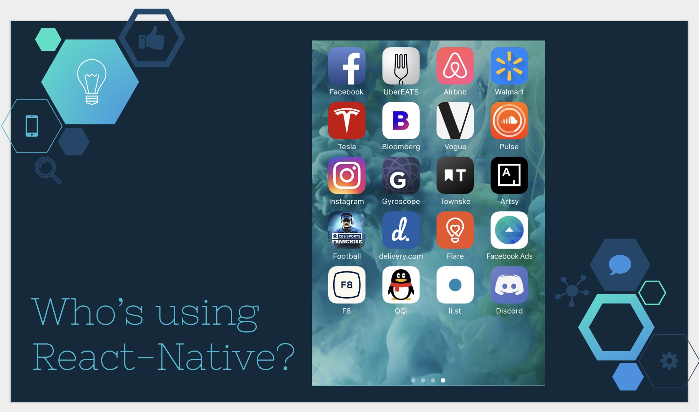
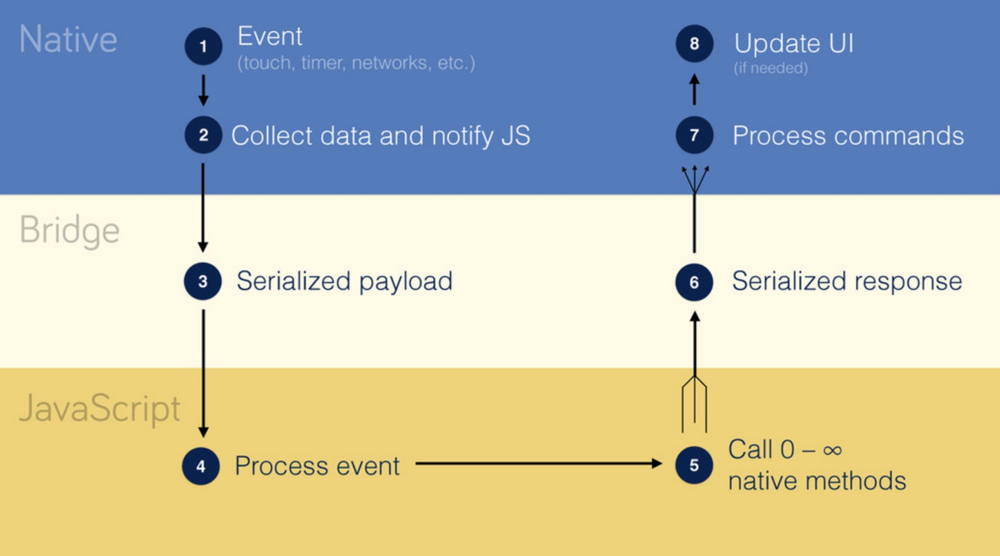

layout: true
class: center, middle
name: pic
background-size: contain

---

layout: true
class: center, top
name: fragment

.title[{{name}}]

---
layout: true
class: center, middle
name: base

.title[{{name}}]


---
name: Websockets, S3, ReactNative


* concepts for the extra credit shorts

.medium_small[]


???
* this is to help with things in your projects

---
name: HTML5 WebSockets

.medium_small[]


???
* in http


---
name: HTTP REST

.medium[]

* request / response
* stateless
* auth tokens
* http verbs

???
* realtime is tricky


---
name: But REALTIME

<iframe src="https://giphy.com/embed/xT5LMFizV0j6HN97iw" width="480" height="274" frameBorder="0" class="giphy-embed" allowFullScreen></iframe>

* ajax polling
* long polling
* streaming


???
* ajax polling:
  * every couple of seconds setInteval
* long polling:
  * poll an endpoint that then keeps connection open and only responds when it has something
  * restart when disconnected
* streaming:
  * keep sending incremental data
  * timeouts after some minutes


---
name: HTML5 WebSockets




???
* one persistent connection


---
name: HTML5 WebSockets

* Bi-directional
* Event-based interface -- pub/sub
* Low level socket interface (remember tcp)


.small[]


???


---
name: Pros

* Realtime Events
* pub/sub simplicity
* efficient (no polling)
* stateful connections

???
*


---
name: Why Not Sockets for EVERYTHING?

* low level protocol means more things to implement
  * how to create/update/delete resources
  * no status codes
* stateful protocol
  * need sticky connections
  * more resources to support connections
* no caching, routing, multiplexing, compression

???
* unlike http,  websockets are stateful
* how do you scale many persistent connections
* have to code more from scratch


---
name:


.medium[]

???
* library for working with websockets
* automatic reconnections
* fallbacks in case browser doesn't support


---
name: Outgoing

```javascript
socket.emit('news', { hello: 'world' });
```

???
* send an event with data server or client


---
name: Incoming

```javascript
socket.on('eventname', data => {
  console.log(data);
});
```

???
* subscribe to a triggered event server or client


---
name: Server Connection

```javascript
io.on('connection', socket => {

  //outgoing
  socket.emit('news', { hello: 'world' });

  //incoming
  socket.on('submit', data => {
    console.log(data);
  });
});
```

???
* on establishing a connection


---
name: Client Connection

```javascript
const socket = io.connect('http://localhost');

//incoming
socket.on('news', data => {
  console.log(data);
  //outgoing
  socket.emit('submit', { my: 'data' });
});

```

???
*


---
name: Namespaces Server

```javascript
const chat = io
  .of('/chat')
  .on('connection', socket => {
    chat.emit('a message', {
        everyone: 'in'
      , '/chat': 'will get'
    });
  });

const news = io
  .of('/news')
  .on('connection', socket => {
    socket.emit('item', { news: 'item' });
  });

```

???
* runs these over one connection if connected to more than one namespace (multiplexing)


---
name: Namespaces Client

```javascript
const chat = io.connect('http://localhost/chat')
const news = io.connect('http://localhost/news');

chat.on('connect', () => {
  chat.emit('hi!');
});

news.on('news', (data) => {
  news.emit('thanks Obama');
});
```

???
* also rooms


---
name: Rooms

```javascript
//on server
io.on('connection', function(socket){
  // determine if that client socket should join some room
  // say part of a conversation
  socket.join('some room');
});

io.to('some room').emit('some event');

```

???
* on client would just get `some event`


---
name: Callbacks Client

```javascript
socket.emit('fetchPost', id, (post) => {
  console.log(post);
});
```

???
* you can use callbacks with events!!
* emitting an event that also has an associated callback that gets returned
* like running a remote asynch function


---
name: Callbacks Server

```javascript
socket.on('fetchPost',  (id, done) {
  Post.findById(id).then(post=> done(post);)
});
```

???
* server side
* soo cool


---
name: broadcast

```javascript
socket.broadcast.emit('user connected', username);
```

???
* can broadcast to all connected users


---
name: Image / Large File Upload

.small[]

* where to store uploaded images or large files?
    * database 🚫
    * server file system 🚫
    * amazon s3? ❤️


???
* why might it be bad to store images in database?
* on heroku - the filesystem gets wiped
* databases are optimized for not large data blobs


---
name: Image / Large File Upload

.large[]

* heroku doesn't even have a filesystem


???


---
name: Image / Large File Upload

.large[]

* database store is super robust and super expensive


???


---
name: S3

* [aws s3](https://aws.amazon.com/s3/)?

.medium[]

.medium[]


???


---
name: S3

* don't publish your secret key! keep it on your api

.large[]


???
* keep keys on server
* create one time use signed urls from server
* give to client to upload directly
* why is this better?


---
name: React Native

* All I know is React - I wanna make a mobile app!

.large[]


???
* in good company so do many people


---
name: React Native

* cool because:
   * javascript thread controlling native components
   * wrapper around all native
   * one way data flow!
   * virtual dom in native app


???


---
name: React Native


.large[]


???


---
name: React Native


.large[]


???

---
name: React Native


.large[]


???
* native layer bridges to javascript control thread

---
name: React Native


.large[]


???


---
name: Expo.io

.super-tiny[]


.medium[]


???
* makes it super easy to develop on both


---
name: Next up:

.small[]

* <a href="/assignments/lab/redux-platform+auth" target="_blank">lab5p2 (adding auth)</a>
* <a href="/assignments/project/feature-spec" target="_blank">feature spec tonight</a>
* <a href="/assignments/project/scaffolding" target="_blank">scaffolding</a>
* <a href="/assignments/project/mockups" target="_blank">mockups</a>

